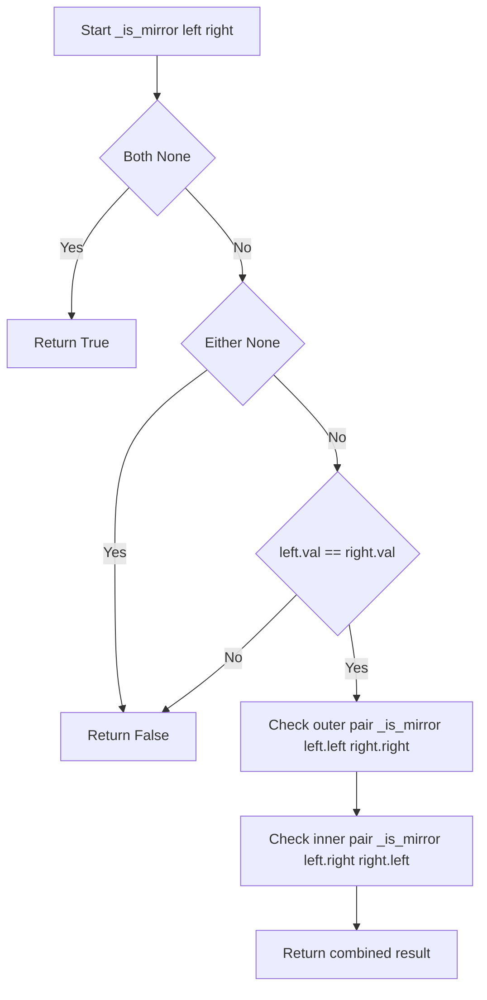
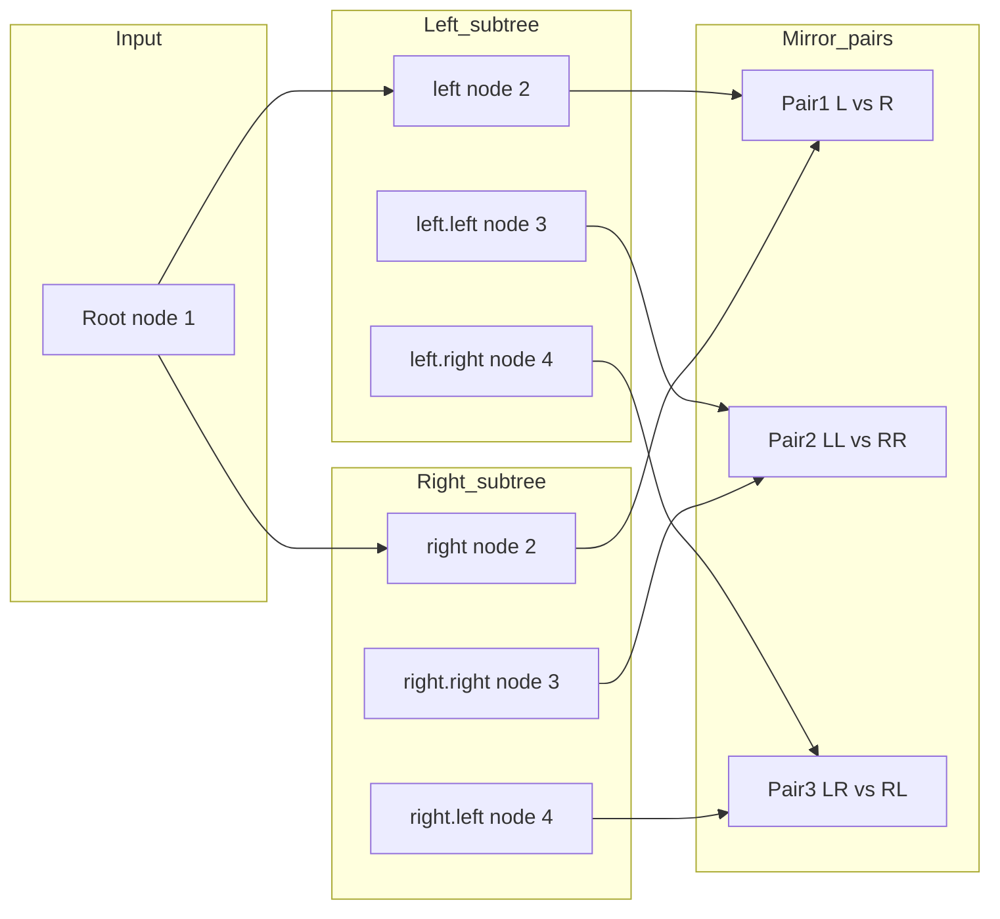

# Symmetric Tree - 二分木が鏡写しかどうかを判定する

---

## 目次（Table of Contents）

- [概要](#overview)
- [アルゴリズム要点（TL;DR）](#tldr)
- [図解](#figures)
- [正しさのスケッチ](#correctness)
- [計算量](#complexity)
- [Python 実装](#impl)
- [CPython最適化ポイント](#cpython)
- [エッジケースと検証観点](#edgecases)
- [FAQ](#faq)

---

<h2 id="overview">概要</h2>

> 💡 **初学者向け補足**：この問題は一言で言うと「**二分木が中心軸に対して鏡写しになっているかを確認する問題**」です。

与えられた二分木（＝各ノードが最大2つの子を持つ木構造）が、中心軸（ルートノード）を境に左右対称かどうかを返します。

**なぜ難しいのか**：「鏡写し」は単純に「左と右が同じ」ではなく、「左サブツリーの左子」と「右サブツリーの右子」が対応するという**交差した対応関係**を正確に追う必要があるためです。また、ノードの「値が同じ」だけでなく「構造（形）も同じ」でなければならない点もつまずきやすいポイントです。

### 問題の制約

| 項目             | 内容                         |
| ---------------- | ---------------------------- |
| プラットフォーム | LeetCode #101                |
| ノード数         | 1 以上 1000 以下             |
| ノードの値       | -100 以上 100 以下           |
| フォローアップ   | 再帰・反復の両方で解けるか？ |

### 入出力例

```
例1）
入力:  root = [1, 2, 2, 3, 4, 4, 3]
出力:  True
理由:  左右が完全に鏡写し

       1
      / \
     2   2
    / \ / \
   3  4 4  3

例2）
入力:  root = [1, 2, 2, null, 3, null, 3]
出力:  False
理由:  右の2にleftがなく、rightしかないので非対称

       1
      / \
     2   2
      \   \
       3   3
```

> 📖 **この章で登場した用語**
>
> - **二分木**：各ノードが最大2つの子（left, right）を持つ木構造のデータ構造
> - **ルートノード**：木の最上位にあるノード。親を持たない
> - **サブツリー**：あるノードを根とした部分木。左サブツリー・右サブツリーと呼ぶ
> - **対称（鏡写し）**：中心軸を境に左右の形と値が完全に一致している状態

---

<h2 id="tldr">アルゴリズム要点（TL;DR）</h2>

> 💡 **初学者向け補足**：TL;DR（Too Long; Didn't Read）とは「長くて読めない人向けの要約」という意味です。ここではアルゴリズム全体の戦略を箇条書きでまとめます。詳細は後の章で説明するので、**「なんとなくこういう手順で解くんだな」というイメージを掴む章**として位置づけています。

### 戦略（再帰版）

1. **ルートを中心に左右を比較する**：ルート自体は中心軸なので比較せず、`root.left` と `root.right` を「鏡ペア」として渡す
2. **鏡ペアの3条件を再帰でチェックする**：
    - 両方 `None` → 対称（基底条件）
    - 片方だけ `None` → 非対称（基底条件）
    - 両方存在 → 値が等しく、かつ外側ペア・内側ペアも鏡写しか（再帰）
3. **`and` の短絡評価で早期終了**：値が違えば再帰を呼ばずに即 `False` を返す

### 戦略（反復版）

1. **`deque`（両端キュー）に「鏡ペア」を積む**：`deque` を使う理由は `popleft()` がO(1)で高速なため
2. **ペアを取り出しながら条件を確認**：再帰と同じ3条件を順番にチェック
3. **次のペアをキューに追加**：外側ペア（左の左子 ↔ 右の右子）と内側ペア（左の右子 ↔ 右の左子）

### 計算量サマリ

| 解法        | 時間計算量 | 空間計算量           |
| ----------- | ---------- | -------------------- |
| 再帰（DFS） | O(n)       | O(h) — hは木の高さ   |
| 反復（BFS） | O(n)       | O(w) — wは木の最大幅 |

> 📖 **この章で登場した用語**
>
> - **TL;DR**：「長くて読めない人向けの要約」を意味する略語
> - **DFS（深さ優先探索）**：根から葉へ向かって深く潜っていく探索方法。再帰と相性が良い
> - **BFS（幅優先探索）**：同じ深さのノードを横断する探索方法。キューと相性が良い
> - **短絡評価**：`A and B` でAが `False` なら、Bをまったく評価せず即 `False` を返す仕組み
> - **`deque`（デック）**：前からも後ろからも出し入れできる"両端開きの箱"。C実装のため先頭削除がO(1)

---

<h2 id="figures">図解</h2>

> 💡 **初学者向け補足**：Mermaidフローチャートの読み方として、**ひし形（`{}`）は条件分岐**（Yes/Noに分かれる）、**長方形（`[]`）は処理ステップ**（何かを実行する）を表します。矢印は処理の流れの方向を示します。

---

### フローチャート（再帰版）

この図は `_is_mirror(left, right)` という再帰ヘルパー関数の処理の流れを表しています。上から下へ読み進めてください。



**主要なノードの意味**：

- `Start`：ヘルパー関数の入り口。左右のノードを受け取る
- `BothNone`：両方 `None` かどうかの判定。葉の「次」の位置（存在しない場所）同士の比較
- `EitherNone`：片方だけ `None` かどうかの判定。一方だけ枝が伸びている非対称の検出
- `ValCheck`：値が等しいかどうかの判定。構造は同じでも値が違えば非対称
- `OuterPair`：外側のペア（左の左子 ↔ 右の右子）を再帰確認
- `InnerPair`：内側のペア（左の右子 ↔ 右の左子）を再帰確認

---

### データフロー図（鏡ペアの対応関係）

この図は「どのノード同士がペアとして比較されるか」を表しています。中心軸（ルート）を境に交差した対応関係があることに注目してください。



**主要な流れの説明**：

- `Root → L / R`：ルートから左右のサブツリーへ分岐。ルート自体は比較しない
- `L vs R (Pair1)`：左の2 と 右の2 を最初のペアとして比較
- `LL vs RR (Pair2)`：外側ペア。左の左子（3）と右の右子（3）を比較
- `LR vs RL (Pair3)`：内側ペア。左の右子（4）と右の左子（4）を比較

---

> 💡 **代表例でのトレース**：`root = [1, 2, 2, 3, 4, 4, 3]` を入力として各ステップを追います。

```
初期状態:
       1
      / \
     2   2
    / \ / \
   3  4 4  3

Step 1: isSymmetric(root=1)
  → root != None なので _is_mirror(root.left=2, root.right=2) を呼ぶ

Step 2: _is_mirror(left=Node(2), right=Node(2))
  → BothNone? No（両方ノードが存在）
  → EitherNone? No（どちらもNoneではない）
  → ValCheck: 2 == 2 ✅
  → 外側ペア: _is_mirror(left.left=Node(3), right.right=Node(3)) を呼ぶ

Step 3: _is_mirror(left=Node(3), right=Node(3))
  → 3 == 3 ✅
  → _is_mirror(None, None) → BothNone = True ✅
  → _is_mirror(None, None) → BothNone = True ✅
  → True を返す

Step 4: Step2 に戻り 内側ペア: _is_mirror(left.right=Node(4), right.left=Node(4))
  → 4 == 4 ✅
  → _is_mirror(None, None) → True ✅
  → _is_mirror(None, None) → True ✅
  → True を返す

Step 5: True and True and True = True
最終結果: True ✅
```

> 📖 **この章で登場した用語**
>
> - **フローチャート**：処理の手順を図形と矢印で表したもの。ひし形=条件分岐、長方形=処理
> - **データフロー図**：データがどのように変換・移動するかを示す図
> - **外側ペア**：左サブツリーの「左子」と右サブツリーの「右子」の組み合わせ
> - **内側ペア**：左サブツリーの「右子」と右サブツリーの「左子」の組み合わせ

---

<h2 id="correctness">正しさのスケッチ</h2>

> 💡 **初学者向け補足**：「正しさのスケッチ」とは、アルゴリズムが**常に正しい答えを返すことの根拠**を整理したものです。数学的な厳密な証明ではなく、「なぜ正しいと言えるか」の説明です。

### 基底条件（再帰が止まる条件）

再帰が終わらないと無限ループになります。このアルゴリズムでは2つの基底条件があります。

| 条件                             | 処理           | 意味                                                                       |
| -------------------------------- | -------------- | -------------------------------------------------------------------------- |
| `left is None and right is None` | `True` を返す  | 「空同士」は対称と定義できる。葉ノードの先（存在しない位置）を比較している |
| `left is None or right is None`  | `False` を返す | 一方だけ枝がある = 非対称。片方だけ子が存在するので鏡写しではない          |

### 不変条件（処理中ずっと成り立つ条件）

> 不変条件（＝アルゴリズムが正しく動くために、処理中ずっと成り立ち続けるべき条件）

`_is_mirror(left, right)` を呼ぶとき、`left` と `right` は常に「同じ深さの鏡対応するノード」です。

- 最初の呼び出し：`_is_mirror(root.left, root.right)` → 深さ1の左右ノード
- 次の呼び出し：`_is_mirror(left.left, right.right)` → 深さ2の外側ノード
- この対応関係は再帰のたびに「1段深い鏡ペア」に移行するので、常に正しいペアを比較している

### 網羅性（すべてのケースを処理しているか）

`match (left, right)` の3ケースは**互いに排他的かつ網羅的**です。

```
ケース① left is None and right is None  → True（両方空）
ケース② left is None or right is None   → False（片方空）
ケース③ 上記以外（両方ノードが存在）    → 値比較 + 再帰
```

この3ケースで「左右ノードのあらゆる組み合わせ」をカバーしています。

### 終了性（必ず有限ステップで終わるか）

> 終了性（＝アルゴリズムが必ず有限ステップで終わるという保証）

再帰のたびに「木の深さが1段増える」ので、最終的には必ず葉ノードの子（`None`）に到達します。ノード数が有限（最大1000）なので、再帰は有限回で終了します。

> 📖 **この章で登場した用語**
>
> - **不変条件**：アルゴリズムが正しく動くために、処理中ずっと成り立ち続けるべき条件
> - **基底条件**：再帰の終了条件。これがないと無限ループになる
> - **終了性**：アルゴリズムが必ず有限ステップで終わるという保証
> - **網羅性**：すべてのケースをもれなく処理できているという保証
> - **排他的かつ網羅的**：各ケースが重複せず（排他）、かつすべての入力を受け入れる（網羅）こと

---

<h2 id="complexity">計算量</h2>

> 💡 **初学者向け補足**：計算量とは「入力が大きくなるにつれて、処理にかかる時間・メモリがどう増えるか」の目安です。

| 記法         | 意味                   | 直感的なイメージ           |
| ------------ | ---------------------- | -------------------------- |
| `O(1)`       | 入力サイズによらず一定 | 辞書で直接ページを開く     |
| `O(n)`       | 入力に比例して増加     | リストを端から順に読む     |
| `O(n log n)` | nよりやや速く増加      | 辞書を二分探索で引く×n回   |
| `O(n²)`      | 入力の2乗で増加        | 全ペアを総当たりで確認する |

### この問題の計算量

| 解法        | 時間計算量 | 空間計算量 | 理由                                                    |
| ----------- | ---------- | ---------- | ------------------------------------------------------- |
| 再帰（DFS） | **O(n)**   | **O(h)**   | 全ノードを1回ずつ訪問。スタックの深さ = 木の高さh       |
| 反復（BFS） | **O(n)**   | **O(w)**   | 全ノードを1回ずつ訪問。キューの最大サイズ = 木の最大幅w |

### 空間計算量の詳細

```
h（木の高さ）の最悪・最良ケース:
  最悪: O(n) → 一直線の木（全ノードが一方向に連なる場合）
           1
          /
         2
        /
       3  ← 高さ = ノード数 n

  最良: O(log n) → 完全バランス木（全レベルにノードが均等に存在する場合）
         1
        / \
       2   3
      / \ / \
     4  5 6  7  ← 高さ = log₂(n)

w（木の最大幅）の最悪ケース:
  最悪: O(n) → 完全二分木の最下段（葉ノードがn/2個）
  → 反復BFS版では完全バランス木の方が多くのメモリを使う！
```

### 再帰 vs 反復の比較

| 観点                         | 再帰版                      | 反復版                     |
| ---------------------------- | --------------------------- | -------------------------- |
| コードの読みやすさ           | ★★★（定義に近い自然な記述） | ★★☆（少し複雑）            |
| スタックオーバーフローリスク | あり（深さ1000で上限近傍）  | なし                       |
| メモリ使用パターン           | コールスタック（暗黙）      | `deque`（明示）            |
| 最悪の空間計算量             | O(n)（一直線の木）          | O(n)（完全二分木の最下段） |

> 📖 **この章で登場した用語**
>
> - **時間計算量**：入力の大きさに対して処理にかかる手間がどう増えるかの目安
> - **空間計算量**：処理中に使うメモリ量がどう増えるかの目安
> - **コールスタック**：関数が呼び出されるたびに積み上がる「呼び出し履歴」。再帰が深いほど消費する
> - **スタックオーバーフロー**：コールスタックが上限を超えてクラッシュする現象。Pythonはデフォルト1000回
> - **完全バランス木**：全レベルにノードが均等に存在する木。高さが最小（log n）になる

---

<h2 id="impl">Python 実装</h2>

> 💡 **初学者向け補足**：コードを読む前に、実装の**全体的な骨格**を確認します。
>
> **再帰版の骨格**：
>
> 1. `isSymmetric`：エントリーポイント。`root` が `None` なら即 `True`、そうでなければヘルパーを呼ぶ
> 2. `_is_mirror`：2つのノードを受け取り、3ケースで鏡写し判定を再帰的に行う
>
> **反復版の骨格**：
>
> 1. `deque` に最初の鏡ペアを追加
> 2. キューが空になるまで取り出してはチェックを繰り返す
> 3. 次のペアをキューに積む

---

### 解法①：再帰版（メイン実装）

```python
from collections import deque


# LeetCode が提供する TreeNode クラス（提出時はコメントアウト済みのものを使用）
# class TreeNode(object):
#     def __init__(self, val=0, left=None, right=None):
#         self.val = val
#         self.left = left
#         self.right = right


class Solution(object):
    """
    Symmetric Tree 解決クラス

    二分木が中心軸に対して鏡写しかどうかを判定する。
    再帰（DFS）と反復（BFS with deque）の2パターンを提供する。
    """

    # =============================================
    # 解法①: 再帰版（メイン）
    # =============================================
    def isSymmetric(self, root):
        """
        二分木が鏡写し（対称）かどうかを再帰で判定する。

        :type  root: Optional[TreeNode]
        :rtype: bool

        Time:  O(n) - 全ノードを1回ずつ訪問する
        Space: O(h) - 再帰スタックの深さ（h = 木の高さ）
        """
        # rootがNone（空の木）は定義上「対称」とする。
        # LeetCodeの制約では最低1ノードあるが、型上Noneがあり得るため処理する
        if root is None:
            return True

        # rootの左子と右子が「鏡写し」かをヘルパーで確認する。
        # rootそのものは中心軸なので比較対象にならない
        return self._is_mirror(root.left, root.right)

    def _is_mirror(self, left, right):
        """
        2つのノードが「鏡写し」の関係かどうかを再帰的に確認するヘルパー。

        鏡写しの3条件（すべて満たす必要がある）:
            1. 左右の値が等しい
            2. 左の「左子」と右の「右子」が鏡写し（外側ペア）
            3. 左の「右子」と右の「左子」が鏡写し（内側ペア）

        :type  left:  Optional[TreeNode]
        :type  right: Optional[TreeNode]
        :rtype: bool
        """
        # ── 基底条件① ──
        # 両方Noneなら「空同士」= 対称 → True。
        # 例: 葉ノードの子（存在しない位置）同士を比較した場合
        if left is None and right is None:
            return True

        # ── 基底条件② ──
        # 片方だけNoneなら「一方だけ枝がある」= 非対称 → False。
        # `is None` を使う理由: `== None` より高速（同一性チェック）かつ
        # Pythonの慣用的な書き方（イディオム）
        if left is None or right is None:
            return False

        # ── 再帰ステップ ──
        # 両方ノードが存在する場合。3条件を `and` で繋いで確認する。
        # `and` の短絡評価（左辺がFalseなら右辺を評価しない）により
        # 値が違った時点で即座にFalseを返し、無駄な再帰を省く
        return (
            left.val == right.val                          # 条件1: 値が同じか？
            and self._is_mirror(left.left, right.right)   # 条件2: 外側ペアを再帰確認
            and self._is_mirror(left.right, right.left)   # 条件3: 内側ペアを再帰確認
        )

    # =============================================
    # 解法②: 反復版（フォローアップ）
    # =============================================
    def isSymmetricIterative(self, root):
        """
        二分木が鏡写しかどうかを反復（deque使用）で判定する。
        再帰の深さ制限（RecursionError）が心配な場合に使う代替実装。

        dequeを使う理由:
            list.pop(0) はO(n)（先頭削除のたびに全要素をずらす）。
            deque.popleft() はO(1)（C実装の双方向リストのため高速）。

        :type  root: Optional[TreeNode]
        :rtype: bool

        Time:  O(n) - 全ノードを1回ずつ訪問する
        Space: O(w) - wは木の最大幅（dequeに入るペアの最大数）
        """
        # rootがNoneなら空の木 → 対称
        if root is None:
            return True

        # deque（デック）に「比較すべきノードのペア」をタプルで格納する。
        # タプル (左ノード, 右ノード) を順番に取り出して比較していく
        queue = deque()

        # 最初のペア: rootの左子と右子をキューに追加
        queue.append((root.left, root.right))

        # キューが空になるまで（= 全ペアの確認が終わるまで）繰り返す
        while queue:
            # popleft() でキューの先頭からペアを取り出す。
            # FIFO（先入れ先出し）= 最初に追加したペアから順番に処理する
            left, right = queue.popleft()

            # ケース①: 両方NoneならこのペアはOK → 次のペアへ（continueでスキップ）
            if left is None and right is None:
                continue

            # ケース②: 片方だけNone → 非対称確定。即座にFalseを返す
            if left is None or right is None:
                return False

            # ケース③: 値が違う → 非対称確定。即座にFalseを返す
            if left.val != right.val:
                return False

            # 次に確認すべき「鏡ペア」をキューに積む。
            # 外側ペア: 左の左子 ↔ 右の右子（木の外側の対応）
            queue.append((left.left, right.right))
            # 内側ペア: 左の右子 ↔ 右の左子（木の内側の対応）
            queue.append((left.right, right.left))

        # 全ペアをパスしたので対称
        return True
```

---

> 💡 **Example 2 でのトレース**：`root = [1, 2, 2, null, 3, null, 3]`（False のケース）

```
初期状態:
       1
      / \
     2   2
      \   \
       3   3

Step 1: isSymmetric(root=1)
  → _is_mirror(root.left=Node(2), root.right=Node(2)) を呼ぶ

Step 2: _is_mirror(left=Node(2), right=Node(2))
  → BothNone? No
  → EitherNone? No
  → 2 == 2 ✅
  → 外側ペア: _is_mirror(left.left=None, right.right=Node(3)) を呼ぶ

Step 3: _is_mirror(left=None, right=Node(3))
  → BothNone? No（Noneと Node(3)）
  → EitherNone? Yes（leftがNone！） → False ❌ を返す

Step 4: and の短絡評価が働く
  → 外側ペアが False なので、内側ペアの _is_mirror は呼ばれない（省エネ）
  → False を返す

最終結果: False ❌
```

> 📖 **この章で登場した用語**
>
> - **`is None`**：PythonのイディオムでNoneとの比較に使う。`== None` より高速（同一性チェック）
> - **短絡評価**：`A and B` でAがFalseなら、Bをまったく評価せず即Falseを返す仕組み
> - **`deque`（デック）**：両端開きのキュー。C実装のため `list.pop(0)` のO(n)より `popleft()` のO(1)が高速
> - **FIFO（先入れ先出し）**：First In First Out。キューの動作原則
> - **docstringの `:type:` / `:rtype:`**：型アノテーションが使えないPython 2スタイルで型情報を伝えるコメント形式

---

<h2 id="cpython">CPython最適化ポイント</h2>

> 💡 **初学者向け補足**：この章では「同じ処理でもPythonの書き方によって速さが変わる理由」を説明します。最適化テクニックを紹介する際は、**最適化前のコード → 最適化後のコード → なぜ速くなるか** の3点セットで説明します。

### ① `self._is_mirror` vs ローカル関数

```python
# 最適化前: クラスメソッドとして定義（呼び出しのたびに self から辞書検索が発生）
class Solution(object):
    def isSymmetric(self, root):
        return self._is_mirror(root.left, root.right)  # 毎回 self から検索

    def _is_mirror(self, left, right):
        ...
        return (left.val == right.val
                and self._is_mirror(left.left, right.right)  # ← ここも毎回検索
                and self._is_mirror(left.right, right.left))

# 最適化後: ローカル関数として定義（self 参照が不要になる）
class Solution(object):
    def isSymmetric(self, root):
        def is_mirror(left, right):  # ← ローカル関数
            ...
            return (left.val == right.val
                    and is_mirror(left.left, right.right)  # ← ローカル変数として高速アクセス
                    and is_mirror(left.right, right.left))

        return root is None or is_mirror(root.left, root.right)

# 理由: Pythonは `self._is_mirror` のたびに内部辞書（__dict__）を検索する。
#       ローカル変数（is_mirror）はより高速なローカルスコープから参照できる。
#       再帰呼び出し回数が多い（最大n回）ほど、この差が積み重なる。
```

### ② `list.pop(0)` vs `deque.popleft()`

```python
# 最悪な書き方: リストを使ったキュー（先頭削除のたびに全要素をずらす）
queue = []
queue.append((root.left, root.right))
while queue:
    left, right = queue.pop(0)  # O(n): 全要素を1つずつ左にずらす処理が発生

# 正しい書き方: deque を使ったキュー（先頭削除がO(1)）
from collections import deque
queue = deque()
queue.append((root.left, root.right))
while queue:
    left, right = queue.popleft()  # O(1): 先頭ポインタを1つ進めるだけ

# 理由: list はメモリ上に連続した配列として保存されているため、
#       先頭要素を削除すると残りの全要素を1つ左にコピーしなければならない（O(n)）。
#       deque（双方向リスト）は先頭ポインタを進めるだけで先頭削除ができる（O(1)）。
#       ノード数1000なら最大999回 popleft() が呼ばれるため、差が出やすい。
```

### ③ `and` の短絡評価の活用

```python
# 短絡評価を活かせていない書き方
outer_result = self._is_mirror(left.left, right.right)
inner_result = self._is_mirror(left.right, right.left)
return left.val == right.val and outer_result and inner_result
# ↑ outer が False でも inner の再帰が先に実行されてしまう！

# 短絡評価を活かした書き方（このコードで採用）
return (
    left.val == right.val
    and self._is_mirror(left.left, right.right)   # False ならここで止まる
    and self._is_mirror(left.right, right.left)   # 上が True のときだけ実行
)
# 理由: `and` は左辺が False の時点で右辺を評価しない。
#       非対称の木では早い段階で False が確定することが多いため、
#       この書き方で不要な再帰呼び出しを大幅に削減できる。
```

> 📖 **この章で登場した用語**
>
> - **ローカルスコープ**：関数内で定義された変数が存在する範囲。グローバルスコープより高速にアクセスできる
> - **`__dict__`**：Pythonオブジェクトが属性を保存する内部辞書。`self.x` のアクセスには辞書検索が発生する
> - **双方向リスト**：前後のノードへのポインタを持つリスト構造。先頭・末尾の挿入・削除がO(1)で可能
> - **短絡評価**：`A and B` でAがFalseなら、Bをまったく評価せず即Falseを返す仕組み

---

<h2 id="edgecases">エッジケースと検証観点</h2>

> 💡 **初学者向け補足**：エッジケースとは「入力が空・最小値・最大値・重複あり」など、通常とは異なる境界的な入力のことです。エッジケースを見落とすと、普通のテストは通るのに特定の入力でだけバグが発生します。

| ケース                   | 入力                    | 期待出力          | なぜ問題になりうるか                                                                      |
| ------------------------ | ----------------------- | ----------------- | ----------------------------------------------------------------------------------------- |
| **ノード1個**            | `[1]`                   | `True`            | 左右の子が両方 `None` → `_is_mirror(None, None)` が呼ばれる。基底条件① が正しく機能するか |
| **基本ケース（対称）**   | `[1,2,2,3,4,4,3]`       | `True`            | 全条件を満たす正常ケース                                                                  |
| **基本ケース（非対称）** | `[1,2,2,null,3,null,3]` | `False`           | 内側ペアの位置が非対称。片方だけ `null` のケース                                          |
| **値は同じ・構造が違う** | `[1,2,2,null,3,3,null]` | `True`            | nullの位置が内側に揃っている（対称な構造）                                                |
| **全て同じ値**           | `[1,1,1,1,1,1,1]`       | `True`            | 値の比較だけでなく構造の比較も正しく行われるか                                            |
| **一直線（左偏り）**     | `[1,2,null,3]`          | `False`           | 右サブツリーが空。深さが非対称                                                            |
| **一直線（深さ最大）**   | 深さ1000の一直線の木    | `False` or `True` | 再帰深度が1000に到達。`RecursionError` が発生しないか                                     |
| **値が負の数**           | `[0,-1,-1]`             | `True`            | 制約内（-100〜100）の負の値を正しく比較できるか                                           |
| **最大値・最小値**       | `[100,-100,-100]`       | `True`            | 境界値（-100、100）での動作確認                                                           |

### 深さ1000への対処

```python
# もし深さ1000の一直線の木でRecursionErrorが発生する場合の対処法
import sys
sys.setrecursionlimit(2000)  # デフォルト1000を引き上げる

# または反復版（isSymmetricIterative）を使う
# → dequeを使うためスタック深度に依存しない
```

> 📖 **この章で登場した用語**
>
> - **エッジケース**：空のリスト・要素1つ・最大サイズ入力など、境界的な条件の入力
> - **境界値**：制約の上限・下限にあたる値。例：ノード数1、ノード数1000
> - **`RecursionError`**：Pythonの再帰呼び出し上限（デフォルト1000回）を超えたときのエラー
> - **`sys.setrecursionlimit()`**：再帰呼び出しの上限を変更する関数。競技プログラミングでよく使う

---

<h2 id="faq">FAQ</h2>

> 💡 **初学者向け補足**：FAQは「初学者がつまずきやすいポイント」を想定した質問と回答です。各回答は「**結論 → 理由 → 補足（具体例）**」の順で書きます。

---

**Q1. なぜ `left.val == right.val` だけでなく再帰も必要なのか？**

**結論**：値の一致だけでは「構造が鏡写しかどうか」を確認できないからです。

**理由**：以下の木は全ノードの値が `2` で同じですが、構造が非対称です。

```
       2
      / \
     2   2
      \
       2
```

`left.val == right.val` （= `2 == 2`）は `True` になりますが、左の右子にノードがあり右の左子に対応するノードがないため、非対称です。再帰で「外側ペア・内側ペアの構造」まで確認することで、構造と値の両方を検証できます。

---

**Q2. なぜ `_is_mirror` に `root` を渡さないのか？**

**結論**：`root` は「中心軸」なので、比較対象ではないからです。

**理由**：「対称」とは「中心軸を境に左右が鏡写し」という意味です。中心軸そのもの（`root`）は鏡の「軸」であり、左右どちらのサブツリーにも属しません。そのため `isSymmetric` では `root.left` と `root.right` の2つを最初のペアとして渡します。

```
       1  ← この1はただの「軸」。比較対象ではない
      / \
     2   2  ← この2と2を最初のペアとして比較する
```

---

**Q3. `list.pop(0)` ではなく `deque.popleft()` を使うべき理由は？**

**結論**：`list.pop(0)` はO(n)、`deque.popleft()` はO(1)だからです。

**理由**：Pythonの `list` はメモリ上に連続した配列として保存されています。先頭要素を削除すると、残りの全要素を1つずつ左にずらすコピー操作が必要です（O(n)）。一方、`deque` は双方向リストのため、先頭ポインタを1つ進めるだけで先頭削除が完了します（O(1)）。

**補足（具体例）**：

```
list.pop(0) でノード100個の場合:
  [ノード1, ノード2, ..., ノード100]
   ↑削除!
  → [ノード2, ノード3, ..., ノード100]  ← 99個のノードを全部移動！

deque.popleft() でノード100個の場合:
  head → [ノード1] → [ノード2] → ... → [ノード100]
  先頭ポインタを進めるだけ。移動ゼロ！
```

---

**Q4. `is None` と `== None` の違いは？**

**結論**：`is None` の方が速く、Pythonのイディオム（推奨される書き方）です。

**理由**：`is` は「同一のオブジェクトかどうか」を確認する演算子です。`None` はPythonプロセス全体で1つしか存在しないオブジェクトなので、`is None` で確実に確認できます。`== None` は内部的に `__eq__` メソッドを呼び出すため、わずかに遅く、また `__eq__` を独自定義したクラスでは意図しない動作をする可能性があります。

**補足**：pylance（Pythonの型チェッカー）も `== None` より `is None` を推奨します。

---

**Q5. なぜ `and` の短絡評価がパフォーマンスに効くのか？**

**結論**：非対称が判明した時点で残りの再帰をまったく実行しないからです。

**理由**：`A and B and C` という式で A が `False` になると、B も C も評価されません。この問題では「値が違う」ことが分かった瞬間に残りの再帰呼び出しが全てスキップされます。

**補足（具体例）**：

```
深さ5の一直線の木で根から1段目の値が違う場合:
  短絡評価なし: 全ノードを訪問（最大O(n)の呼び出し）
  短絡評価あり: 1段目のペアで即False → 残り全部スキップ ← ほぼO(1)!
```

> 📖 **この章で登場した用語**
>
> - **FAQ**：Frequently Asked Questions の略。よくある質問と回答のこと
> - **イディオム**：プログラミング言語における慣用的な（推奨される）書き方
> - **`__eq__`**：Pythonオブジェクトの等値比較（`==`）を定義する特殊メソッド
> - **ポインタ**：メモリ上のアドレスを指す変数。`deque` の先頭ポインタを進めることで高速削除が実現する
> - **トレードオフ**：何かを得ると何かを失う関係。再帰は読みやすいがスタックを消費する、など
