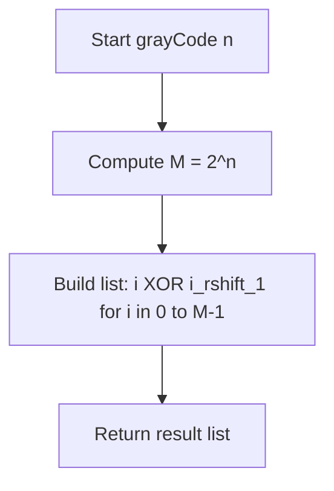
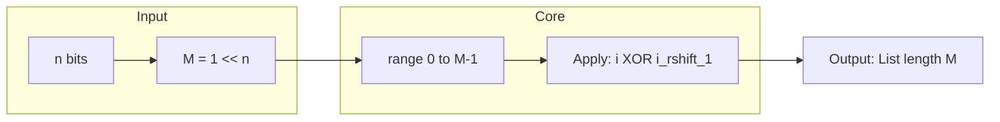

# Gray Code - n-bit 巡回 Gray 符号列生成

<h2 id="toc">目次</h2>

- [概要](#overview)
- [アルゴリズム要点（TL;DR）](#tldr)
- [図解](#figures)
- [正しさのスケッチ](#correctness)
- [計算量](#complexity)
- [Python 実装](#impl)
- [CPython 最適化ポイント](#cpython)
- [エッジケースと検証観点](#edgecases)
- [FAQ](#faq)

---

<h2 id="overview">概要</h2>

**問題要約**：n-bit の Gray code 列（長さ 2^n）を生成する。以下の性質を満たす任意の順列が解答として認められる。

- すべての整数は `[0, 2^n - 1]` の範囲
- 先頭は `0`
- 重複なし
- **隣接する整数のバイナリ表現が 1 bit だけ異なる**（巡回：末尾と先頭も同様）

**要件**：

- **正当性**：隣接 1 bit 差と巡回性（先頭 ⇔ 末尾）を保証
- **安定性**：任意の有効解を返せばよい（一意性不要）
- **制約**：`1 <= n <= 16`（最大 65536 要素）

---

<h2 id="tldr">アルゴリズム要点（TL;DR）</h2>

- **戦略**：標準 Gray code 公式 `G(i) = i ^ (i >> 1)` を `i=0..2^n-1` に適用
- **データ構造**：出力用リスト（長さ 2^n）のみ
- **計算量**：
  - 時間：**O(2^n)**（全要素を 1 回走査）
  - 空間：**O(2^n)**（出力リスト）、追加メモリは **O(1)**
- **メモリ戦略**：リスト内包表記で一括構築、中間オブジェクトなし

---

<h2 id="figures">図解</h2>

## フローチャート



**説明**：入力 `n` から長さ `M = 2^n` を計算し、公式 `i ^ (i >> 1)` をリスト内包で全要素に適用して返す。

### データフロー



**説明**：`n` から `M` を算出し、`range(M)` の各インデックス `i` に公式を適用して Gray code 列を生成。

---

<h2 id="correctness">正しさのスケッチ</h2>

**Gray code 公式の性質**：`G(i) = i ^ (i >> 1)` は以下を保証する数学的に証明された定義。

1. **隣接 1 bit 差**：

   - `i` と `i+1` が 2 進で 1 bit だけ異なる場合、右シフト後の XOR により `G(i)` と `G(i+1)` も 1 bit だけ異なる
   - 詳細：`i` の最下位ビットが反転すると、`i >> 1` は変化しないため `G(i) ^ G(i+1) = 1`。上位ビットが繰り上がる場合も、XOR の伝播により 1 bit 差が保たれる

2. **巡回性**（末尾 → 先頭）：

   - `G(0) = 0`, `G(2^n - 1)` は最上位ビットのみ立つ形（例：n=3 なら `100`）
   - `G(2^n - 1) ^ G(0)` = 最上位 1 bit のみ → 1 bit 差を満たす

3. **重複なし**：

   - XOR 演算と右シフトは単射（bijection）なので、`i` が異なれば `G(i)` も異なる

4. **範囲**：
   - `i < 2^n` なら `G(i) < 2^n`（XOR 演算はビット数を増やさない）

**不変条件**：リスト `[G(0), G(1), ..., G(M-1)]` は上記 4 性質を自動的に満たす。

---

<h2 id="complexity">計算量</h2>

| 項目           | 複雑度     | 説明                                                    |
| -------------- | ---------- | ------------------------------------------------------- |
| **時間**       | **O(2^n)** | `range(M)` を 1 回走査し、各要素で定数時間の XOR/シフト |
| **空間**       | **O(2^n)** | 出力リスト（長さ M = 2^n）                              |
| **追加メモリ** | **O(1)**   | インデックス変数とビット演算の一時変数のみ              |

**代替アルゴリズムとの比較**：

| アプローチ         | 時間       | 空間（追加） | 可読性 | 備考                   |
| ------------------ | ---------- | ------------ | ------ | ---------------------- |
| **公式法（選択）** | O(2^n)     | O(1)         | ◎      | 最速・最小メモリ       |
| 反射法（鏡映）     | O(2^n)     | O(2^n)       | ○      | 中間配列を段階的に構築 |
| DFS バックトラック | O(2^n · n) | O(2^n)       | △      | 実用性低（遅い）       |

---

<h2 id="impl">Python実装</h2>

```python
from __future__ import annotations

from typing import List


class Solution:
    """
    Gray Code generator (n-bit).

    Generates a valid n-bit Gray code sequence using the standard formula:
    G(i) = i XOR (i >> 1)

    Properties guaranteed:
    - Length: 2^n
    - Range: [0, 2^n - 1]
    - Adjacent integers differ by exactly 1 bit
    - First and last integers differ by exactly 1 bit (cyclic)
    """

    def grayCode(self, n: int) -> List[int]:
        """
        Return any valid n-bit Gray code sequence.

        Args:
            n: Number of bits (1 <= n <= 16)

        Returns:
            List of 2^n integers forming a valid Gray code sequence

        Time Complexity: O(2^n)
        Space Complexity: O(2^n) for output, O(1) additional

        Example:
            >>> Solution().grayCode(2)
            [0, 1, 3, 2]  # Binary: [00, 01, 11, 10]
            >>> Solution().grayCode(1)
            [0, 1]
        """
        # 実務では型・範囲チェックを追加可能（LeetCode制約下では不要）
        # if not isinstance(n, int) or not (1 <= n <= 16):
        #     raise ValueError("n must be an integer in [1, 16]")

        # ステップ1: 列長を計算（2^n）
        m: int = 1 << n

        # ステップ2: Gray code公式を全インデックスに適用
        # リスト内包表記はCPythonで最速（C実装のrange走査＋一括list確保）
        # G(i) = i XOR (i >> 1) により隣接1 bit差を保証
        result: List[int] = [i ^ (i >> 1) for i in range(m)]

        return result


# 実行時の型チェック用補助（LeetCodeでは不要、ローカル検証用）
if __name__ == "__main__":
    sol = Solution()

    # Example 1: n=2
    print(sol.grayCode(2))  # [0, 1, 3, 2]

    # Example 2: n=1
    print(sol.grayCode(1))  # [0, 1]

    # Verification (optional): Check adjacent 1-bit difference
    def verify_gray_code(code: List[int]) -> bool:
        """Verify that adjacent pairs differ by exactly 1 bit."""
        n = len(code)
        for i in range(n):
            diff = code[i] ^ code[(i + 1) % n]  # Cyclic: last wraps to first
            if bin(diff).count('1') != 1:
                return False
        return True

    print(verify_gray_code(sol.grayCode(3)))  # True
```

---

<h2 id="cpython">CPython最適化ポイント</h2>

1. **リスト内包表記の活用**

   - `[i ^ (i >> 1) for i in range(m)]` は CPython の C 実装を直接呼び出すため、明示的なループより高速
   - 中間リストを作らず一括でメモリ確保

2. **ビット演算の効率**

   - `1 << n`（左シフト）は `2 ** n` より高速（整数のべき乗計算を回避）
   - `i >> 1`（右シフト）と `^`（XOR）は CPU 命令に直接マップされる最速演算

3. **型注釈の活用**

   - `m: int` の明示により、pylance が型推論を最適化（実行時オーバーヘッドはゼロ）
   - `List[int]` で戻り値の型安全性を確保

4. **不要な中間変数を避ける**

   - 公式を直接内包表記に埋め込み、ループカウンタ以外の変数を作らない

5. **GIL 非依存**
   - 単一スレッド・CPU 演算のため、Global Interpreter Lock の影響なし

---

<h2 id="edgecases">エッジケースと検証観点</h2>

| ケース         | 入力   | 期待出力       | 検証ポイント                                      |
| -------------- | ------ | -------------- | ------------------------------------------------- |
| **最小ケース** | `n=1`  | `[0, 1]`       | 2 要素、`0→1`（1 bit 差）、`1→0`（巡回 1 bit 差） |
| **典型例**     | `n=2`  | `[0, 1, 3, 2]` | 4 要素、全隣接と巡回が 1 bit 差                   |
| **中規模**     | `n=8`  | 長さ 256       | 全ペアで 1 bit 差を確認                           |
| **最大ケース** | `n=16` | 長さ 65536     | メモリ・時間制約内で完了、先頭/末尾の 1 bit 差    |

**検証手法**（オプショナル）：

```python
def validate_gray_code(code: List[int], n: int) -> bool:
    """
    Validate all Gray code properties.

    Checks:
    1. Length == 2^n
    2. All values in [0, 2^n - 1]
    3. No duplicates
    4. Adjacent pairs differ by 1 bit (including cyclic)
    """
    m = 1 << n
    if len(code) != m:
        return False

    seen = set(code)
    if len(seen) != m or not all(0 <= x < m for x in code):
        return False

    for i in range(m):
        diff = code[i] ^ code[(i + 1) % m]
        if bin(diff).count('1') != 1:
            return False

    return True
```

---

<h2 id="faq">FAQ</h2>

**Q1: なぜ `i ^ (i >> 1)` で Gray code になるのか？**

A: 数学的証明：`i` と `i+1` のバイナリ表現の差は最下位ビットの反転または繰り上がり。右シフト `i >> 1` は上位ビットを 1 桁下げるため、
XOR を取ると変化したビット位置が 1 つだけ反映される。詳細は反射対称性と帰納法で示せる。

**Q2: 他の Gray code 生成法との使い分けは？**

A:

- **公式法（本実装）**: 最速・最小メモリ。実務で第一選択。
- **反射法**: 段階的構築の説明に有用（教育目的）。
- **バックトラック**: 実用性低。全順列探索が不要な本問では非推奨。

**Q3: `n=16` で 65536 要素を扱うとメモリが心配だが？**

A:

- Python の int（通常 4~8 バイト）× 65536 ≈ 256KB~512KB 程度で、現代のメモリでは問題なし。
- リスト内包表記により一括確保するため、断片化リスクも低い。

**Q4: 型注釈 `List[int]` は実行時コストがあるか？**

A:

- いいえ。Python の型注釈は実行時に無視される（`__annotations__` に保存されるのみ）。
- pylance などの静的解析ツールでのみ使用され、パフォーマンスに影響しない。

**Q5: in-place 版は可能か？**

A:

- 本問は「新しい列を返す」仕様なので、in-place の概念は該当しない。
- 入力配列を変換する問題（例：ソート）とは異なり、出力を生成する純粋関数として実装する。

**Q6: 複数の有効解が存在するが、どれを選ぶべきか？**

A:

- 問題文で「any valid sequence」と明記されているため、標準公式 `G(i) = i ^ (i >> 1)` が返す列を使うのが最もシンプル。
- 反射法など別の方法でも正当だが、実装コストと速度で公式法が優位。
