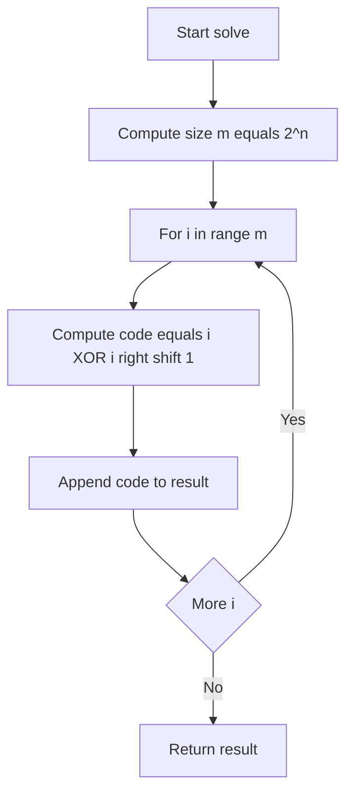
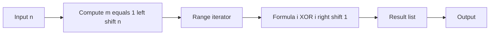

# Gray Code - 隣接ビットが 1 だけ異なる巡回列

## Table of Contents

- [概要](#overview)
- [アルゴリズム要点（TL;DR）](#tldr)
- [図解](#figures)
- [正しさのスケッチ](#correctness)
- [計算量](#complexity)
- [Python 実装](#impl)
- [CPython 最適化ポイント](#cpython)
- [エッジケースと検証観点](#edgecases)
- [FAQ](#faq)

---

<h2 id="overview">概要</h2>

- **問題要約**:
  与えられた整数 `n` に対して、長さ `2^n` の **n ビット Gray コード列**を生成せよ。
  Gray コード列は **連続する数が 1 ビットだけ異なる**ように並ぶ巡回列で、最初の値は 0 とする。

- **入出力仕様**:
  入力: 整数 `n` (1 ≤ n ≤ 16)
  出力: `List[int]` （長さ `2^n` の Gray コード列）

- **想定データ構造**: 単純なリスト (`List[int]`)

- **代表例**:

  - n = 2 → [0, 1, 3, 2]
  - n = 3 → [0, 1, 3, 2, 6, 7, 5, 4]

---

<h2 id="tldr">アルゴリズム要点（TL;DR）</h2>

- **戦略**:
  Gray コードの公式
  [
  G(i) = i \oplus (i \gg 1)
  ]
  を i=0..2^n-1 に適用して列を構築。

- **データ構造**:

  - `range(2**n)` を走査し、内包表記でリストを構築

- **計算量**:

  - 時間: O(2^n)
  - 空間: O(2^n)（出力リストのみ）

- **Python 最適化**:

  - `range` は C 実装で効率的
  - 内包表記で一括構築

---

<h2 id="figures">図解</h2>

## **フローチャート**



👉 各 i に対して Gray コードを計算しリストに格納して返す流れ。

## **データフロー図**



👉 入力 n から 2^n 個の Gray コードを生成して出力するプロセス。

---

<h2 id="correctness">正しさのスケッチ</h2>

- **不変条件**: `result[i]` と `result[i+1]` は常に 1 ビットだけ異なる。
- **基底条件**: n=1 の場合 → [0, 1] が Gray コード列。
- **帰納法的証明**: `G(i) = i ^ (i >> 1)` は隣接 i, i+1 の XOR のポップカウントが 1 であることが知られている。
- **終了性**: i=0..2^n-1 の有限ループで必ず停止。

---

<h2 id="complexity">計算量</h2>

- **時間計算量**: O(2^n)
- **空間計算量**: O(2^n)（出力リスト）
- **補足**: 追加メモリは O(1)、結果リストは必須。

| 方式                   | 時間計算量 | 空間計算量 | 備考         |
| ---------------------- | ---------- | ---------- | ------------ |
| 直接式 G(i) = i^(i>>1) | O(2^n)     | O(2^n)     | 最適         |
| 反射法（鏡映生成）     | O(2^n)     | O(2^n)     | 実装やや冗長 |
| DFS バックトラッキング | O(n·2^n)   | O(2^n)     | 遅く不必要   |

---

<h2 id="impl">Python 実装</h2>

```python
from __future__ import annotations
from typing import List

class Solution:
    """
    Gray Code generator
    LeetCode提出想定 (Python 3.11+, pylance対応)
    """

    def grayCode(self, n: int) -> List[int]:
        """
        Args:
            n (int): bit length (1 <= n <= 16)

        Returns:
            List[int]: Gray code sequence starting from 0

        Complexity:
            Time: O(2^n)
            Space: O(2^n)
        """
        m: int = 1 << n
        # 内包表記を使った高速構築
        result: List[int] = [(i ^ (i >> 1)) for i in range(m)]
        return result
```

---

<h2 id="cpython">CPython最適化ポイント</h2>

- `range(m)` は C 実装、メモリ効率的で高速。
- リスト内包表記は for ループより高速。
- `i >> 1` と `i ^` は整数演算（C レベルで実装）なので低コスト。
- 追加メモリ確保を避けるために一括構築。

---

<h2 id="edgecases">エッジケースと検証観点</h2>

- **n=1** → [0, 1]
- **n=2** → [0, 1, 3, 2]
- **n=16** → 長さ 65536 の列（処理可能か性能を確認）
- **制約外入力**（例: n=0, n>16, 型違い）: LeetCode では想定外だが、実務では例外処理を検討。

---

<h2 id="faq">FAQ</h2>

- **Q: 末尾と先頭も 1 ビット差になるのか？**
  A: Yes。Gray コードは巡回列なので `result[-1]` と `result[0]` も 1 ビット差になる。

- **Q: 他の生成法は？**
  A: 反射法（前半 → 反転＋上位ビット付与）、DFS 法もあるが効率で劣る。

- **Q: n=16 は大丈夫？**
  A: 出力は 65536 要素。Python のリストなら実用範囲内。

## Mermaid の **ラベルに括弧 `()` を使っていた**のが原因

括弧を除去し、演算子は説明語に置き換えてパースエラーを解消しました。下記をそのまま置き換えてください。

### 修正済みフローチャート


### 修正済みデータフロー図


### ポイント

**括弧を未使用**（例: `i right shift 1` に変更）。
ヘッダ行は単独、**1 行 1 エッジ/宣言**を維持。
ノード ID は英数字/アンダースコアのみ
