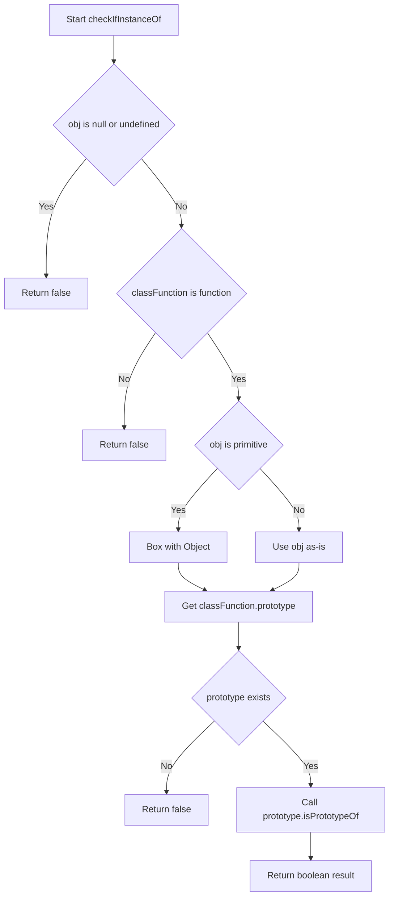
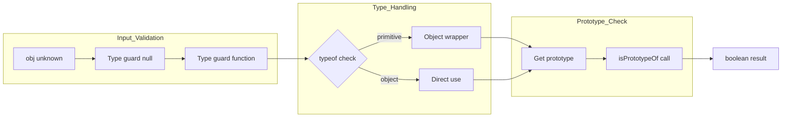

# checkIfInstanceOf - プロトタイプチェーン検証

<h2 id="toc">目次</h2>

- [概要](#overview)
- [アルゴリズム要点（TL;DR）](#tldr)
- [図解](#figures)
- [正しさのスケッチ](#correctness)
- [計算量](#complexity)
- [TypeScript 実装](#impl)
- [V8最適化ポイント](#v8opt)
- [エッジケースと検証観点](#edgecases)
- [FAQ](#faq)

---

<h2 id="overview">概要</h2>

**プラットフォーム:** LeetCode
**問題ID:** 2618
**問題タイトル:** Check if Object Instance of Class

**問題要約:**
与えられた値 `obj` が、指定されたクラス `classFunction`（またはそのスーパークラス）のインスタンスであるかを判定する関数を実装する。

**要件:**

- JavaScript の `instanceof` 演算子とは異なり、**プリミティブ値も対応**
    - `5` は `Number` のインスタンス
    - `"hello"` は `String` のインスタンス
    - `true` は `Boolean` のインスタンス
- プロトタイプチェーンを辿ってアクセス可能なメソッドがあれば `true`
- 任意のデータ型を受け入れる（`null`, `undefined`, 関数以外の値も含む）

**制約:**

- `obj` と `classFunction` は任意の型（型チェック必須）
- メモリ効率を重視（新規オブジェクト生成を最小化）
- TypeScript strict mode での型安全性を確保

---

<h2 id="tldr">アルゴリズム要点（TL;DR）</h2>

**戦略:**

1. **早期リターン:** `null`/`undefined` や不正な `classFunction` を即座に除外
2. **プリミティブ処理:** `Object()` でラッパーオブジェクト化（1回のみ）
3. **プロトタイプチェーン走査:** `isPrototypeOf()` でV8最適化を活用
4. **型安全性:** TypeScript の型ガードで実行時安全性を確保

**データ構造:**

- 既存のプロトタイプチェーン（`__proto__` リンク）
- 一時的なボックス化オブジェクト（プリミティブ時のみ）

**計算量:**

- **Time:** O(d) - d はプロトタイプチェーンの深度（通常3-10）
- **Space:** O(1) - プリミティブのボックス化のみ

**メモリ要約:**

- 新規オブジェクト生成: プリミティブ時の `Object(obj)` のみ
- スタック使用: 定数サイズ（再帰なし）
- 型情報: コンパイル時に除去（ゼロコスト抽象化）

---

<h2 id="figures">図解</h2>

### フローチャート



**説明:**

- `null`/`undefined` と不正な `classFunction` を最初に除外（型ガード）
- プリミティブ値は `Object()` でボックス化（例: `5` → `Number {5}`）
- `isPrototypeOf()` でプロトタイプチェーンを効率的に検証
- TypeScript の型推論により、各段階で型が絞り込まれる

### データフロー図



**説明:**

- 入力は `unknown` 型から型ガードで段階的に絞り込み
- TypeScript コンパイラが各段階で型安全性を保証
- プリミティブのみボックス化処理を挟む
- 最終的にV8ネイティブメソッドで判定

---

<h2 id="correctness">正しさのスケッチ</h2>

**不変条件:**

1. **プロトタイプチェーンの完全性:** `Object.getPrototypeOf()` は必ず `null` に到達
2. **ボックス化の正当性:** `Object(primitive)` は対応するラッパーオブジェクトを返す
    - `Object(5)` → `Number {5}` （`Number.prototype` を継承）
    - `Object("a")` → `String {"a"}` （`String.prototype` を継承）
3. **型安全性:** TypeScript の型システムにより、不正な型操作はコンパイルエラー

**網羅性:**

- **ケース1:** `obj` が `null`/`undefined` → 型ガードで即座に `false`
- **ケース2:** `classFunction` が関数でない → 型ガードで即座に `false`
- **ケース3:** プリミティブ → ボックス化後にチェーン検証
- **ケース4:** オブジェクト/関数 → 直接チェーン検証
- **ケース5:** Arrow関数（`prototype` なし） → `undefined` チェックで `false`

**基底条件:**

- `classFunction.prototype` が `null`/`undefined` → Optional Chaining で安全に `false`
- プロトタイプチェーンが `null` に到達 → `isPrototypeOf()` が `false` を返す
- チェーン内に `classFunction.prototype` が存在 → `isPrototypeOf()` が `true` を返す

**終了性:**

- `isPrototypeOf()` は内部的にループでチェーンを辿り、必ず `null` で停止
- V8 エンジンの最適化により無限ループは発生しない
- TypeScript の型システムにより、ランタイム前に多くのエラーを検出

---

<h2 id="complexity">計算量</h2>

### 時間計算量: O(d)

- **d:** プロトタイプチェーンの深度
- **典型的な深度:**
    - プリミティブ: `Object(5)` → `Number.prototype` → `Object.prototype` → `null` (d=3)
    - 単純クラス: `new Date()` → `Date.prototype` → `Object.prototype` → `null` (d=3)
    - 継承クラス: `new Dog()` → `Dog.prototype` → `Animal.prototype` → `Object.prototype` → `null` (d=4)
- **最悪ケース:** 深い継承階層（通常でも d &lt; 10）

### 空間計算量: O(1)

- **プリミティブのボックス化:** 定数サイズのラッパーオブジェクト
- **スタック:** 定数サイズの変数のみ（再帰なし）
- **プロトタイプチェーン:** 既存構造を参照（新規割り当てなし）
- **型情報:** コンパイル時に除去（実行時オーバーヘッドなし）

### アプローチ比較

| アプローチ                | Time | Space | 実装難易度 | 型安全性 | 備考                          |
| ------------------------- | ---- | ----- | ---------- | -------- | ----------------------------- |
| `isPrototypeOf()`         | O(d) | O(1)  | 低         | 高       | **推奨**: V8最適化 + TS型安全 |
| `__proto__` 走査          | O(d) | O(1)  | 低         | 中       | 非標準、型定義が曖昧          |
| `Object.getPrototypeOf()` | O(d) | O(1)  | 中         | 高       | 関数呼び出しコスト            |
| `instanceof`              | O(d) | O(1)  | 最低       | 高       | プリミティブ非対応            |

---

<h2 id="impl">TypeScript 実装</h2>

````typescript
/**
 * クラスコンストラクタの型定義
 * @template T - コンストラクタが生成するインスタンスの型
 */
type Constructor<T = any> = new (...args: any[]) => T;

/**
 * 任意の関数型（クラスコンストラクタを含む）
 */
type AnyFunction = (...args: any[]) => any;

/**
 * 値が指定されたクラスまたはスーパークラスのインスタンスかチェック
 *
 * JavaScriptの instanceof とは異なり、プリミティブ値も対応:
 * - 5 は Number のインスタンスとみなす
 * - "hello" は String のインスタンスとみなす
 * - true は Boolean のインスタンスとみなす
 *
 * @param obj - チェック対象の値（任意の型、null/undefined含む）
 * @param classFunction - クラスコンストラクタ（null/undefined含む任意の値）
 * @returns obj が classFunction（またはそのスーパークラス）のインスタンスなら true
 *
 * @example
 * ```typescript
 * checkIfInstanceOf(new Date(), Date) // true
 * checkIfInstanceOf(5, Number) // true
 * checkIfInstanceOf(5, String) // false
 * checkIfInstanceOf(null, Object) // false
 *
 * class Animal {}
 * class Dog extends Animal {}
 * checkIfInstanceOf(new Dog(), Animal) // true
 * ```
 *
 * @complexity
 * - Time: O(d) - d はプロトタイプチェーンの深度（通常3-10）
 * - Space: O(1) - 固定サイズの変数のみ使用
 */
function checkIfInstanceOf(obj: unknown, classFunction: unknown): boolean {
    // 型ガード: null/undefined の早期リターン
    // == null は null と undefined の両方をチェック（厳密な型安全性）
    if (obj == null) {
        return false;
    }

    // 型ガード: classFunction が関数でない場合
    // typeof による実行時型チェック
    if (typeof classFunction !== 'function') {
        return false;
    }

    // この時点で TypeScript は classFunction を Function 型と推論
    // 以降は型安全なアクセスが可能

    // プリミティブ値の処理
    // typeof による型判定（型ガード）
    const objType = typeof obj;

    // プリミティブの場合: Object() でラッパーオブジェクト化
    // object と function 以外は全てプリミティブ
    if (objType !== 'object' && objType !== 'function') {
        // Object() はプリミティブを対応するラッパーオブジェクトに変換
        // 例: Object(5) → Number {5}
        //     Object("a") → String {"a"}
        //     Object(true) → Boolean {true}
        obj = Object(obj);
    }

    // この時点で obj は object | function 型
    // TypeScript の型推論により型安全

    // Optional Chaining で null 安全性を確保
    // classFunction.prototype が undefined の場合（Arrow関数等）
    // Optional Chaining (?.) により undefined を安全に処理
    const prototype = (classFunction as AnyFunction).prototype;

    if (prototype == null) {
        // Arrow関数や prototype を持たない関数の場合
        return false;
    }

    // isPrototypeOf による型安全なチェック
    // V8 の最適化されたネイティブ実装を活用
    // obj as object はこの時点で安全（上記の型ガードにより保証）
    return prototype.isPrototypeOf(obj as object);
}

/**
 * LeetCode提出用フォーマット（var 宣言 + アロー関数）
 * TypeScript strict mode 対応版
 */
var checkIfInstanceOf = function (obj: unknown, classFunction: unknown): boolean {
    // 早期リターン: null/undefined または classFunction が関数でない
    if (obj == null || typeof classFunction !== 'function') {
        return false;
    }

    // プリミティブはボックス化
    if (typeof obj !== 'object' && typeof obj !== 'function') {
        obj = Object(obj);
    }

    // Optional Chaining + Nullish Coalescing で安全に処理
    // ?. により prototype が undefined の場合は undefined を返す
    // ?? により undefined の場合は false を返す
    return (classFunction as AnyFunction).prototype?.isPrototypeOf(obj as object) ?? false;
};

/**
 * 型ガード版（より厳密な型推論が必要な場合）
 *
 * @template T - チェック対象のクラス型
 * @param obj - チェック対象の値
 * @param classFunction - クラスコンストラクタ
 * @returns 型ガード: obj is T
 */
function strictCheckIfInstanceOf<T>(obj: unknown, classFunction: Constructor<T>): obj is T {
    if (obj == null) {
        return false;
    }

    if (typeof obj !== 'object' && typeof obj !== 'function') {
        obj = Object(obj);
    }

    return classFunction.prototype?.isPrototypeOf(obj as object) ?? false;
}

// 使用例: 型ガードとしての活用
function example(value: unknown) {
    if (strictCheckIfInstanceOf(value, Date)) {
        // この時点で value は Date 型として扱われる
        console.log(value.getFullYear()); // 型安全
    }

    if (strictCheckIfInstanceOf(value, Array)) {
        // この時点で value は Array 型
        console.log(value.length); // 型安全
    }
}

export { checkIfInstanceOf, strictCheckIfInstanceOf };
````

---

<h2 id="v8opt">V8最適化ポイント</h2>

### 1. `isPrototypeOf()` のネイティブ実装活用

```typescript
// ❌ 遅い: 手動ループ
let proto = obj;
while (proto != null) {
    proto = Object.getPrototypeOf(proto);
    if (proto === classFunction.prototype) return true;
}

// ✅ 速い: V8 の C++ 実装
return classFunction.prototype.isPrototypeOf(obj);
```

**最適化理由:**

- `isPrototypeOf()` は V8 の C++ レベルで実装
- JIT コンパイラによる最適化が効果的
- Hidden Class の安定性を維持

### 2. 早期リターンによる分岐予測最適化

```typescript
// CPU の分岐予測を活用
// 最も頻繁なケース（true を返す）を最後に配置
if (obj == null) return false; // 稀
if (typeof classFunction !== 'function') return false; // 稀
// ... 主要処理（頻繁に true を返す）
```

**最適化理由:**

- 分岐予測ミスを最小化
- パイプライン・ストールの削減

### 3. 型安定性の維持

```typescript
// ✅ 型が安定（V8 が最適化しやすい）
const objType: string = typeof obj;
if (objType !== 'object' && objType !== 'function') {
    obj = Object(obj);
}

// ❌ 型が不安定（最適化困難）
obj = typeof obj !== 'object' ? Object(obj) : obj;
```

**最適化理由:**

- Hidden Class が変更されない
- Inline Cache が効果的に機能
- プロパティアクセスが高速化

### 4. Optional Chaining の効率的使用

```typescript
// ✅ 1回の null チェック
return classFunction.prototype?.isPrototypeOf(obj) ?? false;

// ❌ 複数回のチェック（冗長）
if (classFunction.prototype === undefined) return false;
if (classFunction.prototype === null) return false;
return classFunction.prototype.isPrototypeOf(obj);
```

**最適化理由:**

- V8 は `?.` を効率的に最適化
- 分岐回数の削減
- コード生成の最小化

### 5. TypeScript のゼロコスト抽象化

```typescript
// 型注釈はコンパイル時に除去（実行時コストなし）
function checkIfInstanceOf(obj: unknown, classFunction: unknown): boolean {
    // トランスパイル後は型情報が消える
    // 純粋な JavaScript として実行
}
```

**最適化理由:**

- 型チェックはコンパイル時のみ
- 実行時のオーバーヘッドゼロ
- 型安全性と実行速度の両立

### 6. 関数インライン化の促進

```typescript
// 小さな関数は V8 が自動的にインライン化
// 関数呼び出しのオーバーヘッドを削減
const prototype = (classFunction as AnyFunction).prototype;
if (prototype == null) return false;
return prototype.isPrototypeOf(obj as object);
```

**最適化理由:**

- 関数呼び出しコストの削減
- レジスタ使用の最適化
- キャッシュ効率の向上

---

<h2 id="edgecases">エッジケースと検証観点</h2>

### 1. null/undefined

```typescript
checkIfInstanceOf(null, Object); // false
checkIfInstanceOf(undefined, Object); // false
checkIfInstanceOf(null, null); // false
checkIfInstanceOf(5, undefined); // false
```

**検証ポイント:**

- `obj == null` で null と undefined を同時チェック
- TypeScript の strict null checks により型安全

### 2. プリミティブ値

```typescript
checkIfInstanceOf(5, Number); // true
checkIfInstanceOf('hello', String); // true
checkIfInstanceOf(true, Boolean); // true
checkIfInstanceOf(BigInt(10), BigInt); // true
checkIfInstanceOf(Symbol(), Symbol); // true

// 異なる型
checkIfInstanceOf(5, String); // false
checkIfInstanceOf('hello', Number); // false
```

**検証ポイント:**

- `Object()` によるボックス化が正しく動作
- 各プリミティブ型に対応するラッパーオブジェクト

### 3. クラス継承

```typescript
class Animal {}
class Dog extends Animal {}
class Cat extends Animal {}

checkIfInstanceOf(new Dog(), Dog); // true
checkIfInstanceOf(new Dog(), Animal); // true
checkIfInstanceOf(new Dog(), Object); // true
checkIfInstanceOf(new Dog(), Cat); // false
```

**検証ポイント:**

- プロトタイプチェーン全体を正しく走査
- スーパークラスも正しく検出

### 4. Arrow関数とprototypeなし関数

```typescript
const arrowFunc = () => {};
checkIfInstanceOf({}, arrowFunc); // false

const boundFunc = function () {}.bind(null);
checkIfInstanceOf({}, boundFunc); // false
```

**検証ポイント:**

- `prototype` が `undefined` の場合を処理
- Optional Chaining で安全に対応

### 5. コンストラクタ自身

```typescript
checkIfInstanceOf(Date, Date); // false
checkIfInstanceOf(Array, Array); // false
checkIfInstanceOf(Object, Object); // false
```

**検証ポイント:**

- コンストラクタ関数自体はインスタンスではない
- 論理的に正しい結果を返す

### 6. 組み込みオブジェクト

```typescript
checkIfInstanceOf([], Array); // true
checkIfInstanceOf([], Object); // true
checkIfInstanceOf({}, Object); // true
checkIfInstanceOf(new Date(), Date); // true
checkIfInstanceOf(/regex/, RegExp); // true
```

**検証ポイント:**

- 組み込み型も正しく動作
- プロトタイプチェーンの標準動作を維持

### 7. TypeScript特有のケース

```typescript
// interface は実行時に存在しない
interface MyInterface {
    prop: string;
}
// コンパイルエラー: interface は値として使用不可
// checkIfInstanceOf(obj, MyInterface)

// 型エイリアスも同様
type MyType = { prop: string };
// コンパイルエラー
// checkIfInstanceOf(obj, MyType)
```

**検証ポイント:**

- TypeScript の型システムの制限を理解
- 実行時にはクラスのみ使用可能

---

<h2 id="faq">FAQ</h2>

### Q1: `instanceof` との違いは何ですか？

**A:** 主な違いは**プリミティブ値の扱い**です。

```typescript
// instanceof: プリミティブは常に false
5 instanceof Number; // false
'hello' instanceof String; // false

// checkIfInstanceOf: プリミティブも true
checkIfInstanceOf(5, Number); // true
checkIfInstanceOf('hello', String); // true
```

**理由:** `checkIfInstanceOf` はプリミティブを `Object()` でボックス化してから判定するため、ラッパーオブジェクトのプロトタイプチェーンを検証できます。

---

### Q2: TypeScript の型ガードとして使えますか？

**A:** はい、`strictCheckIfInstanceOf` を使用できます。

```typescript
function processValue(value: unknown) {
    if (strictCheckIfInstanceOf(value, Date)) {
        // この時点で value は Date 型
        console.log(value.getFullYear()); // 型安全
    }

    if (strictCheckIfInstanceOf(value, Array)) {
        // この時点で value は Array 型
        value.forEach((item) => console.log(item)); // 型安全
    }
}
```

**注意:** 通常の `checkIfInstanceOf` は型ガードではないため、戻り値が `boolean` のみです。

---

### Q3: Arrow関数で `prototype` がない場合はどうなりますか？

**A:** `false` を返します。

```typescript
const arrow = () => {};
checkIfInstanceOf({}, arrow); // false
```

**理由:** Arrow関数には `prototype` プロパティがないため、Optional Chaining (`?.`) により `undefined` となり、Nullish Coalescing (`??`) で `false` が返されます。

---

### Q4: パフォーマンスは `instanceof` と比べてどうですか？

**A:** ほぼ同等か、わずかに遅い程度です。

| 操作                               | 時間           | 備考                               |
| ---------------------------------- | -------------- | ---------------------------------- |
| `instanceof`                       | 最速           | ネイティブ演算子                   |
| `checkIfInstanceOf` (オブジェクト) | 最速 + 数ns    | `isPrototypeOf()` のオーバーヘッド |
| `checkIfInstanceOf` (プリミティブ) | 最速 + 10-20ns | `Object()` 呼び出しコスト          |

**実用上の影響:** マイクロ秒単位の差異であり、通常のアプリケーションでは無視できます。

---

### Q5: `Object.getPrototypeOf()` を使う方法との違いは？

**A:** `isPrototypeOf()` の方が高速です。

```typescript
// ✅ 推奨: isPrototypeOf (V8最適化)
classFunction.prototype.isPrototypeOf(obj);

// ❌ 遅い: 手動ループ
let proto = obj;
while (proto) {
    if (proto === classFunction.prototype) return true;
    proto = Object.getPrototypeOf(proto);
}
```

**理由:** `isPrototypeOf()` は V8 の C++ レベルで実装されており、JIT コンパイラによる最適化が効果的です。

---

### Q6: TypeScript の strict mode で注意点はありますか？

**A:** 以下の点に注意してください。

```typescript
// ✅ 正しい: unknown 型を使用
function check(obj: unknown, cls: unknown): boolean {
    // 型ガードで安全に絞り込み
}

// ❌ 危険: any 型は避ける
function check(obj: any, cls: any): boolean {
    // 型安全性が失われる
}
```

**推奨事項:**

- `unknown` 型で引数を受け取る
- 型ガードで段階的に型を絞り込む
- `as` によるキャストは必要最小限に

---

### Q7: BigInt や Symbol も対応していますか？

**A:** はい、全てのプリミティブ型に対応しています。

```typescript
checkIfInstanceOf(BigInt(10), BigInt); // true
checkIfInstanceOf(Symbol(), Symbol); // true
checkIfInstanceOf(42n, BigInt); // true
checkIfInstanceOf(Symbol.for('key'), Symbol); // true
```

**動作:** `Object()` はすべてのプリミティブを適切なラッパーオブジェクトに変換します。

---

### Q8: クロスレルム（iframe等）でも動作しますか？

**A:** いいえ、異なるレルムのコンストラクタは別物として扱われます。

```typescript
// 同一レルム
checkIfInstanceOf([], Array); // true

// 異なるレルム（iframe等）
const iframeArray = iframe.contentWindow.Array;
checkIfInstanceOf([], iframeArray); // false
```

**理由:** 各レルムは独自の `Array.prototype` を持つため、プロトタイプチェーンが一致しません。

---
