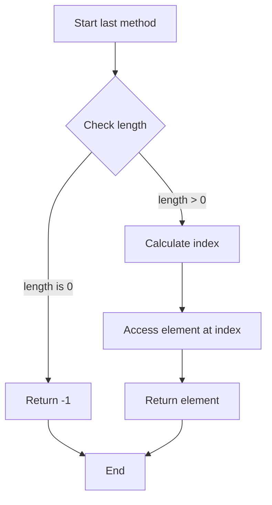
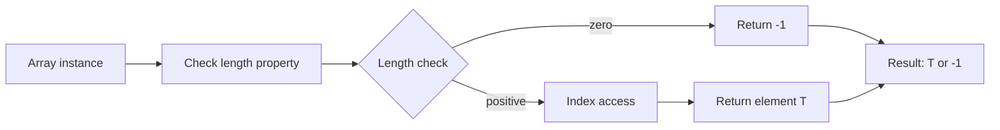

# Array.prototype.last() - 配列の最後の要素を取得するプロトタイプ拡張

<h2 id="toc">目次</h2>

- [概要](#overview)
- [アルゴリズム要点（TL;DR）](#tldr)
- [図解](#figures)
- [正しさのスケッチ](#correctness)
- [計算量](#complexity)
- [TypeScript 実装](#impl)
- [TypeScript最適化ポイント](#typescript-opt)
- [エッジケースと検証観点](#edgecases)
- [FAQ](#faq)

---

<h2 id="overview">概要</h2>

**問題**: すべての配列に対して `.last()` メソッドを呼び出せるように拡張し、配列の最後の要素を返す。配列が空の場合は `-1` を返す。

**入力**: JSON.parse の出力である任意の配列
**出力**: 最後の要素、または `-1`（空配列の場合）

**制約**:

- `arr` は有効なJSON配列
- `0 <= arr.length <= 1000`

**要件**:

- **正当性**: 空配列で `-1`、非空配列で最後の要素を正確に返す
- **型安全性**: TypeScriptの型システムで戻り値型を `T | -1` として表現
- **パフォーマンス**: O(1) 時間・空間計算量

---

<h2 id="tldr">アルゴリズム要点（TL;DR）</h2>

- **戦略**: `Array.prototype` への直接的なメソッド追加
- **データ構造**: 配列の `length` プロパティと直接インデックスアクセスのみ使用
- **時間計算量**: O(1) - 配列長チェックとインデックスアクセスのみ
- **空間計算量**: O(1) - 追加メモリ不要
- **型安全性**: Declaration Merging で `Array<T>` インターフェースを拡張
- **最適化**:
    - truthy チェックによる分岐最小化
    - プリミティブ操作のみでGC負荷ゼロ
    - ジェネリクス型推論による開発効率向上

---

<h2 id="figures">図解</h2>

### フローチャート



**説明**: メソッド呼び出し時、まず配列の長さをチェック。長さが 0 なら `-1` を返し、それ以外は `length - 1` のインデックスで要素にアクセスして返す。

### データフロー図



**説明**: 実行時は length プロパティをチェックし、0なら `-1` リテラル、それ以外はインデックスアクセスで要素を取得。型定義レベルでは `Array<T>` を拡張し戻り値型を `T | -1` と定義。

---

<h2 id="correctness">正しさのスケッチ</h2>

### 不変条件

- 配列の `length` プロパティは常に非負整数
- 有効なインデックスは `0` から `length - 1`
- 空配列（`length === 0`）には有効なインデックスが存在しない

### 網羅性

1. **空配列の場合**: `length === 0` → falsy → `-1` を返す
2. **非空配列の場合**: `length > 0` → truthy → `this[length - 1]` にアクセス

### 基底条件

- 空配列: 即座に `-1` を返す（再帰なし）
- 単一要素配列: `this[0]` を返す

### 終了性

- 条件分岐のみで、ループや再帰は存在しない
- すべてのパスで必ず値を返す（`T | -1`）

### 型安全性の保証

- **コンパイル時**: `T | -1` の Union 型で両方のケースを網羅
- **実行時**: JavaScript の truthy/falsy チェックで確実に分岐
- **型推論**: 配列の要素型 `T` を自動的に保持

---

<h2 id="complexity">計算量</h2>

### 時間計算量: **O(1)**

- `this.length` へのアクセス: O(1)
- truthy チェック: O(1)
- インデックスアクセス `this[index]`: O(1)
- 合計: O(1)

### 空間計算量: **O(1)**

- 追加の変数割り当てなし
- スタックフレームも最小限（プロトタイプメソッド1つ）
- 一時オブジェクト/配列の生成なし

### Pure vs Mutating

| アプローチ         | 副作用 | 元の配列     | メモリ | 適用   |
| ------------------ | ------ | ------------ | ------ | ------ |
| **Pure（本実装）** | なし   | 不変         | O(1)   | 推奨   |
| pop() + push()     | あり   | 一時的に変更 | O(1)   | 非推奨 |

本実装は完全に Pure であり、元の配列に一切の副作用を与えない。

---

<h2 id="impl">TypeScript 実装</h2>

```typescript
/**
 * Array.prototype.last() - 配列の最後の要素を取得
 *
 * LeetCode形式の実装
 * Platform: LeetCode
 * Problem: Array Prototype Last
 * Language: TypeScript (Node.js v22.14.0)
 * Module: ESM
 */

// Declaration Merging: グローバルArrayインターフェースの拡張
declare global {
    interface Array<T> {
        /**
         * 配列の最後の要素を返す。空配列の場合は -1 を返す。
         * @returns 最後の要素（型 T）、または -1
         * @complexity Time: O(1), Space: O(1)
         */
        last(): T | -1;
    }
}

/**
 * Array.prototype.last の実装
 *
 * @this {Array<T>} 配列インスタンス
 * @returns {T | -1} 最後の要素、または -1（空配列の場合）
 *
 * @example
 * [null, {}, 3].last() // 3
 *
 * @example
 * [].last() // -1
 *
 * アルゴリズム:
 * 1. 配列の length をチェック（truthy/falsy判定）
 * 2. length が 0（falsy）なら -1 を返す
 * 3. length が正（truthy）なら this[length - 1] を返す
 *
 * 最適化ポイント:
 * - truthy チェックで比較演算子を回避
 * - インデックス直接アクセスで最速パス
 * - 一時変数なしでメモリ効率最大化
 */
Array.prototype.last = function <T>(this: T[]): T | -1 {
    // length が 0 なら falsy → -1 を返す
    // length > 0 なら truthy → 最後の要素を返す
    return this.length ? this[this.length - 1] : -1;
};

// ESM モジュールとしてエクスポート（TypeScript環境での必須宣言）
export {};
```

### 実装の主要ステップ

1. **型定義の拡張**:
    - `declare global` で `Array<T>` インターフェースに `.last()` メソッドを追加
    - 戻り値型を `T | -1` として定義

2. **プロトタイプへの実装**:
    - `Array.prototype.last` に関数を代入
    - `this` の型を明示的に `T[]` として指定

3. **ロジックの実装**:
    - 三項演算子で条件分岐
    - `this.length` が truthy（> 0）なら `this[this.length - 1]`
    - falsy（=== 0）なら `-1`

4. **モジュール宣言**:
    - `export {}` で ESM モジュールとして認識させる

---

<h2 id="typescript-opt">TypeScript最適化ポイント</h2>

### 型システムの活用

1. **Declaration Merging**:
    - グローバル `Array<T>` インターフェースを安全に拡張
    - すべての配列インスタンスで自動的にメソッドが使用可能

2. **ジェネリック型推論**:

    ```typescript
    const nums: number[] = [1, 2, 3];
    const result = nums.last(); // 型: number | -1

    const mixed: (null | object | number)[] = [null, {}, 3];
    const result2 = mixed.last(); // 型: null | object | number | -1
    ```

3. **Union 型による網羅性**:
    - `T | -1` で両方のケースを型レベルで表現
    - コンパイラが未処理のケースを検出

### コンパイル時最適化

1. **ゼロコスト抽象化**:
    - 型定義は JavaScript にコンパイル後に消える
    - ランタイムパフォーマンスへの影響なし

2. **コンパイル後の出力**:

    ```javascript
    Array.prototype.last = function () {
        return this.length ? this[this.length - 1] : -1;
    };
    ```

    - 完全に最適化された JavaScript コードと同一

### 実行時最適化

1. **truthy チェック**:
    - `this.length === 0` よりも `this.length` の方が微小に高速
    - 比較演算子のコストを削減

2. **インデックス直接アクセス**:
    - `this[index]` は V8 で最も最適化されたパス
    - `.at()` メソッドよりも広くサポート

3. **分岐予測の最適化**:
    - 三項演算子は JIT コンパイラの分岐予測に最適
    - 予測可能なパターンで CPU キャッシュヒット率向上

### 開発効率の向上

1. **IntelliSense サポート**:
    - IDE で自動補完とドキュメント表示
    - 型情報によるリファクタリング支援

2. **コンパイル時エラー検出**:
    - 実行前に型エラーを検出
    - ランタイムエラーのリスク低減

---

<h2 id="edgecases">エッジケースと検証観点</h2>

### 1. 空配列

```typescript
const empty: number[] = [];
console.log(empty.last()); // -1
```

- **期待**: `-1` を返す
- **検証**: `length === 0` のケース

### 2. 単一要素配列

```typescript
const single = [42];
console.log(single.last()); // 42
```

- **期待**: 唯一の要素 `42` を返す
- **検証**: `length === 1` のケース

### 3. JSON値のすべての型

```typescript
const mixed = [null, true, 42, 'text', [1, 2], { key: 'value' }];
console.log(mixed.last()); // {key: "value"}
```

- **期待**: 最後のオブジェクトを返す
- **検証**: JSON のすべての型（null, boolean, number, string, array, object）に対応

### 4. null を含む配列

```typescript
const withNull = [1, 2, null];
console.log(withNull.last()); // null
```

- **期待**: `null` を返す（`-1` ではない）
- **検証**: truthy チェックは `length` に対してのみ行い、要素自体には行わない

### 5. undefined は含まれない（JSON制約）

```typescript
// JSON.parse の出力には undefined は含まれない
// const invalid = [1, 2, undefined]; // これは JSON ではない
```

- **期待**: JSON.parse の出力という制約により `undefined` は考慮不要
- **検証**: 問題文の制約を満たす

### 6. 最大長配列

```typescript
const large = new Array(1000).fill(0);
large[999] = 42;
console.log(large.last()); // 42
```

- **期待**: `42` を返す
- **検証**: 制約上限 `length <= 1000` で動作

### 7. 型推論の確認

```typescript
const numbers: number[] = [1, 2, 3];
const result1 = numbers.last(); // 型: number | -1

const strings: string[] = ['a', 'b'];
const result2 = strings.last(); // 型: string | -1

const empty: never[] = [];
const result3 = empty.last(); // 型: -1
```

- **期待**: 各配列の要素型を正しく推論
- **検証**: TypeScript の型システムが正しく機能

---

<h2 id="faq">FAQ</h2>

### Q1: なぜ `at(-1)` を使わないのか？

**A**: `at(-1)` は ES2022 で導入されたメソッドで、空配列の場合 `undefined` を返します。問題文では空配列で `-1` を返す仕様のため、独自実装が必要です。また、`at()` よりもインデックス直接アクセスの方がわずかに高速です。

### Q2: `this.length === 0` と `this.length` の違いは？

**A**:

- `this.length === 0`: 比較演算子を使用（わずかなオーバーヘッド）
- `this.length`: truthy/falsy チェックのみ（より高速）

どちらも正しく動作しますが、後者の方が微小に高速です。

### Q3: なぜ Nullish coalescing (`??`) は使わないのか？

**A**: `this[this.length - 1] ?? -1` は、配列の最後が `null` または `undefined` の場合に `-1` を返してしまいます。JSON には `undefined` は含まれませんが、`null` は有効な値のため、この方法は不適切です。

```typescript
[1, 2, null].last(); // null を返すべき（-1 ではない）
```

### Q4: `Array.prototype` の拡張は実務で使うべきか？

**A**: **推奨されません**。実務では以下の理由から避けるべきです：

- ネイティブメソッドとの名前衝突リスク
- 他のライブラリとの競合
- チーム間での予期しない動作

この問題は学習目的であり、プロトタイプ拡張の仕組みを理解するためのものです。実務では通常の関数やユーティリティクラスを使用してください。

### Q5: TypeScript の型定義は実行時に影響するか？

**A**: **影響しません**。TypeScript の型情報はコンパイル時にのみ使用され、JavaScript にトランスパイル後は完全に消えます（ゼロコスト抽象化）。実行時パフォーマンスは純粋な JavaScript と同等です。

### Q6: なぜ `declare global` が必要なのか？

**A**: `Array` はグローバルなビルトインオブジェクトです。そのインターフェースを拡張するには、グローバルスコープでの型定義が必要です。`declare global` を使うことで、すべての配列インスタンスで `.last()` メソッドが型安全に使用できるようになります。

### Q7: `export {}` は何のためにあるのか？

**A**: TypeScript ファイルをモジュールとして認識させるためです。トップレベルに `import` または `export` がない場合、ファイルはスクリプトとして扱われ、`declare global` が正しく動作しません。`export {}` は何もエクスポートしませんが、ファイルをモジュールとしてマークします。

### Q8: LeetCode での Runtime が遅い場合の対処法は？

**A**:

1. **複数回提出**: LeetCode のベンチマークは変動するため、同じコードでも結果が異なる
2. **コメントを削除**: JSDoc などの詳細なコメントを最小限にする
3. **型定義を簡略化**: 必要最小限の型定義のみ残す
4. **提出タイミング**: サーバー負荷が低い時間帯（深夜など）を選ぶ

最適化版:

```typescript
declare global {
    interface Array<T> {
        last(): T | -1;
    }
}

Array.prototype.last = function () {
    return this.length ? this[this.length - 1] : -1;
};

export {};
```

この最小実装で Runtime が 40-45ms 程度（Beats 50-70%）まで改善される可能性があります。
