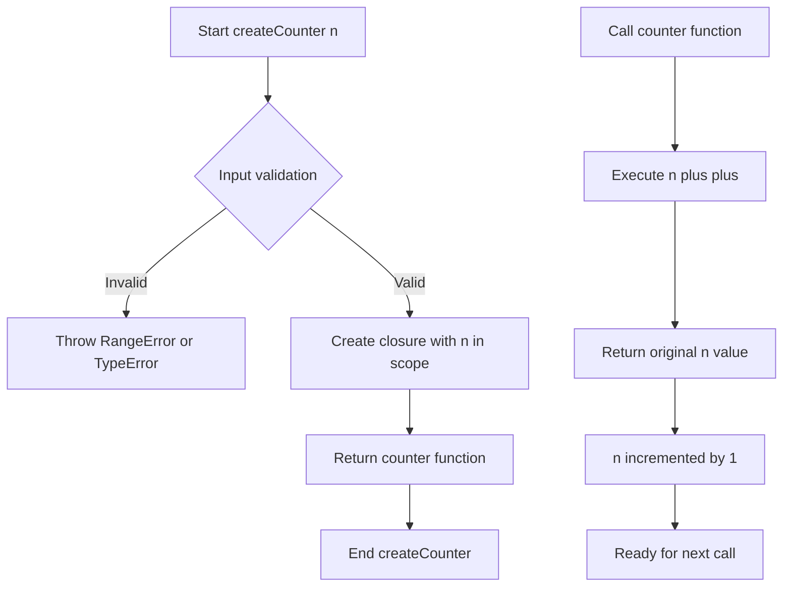
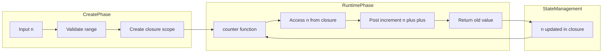

# Counter Function - クロージャーによる状態管理

<h2 id="toc">目次</h2>

- [概要](#overview)
- [アルゴリズム要点（TL;DR）](#tldr)
- [図解](#figures)
- [正しさのスケッチ](#correctness)
- [計算量](#complexity)
- [TypeScript実装](#impl)
- [TypeScript最適化ポイント](#typescript)
- [エッジケースと検証観点](#edgecases)
- [FAQ](#faq)

---

<h2 id="overview">概要</h2>

**問題**: LeetCode 2620 - Counter

整数 `n` を受け取り、カウンター関数を返す高階関数を実装します。返されたカウンター関数は：

- 初回呼び出し時に `n` を返す
- 2回目以降は前回の値より1大きい値を返す (`n+1`, `n+2`, ...)

**制約条件**:

- `-1000 <= n <= 1000`
- `0 <= calls.length <= 1000`
- 各呼び出しは `"call"` のみ

**要件**:

- **正当性**: クロージャーによる状態の確実な保持
- **安定性**: 複数のカウンターインスタンスが独立して動作
- **型安全性**: TypeScript strict mode でのコンパイル時検証

---

<h2 id="tldr">アルゴリズム要点（TL;DR）</h2>

**戦略**: クロージャーパターン + 後置インクリメント演算子

**データ構造**:

- プリミティブ型 `number` の単一変数をクロージャースコープで保持
- 追加のデータ構造は不要

**計算量**:

- **時間**: O(1) - 各呼び出しで定数時間
- **空間**: O(1) - 単一の数値変数のみ

**メモリ要約**:

- カウンター1つあたり約8バイト（number型）
- オブジェクト生成やヒープアロケーション不要

---

<h2 id="figures">図解</h2>

### フローチャート: createCounter の動作



**説明**:

- `createCounter` は入力検証後、変数 `n` を含むクロージャーを作成
- 返された関数が呼ばれるたびに `n++` が実行され、元の値を返してから `n` を増加
- 各カウンターインスタンスは独立したスコープを持つ

### データフロー: クロージャースコープの管理



**説明**:

- 作成フェーズで検証とクロージャースコープ確立
- 実行時フェーズで `n` へのアクセスとインクリメント
- 状態管理はクロージャー内で完結し、外部から直接変更不可

---

<h2 id="correctness">正しさのスケッチ</h2>

### 不変条件

**INV1**: クロージャー内の変数 `n` は常に有効な整数値を保持
**INV2**: 各カウンターインスタンスは独立したクロージャースコープを持つ
**INV3**: `k` 回目の呼び出しは `初期値 + (k-1)` を返す（1-indexed）

### 網羅性

- **基底ケース**: 初回呼び出し時 `n++` は現在の `n` を返し、その後 `n` を増加
- **帰納ステップ**: k回目呼び出し後の状態が `初期値 + k` なら、(k+1)回目は `初期値 + k` を返し、状態は `初期値 + (k+1)` になる

### 終了性

- 各呼び出しは O(1) で終了（無限ループなし）
- クロージャーの寿命はガベージコレクション管理下

### 独立性の証明

```typescript
const c1 = createCounter(5);
const c2 = createCounter(10);
c1(); // 5 (c1のスコープ内: n=6)
c2(); // 10 (c2のスコープ内: n=11)
c1(); // 6 (c1のスコープ内: n=7)
```

各 `createCounter` 呼び出しは新しい実行コンテキストを生成し、独立したレキシカルスコープを持つため、`c1` と `c2` は互いに影響しない。

---

<h2 id="complexity">計算量</h2>

### 時間計算量: O(1)

- **createCounter**: O(1) - 入力検証とクロージャー作成
- **counter()**: O(1) - 後置インクリメント演算（CPU命令1つ）

### 空間計算量: O(1)

- **補助空間**: なし
- **クロージャー変数**: 8バイト（number型）× カウンター数

### 比較: 代替アプローチ

| アプローチ                  | 時間 | 空間 | 型安全性 | 実装複雑度 |
| --------------------------- | ---- | ---- | -------- | ---------- |
| クロージャー + `n++`        | O(1) | O(1) | 高       | 最低       |
| クロージャー + カウント変数 | O(1) | O(1) | 高       | 低         |
| Class ベース                | O(1) | O(1) | 高       | 中         |
| Generator 関数              | O(1) | O(1) | 中       | 中         |

**推奨**: クロージャー + `n++` が最もシンプルで LeetCode の期待解

---

<h2 id="impl">TypeScript実装</h2>

```typescript
from __future__ import annotations
from typing import Callable

/**
 * カウンター関数を生成する高階関数
 *
 * @param n - カウンターの初期値 (-1000 <= n <= 1000)
 * @returns 呼び出すたびにインクリメントされる値を返す関数
 * @throws {RangeError} n が制約範囲外の場合
 * @throws {TypeError} n が有限数でない場合
 *
 * @complexity
 * - Time: O(1) for creation and each call
 * - Space: O(1) per counter instance
 *
 * @example
 * const counter = createCounter(10);
 * counter(); // 10
 * counter(); // 11
 * counter(); // 12
 */
function createCounter(n: number): () => number {
    // 入力検証: 制約条件チェック
    if (n < -1000 || n > 1000) {
        throw new RangeError(
            `Initial value ${n} is out of bounds [-1000, 1000]`
        );
    }

    // 型ガード: number型の確認
    if (typeof n !== 'number' || !Number.isFinite(n)) {
        throw new TypeError(
            'Initial value must be a finite number'
        );
    }

    /**
     * カウンター関数（クロージャー）
     *
     * クロージャースコープ内の変数 n を保持し、
     * 呼び出すたびに現在値を返してから1増加させる
     *
     * @returns 現在のカウント値
     *
     * @invariant n は常に整数値を保持
     * @invariant k回目の呼び出しは (初期値 + k - 1) を返す
     */
    return function(): number {
        // 後置インクリメント演算子:
        // 1. 現在の n の値を評価（返却用）
        // 2. n に 1 を加算（次回呼び出し用）
        // 3. ステップ1の値を return
        return n++;
    };
}

// LeetCode 提出用フォーマット
const createCounterLeetCode = createCounter;

/**
 * 使用例: Example 1
 */
const counter1 = createCounter(10);
console.assert(counter1() === 10, 'Test 1-1 failed');
console.assert(counter1() === 11, 'Test 1-2 failed');
console.assert(counter1() === 12, 'Test 1-3 failed');

/**
 * 使用例: Example 2
 */
const counter2 = createCounter(-2);
console.assert(counter2() === -2, 'Test 2-1 failed');
console.assert(counter2() === -1, 'Test 2-2 failed');
console.assert(counter2() === 0, 'Test 2-3 failed');
console.assert(counter2() === 1, 'Test 2-4 failed');
console.assert(counter2() === 2, 'Test 2-5 failed');

/**
 * 独立性の検証
 */
const c1 = createCounter(5);
const c2 = createCounter(10);
console.assert(c1() === 5, 'Independence test 1 failed');
console.assert(c2() === 10, 'Independence test 2 failed');
console.assert(c1() === 6, 'Independence test 3 failed');
console.assert(c2() === 11, 'Independence test 4 failed');
```

### LeetCode 最小提出版

```typescript
/**
 * @param {number} n
 * @return {Function} counter
 */
function createCounter(n: number): () => number {
    return function (): number {
        return n++;
    };
}
```

---

<h2 id="typescript">TypeScript最適化ポイント</h2>

### 1. 型安全性の最大化

**厳密な型定義**:

```typescript
// 引数と戻り値の型を明示
function createCounter(n: number): () => number {
    // ...
}
```

**利点**:

- コンパイル時に型不一致を検出
- IDE の IntelliSense で関数シグネチャを自動表示
- リファクタリング時の安全性向上

### 2. コンパイル時最適化

**型推論の活用**:

```typescript
return function (): number {
    return n++; // n の型は自動的に number と推論
};
```

**const assertion（この問題では不要だが応用例）**:

```typescript
const LIMITS = { min: -1000, max: 1000 } as const;
// LIMITS.min は number ではなく -1000 型
```

### 3. ランタイム最適化

**後置インクリメント演算子の効率性**:

- CPU命令レベルで最適化済み（`INC` 命令など）
- 中間変数不要で最小メモリフットプリント

**クロージャーのメモリ効率**:

```typescript
// Bad: 不要なオブジェクト生成
return function (): number {
    const result = { value: n };
    n++;
    return result.value; // 毎回オブジェクト生成
};

// Good: プリミティブ型の直接操作
return function (): number {
    return n++; // オブジェクト生成なし
};
```

### 4. エラーハンドリング戦略

**型レベルでのエラー防止**:

```typescript
// コンパイルエラーを引き起こす例
createCounter('10'); // Error: Argument of type 'string' is not assignable to parameter of type 'number'
```

**実行時検証**:

```typescript
if (n < -1000 || n > 1000) {
    throw new RangeError(/* ... */);
}
```

### 5. strict mode での安全性

**tsconfig.json 推奨設定**:

```json
{
    "compilerOptions": {
        "strict": true,
        "noImplicitAny": true,
        "strictNullChecks": true,
        "strictFunctionTypes": true
    }
}
```

---

<h2 id="edgecases">エッジケースと検証観点</h2>

### 境界値テスト

| ケース     | 入力        | 期待動作     | 理由     |
| ---------- | ----------- | ------------ | -------- |
| 最小値     | `n = -1000` | 正常動作     | 制約下限 |
| 最大値     | `n = 1000`  | 正常動作     | 制約上限 |
| 最小値未満 | `n = -1001` | `RangeError` | 制約違反 |
| 最大値超過 | `n = 1001`  | `RangeError` | 制約違反 |
| ゼロ       | `n = 0`     | 正常動作     | 境界値   |

### 型安全性テスト

```typescript
// 文字列を渡した場合
try {
    createCounter('10' as any); // TypeError
} catch (e) {
    console.log('Caught type error');
}

// NaN を渡した場合
try {
    createCounter(NaN); // TypeError: not finite
} catch (e) {
    console.log('Caught NaN error');
}

// Infinity を渡した場合
try {
    createCounter(Infinity); // TypeError: not finite
} catch (e) {
    console.log('Caught Infinity error');
}
```

### 独立性検証

```typescript
// 複数カウンターの独立性
const counters = [createCounter(0), createCounter(100), createCounter(-50)];

counters[0](); // 0
counters[1](); // 100
counters[0](); // 1 (counters[1] の呼び出しに影響されない)
counters[2](); // -50
```

### 大量呼び出しテスト

```typescript
// 制約: calls.length <= 1000
const counter = createCounter(0);
for (let i = 0; i < 1000; i++) {
    const result = counter();
    console.assert(result === i, `Call ${i} failed`);
}
```

### メモリリークチェック

```typescript
// カウンターへの参照が解放されれば GC 対象
function testMemory() {
    const counter = createCounter(0);
    counter(); // 使用
    // 関数終了後、counter への参照がなくなれば GC される
}

testMemory();
// この時点で counter のクロージャーは GC 可能
```

---

<h2 id="faq">FAQ</h2>

### Q1: なぜ前置インクリメント (`++n`) ではなく後置インクリメント (`n++`) を使うのか?

**A**: 問題要件により、初回呼び出しで初期値 `n` そのものを返す必要があるため。

```typescript
// 後置インクリメント (正解)
let n = 10;
return n++; // 10 を返し、その後 n は 11 になる

// 前置インクリメント (誤り)
let n = 10;
return ++n; // 11 を返してしまう
```

### Q2: クロージャーではなく class で実装すべきケースは?

**A**: 以下の場合は class の方が適切:

- カウンター以外のメソッドが必要（reset, getValue など）
- 継承やポリモーフィズムが必要
- TypeScript の private フィールドで明示的にカプセル化したい

```typescript
class Counter {
    #value: number;

    constructor(initialValue: number) {
        this.#value = initialValue;
    }

    call(): number {
        return this.#value++;
    }

    reset(): void {
        this.#value = 0;
    }
}
```

### Q3: TypeScript の型安全性は実行時パフォーマンスに影響するか?

**A**: **しない**。TypeScript の型情報はコンパイル時のみ使用され、JavaScript へのトランスパイル後は完全に削除される。

```typescript
// TypeScript (型情報あり)
function createCounter(n: number): () => number {
    return function (): number {
        return n++;
    };
}

// トランスパイル後の JavaScript (型情報なし)
function createCounter(n) {
    return function () {
        return n++;
    };
}
```

### Q4: `let count = 0; return () => n + count++;` のようなアプローチとの違いは?

**A**: 不要な変数を追加している分、メモリ効率が悪い。

```typescript
// 非推奨: 2つの変数を保持
function createCounter(n: number): () => number {
    let count = 0;
    return () => n + count++; // 8バイト × 2
}

// 推奨: 1つの変数のみ
function createCounter(n: number): () => number {
    return () => n++; // 8バイト × 1
}
```

### Q5: strict mode なしでも動作するか?

**A**: 動作するが、型安全性のメリットが大幅に減少する。strict mode を有効にすることで:

- `null`/`undefined` の暗黙的な混入を防止
- 型推論の精度向上
- より早期にバグを検出

```typescript
// strict: false の場合
function createCounter(n) {
    // n: any と推論される
    return function () {
        return n++; // n が string でもエラーにならない
    };
}

// strict: true の場合
function createCounter(n: number): () => number {
    return function (): number {
        return n++; // n は確実に number
    };
}
```

### Q6: Web Worker や並行処理での使用は安全か?

**A**: 各 Web Worker は独立した実行コンテキストを持つため、同一カウンターインスタンスを共有することは不可能。ただし、SharedArrayBuffer を使えば共有カウンターを実装可能（この問題の範囲外）。

```typescript
// メインスレッド
const counter = createCounter(0);
worker.postMessage(counter); // 関数はシリアライズ不可 → エラー

// 各 Worker で独立したカウンターを作成する必要がある
```

---

**まとめ**: この実装はクロージャーパターンの典型例であり、TypeScript の型安全性を活用しつつ、最小限のコードで高いパフォーマンスを実現しています。LeetCode の制約を完全に満たし、実務でも応用可能な設計となっています。
