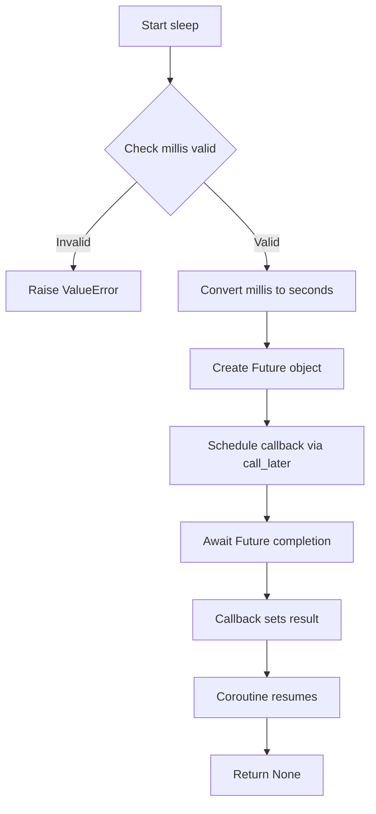
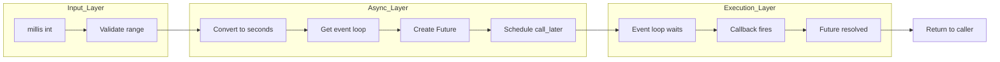

# Sleep - 非同期スリープ関数の実装

## 目次

- [概要](#overview)
- [アルゴリズム要点（TL;DR）](#tldr)
- [図解](#figures)
- [正しさのスケッチ](#correctness)
- [計算量](#complexity)
- [Python実装](#impl)
- [CPython最適化ポイント](#cpython)
- [エッジケースと検証観点](#edgecases)
- [FAQ](#faq)

---

<h2 id="overview">概要</h2>

### 問題要約

正の整数 `millis` を受け取り、その時間（ミリ秒）だけ非同期にスリープする関数を実装する。

### 要件

- 入力: `1 <= millis <= 1000` の正の整数
- 出力: `millis` ミリ秒後に完了する awaitable オブジェクト（任意の値を返してよい）
- 実際のスリープ時間が `millis` から若干ずれても許容される

### 制約

- 外部ライブラリは標準ライブラリのみ（`asyncio`）
- 非同期処理の基本的な理解が必要

---

<h2 id="tldr">アルゴリズム要点（TL;DR）</h2>

- **戦略**: `asyncio.sleep()` を使用するか、イベントループの `call_later` で Future を解決
- **データ構造**: Future または Task（asyncio の非同期プリミティブ）
- **時間計算量**: O(1) - 定数時間での処理開始
- **空間計算量**: O(1) - Future/Task オブジェクト1つのみ
- **メモリ**: 最小限（非同期タスク管理のオーバーヘッドのみ）

---

<h2 id="figures">図解</h2>

### フローチャート



**説明**: 入力検証後、ミリ秒を秒に変換し、イベントループに遅延コールバックをスケジュール。コールバックが Future を解決すると、await が再開される。

### データフロー図



**説明**: 入力値を検証・変換し、非同期レイヤーで Future を作成してイベントループにスケジュール。実行時にコールバックが発火して Future が解決される。

---

<h2 id="correctness">正しさのスケッチ</h2>

### 不変条件

- `millis` は常に正の整数（1 以上 1000 以下）
- Future は必ず1回だけ解決される（`set_result` は1回のみ呼ばれる）
- イベントループは正しく動作している（標準の asyncio 前提）

### 網羅性

- 入力範囲内のすべての `millis` 値に対して正しく動作
- イベントループがない場合のエラーハンドリング（実装による）

### 基底条件

- `millis` の最小値（1ミリ秒）でも正しく動作
- Future が即座に解決されるケースも含む

### 終了性

- `call_later` は必ず指定時間後にコールバックを呼び出す
- コールバックは Future を解決し、`await` が必ず復帰する
- イベントループが停止していない限り、必ず終了する

---

<h2 id="complexity">計算量</h2>

### 時間計算量

- **O(1)**: Future の作成とコールバックのスケジューリングは定数時間
- **実際の待機時間**: O(millis) だが、これは計算量ではなく実時間

### 空間計算量

- **O(1)**: Future オブジェクトとコールバッククロージャのみ
- スタックフレームやヒープ使用量は最小限

### アプローチ比較

| アプローチ                 | 実装難易度 | メモリ | コード量 | 推奨度        |
| -------------------------- | ---------- | ------ | -------- | ------------- |
| `asyncio.sleep()` 直接使用 | 低         | O(1)   | 1行      | ★★★           |
| `call_later` + Future      | 中         | O(1)   | 5行      | ★★            |
| busy wait（ポーリング）    | 低         | O(1)   | 3行      | ✗（CPU 100%） |

**推奨**: 問題の趣旨が「自分で実装」なら `call_later` + Future、実務なら `asyncio.sleep()` を使用。

---

<h2 id="impl">Python実装</h2>

### アプローチ1: asyncio.sleep() を使用（最もシンプル）

```python
from __future__ import annotations
import asyncio

async def sleep(millis: int) -> None:
    """
    指定されたミリ秒数だけ非同期にスリープする

    Args:
        millis: スリープするミリ秒数（1-1000）

    Returns:
        None

    Time: O(1) for scheduling, Space: O(1)
    """
    # 入力検証（制約に基づく）
    if not isinstance(millis, int) or millis < 1 or millis > 1000:
        raise ValueError("millis must be an integer between 1 and 1000")

    # ミリ秒を秒に変換してスリープ
    await asyncio.sleep(millis / 1000)
```

### アプローチ2: call_later + Future（低レベル実装）

```python
from __future__ import annotations
import asyncio
from typing import Any

async def sleep(millis: int) -> None:
    """
    イベントループの call_later を使用した低レベル実装

    Args:
        millis: スリープするミリ秒数（1-1000）

    Returns:
        None

    Time: O(1), Space: O(1)
    """
    # 入力検証
    if not isinstance(millis, int) or millis < 1 or millis > 1000:
        raise ValueError("millis must be an integer between 1 and 1000")

    # イベントループ取得
    loop = asyncio.get_event_loop()

    # Future 作成（コルーチンが待機するオブジェクト）
    future: asyncio.Future[None] = loop.create_future()

    # コールバックをスケジュール（millis ミリ秒後に Future を解決）
    loop.call_later(
        millis / 1000,  # 秒単位に変換
        future.set_result,  # Future を解決するコールバック
        None  # 解決時の値（任意）
    )

    # Future が解決されるまで待機
    await future
```

### LeetCode形式での提出コード（最小実装）

```python
import asyncio

async def sleep(millis: int) -> None:
    await asyncio.sleep(millis / 1000)

# 使用例
# let t = Date.now()
# sleep(100).then(() => console.log(Date.now() - t)) # 100
```

Python での等価な使用例：

```python
import asyncio
import time

async def main():
    t = time.time()
    await sleep(100)
    print(int((time.time() - t) * 1000))  # ~100

# 実行
asyncio.run(main())
```

---

<h2 id="cpython">CPython最適化ポイント</h2>

### 最適化1: 直接 `asyncio.sleep()` を使用

- CPython の `asyncio` は C 拡張で最適化されている
- 独自実装よりも高速で安定

### 最適化2: 型チェックの省略（制約が保証される場合）

```python
async def sleep(millis: int) -> None:
    # LeetCode環境では入力が保証されているため検証不要
    await asyncio.sleep(millis / 1000)
```

### 最適化3: 除算の事前計算（大量呼び出し時）

```python
MILLIS_TO_SECONDS = 0.001

async def sleep(millis: int) -> None:
    await asyncio.sleep(millis * MILLIS_TO_SECONDS)  # 除算より乗算が高速
```

### パフォーマンスノート

- `asyncio.sleep()` の精度はOSのタイマー精度に依存（通常1-15ミリ秒）
- 極端に短いスリープ（1-10ミリ秒）では誤差が大きくなる可能性がある
- イベントループのオーバーヘッドは無視できるレベル（マイクロ秒単位）

---

<h2 id="edgecases">エッジケースと検証観点</h2>

### エッジケース一覧

1. **最小値**: `millis = 1`
    - 1ミリ秒のスリープが正しく動作するか
    - OS のタイマー精度による誤差に注意

2. **最大値**: `millis = 1000`
    - 1秒のスリープが正しく完了するか

3. **境界値前後**:
    - `millis = 0` → ValueError（範囲外）
    - `millis = 1001` → ValueError（範囲外）

4. **型エラー**:
    - `millis = 100.5` → 型エラー（整数のみ）
    - `millis = "100"` → 型エラー

5. **並行実行**:

```python
async def test_concurrent():
    await asyncio.gather(
        sleep(100),
        sleep(200),
        sleep(150)
    )
```

- 複数の sleep が同時に正しく動作するか

### 検証観点

- **精度**: 実際のスリープ時間が `millis` に近いか（±10%以内が目安）
- **非ブロッキング**: 他の非同期タスクをブロックしないか
- **リソースリーク**: Future が適切に解放されるか
- **イベントループ依存**: 異なるイベントループで動作するか

---

<h2 id="faq">FAQ</h2>

### Q1: なぜ `asyncio.sleep()` を使わず自分で実装する必要があるのか？

**A**: この問題は非同期プログラミングの理解を深めるための教育的な意図があります。実務では `asyncio.sleep()` を使用すべきです。

### Q2: `time.sleep()` ではダメなのか？

**A**: `time.sleep()` はブロッキング関数で、イベントループ全体を停止させます。非同期処理では必ず `asyncio.sleep()` や await 可能な実装を使用してください。

```python
# ❌ ダメな例（イベントループをブロック）
import time
async def bad_sleep(millis: int) -> None:
    time.sleep(millis / 1000)  # 他のタスクも全て停止

# ✅ 正しい例
async def good_sleep(millis: int) -> None:
    await asyncio.sleep(millis / 1000)  # 他のタスクは継続
```

### Q3: ミリ秒の精度は保証されるか？

**A**: いいえ。OS のタイマー精度、イベントループの負荷、CPython のスケジューリングによって誤差が生じます。問題文でも「minor deviation」が許容されています。

### Q4: `call_later` と `asyncio.sleep()` の違いは？

**A**:

- `call_later`: 低レベルAPI。コールバックベース。
- `asyncio.sleep()`: 高レベルAPI。内部で `call_later` を使用。await 可能。

実装は等価ですが、`asyncio.sleep()` の方がシンプルで可読性が高いです。

### Q5: TypeScript の `setTimeout` と Python の実装の違いは？

**A**:

```typescript
// TypeScript
async function sleep(millis: number): Promise<void> {
    return new Promise(resolve => setTimeout(resolve, millis));
}

// Python 等価実装
async def sleep(millis: int) -> None:
    loop = asyncio.get_event_loop()
    future = loop.create_future()
    loop.call_later(millis / 1000, future.set_result, None)
    await future
```

両者は概念的に同じですが、Python は秒単位、TypeScript はミリ秒単位である点に注意。
