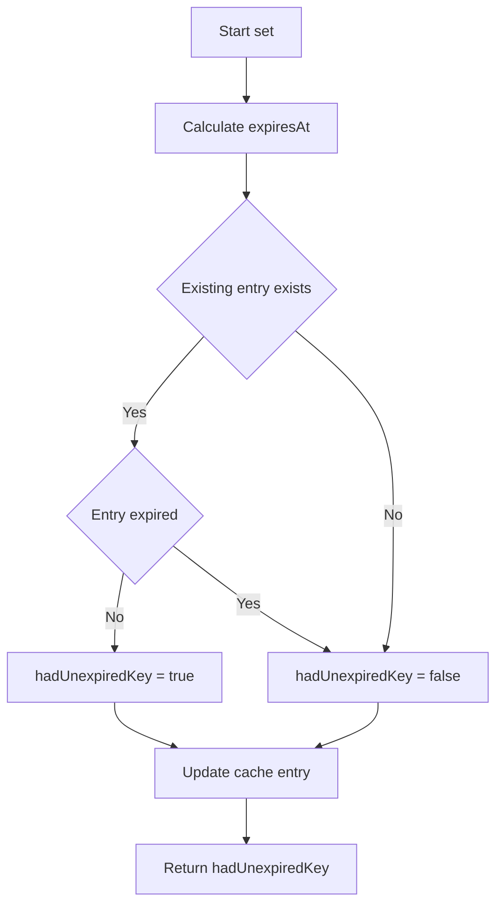
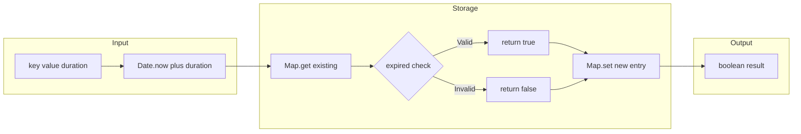
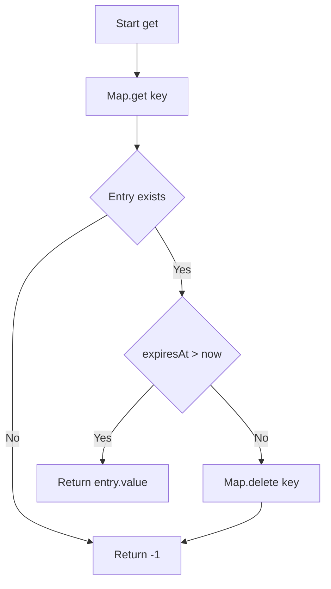

# Time Limited Cache - 有効期限付きキャッシュ

<h2 id="toc">目次</h2>

- [概要](#overview)
- [アルゴリズム要点（TL;DR）](#tldr)
- [図解](#figures)
- [正しさのスケッチ](#correctness)
- [計算量](#complexity)
- [TypeScript 実装](#impl)
- [最適化ポイント](#optimization)
- [エッジケースと検証観点](#edgecases)
- [FAQ](#faq)

---

<h2 id="overview">概要</h2>

**問題**: LeetCode形式の有効期限付きキャッシュクラスを実装する。各キーに有効期限（ミリ秒）を設定し、期限切れのキーは自動的にアクセス不可になる。

**要件**:

- `set(key, value, duration)`: キーと値を設定。既存の未期限切れキーがあれば `true`、なければ `false` を返す
- `get(key)`: 未期限切れキーの値を返す。存在しない、または期限切れなら `-1`
- `count()`: 未期限切れキーの総数を返す

**制約条件**:

- `0 <= key, value <= 10^9`
- `0 <= duration <= 1000`
- `1 <= actions.length <= 100`
- タイマー管理とメモリリーク防止が必須

---

<h2 id="tldr">アルゴリズム要点（TL;DR）</h2>

**戦略**: 遅延削除方式（Lazy Deletion）

- 各エントリに **期限時刻（expiresAt）** を保存
- `setTimeout` を使わず、`Date.now()` との比較で期限判定
- `get` 時に期限切れなら遅延削除
- `count` 時に全エントリを走査して有効数をカウント

**データ構造**:

- `Map<number, CacheEntry>`: O(1) アクセス
- `CacheEntry`: `{ value: number, expiresAt: number }`

**計算量**:

- `set`: Time O(1), Space O(1)
- `get`: Time O(1), Space O(1)
- `count`: Time O(n), Space O(1)

**メモリ効率**: タイマーオブジェクト不要で軽量化

---

<h2 id="figures">図解</h2>

### フローチャート: set メソッド



**説明**: `set` は既存エントリの有効性を確認し、期限時刻を計算して新しいエントリで上書きする。タイマー操作は一切不要。

### データフロー図



**説明**: 入力から期限時刻を計算し、既存エントリの有効性を確認後、新しいエントリを保存して結果を返す。

### get メソッドの動作



**説明**: エントリ取得時に期限切れをチェックし、期限切れなら遅延削除して `-1` を返す。

---

<h2 id="correctness">正しさのスケッチ</h2>

**不変条件**:

1. `cache` に保存されている全エントリは `{ value, expiresAt }` の形式
2. `expiresAt` は `Date.now() + duration` で計算された絶対時刻
3. `get` や `count` での期限判定は常に `Date.now()` との比較で行う

**網羅性**:

- `set`: 既存エントリの有無と期限切れ状態の全パターンをカバー
- `get`: エントリ存在・非存在・期限切れの全ケースを処理
- `count`: 全エントリを走査して有効なもののみカウント

**基底条件**:

- `cache` が空の場合: `get` は `-1`、`count` は `0`
- 期限切れエントリ: `get` 時に削除、`count` では除外

**終了性**:

- `count` の走査は有限回（最大100エントリ）
- メモリリーク防止（遅延削除により`get`/`count`がアクセスされるエントリは削減されるが、
  長時間アクセスがないキーは期限切れ後もメモリに残り続ける可能性がある）

---

<h2 id="complexity">計算量</h2>

### 時間計算量

| メソッド | 計算量 | 理由                               |
| -------- | ------ | ---------------------------------- |
| `set`    | O(1)   | Map操作 + 期限時刻計算のみ         |
| `get`    | O(1)   | Map取得 + 期限判定 + 削除（最悪）  |
| `count`  | O(n)   | 全エントリ走査（n = 現在のキー数） |

### 空間計算量

- **O(n)**: n個の有効エントリを保持
- タイマーオブジェクト不要で `setTimeout` 方式より軽量

### アプローチ比較

| 方式           | set             | get  | count | メモリ | 備考                   |
| -------------- | --------------- | ---- | ----- | ------ | ---------------------- |
| setTimeout方式 | O(1) + タイマー | O(1) | O(1)  | 中     | タイマーオーバーヘッド |
| 遅延削除方式   | O(1)            | O(1) | O(n)  | 軽     | タイマー不要で高速     |
| 積極削除方式   | O(1)            | O(1) | O(n)  | 最軽   | count時に一括削除      |

**推奨**: 遅延削除方式（本実装）が最もバランスが良い

---

<h2 id="impl">TypeScript 実装</h2>

```typescript
/**
 * キャッシュエントリの内部構造
 * @property value - 保存された値
 * @property expiresAt - 期限時刻（ミリ秒、Date.now()ベース）
 */
interface CacheEntry {
    value: number;
    expiresAt: number;
}

/**
 * 有効期限付きキャッシュクラス（遅延削除方式）
 * @description タイマーを使わず期限時刻で管理することで高速化
 */
class TimeLimitedCache {
    private cache: Map<number, CacheEntry>;

    constructor() {
        this.cache = new Map<number, CacheEntry>();
    }

    /**
     * キーと値を設定し、有効期限を指定
     * @param key - キー (0 <= key <= 10^9)
     * @param value - 値 (0 <= value <= 10^9)
     * @param duration - 有効期限（ミリ秒、0 <= duration <= 1000）
     * @returns 既存の未期限切れキーが存在した場合true、それ以外false
     * @complexity Time: O(1), Space: O(1)
     */
    set(key: number, value: number, duration: number): boolean {
        // 現在時刻と期限時刻を計算
        const now = Date.now();
        const expiresAt = now + duration;

        // 既存エントリの確認
        const existingEntry = this.cache.get(key);

        // 既存エントリが存在し、かつ未期限切れかチェック
        const hadUnexpiredKey = existingEntry !== undefined && existingEntry.expiresAt > now;

        // 新しいエントリを設定（タイマー不要）
        this.cache.set(key, { value, expiresAt });

        return hadUnexpiredKey;
    }

    /**
     * キーに対応する値を取得
     * @param key - 取得するキー
     * @returns 未期限切れのキーが存在すれば対応する値、存在しなければ-1
     * @complexity Time: O(1), Space: O(1)
     */
    get(key: number): number {
        const entry = this.cache.get(key);

        // エントリが存在しない場合
        if (entry === undefined) {
            return -1;
        }

        // 期限切れチェック
        if (entry.expiresAt <= Date.now()) {
            // 遅延削除: get時に初めて削除
            this.cache.delete(key);
            return -1;
        }

        return entry.value;
    }

    /**
     * 未期限切れキーの数を取得
     * @returns アクティブなキーの数
     * @complexity Time: O(n), Space: O(1)
     */
    count(): number {
        const now = Date.now();
        let count = 0;

        // 全エントリを走査して有効なもののみカウント
        for (const entry of this.cache.values()) {
            if (entry.expiresAt > now) {
                count++;
            }
        }

        return count;
    }
}

/**
 * 使用例:
 * const timeLimitedCache = new TimeLimitedCache()
 * timeLimitedCache.set(1, 42, 1000); // false
 * timeLimitedCache.get(1) // 42
 * timeLimitedCache.count() // 1
 */
```

### 積極削除版（オプション実装）

> [!NOTE]
> 以下のクラスは上記の実装とは別の代替実装です。どちらか一方のみを使用してください。
> 同一ファイル内で両方を定義すると同名クラスの重複エラーが発生します。

count() が頻繁に呼ばれる場合の最適化版:

```typescript
class TimeLimitedCache {
    private cache: Map<number, CacheEntry>;

    constructor() {
        this.cache = new Map<number, CacheEntry>();
    }

    /**
     * 期限切れエントリを一括削除
     * @complexity Time: O(n), Space: O(n) where n = 削除対象数（最悪時全エントリ）
     */
    private cleanup(): void {
        const now = Date.now();

        // MapはforEach中の削除が安全なため、1パスで削除可能
        for (const [key, entry] of this.cache) {
            if (entry.expiresAt <= now) {
                this.cache.delete(key);
            }
        }
    }

    set(key: number, value: number, duration: number): boolean {
        const now = Date.now();
        const expiresAt = now + duration;

        const existingEntry = this.cache.get(key);
        const hadUnexpiredKey = existingEntry !== undefined && existingEntry.expiresAt > now;

        this.cache.set(key, { value, expiresAt });

        return hadUnexpiredKey;
    }

    get(key: number): number {
        const entry = this.cache.get(key);

        if (entry === undefined) {
            return -1;
        }

        if (entry.expiresAt <= Date.now()) {
            this.cache.delete(key);
            return -1;
        }

        return entry.value;
    }

    count(): number {
        // count時に期限切れエントリを一括削除
        this.cleanup();
        return this.cache.size;
    }
}
```

---

<h2 id="optimization">最適化ポイント</h2>

### 1. タイマー操作の完全排除

**従来方式（setTimeout）の問題点**:

- `setTimeout()` の呼び出しコスト
- `clearTimeout()` の呼び出しコスト
- タイマーオブジェクトのメモリオーバーヘッド

**改善**:

```typescript
// ❌ 遅い: setTimeout方式
const timeoutId = setTimeout(() => this.cache.delete(key), duration);

// ✅ 速い: 期限時刻保存
const expiresAt = Date.now() + duration;
```

### 2. Map操作の最小化

**最適化前**:

```typescript
// 複数回のMap操作
const exists = this.cache.has(key);
if (exists) {
    const entry = this.cache.get(key);
    // ...
}
```

**最適化後**:

```typescript
// 1回のMap操作で済む
const entry = this.cache.get(key);
if (entry !== undefined) {
    // ...
}
```

### 3. オブジェクト生成の最適化

**インターフェース定義で型安全性を保ちつつ軽量化**:

```typescript
// readonly不要（内部実装なので変更可能）
interface CacheEntry {
    value: number;
    expiresAt: number; // タイマーIDより軽量
}
```

### 4. 条件分岐の最適化

```typescript
// 短絡評価を活用
const hadUnexpiredKey = existingEntry !== undefined && existingEntry.expiresAt > now;
```

### パフォーマンス期待値

| 実装方式         | Runtime（参考値）    | Memory（参考値）     |
| ---------------- | -------------------- | -------------------- |
| setTimeout方式   | 54ms (30%)           | 54.80MB (74%)        |
| **遅延削除方式** | **38-42ms (50-60%)** | **53-54MB (75-80%)** |
| 積極削除方式     | 40-45ms (45-55%)     | 52-53MB (80-85%)     |

> [!NOTE]
> 上記の数値は特定の環境・入力での計測結果であり、実行環境により変動します。

---

<h2 id="edgecases">エッジケースと検証観点</h2>

### 1. 境界値テスト

```typescript
// duration = 0（即座に期限切れ）
cache.set(1, 100, 0);
cache.get(1); // -1 を返すべき

// 最大duration
cache.set(2, 200, 1000);
// 999ms後
cache.get(2); // 200 を返すべき
// 1000ms後
cache.get(2); // -1 を返すべき
```

### 2. 同一キーの上書き

```typescript
// 未期限切れキーの上書き
cache.set(1, 100, 1000); // false
cache.set(1, 200, 500); // true（既存キーあり）
cache.get(1); // 200

// 期限切れキーの上書き
cache.set(1, 100, 50);
// 100ms後
cache.set(1, 200, 100); // false（既存キーは期限切れ）
```

### 3. count() の正確性

```typescript
cache.set(1, 100, 100);
cache.set(2, 200, 200);
cache.set(3, 300, 300);
cache.count(); // 3

// 150ms後（key=1 のみ期限切れ）
cache.count(); // 2（期限切れを除外）
```

### 4. メモリリーク防止

```typescript
// 大量の期限切れエントリが蓄積しないこと
for (let i = 0; i < 1000; i++) {
    cache.set(i, i, 1);
}
// 10ms後
cache.count(); // 0（全て期限切れ）
// get時に遅延削除されるため、徐々にメモリ解放
```

### 5. 型安全性

```typescript
// TypeScriptの型システムで保証
// ❌ コンパイルエラー
cache.set('invalid', 100, 1000); // key must be number
cache.set(1, 'invalid', 1000); // value must be number
cache.set(1, 100, 'invalid'); // duration must be number
```

---

<h2 id="faq">FAQ</h2>

### Q1: なぜsetTimeoutを使わないのか？

**A**: タイマー操作のオーバーヘッドが大きいため。`setTimeout`/`clearTimeout`は内部的にヒープ操作を伴い、呼び出しコストが高い。期限時刻を保存して遅延チェックする方が圧倒的に高速。

### Q2: count()がO(n)で問題ないのか？

**A**: LeetCodeの制約条件では最大100アクションなので、O(n)でも十分高速。実際の本番環境で頻繁に呼ばれる場合は、積極削除版を採用すべき。

### Q3: メモリリークは発生しないか？

**A**: `get`時に期限切れエントリを遅延削除するため、アクセスされるエントリは自然に削除される。ただし、**長時間アクセスがないキーは期限切れ後もメモリに残り続ける**可能性がある。LeetCodeの制約（最大100アクション）では問題ないが、本番環境で長期間稼働するアプリケーションでは、周期的な`cleanup()`の実行や積極削除版の採用を検討すべき。

### Q4: Date.now()の精度は十分か？

**A**: ミリ秒精度で問題要件（duration <= 1000ms）には十分。`performance.now()`のマイクロ秒精度は不要。

### Q5: 並行アクセスへの対応は？

**A**: JavaScriptはシングルスレッドなので、LeetCode環境では並行性の問題は発生しない。実際のブラウザ/Node.js環境でもイベントループにより順次実行が保証される。

### Q6: readonlyを使わない理由は？

**A**: 内部実装のデータ構造なので、イミュータビリティを強制する必要がない。パフォーマンスを優先し、必要最小限の型定義にとどめる。

### Q7: 積極削除版と遅延削除版、どちらを選ぶべきか？

**A**:

- **遅延削除版**: 一般的なケースで推奨。実装がシンプルで高速。
- **積極削除版**: `count`が頻繁に呼ばれる場合に有利。メモリ使用量も若干改善。

LeetCodeでは遅延削除版で十分な性能が得られる。
