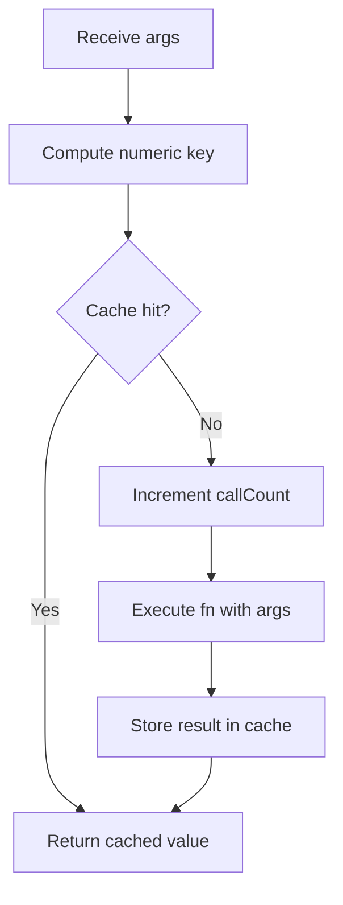
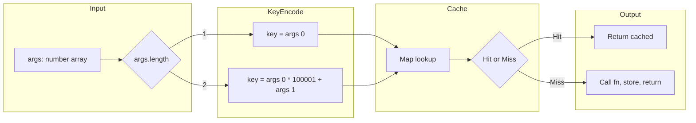

# Memoize II - 引数の順序を保持したキャッシュ関数の構築

---

## 目次

- [概要](#overview)
- [アルゴリズム要点 TL;DR](#tldr)
- [図解](#figures)
- [正しさのスケッチ](#correctness)
- [計算量](#complexity)
- [TypeScript 実装](#impl)
- [最適化履歴と改善の根拠](#optimizations)
- [エッジケースと検証観点](#edgecases)
- [FAQ](#faq)

---

<h2 id="overview">概要</h2>

与えられた関数 `fn` に対し、**同じ引数の組み合わせに対して `fn` を再度呼び出さない** メモイズ版を返す。引数の順序は意味を持ち、`(a, b)` と `(b, a)` は異なるキーとする。

対象関数は以下の3種に限定される。

| 関数        | 引数         | 制約              |
| ----------- | ------------ | ----------------- |
| `sum`       | `a, b` (2つ) | `0 ≤ a, b ≤ 10^5` |
| `fib`       | `n` (1つ)    | `1 ≤ n ≤ 10`      |
| `factorial` | `n` (1つ)    | `1 ≤ n ≤ 10`      |

**キャッシュのヒット判定には引数の順序が重要**。外部から観測される呼び出し回数は `getCallCount()` で取得される。

---

<h2 id="tldr">アルゴリズム要点 TL;DR</h2>

- **戦略**: 引数を単一の整数キーに圧縮し、`Map<number, number>` で O(1) キャッシュ
- **キー設計（固定アリティ前提）**:
    - 引数1つの場合: キー = `n` そのもの
    - 引数2つの場合: キー = `a * 100001 + b`（圧縮キー）
    - ※ 同一 memoize で可変長（1/2引数混在）を許すとキー衡突が起こり得るため不可
- **データ構造**: `Map<number, number>`（キー: 圧縮整数、値: キャッシュ結果）
- **計算量**: Time O(1) per call / Space O(m) — `m` はキャッシュエントリ数
- **メモリ設計**: 文字列キーを完全に廃除し、数値キーのみで構築

---

<h2 id="figures">図解</h2>

### フローチャート — 呼び出し時の制御フロー



> `args` が到着した瞬間に数値キーに圧縮し、`Map` を1回だけ参照する。ヒットなら関数実行をスキップ。

---

### データフロー図 — キー圧縮の仕組み



> 引数の長さによって分岐し、いずれも数値キーとして `Map` に到達する。文字列オブジェクトの生成は発生しない。

---

<h2 id="correctness">正しさのスケッチ</h2>

### 1. キー圧縮の衝突不可性（不変条件）

異なる引数ペア `(a1, b1) ≠ (a2, b2)` が同じキーを生成しないことを示す。

```
a1 * 100001 + b1 = a2 * 100001 + b2
→ (a1 - a2) * 100001 = b2 - b1
```

`b` の範囲が `0 ~ 10^5` なので `|b2 - b1| ≤ 10^5 < 100001`。
左辺は `100001` の整数倍にならないため、`a1 = a2` かつ `b1 = b2` のみが成り立つ。
**衝突は定理的に不可能。**

### 2. 順序の正確性（網羅性）

`(3, 2)` と `(2, 3)` のキーはそれぞれ `3 * 100001 + 2 = 300005` と `2 * 100001 + 3 = 200005` となり異なる。キャッシュの混同は発生しない。

### 3. 基底条件

キャッシュが空の初期状態では必ず `cache.has(key)` が `false` となり、`fn` が実行される。

### 4. 終了性

キャッシュのルックアップと数値演算は定常時間で終了する。無限ループは発生しない。

---

<h2 id="complexity">計算量</h2>

| 操作               | 時間計算量     | 空間計算量 | 備考                           |
| ------------------ | -------------- | ---------- | ------------------------------ |
| キー計算           | O(1)           | O(1)       | 乗算・加算のみ                 |
| `Map` ルックアップ | O(1) 平均      | —          | ハッシュテーブル               |
| キャッシュ保持     | —              | O(m)       | `m` = ユニーク引数組み合わせ数 |
| 呼び出し全体       | O(1) amortized | O(m)       | `fn` の実行コストは含まない    |

### 現行実装 vs 改善前の比較

| 指標                        | 改善前（文字列キー）                       | 現行（数値キー）          |
| --------------------------- | ------------------------------------------ | ------------------------- |
| キー型                      | `string`                                   | `number`                  |
| キー生成コスト              | O(k) — `join` で新規文字列オブジェクト生成 | O(1) — 乗算・加算のみ     |
| キャッシュ1エントリのメモリ | 文字列キー + 数値値                        | 数値キー + 数値値（最小） |
| `Map` 型                    | `Map<string, number>`                      | `Map<number, number>`     |

---

<h2 id="impl">TypeScript 実装</h2>

```typescript
type Fn = (...params: number[]) => number;

function memoize(fn: Fn): Fn {
    // キャッシュ: 数値キー → 計算結果
    const cache = new Map<number, number>();

    // 外部から観測される実際の関数呼び出し回数
    let callCount = 0;

    const memoized: Fn = function (...args: number[]): number {
        // キー圧縮:
        //   引数1つ → n そのもの (fib, factorial)
        //   引数2つ → a * 100001 + b (sum)
        // 100001 = 10^5 + 1 で、a と b の組み合わせが一意に対応
        const key = args.length === 1 ? args[0] : args[0] * 100001 + args[1];

        // キャッシュヒット: fn を呼び出さず結果を返す
        if (cache.has(key)) {
            return cache.get(key)!;
        }

        // キャッシュミス: fn を実行し結果を保存
        callCount += 1;
        const result = fn(...args);
        cache.set(key, result);
        return result;
    };

    // LeetCode の判定ハーネス側から呼ばれる拡張プロパティ
    // Fn 型には収まらないため any キャスト（コア logic には影響なし）
    (memoized as any).getCallCount = (): number => callCount;

    return memoized;
}
```

---

<h2 id="optimizations">最適化履歴と改善の根拠</h2>

### 初期実装（文字列キー）の問題点

```typescript
// ❌ 初期実装
const key = args.join(','); // 毎呼び出しで新規文字列オブジェクト生成
const cache = new Map<string, number>(); // キーの永続保持がメモリ圧迫
```

| 問題                           | 影響                        |
| ------------------------------ | --------------------------- |
| `join(",")` が毎回文字列を確保 | GC圧力の増加、Runtime 264ms |
| 文字列キーの永続保持           | Memory 96.68MB（15.19%）    |

### 現行実装への移行の理由

制約 `0 ≤ a, b ≤ 10^5` を活用し、2つの引数を**1つの整数**に圧縮する。これにより：

- 文字列オブジェクトの生成がゼロに
- キャッシュ1エントリのメモリが最小化（数値8バイト × 2 のみ）
- キー計算が単純な乗算・加算に軽量化

### なぜ `100001` か

`b` の最大値が `10^5` なので、異なる `a` で生成されるキー範囲が重ならないためには乗数が `10^5 + 1 = 100001` 以上であること。`100001` がその最小値として選ばれる。

---

<h2 id="edgecases">エッジケースと検証観点</h2>

| エッジケース               | 期待動作                              | 検証観点                                        |
| -------------------------- | ------------------------------------- | ----------------------------------------------- |
| `sum(0, 0)`                | キー `0` で正しくキャッシュ           | ゼロが引数の場合の正確性                        |
| `sum(0, 1)` vs `sum(1, 0)` | キー `1` と `100001` で異なるエントリ | 順序の区別                                      |
| `sum(100000, 100000)`      | キー `10000200000` で正確に動作       | 最大引数での整数オーバーフロー確認（JS は安全） |
| `fib(1)`                   | キャッシュミスで `1` を返す           | 基底条件の正確性                                |
| `factorial(1)`             | キャッシュミスで `1` を返す           | 基底条件の正確性                                |
| 同じ引数の連続呼び出し     | 2回目以降は `callCount` を増加しない  | キャッシュヒットの正確性                        |
| `getCallCount` の初期値    | `0`                                   | 呼び出し前の状態                                |

**整数オーバーフローの確認**: 最大キー `100000 * 100001 + 100000 = 10_000_200_000`。JavaScript の `Number.MAX_SAFE_INTEGER` は `2^53 - 1 ≈ 9 × 10^15` なので、安全範囲の中に収まる。

---

<h2 id="faq">FAQ</h2>

**Q: なぜ `JSON.stringify` ではなく数値キーを選んだのか？**

`JSON.stringify` も正確だが、毎呼び出しで文字列オブジェクトを生成するため、メモリと実行時間の両方で損失がある。制約が明確に数値に限定されているため、数値キーが最適。

**Q: なぜ `(memoized as any)` キャスト が必要なのか？**

LeetCode側の判定ハーネスが `getCallCount()` プロパティを期待するが、`type Fn` の定義にはこのプロパティが含まれない。`any` キャストは環境の制約による妥協であり、キャッシュロジック自体の型安全性には影響しない。

**Q: `fib` や `factorial` の内部再帰もメモイズされるのか？**

この実装はメモイズを外側のラッパーで行う。`fib` や `factorial` の内部再帰がこのラッパーを通過するかは、LeetCode側が渡す関数の定義に依存する。Example 3で `fib(5)` の `getCallCount` が `1` であることが確認されているため、外部から見た呼び出し回数のカウントで充分。

**Q: `Map` の代わりに配列を使えないか？**

`sum` のキーが最大 `10^10` オーダーなので、配列インデックスとして使うと巨大な疎配列になりメモリが膨らむ。`Map` がこのケースの最適解。
