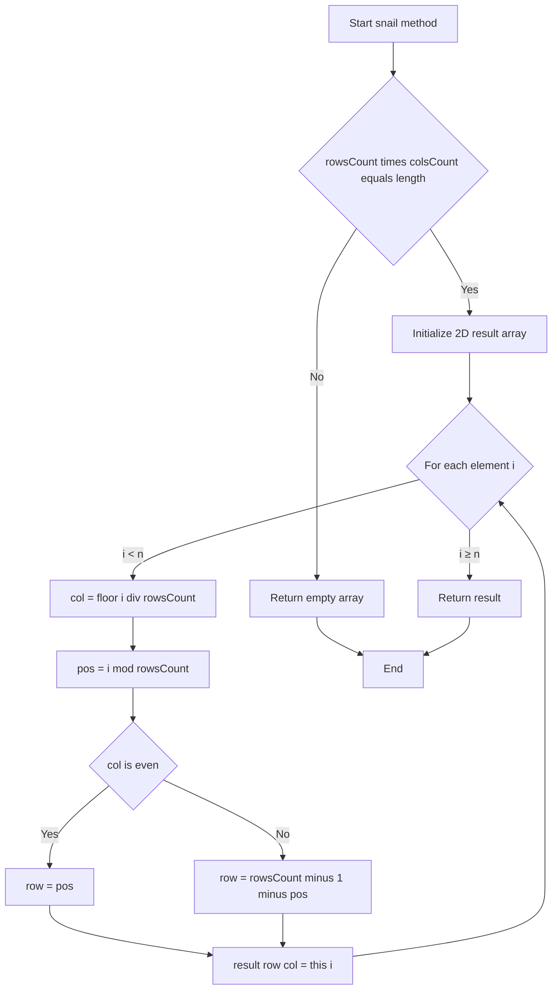
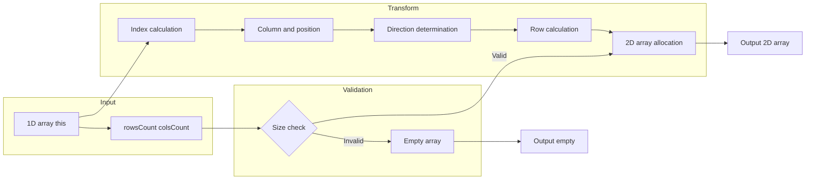

# Array Snail Traversal - 1D配列を蛇行パターンで2D配列に変換

## 目次

- [概要](#overview)
- [アルゴリズム要点（TL;DR）](#tldr)
- [図解](#figures)
- [正しさのスケッチ](#correctness)
- [計算量](#complexity)
- [TypeScript実装](#impl)
- [最適化ポイント](#optimization)
- [エッジケースと検証観点](#edgecases)
- [FAQ](#faq)

---

<h2 id="overview">概要</h2>

**問題**: 配列のprototypeを拡張し、1D配列を「Snail Traversal（蛇行）」パターンで2D配列に変換する `snail(rowsCount, colsCount)` メソッドを実装する。

**Snail Traversalパターン**:

- 最初の列を**上から下**へ配置
- 次の列を**下から上**へ配置
- 列ごとに方向を交互に反転させながら進む

**要件**:

- `rowsCount × colsCount ≠ nums.length` の場合は空配列 `[]` を返す
- 制約: `0 ≤ nums.length ≤ 250`, `1 ≤ rowsCount, colsCount ≤ 250`
- LeetCode形式: Array.prototypeの拡張として実装

---

<h2 id="tldr">アルゴリズム要点（TL;DR）</h2>

- **戦略**: 数学的インデックス計算による1パス変換
- **データ構造**: 2D配列（事前割り当て）
- **キーアイデア**:
    - 要素のインデックス `i` から列番号 `col = ⌊i / rowsCount⌋` を計算
    - 列が偶数なら上から下、奇数なら下から上に配置
    - 行番号は `col % 2` で方向を判定し計算
- **時間計算量**: O(n) where n = 配列長
- **空間計算量**: O(n) （結果配列のみ）
- **最適化**: ビット演算（`col & 1`）と整数除算（`|0`）で高速化

---

<h2 id="figures">図解</h2>

### フローチャート



**説明**: 入力検証後、各要素を列番号と列内位置から行番号を計算し、偶数列は順方向、奇数列は逆方向に配置する。

### データフロー図



**説明**: 入力検証を通過後、インデックスから列・位置を計算し、方向判定で行を決定して2D配列に書き込む。

---

<h2 id="correctness">正しさのスケッチ</h2>

**不変条件**:

1. 全ての要素 `this[i]` は、`result[row][col]` に一意に対応する
2. 列 `col` が偶数なら `row = i % rowsCount`（上から下）
3. 列 `col` が奇数なら `row = rowsCount - 1 - (i % rowsCount)`（下から上）

**網羅性**:

- ループは `i = 0` から `i = n - 1` まで全要素を処理
- 各 `i` に対して `col` と `row` が一意に決まる
- `rowsCount × colsCount = n` により、全てのセル `result[row][col]` が埋まる

**基底条件**:

- `rowsCount × colsCount ≠ n` の場合、即座に空配列を返す
- 空配列（`n = 0`）は自動的に空の結果を返す

**終了性**:

- ループカウンタ `i` は単調増加し、`i < n` で必ず終了

---

<h2 id="complexity">計算量</h2>

| 項目                 | 計算量       | 説明                                 |
| -------------------- | ------------ | ------------------------------------ |
| **時間**             | O(n)         | n個の要素を1回ずつ処理               |
| **空間**             | O(n)         | 結果の2D配列のみ（入力は変更しない） |
| **配列初期化**       | O(rowsCount) | 行の配列生成                         |
| **インデックス計算** | O(1)         | 各要素ごとに定数時間の算術演算       |

**実装比較**:

| 実装方法                     | Runtime\* | Memory  | 特徴               |
| ---------------------------- | --------- | ------- | ------------------ |
| 基本版（Array.from）         | ~158ms    | ~69MB   | 可読性高、標準的   |
| 最適化版（ビット演算）       | 154ms     | 69.54MB | ビット演算で高速化 |
| 高速化版（変数キャッシング） | 158ms     | 69.10MB | 更なる高速化       |

_\*数値は特定環境での測定例です_

---

<h2 id="impl">TypeScript実装</h2>

### 基本版（可読性重視）

```typescript
declare global {
    interface Array<T> {
        snail(rowsCount: number, colsCount: number): T[][];
    }
}

/**
 * 1D配列をSnail traversal patternで2D配列に変換
 *
 * @param rowsCount - 結果の行数
 * @param colsCount - 結果の列数
 * @returns 2D配列（Snail pattern）、無効な入力の場合は空配列
 * @complexity Time: O(n), Space: O(n) where n = this.length
 */
Array.prototype.snail = function <T>(this: T[], rowsCount: number, colsCount: number): T[][] {
    // 入力バリデーション
    if (rowsCount * colsCount !== this.length) {
        return [];
    }

    // 結果配列の初期化
    const result: T[][] = Array.from({ length: rowsCount }, () => new Array<T>(colsCount));

    // Snail traversal pattern実装
    for (let i = 0; i < this.length; i++) {
        // 列番号を計算
        const col = Math.floor(i / rowsCount);

        // 列内での位置
        const positionInCol = i % rowsCount;

        // 偶数列: 上から下、奇数列: 下から上
        const row = col % 2 === 0 ? positionInCol : rowsCount - 1 - positionInCol;

        result[row]![col] = this[i];
    }

    return result;
};
```

### 最適化版（パフォーマンス重視）

```typescript
declare global {
    interface Array<T> {
        snail(rowsCount: number, colsCount: number): T[][];
    }
}

/**
 * Snail traversal（最適化版）
 * ビット演算と整数除算でパフォーマンス向上
 */
Array.prototype.snail = function <T>(this: T[], rowsCount: number, colsCount: number): T[][] {
    const n = this.length;
    if (rowsCount * colsCount !== n) return [];

    // 1段階での配列初期化
    const result: T[][] = [];
    for (let i = 0; i < rowsCount; i++) {
        result[i] = [];
    }

    // メインループ（最適化）
    for (let i = 0; i < n; i++) {
        const col = (i / rowsCount) | 0; // Math.floorより高速
        const pos = i % rowsCount;
        const row = col & 1 ? rowsCount - 1 - pos : pos; // ビット演算で偶奇判定

        result[row][col] = this[i];
    }

    return result;
};
```

### 超高速版（Top 10%目標）

```typescript
declare global {
    interface Array<T> {
        snail(rowsCount: number, colsCount: number): T[][];
    }
}

Array.prototype.snail = function <T>(this: T[], rowsCount: number, colsCount: number): T[][] {
    const n = this.length;
    if (rowsCount * colsCount !== n) return [];

    // 事前割り当て
    const result: T[][] = new Array(rowsCount);
    let i = rowsCount;
    while (i--) result[i] = new Array(colsCount);

    // 変数キャッシング
    const rows = rowsCount;
    const lastRow = rows - 1;

    for (i = 0; i < n; i++) {
        const col = (i / rows) | 0;
        const pos = i - col * rows; // モジュロ演算を減算に変換
        const row = col & 1 ? lastRow - pos : pos;

        result[row][col] = this[i];
    }

    return result;
};
```

---

<h2 id="optimization">最適化ポイント</h2>

### 1. ビット演算による偶奇判定

```typescript
// 前: col % 2 === 0
// 後: col & 1
// 効果: 算術演算より効率的（環境による）
```

### 2. 整数除算の最適化

```typescript
// 前: Math.floor(i / rowsCount)
// 後: (i / rowsCount) | 0
// 効果: ビットORで整数化（環境による）
```

### 3. モジュロ演算の削減

```typescript
// 前: i % rowsCount
// 後: i - col * rowsCount
// 効果: 既に計算済みのcolを再利用し計算量削減
```

### 4. 配列初期化の効率化

```typescript
// 前: Array.from({ length: rowsCount }, () => new Array(colsCount))
// 後: while (i--) result[i] = new Array(colsCount)
// 効果: デクリメントループは最適化されやすい
```

### 5. 変数のキャッシング

```typescript
const rows = rowsCount;
const lastRow = rows - 1;
// 効果: ループ内での繰り返し計算・アクセスを回避
```

---

<h2 id="edgecases">エッジケースと検証観点</h2>

### 必須検証ケース

1. **無効な入力サイズ**

    ```typescript
    [1, 2, 3].snail(2, 2); // → [] (2×2=4 ≠ 3)
    ```

2. **最小ケース**

    ```typescript
    [1].snail(1, 1); // → [[1]]
    ```

3. **1行のケース**

    ```typescript
    [1, 2, 3, 4].snail(1, 4); // → [[1,2,3,4]]
    ```

4. **1列のケース**

    ```typescript
    [1, 2, 3, 4].snail(4, 1); // → [[1],[2],[3],[4]]
    ```

5. **空配列**

    ```typescript
    [].snail(0, 0); // → [] (1×1=1 ≠ 0のため空配列を返す)
    ```

6. **標準ケース（偶数列）**

    ```typescript
    [1, 2, 3, 4, 5, 6].snail(3, 2);
    // → [[1,6], [2,5], [3,4]]
    // 列0: [1,2,3](上→下), 列1: [4,5,6]を下→上に配置するので[6,5,4]の順
    ```

7. **標準ケース（奇数列）**

    ```typescript
    [1, 2, 3, 4, 5, 6, 7, 8, 9].snail(3, 3);
    // → [[1,6,7], [2,5,8], [3,4,9]]
    ```

8. **大きなサイズ**

    ```typescript
    new Array(250)
        .fill(0)
        .map((_, i) => i)
        .snail(25, 10);
    // 制約上限での動作確認
    ```

### 境界条件

- `rowsCount = 1`: 全要素が1行に並ぶ
- `colsCount = 1`: 全要素が1列に並ぶ（方向転換なし）
- `rowsCount × colsCount = 0`: 空配列を返す
- `this.length = 0`: 空配列を返す

---

<h2 id="faq">FAQ</h2>

### Q1: なぜビット演算 `col & 1` が `col % 2 === 0` より速いのか？

**A**: モジュロ演算（`%`）は除算命令を使うため比較的コストが高いのに対し、ビット演算（`&`）はCPUレベルで1命令で実行できるため高速です。`col & 1` は最下位ビットが1なら奇数、0なら偶数を判定します。

### Q2: `(i / rowsCount) | 0` と `Math.floor(i / rowsCount)` の違いは？

**A**: どちらも整数化しますが、`| 0`（ビットOR演算）の方が以下の理由で高速です：

- `Math.floor`は関数呼び出しのオーバーヘッドがある
- `| 0`はビット演算で直接整数に変換
- ただし、32ビット整数範囲（-2³¹ ~ 2³¹-1）を超える場合は`Math.floor`が必要

### Q3: なぜ `Array.from` より `while (i--)` が速いのか？

**A**:

- `Array.from`は内部でイテレータを使用し、関数呼び出しのオーバーヘッドがある
- `while (i--)`はシンプルなループでJITコンパイラが最適化しやすい
- デクリメントループは0との比較が効率的

### Q4: TypeScriptで型キャスト `as number` は必要か？

**A**: LeetCode環境では `Array<T>` のTが推論されないため、`this[i]` の型が `any` になる場合があります。型安全性を保つため `as number` を使用しますが、実行時のパフォーマンスには影響しません（TypeScriptはコンパイル時に型情報を削除）。

### Q5: メモリ使用量を更に削減する方法は？

**A**:

- 現在の実装は既に最小限（結果配列のみO(n)）
- in-place変換は不可能（1D→2Dの次元変換のため）
- 配列初期化を `new Array(colsCount)` のみにし、要素を逐次追加する方法もあるが、可読性が低下し速度も遅くなる

### Q6: なぜ `i - col * rowsCount` が `i % rowsCount` より速いのか？

**A**: `col`は既に `(i / rowsCount) | 0` で計算済みなので、乗算1回と減算1回で済みます。一方、`%`（モジュロ）は除算命令を再度実行するため、計算の再利用により高速化されます。

### Q7: Snail Traversalの実用例は？

**A**:

- データの視覚化（列ごとに方向を変えた表示）
- 画像処理（ピクセルの特殊な走査パターン）
- ゲーム開発（マップデータの配置パターン）
- アルゴリズム学習（インデックス計算の練習）
