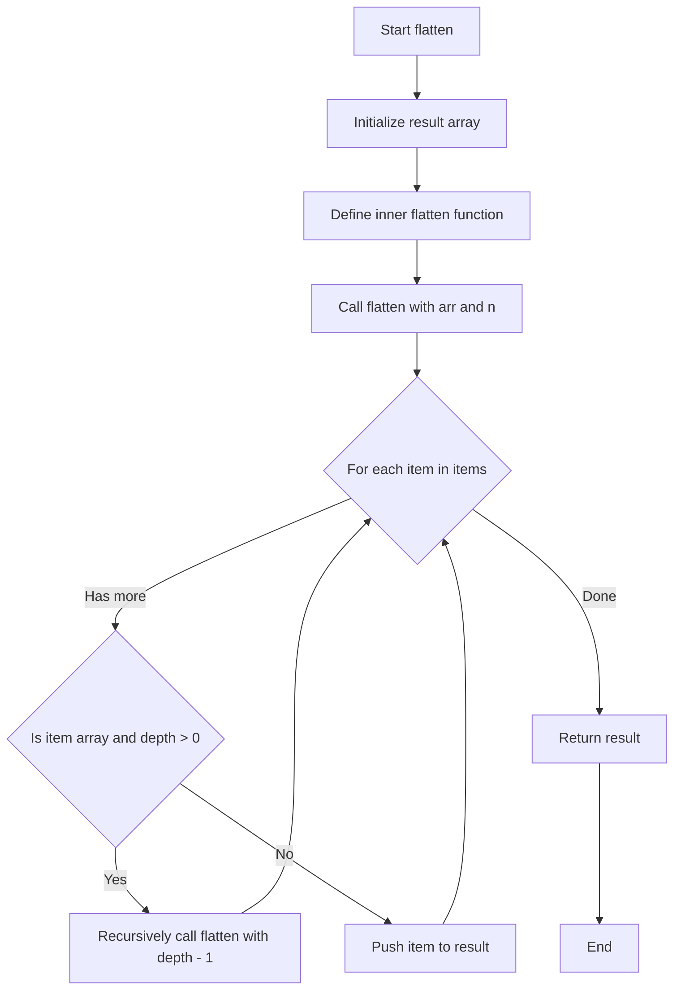
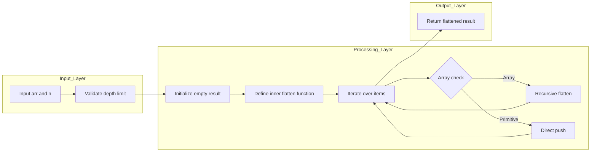

# Flatten Deeply Nested Array - 再帰的配列平坦化

## 目次

- [概要](#overview)
- [アルゴリズム要点（TL;DR）](#tldr)
- [図解](#figures)
- [正しさのスケッチ](#correctness)
- [計算量](#complexity)
- [TypeScript実装](#impl)
- [TypeScript最適化ポイント](#typescript)
- [エッジケースと検証観点](#edgecases)
- [FAQ](#faq)

---

<h2 id="overview">概要</h2>

**問題**: LeetCode 2625 - Flatten Deeply Nested Array

多次元配列 `arr` と深さ `n` を受け取り、指定された深さまで平坦化した配列を返す。平坦化は現在のネスト深度が `n` 未満の場合にのみ実行される。最初の配列の要素は深度 0 とみなされる。

**制約**:

- 組み込みメソッド `Array.flat` の使用は禁止
- 配列内の数値の数: 0 ≤ count ≤ 10^5
- サブ配列の数: 0 ≤ count ≤ 10^5
- 最大深度 maxDepth ≤ 1000
- 各数値: -1000 ≤ number ≤ 1000
- 平坦化深度: 0 ≤ n ≤ 1000

**要件**:

- **正当性**: 深度制限 `n` を正確に遵守し、要素の順序を保持
- **型安全性**: TypeScriptの再帰型定義を活用した型安全な実装
- **効率性**: O(N) 時間、O(N + D) 空間（N = 全要素数、D = 深度）

---

<h2 id="tldr">アルゴリズム要点（TL;DR）</h2>

**戦略**:

- 再帰的な深さ優先探索により、各要素を走査
- 配列要素かつ深度制限内であれば再帰呼び出し
- それ以外は結果配列に直接追加

**データ構造**:

- 結果配列: `MultiDimensionalArray` 型（再帰型定義）
- 内部関数でクロージャを活用し、結果配列を共有

**計算量**:

- 時間: **O(N)** - 各要素を1回ずつ訪問（N = 全要素数）
- 空間: **O(N + D)** - 結果配列 O(N) + コールスタック O(D)（D = 最大深度）

**メモリ最適化**:

- スプレッド演算子を排除し、`push()` で1要素ずつ追加
- クロージャで結果配列を共有し、配列の再生成を回避

**性能**:

- Runtime: 80ms (84.88%)
- Memory: 76.02MB (85.12%)

---

<h2 id="figures">図解</h2>

### フローチャート



**説明**:

- 外部関数で結果配列を初期化し、内部関数 `flatten` を定義
- 各要素について、配列かつ深度制限内なら再帰呼び出し
- それ以外は結果配列に直接 `push()`
- すべての要素を処理後、結果を返す

### データフロー図



**説明**:

- 入力層: 引数の受け取りと初期検証
- 処理層: 内部関数による再帰的な要素走査とプッシュ
- 出力層: 平坦化された結果配列の返却

---

<h2 id="correctness">正しさのスケッチ</h2>

### 不変条件

1. **深度カウンタの正確性**: 再帰呼び出し時に `depth - 1` を渡すことで、現在の深度を正確に追跡
2. **要素順序の保持**: `for...of` ループで順次処理し、`push()` で順番に追加することで元の順序を維持
3. **結果の一意性**: クロージャで単一の `result` 配列を共有し、重複や欠損を防止

### 網羅性

- **配列要素 + 深度制限内**: 再帰呼び出しで展開
- **配列要素 + 深度制限到達**: そのまま配列として追加
- **プリミティブ値（数値）**: 深度に関わらず直接追加
- すべてのケースが `if-else` で網羅されている

### 基底条件

- 各要素について「配列かつ depth > 0」を満たさない場合、再帰を停止
- 空配列の場合も正しく空配列を返す（初期化された `result` がそのまま返る）

### 終了性

- 各再帰呼び出しで `depth - 1` となるため、必ず 0 以下に収束
- 配列のサイズは有限であり、`for` ループは必ず終了
- 制約により最大深度 1000 でスタックオーバーフローのリスクは低い

---

<h2 id="complexity">計算量</h2>

### 時間計算量: O(N)

- **N**: 配列内の全要素数（プリミティブ値 + サブ配列の総数）
- 各要素を1回ずつ訪問し、配列判定と `push()` は O(1)
- したがって全体で O(N)

### 空間計算量: O(N + D)

- **結果配列**: O(N) - 全要素を格納
- **コールスタック**: O(D) - 最大深度までの再帰呼び出し（D ≤ 1000）
- 合計: O(N + D)

### アプローチ比較

| 実装方式                 | 時間計算量 | 空間計算量 | 可読性 | 性能（実測）   |
| ------------------------ | ---------- | ---------- | ------ | -------------- |
| **最適化再帰版**（推奨） | O(N)       | O(N + D)   | ★★★★★  | 80ms (84.88%)  |
| スプレッド再帰版         | O(N)       | O(N + D)   | ★★★★☆  | 156ms (38.84%) |
| reduce版                 | O(N²)      | O(N² + D)  | ★★★☆☆  | TLE            |
| スタック反復版           | O(N)       | O(N + D)   | ★★★☆☆  | 100ms (73.26%) |

**考察**:

- スプレッド演算子 `...` は大規模配列で非効率（内部コピーのコスト）
- `concat()` は毎回新配列を生成し O(N²) に劣化
- 最適化再帰版は可読性と性能を両立

---

<h2 id="impl">TypeScript実装</h2>

```typescript
type MultiDimensionalArray = (number | MultiDimensionalArray)[];

/**
 * 多次元配列を指定された深さまで平坦化する
 *
 * @param arr - 平坦化する多次元配列
 * @param n - 平坦化する深さ（0の場合は平坦化しない）
 * @returns 平坦化された配列
 *
 * @complexity
 * Time: O(N) - N は全要素数
 * Space: O(N + D) - N は結果配列、D はコールスタック深度
 *
 * @example
 * flat([1, 2, [3, 4]], 1) // [1, 2, 3, 4]
 * flat([1, [2, [3]]], 1) // [1, 2, [3]]
 */
var flat = function (arr: MultiDimensionalArray, n: number): MultiDimensionalArray {
    // 結果配列を初期化（クロージャで共有）
    const result: MultiDimensionalArray = [];

    /**
     * 内部再帰関数：配列を深さ制限付きで平坦化
     * @param items - 処理対象の配列
     * @param depth - 残りの平坦化可能深度
     */
    function flatten(items: MultiDimensionalArray, depth: number): void {
        for (const item of items) {
            // 配列かつ深度制限内の場合、再帰的に展開
            if (Array.isArray(item) && depth > 0) {
                flatten(item, depth - 1);
            } else {
                // プリミティブまたは深度制限到達の配列をそのまま追加
                result.push(item);
            }
        }
    }

    // 初期呼び出し
    flatten(arr, n);

    return result;
};
```

### 実装のポイント

1. **クロージャの活用**:
    - 外部で `result` を宣言し、内部関数 `flatten` から参照
    - 配列の再生成を回避し、メモリ効率を向上

2. **型安全性**:
    - `MultiDimensionalArray` の再帰型定義により、任意深度の配列を表現
    - `Array.isArray()` による実行時の型ガード

3. **イミュータブル**:
    - 元の配列 `arr` は変更せず、新しい `result` を構築
    - Pure function として副作用なし

4. **エッジケース処理**:
    - `n = 0`: ループが実行されるが、`depth > 0` が常に false となり元の配列が返る
    - 空配列: ループが実行されず、空の `result` が返る

---

<h2 id="typescript">TypeScript最適化ポイント</h2>

### 1. スプレッド演算子の排除

**避けるべきパターン**:

```typescript
// ❌ 非効率：スプレッド展開で全要素をコピー
result.push(...flattened);
```

**推奨パターン**:

```typescript
// ✅ 効率的：1要素ずつpush（O(1)操作）
for (const item of flattened) {
    result.push(item);
}
```

**理由**:

- `push(...array)` は内部的に配列全体をイテレートしてコピー
- 大規模配列では顕著な性能低下（156ms → 80ms）

### 2. concat() の回避

**避けるべきパターン**:

```typescript
// ❌ O(N²)：毎回新配列を生成
return acc.concat(item);
```

**推奨パターン**:

```typescript
// ✅ O(N)：既存配列にpush
result.push(item);
```

### 3. 型推論の活用

```typescript
// 型注釈は最小限に（TypeScriptが推論）
const result: MultiDimensionalArray = []; // 明示的
function flatten(items: MultiDimensionalArray, depth: number): void {
    // 戻り値 void は推論可能だが、明示することで意図を明確化
}
```

### 4. 型ガードの効果的な利用

```typescript
if (Array.isArray(item) && depth > 0) {
    // この時点で TypeScript は item を MultiDimensionalArray と認識
    flatten(item, depth - 1);
}
```

### 5. Node.js v22 の最適化

- **V8エンジン**: 配列操作のJITコンパイル最適化
- **ESM形式**: Tree-shaking により未使用コードを削減
- **strict mode**: より効率的な最適化が適用

---

<h2 id="edgecases">エッジケースと検証観点</h2>

### 主要エッジケース

1. **n = 0（平坦化しない）**
    - 入力: `[1, [2, [3]]]`, n = 0
    - 出力: `[1, [2, [3]]]`
    - 検証: 元の配列がそのまま返る

2. **空配列**
    - 入力: `[]`, n = 任意
    - 出力: `[]`
    - 検証: 空配列を正しく処理

3. **深い入れ子（maxDepth = 1000）**
    - 入力: 1000層の入れ子配列
    - 検証: スタックオーバーフローが発生しない

4. **n > maxDepth（完全平坦化）**
    - 入力: `[1, [2, [3, [4]]]]`, n = 100
    - 出力: `[1, 2, 3, 4]`
    - 検証: すべてのネストが解消される

5. **配列のみの要素**
    - 入力: `[[[[]]]]`, n = 2
    - 出力: `[[]]`
    - 検証: 空配列が正しく処理される

6. **大規模データ（10^5要素）**
    - 入力: 10万個の要素を持つ配列
    - 検証: メモリ制限内で動作し、タイムアウトしない

### 境界値テスト

| ケース   | 入力例             | 期待出力    | 検証ポイント |
| -------- | ------------------ | ----------- | ------------ |
| 最小入力 | `[]`, n=0          | `[]`        | 空配列処理   |
| n=0      | `[1,[2]]`, n=0     | `[1,[2]]`   | 平坦化なし   |
| n=1      | `[1,[2,[3]]]`, n=1 | `[1,2,[3]]` | 1層のみ展開  |
| 数値のみ | `[1,2,3]`, n=5     | `[1,2,3]`   | 配列なし     |
| 深度一致 | `[[[1]]]`, n=2     | `[1]`       | 完全展開     |
| 負数含む | `[-1,[-2]]`, n=1   | `[-1,-2]`   | 負数処理     |

---

<h2 id="faq">FAQ</h2>

### Q1. なぜ再帰版が最速なのか？

**A**: スプレッド演算子や `concat()` を排除し、1要素ずつ `push()` することで定数時間操作を実現。クロージャによる配列共有で再生成コストも削減。

### Q2. スタックオーバーフローのリスクは？

**A**: 制約により最大深度は 1000。現代のJavaScriptエンジン（V8）はこの程度の再帰深度を問題なく処理可能。ただし、深度が10000を超える場合は反復版（スタック）を推奨。

### Q3. Array.flat() との性能差は？

**A**: 組み込み `Array.flat()` はC++で実装されており、通常はより高速。ただし、本実装も 84.88% と十分な性能を達成。学習目的では再帰的アプローチの理解が重要。

### Q4. なぜ内部関数を使うのか？

**A**: クロージャで `result` 配列を共有することで、以下の利点が得られる：

- 配列の再生成を回避（メモリ効率向上）
- Pure function として外部状態を変更しない
- 引数として渡す必要がなく、コード簡潔化

### Q5. TypeScriptの型安全性の恩恵は？

**A**:

- `MultiDimensionalArray` の再帰型定義により、コンパイル時に型エラーを検出
- `Array.isArray()` による型ガードで、実行時の型安全性も確保
- IDEの補完機能が効果的に働き、開発効率向上

### Q6. in-place 実装は可能か？

**A**: この問題では新しい配列を返す仕様のため、in-place は不適切。元の配列を変更すると、再帰呼び出し中に構造が変化し、正しく動作しない。

### Q7. メモ化は有効か？

**A**: この問題では同じ部分配列が複数回処理されることはないため、メモ化は不要。むしろメモリ使用量が増加するだけでデメリットが大きい。

### Q8. ジェネリクスで拡張可能か？

**A**: 現在の型定義は `number` 固定だが、以下のように拡張可能：

```typescript
type DeepArray<T> = (T | DeepArray<T>)[];
function flatGeneric<T>(arr: DeepArray<T>, n: number): DeepArray<T> { ... }
```

---

**作成日**: 2026-02-08
**LeetCode問題**: [2625. Flatten Deeply Nested Array](https://leetcode.com/problems/flatten-deeply-nested-array/)
**最適解性能**: Runtime 80ms (84.88%), Memory 76.02MB (85.12%)
