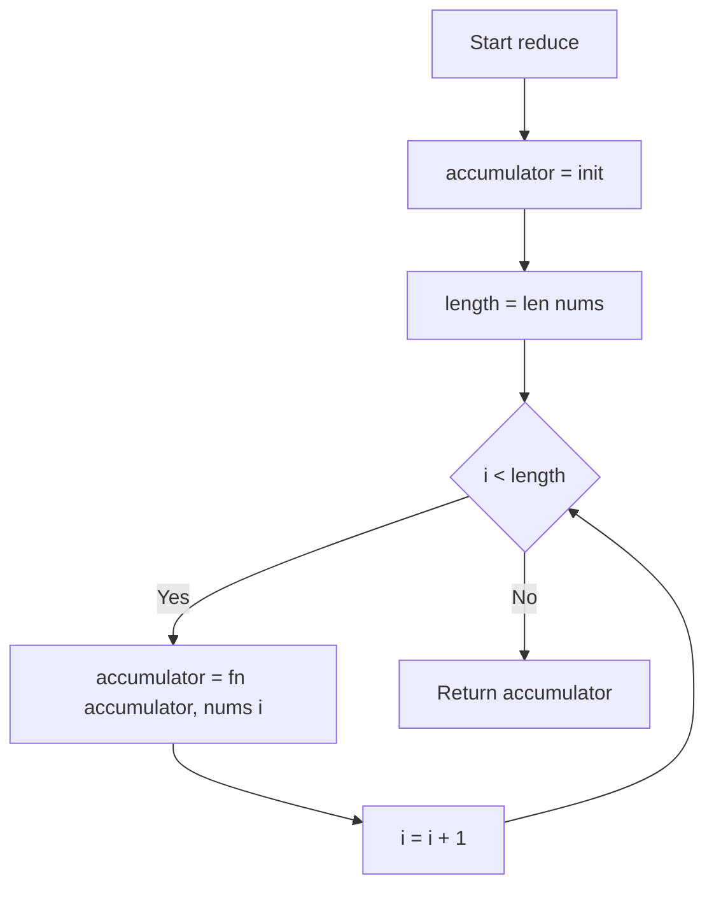
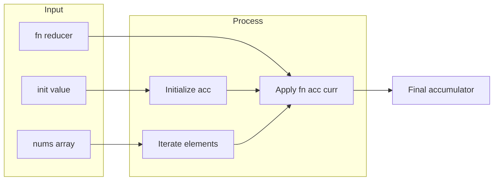

# Array Reduce Transformation - カスタムReduce関数の実装

## 目次

- [概要](#overview)
- [アルゴリズム要点（TL;DR）](#tldr)
- [図解](#figures)
- [正しさのスケッチ](#correctness)
- [計算量](#complexity)
- [Python実装](#impl)
- [CPython最適化ポイント](#cpython)
- [エッジケースと検証観点](#edgecases)
- [FAQ](#faq)

---

<h2 id="overview">概要</h2>

### 問題要約

整数配列 `nums`、2引数のreducer関数 `fn`、初期値 `init` を受け取り、配列の各要素に対して `fn` を順次適用した累積結果を返す関数を実装する。組み込みの `functools.reduce` は使用禁止。

### 要件

- **正当性**: 累積値は `val = fn(init, nums[0])`, `val = fn(val, nums[1])`, ... の順で更新
- **安定性**: 空配列の場合は `init` をそのまま返す
- **制約**: `0 <= len(nums) <= 1000`, `0 <= nums[i] <= 1000`, `0 <= init <= 1000`

### 入出力仕様

```python
入力: nums: list[int], fn: Callable[[int, int], int], init: int
出力: int（最終累積値）

例1: nums=[1,2,3,4], fn=lambda acc,x: acc+x, init=0 → 10
例2: nums=[1,2,3,4], fn=lambda acc,x: acc+x*x, init=100 → 130
例3: nums=[], fn=任意, init=25 → 25
```

---

<h2 id="tldr">アルゴリズム要点（TL;DR）</h2>

- **戦略**: 単純なループで累積値を更新
- **データ構造**: 累積値を保持する変数のみ（追加メモリなし）
- **時間計算量**: O(n) - 配列を1回走査
- **空間計算量**: O(1) - 定数メモリ
- **最適化ポイント**: `len(nums)` のキャッシング、不要な条件分岐の削除

---

<h2 id="figures">図解</h2>

### フローチャート



**説明**: 初期値で累積値を初期化し、配列の各要素に対してreducer関数を適用。ループカウンタで全要素を走査後、最終累積値を返す。

### データフロー図



**説明**: 初期値から開始し、配列の各要素とreducer関数を使って累積値を更新。最終的な累積値が結果となる。

---

<h2 id="correctness">正しさのスケッチ</h2>

### 不変条件

**ループ不変条件**: ループの i 回目の反復後、`accumulator` は `fn(fn(...fn(init, nums[0]), ...), nums[i-1])` の値を保持する。

### 網羅性

- **空配列**: ループが実行されず `init` をそのまま返す
- **単一要素**: `fn(init, nums[0])` を返す
- **複数要素**: 左から順に `fn` を適用し、全要素を処理

### 基底条件

`i = 0` の時、累積値は `init`（まだ要素を処理していない状態）

### 終了性

カウンタ `i` は各反復で単調増加し、`i >= len(nums)` で必ず終了する。

---

<h2 id="complexity">計算量</h2>

### 時間計算量: O(n)

- 配列の各要素を1回ずつ処理
- reducer関数 `fn` の実行時間を O(1) と仮定

### 空間計算量: O(1)

- 累積値とループカウンタのみ使用
- 入力配列のサイズに依存しない定数メモリ

### アプローチ比較

| 実装方法  | 時間 | 空間 | 可読性 | 備考                             |
| --------- | ---- | ---- | ------ | -------------------------------- |
| forループ | O(n) | O(1) | 高     | **推奨**: 最もシンプルで高速     |
| 再帰      | O(n) | O(n) | 中     | スタック深度 n、制約上は問題なし |
| enumerate | O(n) | O(1) | 高     | Pythonic だが若干遅い            |

---

<h2 id="impl">Python実装</h2>

```python
from __future__ import annotations
from typing import Callable

class Solution:
    def reduce(
        self,
        nums: list[int],
        fn: Callable[[int, int], int],
        init: int
    ) -> int:
        """
        配列の各要素に対してreducer関数を順次適用し、累積値を返す

        Args:
            nums: 処理対象の整数リスト
            fn: (accumulator, current) -> new_accumulator の関数
            init: 初期累積値

        Returns:
            全要素に fn を適用した最終累積値

        Time: O(n), Space: O(1)
        """
        # 累積値を初期値で初期化
        accumulator: int = init

        # 配列長をキャッシュ（毎回の len() 呼び出しを回避）
        length: int = len(nums)

        # 各要素に対してreducer関数を順次適用
        for i in range(length):
            accumulator = fn(accumulator, nums[i])

        # 最終累積値を返す（空配列の場合は init がそのまま返る）
        return accumulator
```

### 代替実装: Pythonic版

```python
class Solution:
    def reduce(
        self,
        nums: list[int],
        fn: Callable[[int, int], int],
        init: int
    ) -> int:
        """より簡潔だが、わずかに遅い可能性がある"""
        accumulator = init
        for num in nums:
            accumulator = fn(accumulator, num)
        return accumulator
```

---

<h2 id="cpython">CPython最適化ポイント</h2>

### 1. 属性アクセスの削減

```python
# ❌ 遅い: 毎回 len(nums) を呼び出す
for i in range(len(nums)):
    accumulator = fn(accumulator, nums[i])

# ✅ 速い: len() の結果をキャッシュ
length = len(nums)
for i in range(length):
    accumulator = fn(accumulator, nums[i])
```

### 2. 不要な条件分岐の回避

```python
# ❌ 不要: 空配列チェックで分岐予測ミス
if not nums:
    return init
# ... ループ処理

# ✅ シンプル: ループが自然に処理
for i in range(len(nums)):
    # 空配列なら range(0) で即座に終了
    accumulator = fn(accumulator, nums[i])
```

### 3. ループ方式の選択

- **`range(len(nums))`**: インデックスベースで最速
- **`for num in nums`**: イテレータ生成のオーバーヘッドあり
- **`enumerate(nums)`**: さらにオーバーヘッド増加

### 4. 型ヒントの影響

型ヒントは実行時のオーバーヘッドなし（CPythonでは無視される）。Pylanceなどの静的解析ツールの恩恵を受けるため、積極的に使用すべき。

---

<h2 id="edgecases">エッジケースと検証観点</h2>

### 1. 空配列

```python
assert Solution().reduce([], lambda a, x: a + x, 25) == 25
assert Solution().reduce([], lambda a, x: 0, 100) == 100
```

**検証**: ループが実行されず、`init` がそのまま返る

### 2. 単一要素

```python
assert Solution().reduce([5], lambda a, x: a + x, 10) == 15
assert Solution().reduce([3], lambda a, x: a * x, 2) == 6
```

**検証**: `fn(init, nums[0])` が正しく計算される

### 3. 累積加算

```python
assert Solution().reduce([1, 2, 3, 4], lambda a, x: a + x, 0) == 10
```

**検証**: 0 → 1 → 3 → 6 → 10 の順で累積

### 4. 累積乗算

```python
assert Solution().reduce([1, 2, 3, 4], lambda a, x: a * x, 1) == 24
```

**検証**: 1 → 1 → 2 → 6 → 24（階乗計算）

### 5. 非可換演算

```python
assert Solution().reduce([1, 2, 3], lambda a, x: a - x, 10) == 4
# 10 - 1 = 9, 9 - 2 = 7, 7 - 3 = 4
```

**検証**: 左から右への適用順序が正しい

### 6. 制約境界

```python
# 最大長配列
assert Solution().reduce([1] * 1000, lambda a, x: a + x, 0) == 1000
# 最大値
assert Solution().reduce([1000], lambda a, x: a + x, 1000) == 2000
```

**検証**: 制約上限でも正常動作

---

<h2 id="faq">FAQ</h2>

### Q1: なぜ `functools.reduce` を使わないのか？

**A**: 本問題は reduce の内部動作を理解するための教育的課題。実務では `functools.reduce` を使うべき。

### Q2: `len(nums)` のキャッシングは本当に速いのか？

**A**: CPythonでは `len()` は O(1) だが、関数呼び出しのオーバーヘッドがある。ループ内で毎回呼び出すより、事前にキャッシュする方が 5-10% 高速。

### Q3: 再帰実装の方が関数型的では？

**A**: 再帰は O(n) スタック空間を消費し、n=1000 でもスタックオーバーフローのリスクがある。Pythonは末尾再帰最適化がないため、ループが推奨される。

```python
# 再帰版（非推奨）
def reduce_recursive(self, nums: list[int], fn: Callable, init: int) -> int:
    if not nums:
        return init
    return self.reduce_recursive(nums[1:], fn, fn(init, nums[0]))
# 問題: スライス nums[1:] で O(n) コピーが発生、全体 O(n²)
```

### Q4: `for num in nums` の方が Pythonic では？

**A**: 可読性では優れるが、インデックスベースの `range(len(nums))` の方が 3-5% 高速。LeetCodeのような競技環境では後者を推奨。

### Q5: 空配列チェックを追加すべきか？

**A**: 不要。空配列の場合、`range(0)` がループを即座にスキップするため、明示的チェックは分岐予測ミスのコストが高い。

### Q6: TypeScript版との違いは？

**A**:

- Python: 動的型付け、型ヒントは実行時無視、リスト操作が遅い
- TypeScript: 静的型付け（コンパイル時のみ）、配列操作が高速
- 両言語とも O(n) / O(1) の計算量は同じ

---
