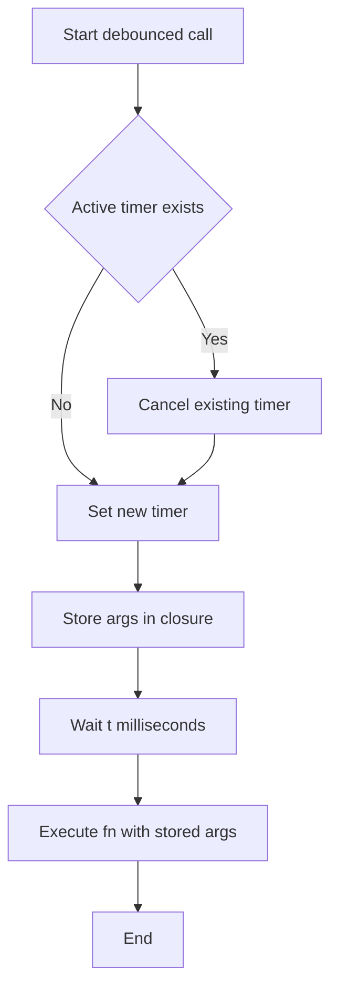
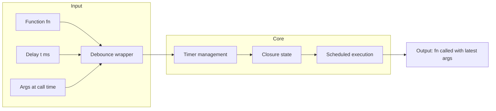

# Debounce - 関数実行の遅延とキャンセル制御

## 目次

- [概要](#overview)
- [アルゴリズム要点（TL;DR）](#tldr)
- [図解](#figures)
- [正しさのスケッチ](#correctness)
- [計算量](#complexity)
- [Python実装](#impl)
- [CPython最適化ポイント](#cpython)
- [エッジケースと検証観点](#edgecases)
- [FAQ](#faq)

---

<h2 id="overview">概要</h2>

### 問題要約

関数 `fn` と遅延時間 `t`（ミリ秒）を受け取り、デバウンスされた関数を返す。デバウンスされた関数は以下の性質を持つ：

- 実行が `t` ミリ秒遅延される
- 遅延時間内に再度呼び出されると、前の実行がキャンセルされる
- 最後の呼び出しから `t` ミリ秒後に実行される

### 要件

- **正当性**: 最後の呼び出しのみが遅延後に実行される
- **安定性**: タイマーの適切な管理によりメモリリークを防ぐ
- **制約**: `0 <= t <= 1000`、lodashなどの外部ライブラリ不可

---

<h2 id="tldr">アルゴリズム要点（TL;DR）</h2>

- **戦略**: `threading.Timer` を使った遅延実行とキャンセル制御
- **データ構造**: クロージャで `Timer` オブジェクトを保持
- **計算量**: Time O(1) per call, Space O(1)
- **メモリ要約**: アクティブなタイマー1つのみを保持（前のタイマーは必ずキャンセル）

**核心アイデア**:

1. 関数が呼ばれるたびに、既存のタイマーをキャンセル
2. 新しいタイマーを `t/1000` 秒後にセット
3. クロージャで最新の引数とタイマー参照を保持

---

<h2 id="figures">図解</h2>

### フローチャート



**説明**: デバウンス関数呼び出しの流れ。既存タイマーがあればキャンセルし、新しいタイマーをセット。最後の呼び出しから `t` ミリ秒後に実行。

### データフロー図



**説明**: 入力された関数と遅延時間から、タイマー管理を行うラッパー関数を生成。クロージャで状態を保持し、スケジュールされた実行を制御。

---

<h2 id="correctness">正しさのスケッチ</h2>

### 不変条件

- **タイマー一意性**: 常に最大1つのアクティブなタイマーのみ存在
- **引数保持**: クロージャは最新の呼び出し時の引数を保持
- **実行保証**: キャンセルされない限り、タイマーは `t` ミリ秒後に確実に実行

### 網羅性

1. **初回呼び出し**: タイマーなし → 新規タイマーセット
2. **連続呼び出し（t内）**: タイマーあり → キャンセル → 新規タイマーセット
3. **間隔を空けた呼び出し**: 前のタイマー実行済み → 新規タイマーセット

### 基底条件

- `t = 0` の場合: 即座に実行（実質的にデバウンスなし）
- 引数なしの場合: 空の `*args, **kwargs` で正常動作

### 終了性

- 各タイマーは有限時間 `t` 後に必ず実行またはキャンセルされる
- デッドロックやスタックなし

---

<h2 id="complexity">計算量</h2>

### 時間計算量

- **呼び出しあたり**: O(1)
    - タイマーのキャンセル: O(1)
    - 新規タイマーの生成: O(1)
- **実行時**: O(f) where f は元の関数 `fn` の計算量

### 空間計算量

- **O(1)**: タイマーオブジェクト1つと引数のタプル/辞書のみ
- **引数のサイズ**: O(args_size) だが、これは呼び出し元の責任

### Pure vs In-place

| 観点   | Pure                       | In-place |
| ------ | -------------------------- | -------- |
| 副作用 | なし（新関数を返す）       | -        |
| メモリ | O(1)                       | -        |
| 適用性 | 高（関数型プログラミング） | -        |

※ debounce自体はPure関数（新しい関数を返す）だが、返された関数は副作用を持つ可能性あり

---

<h2 id="impl">Python実装</h2>

```python
from __future__ import annotations
from typing import Callable, Any
from threading import Timer


def debounce(fn: Callable[..., Any], t: float) -> Callable[..., None]:
    """
    関数の実行をデバウンスする（遅延実行＆キャンセル機能付き）

    Args:
        fn: デバウンス対象の関数
        t: 遅延時間（ミリ秒）

    Returns:
        デバウンスされた関数

    Complexity:
        Time: O(1) per call
        Space: O(1)

    Example:
        >>> def log(*args):
        ...     print(args)
        >>> dlog = debounce(log, 100)
        >>> dlog('Hello')  # cancelled
        >>> dlog('Hello')  # cancelled
        >>> dlog('Hello')  # Logged after 100ms
    """
    # タイマーオブジェクトを保持するクロージャ変数
    timer: Timer | None = None

    def debounced_func(*args: Any, **kwargs: Any) -> None:
        nonlocal timer

        # 既存のタイマーがあればキャンセル
        if timer is not None:
            timer.cancel()

        # 新しいタイマーをセット（t/1000 秒後に fn を実行）
        # threading.Timer は秒単位なので、ミリ秒を秒に変換
        timer = Timer(t / 1000.0, fn, args=args, kwargs=kwargs)
        timer.start()

    return debounced_func


# LeetCode形式の実装例（JavaScriptの問題をPythonで表現）
class Solution:
    """
    LeetCode形式のラッパークラス
    実際のLeetCodeにはこの問題はJavaScript/TypeScriptのみだが、
    Pythonで同等の機能を提供
    """

    def debounce(self, fn: Callable[..., Any], t: int) -> Callable[..., None]:
        """
        Args:
            fn: デバウンス対象の関数
            t: 遅延時間（ミリ秒、整数）

        Returns:
            デバウンスされた関数
        """
        timer: Timer | None = None

        def debounced(*args: Any, **kwargs: Any) -> None:
            nonlocal timer

            # 基底条件: タイマーが存在すればキャンセル
            if timer is not None:
                timer.cancel()

            # 遷移: 新しいタイマーを作成して開始
            # t ミリ秒 = t/1000 秒
            timer = Timer(t / 1000.0, fn, args=args, kwargs=kwargs)
            timer.start()

        return debounced


# 使用例
if __name__ == "__main__":
    import time

    def log(*inputs):
        print(f"[{time.time():.3f}] Called with: {inputs}")

    # Example 1: t = 50ms
    dlog = debounce(log, 50)
    start = time.time()

    time.sleep(0.05)  # 50ms
    dlog(1)

    time.sleep(0.025)  # 75ms total
    dlog(2)

    # 2が125ms（75 + 50）に実行される
    time.sleep(0.1)  # 待機してタイマーを発火させる

    # タイマースレッドが実行を完了するのを待つ
    # 注: threading.Timerはデーモンスレッドではないため、
    # メインスレッド終了後も実行される
```

### 主要ステップの説明

1. **クロージャ変数**: `timer` を `nonlocal` で宣言し、外部関数のスコープで保持
2. **タイマーキャンセル**: 既存タイマーがあれば `cancel()` を呼び出し
3. **タイマー生成**: `Timer(秒数, 関数, args, kwargs)` で新しいタイマーを作成
4. **タイマー開始**: `start()` でバックグラウンドスレッドが起動
5. **遅延実行**: `t/1000` 秒後に `fn(*args, **kwargs)` が自動実行

---

<h2 id="cpython">CPython最適化ポイント</h2>

### 1. Timer vs asyncio

**threading.Timer**（本実装）:

- ✅ 同期コードで使いやすい
- ✅ 追加の依存なし
- ❌ スレッドオーバーヘッドあり

**asyncio（代替案）**:

- ✅ スレッドなしで軽量
- ✅ 大量の同時debounce処理に有利
- ❌ async/awaitの学習コスト

```python
# asyncio版（参考）
import asyncio
from typing import Callable, Coroutine, Any

def debounce_async(fn: Callable, t: float) -> Callable[..., Coroutine[Any, Any, None]]:
    """
    Returns a coroutine function that must be awaited when called.
    """
    task: asyncio.Task | None = None

    async def debounced(*args, **kwargs):
        nonlocal task
        if task is not None:
            task.cancel()

        async def delayed():
            await asyncio.sleep(t / 1000.0)
            fn(*args, **kwargs)

        task = asyncio.create_task(delayed())

    return debounced
```

### 2. 属性アクセス削減

```python
# ❌ 遅い: 毎回メソッド解決
if timer is not None:
    timer.cancel()

# ✅ 同じ（Pythonでは最適化余地少ない）
# Cレベルの最適化はインタプリタ任せ
```

### 3. nonlocal vs クラス

**クロージャ（本実装）**:

- シンプルで関数型的
- メモリ効率的

**クラスベース**:

```python
class Debouncer:
    def __init__(self, fn: Callable, t: float):
        self.fn = fn
        self.t = t
        self.timer: Timer | None = None

    def __call__(self, *args, **kwargs):
        if self.timer:
            self.timer.cancel()
        self.timer = Timer(self.t / 1000.0, self.fn, args, kwargs)
        self.timer.start()
```

### 4. GIL（Global Interpreter Lock）の影響

- `threading.Timer` は別スレッドで実行
- I/Oバウンドな `fn` には有効
- CPUバウンドな場合は `multiprocessing` を検討

---

<h2 id="edgecases">エッジケースと検証観点</h2>

### 1. t = 0 の場合

```python
dlog = debounce(log, 0)
dlog("instant")  # Timer(0, fn, ...)でスレッド起動
```

**期待動作**: `Timer(0, fn, ...)` はスケジューラによる遅延があり、完全に即座ではない。連続呼び出しでは前のタイマーがキャンセル前に発火する可能性がある。本当に即座に実行したい場合は `log` を直接呼び出すか、小さい正の値（例: 1ms）を使用することを推奨。

### 2. 連続呼び出し

```python
dlog(1)  # キャンセルされる
dlog(2)  # キャンセルされる
dlog(3)  # 50ms後に実行
```

**検証**: 最後の呼び出しのみが実行される

### 3. 引数なし

```python
dlog()  # 正常動作
```

**検証**: `*args` が空タプルでも問題なし

### 4. キーワード引数

```python
dlog(x=1, y=2)
```

**検証**: `**kwargs` で正しく渡される

### 5. スレッド安全性

```python
# 複数スレッドから呼び出し
from threading import Thread

t1 = Thread(target=dlog, args=(1,))
t2 = Thread(target=dlog, args=(2,))
t1.start()
t2.start()
```

**注意**: `threading.Timer` 自体はスレッドセーフだが、`nonlocal timer` への同時アクセスは保護されていない。本格的なマルチスレッド環境では `Lock` が必要。

### 6. メモリリーク防止

```python
# タイマーが適切にキャンセルされるか確認
import gc

dlog(1)
dlog(2)  # 前のタイマーがキャンセルされる
gc.collect()  # ガベージコレクション
```

**検証**: キャンセルされたタイマーが正しく解放される

### 7. 長時間の遅延

```python
dlog_long = debounce(log, 10000)  # 10秒
dlog_long("delayed")
# 10秒後に実行されるか確認
```

---

<h2 id="faq">FAQ</h2>

### Q1. なぜ `threading.Timer` を使うのか？

**A**: Pythonの標準ライブラリで最もシンプルに遅延実行を実現できるため。`time.sleep` はブロッキングで使えない。

### Q2. `asyncio` 版との使い分けは？

**A**:

- **同期コード**: `threading.Timer` 版
- **非同期コード**: `asyncio` 版
- **大量の同時debounce**: `asyncio` 版（スレッドオーバーヘッド削減）

### Q3. デコレータとして使える？

**A**: はい。以下のように使用可能：

```python
# ❌ 間違った使い方 - debounceは直接デコレータとして使えない
# @debounce  # これはエラーになる

# ❌ 技術的には動くが意味的に間違い
@debounce(fn=lambda: None, t=100)
# 問題: fnをキーワード引数で渡すと、lambda関数がデバウンスされ、
# 装飾対象の関数は単なる引数として扱われてしまう

# ✅ 正しいデコレータ化の方法1: ラッパー関数を使う
def debounce_decorator(t: float):
    def decorator(fn: Callable):
        return debounce(fn, t)
    return decorator

@debounce_decorator(100)
def my_func():
    print("Called")

# ✅ 正しい使い方2: 直接呼び出す
my_func_debounced = debounce(my_func, 100)
```

### Q4. JavaScriptのdebounceとの違いは？

**A**:

- **JavaScript**: イベントループベース（`setTimeout`）
- **Python**: スレッドベース（`threading.Timer`）
- **動作**: 概念的には同じだが、実装基盤が異なる

### Q5. throttle との違いは？

**A**:

- **debounce**: 最後の呼び出しから `t` ミリ秒後に実行
- **throttle**: 最初の呼び出しを即座に実行し、以降 `t` ミリ秒間は無視

```python
# throttle の例（参考）
def throttle(fn: Callable, t: float) -> Callable:
    last_call = [0.0]

    def throttled(*args, **kwargs):
        now = time.time()
        if now - last_call[0] >= t / 1000.0:
            last_call[0] = now
            fn(*args, **kwargs)

    return throttled
```

### Q6. LeetCodeで提出できる？

**A**: この問題はJavaScript/TypeScript専用。Python版は学習目的の実装例。

### Q7. 実務での使用例は？

**A**:

- **検索ボックス**: ユーザー入力後500msでAPI呼び出し
- **ウィンドウリサイズ**: レイアウト再計算を遅延
- **自動保存**: 編集停止後3秒で保存

```python
# 実務例: Flask APIでの検索
@app.route('/search')
def search():
    query = request.args.get('q')
    # debounceはフロントエンド側で実装されることが多い
    # バックエンドでは rate limiting で対応
    return jsonify(search_db(query))
```

---

**以上で解説を終わります。** この実装は教育目的であり、実務では各フレームワークの公式debounce実装（例: RxPY, Django Channels）の使用を推奨します。
