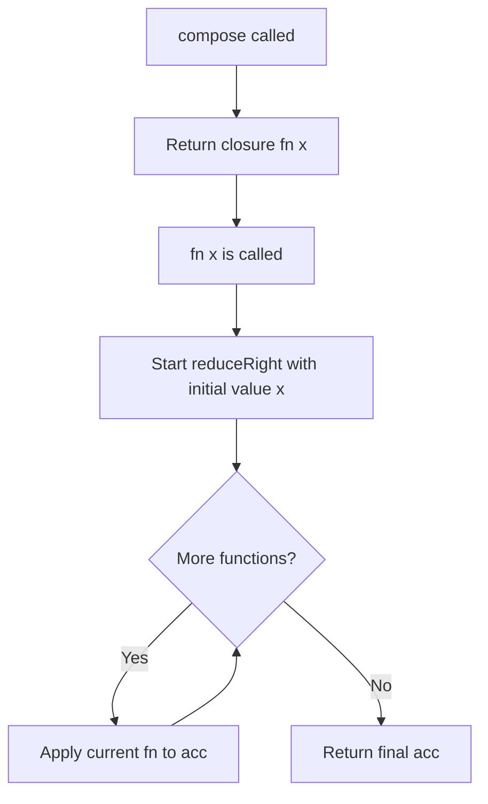
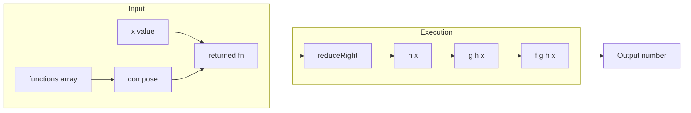

# Function Composition - Right-to-Left Pipeline via reduceRight

## 目次（Table of Contents）

- [概要](#overview)
- [アルゴリズム要点（TL;DR）](#tldr)
- [図解](#figures)
- [正しさのスケッチ](#correctness)
- [計算量](#complexity)
- [TypeScript 実装](#impl)
- [TypeScript / V8 最適化ポイント](#typescript-v8)
- [エッジケースと検証観点](#edgecases)
- [FAQ](#faq)

---

<h2 id="overview">概要</h2>

**LeetCode 2629 – Function Composition**

関数の配列 `[f1, f2, ..., fn]` を受け取り、**右から左** へ順に適用する合成関数 `fn` を返す。

```
compose([f, g, h])(x) = f(g(h(x)))
```

| 要件   | 内容                                              |
| ------ | ------------------------------------------------- |
| 正当性 | 空配列のとき恒等関数 `x => x` を返す              |
| 安定性 | 各関数は副作用なし・純粋関数を前提                |
| 制約   | `0 ≤ functions.length ≤ 1000`, `-1000 ≤ x ≤ 1000` |

---

<h2 id="tldr">アルゴリズム要点（TL;DR）</h2>

- **戦略**: `Array.prototype.reduceRight` で配列を右端から畳み込む。
- **データ構造**: 追加データ構造なし。クロージャが `functions` 参照を保持するのみ。
- **時間計算量**: 合成関数呼び出し時 O(n)（n = 関数配列の長さ）
- **空間計算量**: O(1)（クロージャのポインタ1本のみ）
- **空配列**: `reduceRight` の初期値 `x` がそのまま返るため、特別処理不要。
- **型安全性**: `type F = (x: number) => number` で入出力を厳密に束縛。

---

<h2 id="figures">図解</h2>

### フローチャート



> `compose` は呼ばれた時点でクロージャを返すだけ（O(1)）。
> 実際の計算は返された関数 `fn(x)` が呼ばれたときに行われる（O(n)）。

---

### データフロー図



> 配列の末尾から先頭に向かって関数が順に適用される。各ステップの出力が次のステップの入力となる。

---

<h2 id="correctness">正しさのスケッチ</h2>

**不変条件**
`reduceRight` の各ステップで、`acc` は「現在のインデックスより右側の全関数を適用した結果」を保持する。

**基底条件**

- 空配列：`reduceRight` はコールバックを一度も呼ばず、初期値 `x` を返す → 恒等関数として正しい。
- 要素1個：`reduceRight` は1回だけコールバックを呼び、`fn(x)` を返す。

**網羅性**

- 全関数は `F = (x: number) => number` 型を満たすため、型レベルで入出力の整合性が保証される。
- `acc` の型は常に `number` であり、コンパイル時に検証される。

**終了性**

- `reduceRight` は有限配列を走査するため必ず終了する。

---

<h2 id="complexity">計算量</h2>

| フェーズ               | 時間計算量 | 空間計算量 | 備考               |
| ---------------------- | ---------- | ---------- | ------------------ |
| `compose` 呼び出し     | O(1)       | O(1)       | クロージャ生成のみ |
| 返された関数の呼び出し | O(n)       | O(1)       | n = 関数配列の長さ |

> **in-place vs Pure**:
> 本実装は Pure（副作用なし）。`functions` 配列を変更せず、クロージャは参照のみ保持する。

---

<h2 id="impl">TypeScript 実装</h2>

```typescript
// LeetCode 2629 - Function Composition
// TypeScript strict mode 対応

type F = (x: number) => number;

/**
 * 関数配列の右から左への合成を返す。
 * 空配列の場合は恒等関数を返す。
 *
 * @param functions - 合成する関数の配列（右端から順に適用）
 * @returns 合成された関数
 * @complexity Time: O(n) per call, Space: O(1)
 */
function compose(functions: readonly F[]): F {
    // reduceRight の初期値 x が空配列時の恒等関数を自然に実現する
    return function (x: number): number {
        return functions.reduceRight((acc: number, fn: F): number => fn(acc), x);
    };
}

/**
 * const fn = compose([x => x + 1, x => 2 * x]);
 * fn(4); // 9  (2*4=8, 8+1=9)
 */
```

**主要ポイント**

- `readonly F[]` で入力配列の不変性を型レベルで保証。
- コールバック引数 `acc: number`, `fn: F` に明示的型注釈を付与し、`strict` モード下での推論を確実化。
- 空配列の特別分岐が不要 → 分岐ゼロ・コードが簡潔。

---

<h2 id="typescript-v8">TypeScript / V8 最適化ポイント</h2>

| 観点                        | 内容                                                                                      |
| --------------------------- | ----------------------------------------------------------------------------------------- |
| **クロージャコスト**        | `compose` 呼び出しごとにクロージャを1つ生成するのみ。追加オブジェクトなし。               |
| **`reduceRight` vs ループ** | V8 の組み込みメソッドは JIT 最適化されやすい。可読性も高く推奨。                          |
| **配列参照の共有**          | クロージャは `functions` の参照を保持するのみ（コピーなし）。大配列でもメモリ効率が良い。 |
| **型注釈の効果**            | コンパイル時に型エラーを除去することで、実行時の型チェック分岐が不要になる。              |
| **`readonly` 修飾子**       | TypeScript コンパイラが配列の書き換えをコンパイル時にブロック。実行時オーバーヘッドなし。 |

> `for` ループで書き換えても計算量は変わらないが、`reduceRight` の方が数学的意図が明確で保守性が高い。

---

<h2 id="edgecases">エッジケースと検証観点</h2>

| ケース           | 入力例                                | 期待出力                                                                | 対応                                 |
| ---------------- | ------------------------------------- | ----------------------------------------------------------------------- | ------------------------------------ |
| 空配列           | `functions = [], x = 42`              | `42`                                                                    | `reduceRight` の初期値がそのまま返る |
| 関数1つ          | `functions = [x => x * 2], x = 5`     | `10`                                                                    | コールバック1回だけ実行              |
| 全関数が恒等関数 | `functions = [x => x, x => x], x = 7` | `7`                                                                     | 変換なし                             |
| 境界値 x = -1000 | `functions = [x => x + 1], x = -1000` | `-999`                                                                  | 制約内で正常動作                     |
| 境界値 x = 1000  | `functions = [x => x - 1], x = 1000`  | `999`                                                                   | 制約内で正常動作                     |
| 関数1000個       | 全て `x => x + 1`, `x = 0`            | `1000`                                                                  | O(n) で完走                          |
| 非可換な合成順序 | `[x => x + 1, x => x * x], x = 3`     | `10` (3²=9, 9+1=10) vs `[x => x * x, x => x + 1]` → `16` (3+1=4, 4²=16) | 右から左の順が正しく守られる         |

---

<h2 id="faq">FAQ</h2>

**Q. なぜ `reduceRight` を使うのか？ `reduce` ではだめなのか？**
A. 数学の合成関数 `f∘g∘h` は右から左に評価される（`h` を先に適用）。`reduceRight` はその順序を自然に表現できる。`reduce` を使うと左から右の適用になり、問題の仕様と逆になる。

**Q. 空配列の場合、なぜ特別分岐が不要なのか？**
A. `reduceRight(callback, initialValue)` は配列が空のとき、`callback` を一度も呼ばずに `initialValue` を返す。これが恒等関数 `x => x` の動作と一致する。

**Q. `functions` 配列の要素を変更するとどうなるか？**
A. クロージャは参照を保持するため、外部から配列の要素を書き換えると合成結果も変わる。`readonly F[]` はコンパイル時にこの書き換えをブロックするが、実行時の完全な防御が必要な場合は `Object.freeze(functions)` を追加する。

**Q. ループ実装と `reduceRight` 実装でパフォーマンス差はあるか？**
A. 制約（`functions.length ≤ 1000`）の範囲では計測上の差はほぼない。可読性・意図の明確さから `reduceRight` を推奨する。

**Q. TypeScript の `strict` モードで問題なく動作するか？**
A. はい。`reduceRight` のコールバック引数に明示的型注釈 `(acc: number, fn: F): number` を付与しているため、`strict` / `noImplicitAny` 下でもコンパイルエラーは発生しない。
