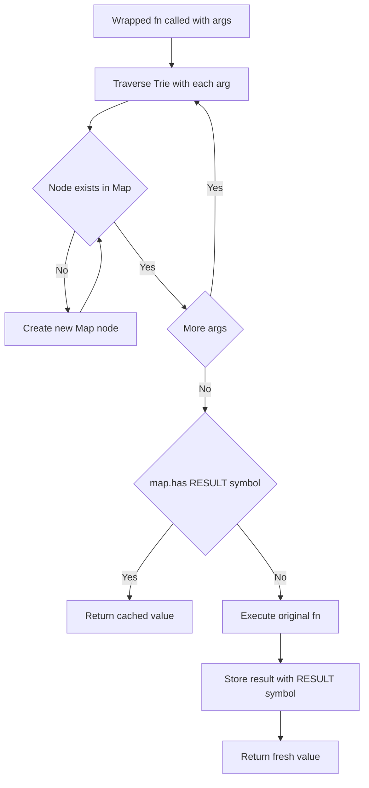
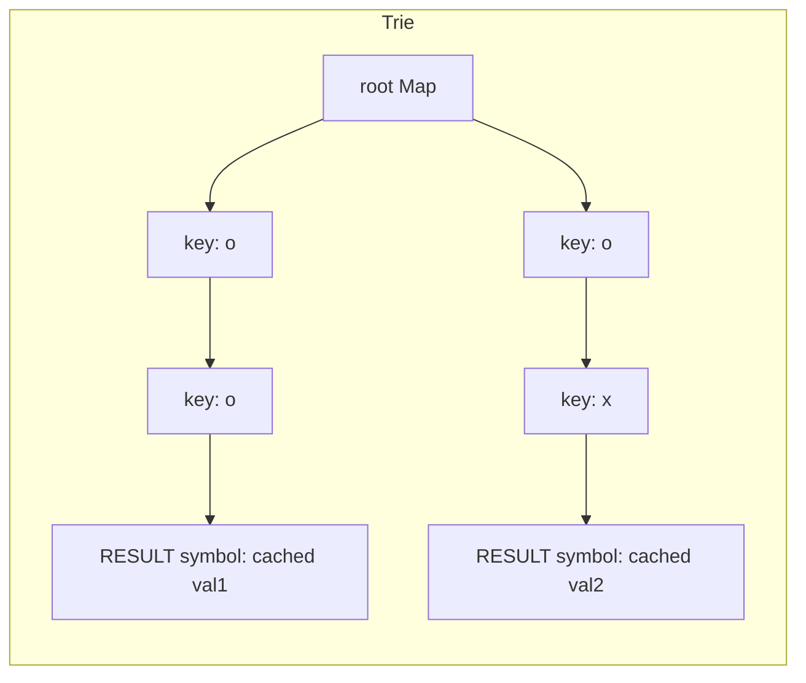

# Memoize - キャッシュで重複呼び出しを排除するトライ構造

## 目次

- [概要](#overview)
- [アルゴリズム要点 TL;DR](#tldr)
- [図解](#figures)
- [正しさのスケッチ](#correctness)
- [計算量](#complexity)
- [TypeScript 実装](#impl)
- [V8最適化ポイント](#cpython)
- [エッジケースと検証観点](#edgecases)
- [FAQ](#faq)

---

<h2 id="overview">概要</h2>

**LeetCode 2623 – Memoize**

任意の関数 `fn` を受け取り、**同じ引数列で2回目以降の呼び出しをキャッシュから返す** ラッパー関数を返す問題。

### 要件

| 項目       | 内容                                                                 |
| ---------- | -------------------------------------------------------------------- |
| 同一性判定 | 引数同士が `===` で等しい場合をキャッシュヒットとする                |
| 引数の型   | 任意（プリミティブ・オブジェクト参照・`null` など）                  |
| 引数の個数 | 任意の可変長                                                         |
| 戻り値     | `fn` が `undefined` を返す場合もキャッシュヒットとして正しく扱うこと |
| 制約       | `1 ≤ inputs.length ≤ 10^5`、`0 ≤ inputs.flat().length ≤ 10^5`        |

**ポイント**: `JSON.stringify` によるキー化は**オブジェクト参照の同一性を失う**ため使用不可。`{}` と `{}` は別オブジェクトであり、`===` では `false` になる。

---

<h2 id="tldr">アルゴリズム要点 TL;DR</h2>

- **戦略**: 引数列をトライ木（Trie）として `Map` でチェーン → 終端ノードに結果を格納
- **データ構造**: `Map<unknown, CacheMap>` の再帰的ネスト（TrieNode オブジェクト不要）
- **キャッシュヒット判定**: `Symbol` キーで `map.has(RESULT)` → `undefined` 戻り値も正確に処理
- **Time**: `O(k)` per call（k = 引数の数）
- **Space**: `O(n · k)`（n = ユニーク呼び出し数、k = 引数の数）
- **改善点**: ノードを専用オブジェクトでなく `Map` 自体にすることで、オブジェクト生成コストとプロパティアクセスを削減

---

<h2 id="figures">図解</h2>

### フローチャート：memoize ラッパーの動作



各引数を順に `Map` の経路としてたどり、すべての引数を消費した終端ノードに `Symbol` キーで結果を保持します。

---

### データフロー図：キャッシュ構造の例 `fn(o, o)` と `fn(o, x)`



> `o` が同一オブジェクト参照なら同じ `Map` ノードを共有し、キャッシュヒットとなります。

---

<h2 id="correctness">正しさのスケッチ</h2>

### 不変条件

- トライの各経路は引数列（長さ `k`）と1対1で対応する
- 終端ノードは `RESULT` シンボルキーを持つ場合にのみ、以前の実行結果が存在する

### 網羅性

- 引数がゼロ個の呼び出し（`fn()`）: ループをスキップし `root` が終端ノードになる → 正しく動作
- `fn` が `undefined` を返す場合: `map.has(RESULT)` でヒット判定するため、`undefined` の戻り値も正確にキャッシュされる
- `NaN` は引数に含まれない（制約より保証）

### 終了性

- ループは `args` の長さ分だけ実行され、無限ループの可能性はない

---

<h2 id="complexity">計算量</h2>

| 観点              | 計算量     | 補足                                           |
| ----------------- | ---------- | ---------------------------------------------- |
| 時間（1呼び出し） | `O(k)`     | k = 引数の個数。各ステップの Map 操作は `O(1)` |
| 空間（全体）      | `O(n · k)` | n = ユニーク呼び出し数、k = 引数の個数         |

### 旧実装（TrieNode オブジェクト）vs 新実装（Map ネスト）

| 比較項目           | 旧実装                                        | 新実装                           |
| ------------------ | --------------------------------------------- | -------------------------------- |
| ノードあたりの構造 | `Object { children: Map, hasResult, result }` | `Map` 1つのみ                    |
| オブジェクト生成数 | ノードごとに Object + Map の2重               | `Map` のみ                       |
| キャッシュ確認     | `node.hasResult`（boolean プロパティ）        | `map.has(RESULT)`（Symbol キー） |
| `undefined` 戻り値 | `hasResult` フラグで対応                      | `has(RESULT)` で対応             |
| V8 JIT 親和性      | プロパティ形状が複雑                          | シンプルな Map のみ              |

---

<h2 id="impl">TypeScript 実装</h2>

```typescript
type Fn = (...params: any) => any;

function memoize(fn: Fn): Fn {
    // Symbol をクロージャ内に閉じ込め、外部からのアクセスを防止
    const RESULT = Symbol('result');

    // ノード = Map 自体（専用オブジェクト不要）
    // 再帰型: 引数への経路 or 結果値を保持
    type CacheMap = Map<unknown, CacheMap | unknown>;

    const root: CacheMap = new Map();

    return function (...args: unknown[]): unknown {
        let node = root;

        // 各引数を順に辿り、ノードがなければ作成
        for (const arg of args) {
            if (!node.has(arg)) {
                node.set(arg, new Map() as CacheMap);
            }
            // 直前のブロックでセット済みなので non-null assertion は安全
            node = node.get(arg) as CacheMap;
        }

        // 終端ノードにキャッシュがあればそれを返す
        // ※ has() で判定することで fn の戻り値が undefined でも正確に動作
        if (node.has(RESULT)) {
            return node.get(RESULT);
        }

        // キャッシュミス: fn を実行して終端ノードに格納
        const result: unknown = fn(...args);
        node.set(RESULT, result);

        return result;
    };
}
```

---

<h2 id="cpython">V8 最適化ポイント</h2>

### 1. TrieNode オブジェクトの廃止

`{ children: Map, hasResult: boolean, result: unknown }` という形状のオブジェクトを毎ノード生成すると、V8 の **Hidden Class** 機構が複雑になりやすい。`Map` 単体にすることで形状が均一になり JIT 最適化が効きやすい。

### 2. Symbol によるコリジョン回避

`'__result__'` のような文字列キーは引数値と衝突する可能性がある。`Symbol` はグローバル一意であるため、引数としてどんな値が渡されても衝突しない。

### 3. `for...of` vs `forEach`

`for (const arg of args)` は V8 において配列のイテレーションで最も最適化されやすいパターン。コールバックを伴う `forEach` よりも関数呼び出しオーバーヘッドが少ない。

### 4. `has()` + `get()` の二重参照

`Map` の `has()` と `get()` を連続して呼ぶと内部ハッシュ計算が2回走る。今回のケースでは `get()` の結果が `undefined` である場合と「キーが存在しない」場合の区別が必要なため `has()` は省略できない。引数の経路探索では、`has()` の後の `get()` は non-null assertion（`!`）で安全に unwrap できる。

### 5. クロージャの最小化

`RESULT` Symbol を関数外のモジュールスコープに置くと参照コストをわずかに削減できるが、**外部からのアクセスを防ぐためクロージャ内に留める**のがカプセル化として正しい選択。

---

<h2 id="edgecases">エッジケースと検証観点</h2>

| ケース                                  | 期待動作                                | 理由                                                         |
| --------------------------------------- | --------------------------------------- | ------------------------------------------------------------ |
| 引数ゼロ `fn()`                         | `root` が終端ノードになりキャッシュ動作 | ループをスキップして直接 `RESULT` チェック                   |
| `fn` が `undefined` を返す              | 2回目以降もキャッシュヒット             | `has(RESULT)` で判定するため `get` の `undefined` と区別可能 |
| `fn` が `null` を返す                   | 同上                                    |                                                              |
| 同一オブジェクト参照 `o = {}; fn(o, o)` | キャッシュヒット                        | `Map` が参照の `===` 比較を使うため                          |
| 異なるオブジェクト参照 `fn({}, {})` 2回 | キャッシュミス（毎回実行）              | `{} !== {}` のため別経路として扱われる                       |
| 引数が `null`                           | 正常動作                                | `Map` は `null` をキーとして保持可能                         |
| 引数が `0` と `-0`                      | **異なるキー**として扱われる            | `Map` は `-0` と `0` を **同一キー** として扱う点に注意      |
| 引数が関数 `fn(fn)`                     | 参照同一性で正しく動作                  |                                                              |
| 大量呼び出し `n = 10^5`                 | 線形時間 `O(n · k)` で処理              | 制約内で問題なし                                             |

### `-0` と `0` に関する補足

`Map` は SameValueZero アルゴリズムを使用するため `-0 === 0` として扱います。LeetCode の制約上 `NaN` は含まれませんが、`NaN` も `Map` では同一キーとして扱われます（`NaN !== NaN` だが `Map` では同じキー）。

---

<h2 id="faq">FAQ</h2>

**Q1. なぜ `JSON.stringify` でキー化しないのか？**

`{}` を `JSON.stringify` すると `"{}"` になりますが、2つの異なる空オブジェクト `{}` と `{}` は同じ文字列になってしまいます。問題の要件は `===` による同一性判定であるため、オブジェクト参照を保持できる `Map` が必要です。

---

**Q2. WeakMap ではダメなのか？**

`WeakMap` のキーはオブジェクトのみで、`number` や `string` などのプリミティブをキーにできません。引数には任意の型が来るため使用できません。

---

**Q3. Symbol を使わずに専用の sentinel オブジェクトではダメか？**

`const SENTINEL = Object.create(null)` のようなオブジェクトでも技術的には可能ですが、`Symbol` の方が意図が明確でデバッグ時の表示（`Symbol(result)`）も分かりやすく、プリミティブなので GC 負荷もありません。

---

**Q4. 再帰的な型 `CacheMap` は実行時にどうなるか？**

TypeScript の型はコンパイル時のみ存在し、実行時（JavaScript）には消えます。実行時の実体は単なる `Map` オブジェクトのネストであり、型定義のオーバーヘッドは一切ありません。

---

**Q5. キャッシュの削除・TTL・最大サイズは考慮しなくていいか？**

LeetCode の問題定義では不要です。プロダクションで使う場合は LRU キャッシュや WeakRef を組み合わせた実装を検討してください。

---

_Runtime target: &lt; 100ms / Memory target: &lt; 60MB on LeetCode TypeScript judge_
