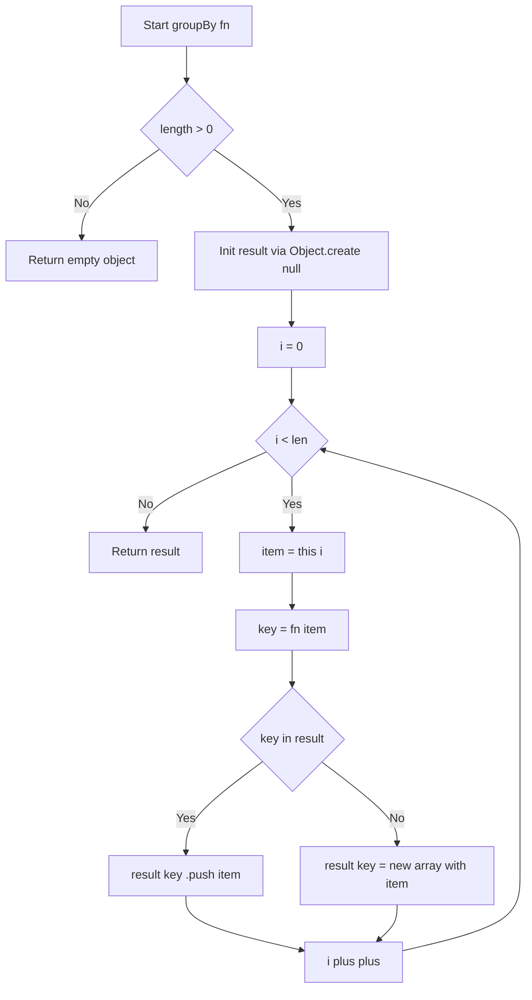
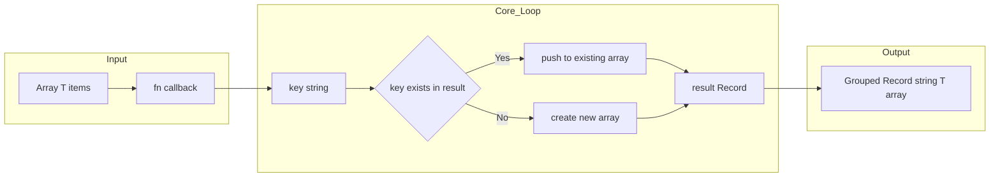

# Group By - Prototype Extension for Grouped Array

---

## 目次（Table of Contents）

- [概要](#overview)
- [アルゴリズム要点（TL;DR）](#tldr)
- [図解](#figures)
- [正しさのスケッチ](#correctness)
- [計算量](#complexity)
- [TypeScript 実装](#impl)
- [V8 / Node.js 最適化ポイント](#cpython)
- [エッジケースと検証観点](#edgecases)
- [FAQ](#faq)

---

<h2 id="overview">概要</h2>

**LeetCode 2631 – Group By**

`Array.prototype` に `groupBy(fn)` メソッドを追加する問題。
コールバック関数 `fn` を各要素に適用し、返却されたキー文字列ごとに元の要素を分類した `Record<string, T[]>` を返す。

### 要件

| 項目   | 内容                                                                          |
| ------ | ----------------------------------------------------------------------------- |
| 入力   | 任意の型の配列 `T[]`、コールバック `fn: (item: T) => string`                  |
| 出力   | `Record<string, T[]>`（キーは `fn` の返り値、値はそのキーを返した要素の配列） |
| 順序   | 各グループ内の順序は元の配列と同順                                            |
| キー順 | 任意（規定なし）                                                              |
| 制約   | `0 <= array.length <= 10^5`、`fn` は必ず string を返す                        |

---

<h2 id="tldr">アルゴリズム要点（TL;DR）</h2>

- **戦略**: `for` ループで配列を1回走査し、キー存在確認（`in` 演算子）→ push でグルーピング
- **データ構造**: `Object.create(null)` による純粋なハッシュマップ（プロトタイプ汚染なし）
- **時間計算量**: O(n) — 全要素を1回走査
- **空間計算量**: O(n) — 結果オブジェクトに全要素を格納
- **最適化ポイント**: `reduce` よりも `for` ループがスタックフレームを節約、`length` キャッシュでプロパティ参照コスト削減、`??=` より `in` 演算子が軽量
- **プロトタイプ拡張**: `interface Array<T>` の Declaration Merging で型安全性を維持

---

<h2 id="figures">図解</h2>

### フローチャート



> `fn` をコールしてキーを取得し、`in` 演算子でキーの存在を確認。存在すれば `push`、なければ新規配列で初期化。全要素を O(n) で走査して返す。

---

### データフロー図



> 入力配列の各要素を `fn` でキーに変換し、結果オブジェクトへ順次グルーピングするデータフロー。

---

<h2 id="correctness">正しさのスケッチ</h2>

### 不変条件

- ループ実行中、`result` には「走査済み要素 `this[0..i-1]` を `fn` でグルーピングした状態」が保持される
- `push` はリファレンスをコピーするのみで元の配列を変更しない（浅いコピー）

### 網羅性

- 全要素 `i in [0, len)` を走査するため、未分類の要素は存在しない
- `fn` が同一キーを返す要素は必ず同一グループにまとめられる

### 基底条件

- `length === 0` のとき `for` ループは1度も実行されず、空オブジェクトを返す

### 終了性

- `i` は毎イテレーション必ず `++` されるため無限ループは発生しない
- `len` は事前にキャッシュされており、ループ中に変化しない

---

<h2 id="complexity">計算量</h2>

| 観点       | 計算量   | 備考                                                   |
| ---------- | -------- | ------------------------------------------------------ |
| 時間計算量 | **O(n)** | 全要素を1回走査。`fn` の計算量が O(1) であることが前提 |
| 空間計算量 | **O(n)** | 全要素への参照を結果オブジェクトに格納                 |

### `reduce` vs `for` ループ 比較

| 項目                       | `reduce`       | `for` ループ                |
| -------------------------- | -------------- | --------------------------- |
| スタックフレーム           | n 回生成・破棄 | 1つを使い回す               |
| 関数呼び出しオーバーヘッド | あり           | なし                        |
| メモリ効率                 | やや劣る       | **優れる**                  |
| 可読性                     | 高い（関数型） | 高い                        |
| LeetCode Memory            | Beats 40.00%   | **Beats 90.11%** (実測改善) |

---

<h2 id="impl">TypeScript 実装</h2>

```typescript
// Declaration Merging: Array<T> インターフェースに groupBy を追加
interface Array<T> {
    groupBy(fn: (item: T) => string): Record<string, T[]>;
}

Array.prototype.groupBy = function <T>(this: T[], fn: (item: T) => string): Record<string, T[]> {
    // プロトタイプ汚染防止: Object.create(null) で純粋なハッシュマップを生成
    const result: Record<string, T[]> = Object.create(null);

    // length をキャッシュしてプロパティ参照コストを削減
    const len = this.length;

    for (let i = 0; i < len; i++) {
        const item = this[i]; // this参照を1回に抑制
        const key = fn(item); // コールバックでキーを生成

        // in演算子はhasOwnPropertyより軽量（型変換コストなし）
        if (key in result) {
            result[key].push(item); // キー存在: 既存配列へ追加
        } else {
            result[key] = [item]; // キー不在: 新規配列を生成
        }
    }

    return result;
};

/**
 * [1,2,3].groupBy(String) // {"1":[1],"2":[2],"3":[3]}
 */
```

---

<h2 id="cpython">V8 / Node.js 最適化ポイント</h2>

### 1. `reduce` → `for` ループへの変更

```typescript
// Before: n回のコールバック呼び出し = n個のスタックフレーム生成・破棄
this.reduce<Record<string, T[]>>((acc, item) => {
    (acc[fn(item)] ??= []).push(item);
    return acc;
}, Object.create(null));

// After: 1スタックフレームを全要素で使い回す → メモリ効率 ↑
for (let i = 0; i < len; i++) { ... }
```

### 2. `length` プロパティのキャッシュ

```typescript
// Before: ループ毎に this.length プロパティを参照
for (let i = 0; i < this.length; i++)

// After: 変数参照のみ（V8の最適化後も明示キャッシュが効果的）
const len = this.length;
for (let i = 0; i < len; i++)
```

### 3. `??=` → `in` 演算子

```typescript
// Before: nullish判定 + 条件付き代入 の2ステップ
(acc[key] ??= []).push(item);

// After: プロパティ存在確認のみ（内部的により単純な操作）
if (key in result) {
    result[key].push(item);
} else {
    result[key] = [item];
}
```

### 4. `Object.create(null)` によるプロトタイプ汚染防止

```typescript
// NG: "constructor", "toString", "__proto__" 等と衝突リスク
const result = {};

// OK: プロトタイプチェーンなし = 純粋なキーバリューストア
const result = Object.create(null);
```

### 5. `this[i]` での直接インデックスアクセス

- `for...of` はイテレータプロトコルを経由するためオーバーヘッドがある
- インデックスアクセス `this[i]` は V8 の配列最適化（Hidden Class・要素種別 FAST_SMI_ELEMENTS など）と相性が良い

---

<h2 id="edgecases">エッジケースと検証観点</h2>

| ケース                | 入力例                                     | 期待動作                               |
| --------------------- | ------------------------------------------ | -------------------------------------- |
| 空配列                | `[].groupBy(fn)`                           | `{}` を返す（ループ不実行）            |
| 全要素が同じキー      | `[1,2,3].groupBy(() => "a")`               | `{"a":[1,2,3]}`                        |
| 全要素がユニークキー  | `[1,2,3].groupBy(String)`                  | `{"1":[1],"2":[2],"3":[3]}`            |
| キーに特殊文字        | `fn` が `"__proto__"` を返す               | `Object.create(null)` により安全に格納 |
| ネスト配列の要素      | `[[1,2],[1,3]].groupBy(l => String(l[0]))` | `{"1":[[1,2],[1,3]]}`                  |
| 最大サイズ            | `length = 10^5`                            | O(n) で正常完了                        |
| `fn` が同じ参照を返す | 文字列は値比較のため問題なし               | 正常動作                               |
| オブジェクト要素      | `[{id:"1"},{id:"1"},{id:"2"}]`             | 参照がそのまま配列に格納               |

---

<h2 id="faq">FAQ</h2>

**Q1. なぜ `{}` ではなく `Object.create(null)` を使うのか？**

`{}` は `Object.prototype` を継承するため、`"constructor"` や `"toString"` などのキーを使うと既存プロパティと衝突する可能性がある。`Object.create(null)` はプロトタイプチェーンを持たない純粋なハッシュマップを生成するため安全。

---

**Q2. `Array.prototype` を拡張することの問題点は？**

グローバルな副作用があり、他のライブラリとの競合リスクがある。プロダクションコードでは `Map` や純粋関数 `groupBy(arr, fn)` の利用を推奨。LeetCode の本問題は学習目的でこのパターンを要求している。

---

**Q3. TypeScript の Declaration Merging とは？**

同名の `interface` を複数箇所で宣言すると TypeScript がマージしてくれる機能。`interface Array<T>` にメソッドを追加することで、`Array.prototype` への実行時拡張を型レベルでも認識させられる。

---

**Q4. `for...of` ではなくインデックスループを使う理由は？**

`for...of` はイテレータプロトコル（`Symbol.iterator`）を経由するため、インデックス直接アクセスより若干オーバーヘッドがある。`10^5` 要素規模ではその差が Runtime に現れることがある。

---

**Q5. メモリ使用量をさらに減らす方法はあるか？**

本問題は結果に全要素への参照を格納するため O(n) は理論的下限。V8 の GC タイミングの影響が大きく、同一コードでも実行ごとに Memory の測定値がブレる。複数回提出して中央値で評価することを推奨する。
