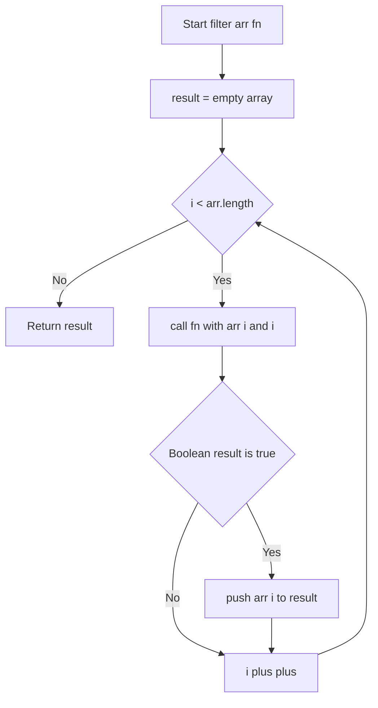
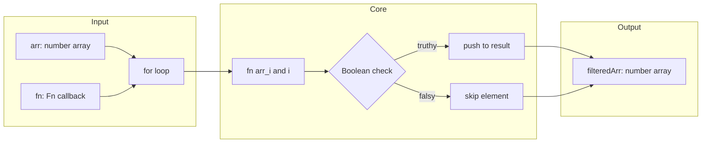

# Filter Elements from Array - Array.filter を使わないフィルタ実装

<h2 id="toc">目次（Table of Contents）</h2>

- [概要](#overview)
- [アルゴリズム要点 TL;DR](#tldr)
- [図解](#figures)
- [正しさのスケッチ](#correctness)
- [計算量](#complexity)
- [実装コード](#impl)
- [TypeScript最適化ポイント](#tsopt)
- [エッジケースと検証観点](#edgecases)
- [FAQ](#faq)

---

<h2 id="overview">概要</h2>

**プラットフォーム / ID**: LeetCode 2634
**問題タイトル**: Filter Elements from Array

### 問題要約

整数配列 `arr` とコールバック関数 `fn` を受け取り、`fn(arr[i], i)` が **truthy** を返す要素のみを含む新しい配列を返す。
ただし **組み込みの `Array.prototype.filter` の使用は禁止**。

### 要件

| 項目 | 内容                                                      |
| ---- | --------------------------------------------------------- |
| 入力 | `number[]` 型配列 `arr`、コールバック `fn: (n, i) => any` |
| 出力 | フィルタ後の `number[]`                                   |
| 制約 | `0 ≤ arr.length ≤ 1000`、`-10^9 ≤ arr[i] ≤ 10^9`          |
| 禁止 | `Array.prototype.filter`                                  |

---

<h2 id="tldr">アルゴリズム要点（TL;DR）</h2>

- **戦略**: インデックス付き `for` ループによる線形走査
- **データ構造**: 結果格納用 `number[]` を動的に `push`
- **コールバック評価**: `fn(arr[i], i)` の戻り値を `Boolean()` で明示的に truthiness 評価
- **時間計算量**: O(n) — 各要素を1回だけ評価
- **空間計算量**: O(k) — k はフィルタ後の要素数（入力配列を破壊しない）
- **型安全性**: `Fn` 型でコールバック引数を保証、`Boolean()` で `any` を安全に評価

---

<h2 id="figures">図解</h2>

### フローチャート



> 配列の各要素を先頭から順に評価し、`fn` が truthy を返した要素のみ `result` に追加する線形走査の流れ。

---

### データフロー図



> `arr` と `fn` の両入力がループ内で結合され、truthiness に応じて選択的に出力配列へ格納される。

---

<h2 id="correctness">正しさのスケッチ</h2>

### 不変条件

- ループ開始時点で `result` には `arr[0..i-1]` のうち `fn` が truthy を返した要素のみが格納されている

### 網羅性

- `Boolean(fn(arr[i], i))` は `any` 型に対して一貫した truthiness 評価を行う
- `0`, `""`, `null`, `undefined`, `NaN`, `false` → falsy として除外
- それ以外の全ての値 → truthy として採用

### 基底条件

- `arr.length === 0` → ループは即時終了、空配列 `[]` を返す

### 終了性

- `i` は毎イテレーションで単調増加し、有限の `arr.length` に到達するため必ず終了する

---

<h2 id="complexity">計算量</h2>

| 観点           | 計算量 | 説明                                |
| -------------- | ------ | ----------------------------------- |
| **時間計算量** | O(n)   | 全要素を1回ずつ評価                 |
| **空間計算量** | O(k)   | k = フィルタ後の要素数（最悪 O(n)） |
| 補助空間       | O(1)   | ループ変数 `i` のみ                 |

### in-place vs Pure 比較

| 方式               | 空間 | 元配列の保持 | TypeScript推奨度 |
| ------------------ | ---- | ------------ | ---------------- |
| **Pure（新配列）** | O(k) | ✅ 保持      | ⭐⭐⭐ 推奨      |
| in-place（splice） | O(1) | ❌ 破壊      | ❌ 非推奨        |

> 副作用ゼロの Pure 実装を採用。元配列を破壊しないため、呼び出し元が安全に参照を保持できる。

---

<h2 id="impl">実装コード</h2>

```typescript
// LeetCode 2634 - Filter Elements from Array
// TypeScript strict mode 対応実装

type Fn = (n: number, i: number) => any;

/**
 * コールバック関数で配列をフィルタリングする（Array.filter の手動実装）
 *
 * @param arr  - フィルタ対象の整数配列
 * @param fn   - フィルタ条件コールバック (要素値, インデックス) => truthy | falsy
 * @returns    - fn が truthy を返した要素のみを含む新しい配列
 *
 * @complexity Time: O(n), Space: O(k) ※ k = フィルタ後の要素数
 *
 * @example
 * filter([0, 10, 20, 30], (n) => n > 10);  // => [20, 30]
 * filter([1, 2, 3], (n, i) => i === 0);    // => [1]
 * filter([-2,-1,0,1,2], (n) => n + 1);    // => [-2, 0, 1, 2]
 */
function filter(arr: number[], fn: Fn): number[] {
    // 結果格納用の新しい配列（元の arr を破壊しない Pure 実装）
    const result: number[] = [];

    // 線形走査: インデックスを fn に渡すため for ループを使用
    for (let i = 0; i < arr.length; i++) {
        // Boolean() で any 型の戻り値を安全に truthiness 評価
        if (Boolean(fn(arr[i], i))) {
            result.push(arr[i]);
        }
    }

    // フィルタ後の配列を返却（arr は不変）
    return result;
}
```

---

<h2 id="tsopt">TypeScript 最適化ポイント</h2>

### 型安全性の活用

| 観点                 | 本実装での対応                                                   |
| -------------------- | ---------------------------------------------------------------- |
| **Fn 型定義**        | コールバックの引数 `(n: number, i: number)` をコンパイル時に保証 |
| **戻り値 `any`**     | `Boolean()` で実行時に安全な truthiness 評価を実施               |
| **result 型注釈**    | `number[]` を明示し、誤った型の push を防止                      |
| **イミュータブル性** | 元の `arr` を変更せず、新配列を返却（副作用ゼロ）                |

### コンパイル時最適化

```typescript
// ✅ 型推論が効く例
const result: number[] = []; // 推論により後続の push も型チェック対象

// ✅ Fn 型により引数の誤用をコンパイル時に検出
type Fn = (n: number, i: number) => any;
// fn("string", 0) → Type 'string' is not assignable to type 'number'

// ✅ Boolean() による明示的評価で暗黙の型変換を回避
Boolean(fn(arr[i], i)); // any → boolean への安全な変換
```

### なぜ `if (fn(...))` ではなく `if (Boolean(...))` なのか

```
fn の戻り値型は any → TypeScript の型チェックが無効化される領域

Boolean() を挟むことで:
  1. 意図的な truthiness 評価であることが明示的に表現される
  2. コードレビュー時に「any を意識して処理している」と読み取れる
  3. 将来的に fn の型が変わっても評価ロジックが安定する
```

---

<h2 id="edgecases">エッジケースと検証観点</h2>

| ケース           | 入力例                           | 期待出力     | 理由                    |
| ---------------- | -------------------------------- | ------------ | ----------------------- |
| 空配列           | `arr = []`                       | `[]`         | ループが0回で即終了     |
| 全要素 truthy    | `[1,2,3]`, `fn = () => true`     | `[1,2,3]`    | 全て push される        |
| 全要素 falsy     | `[0,0,0]`, `fn = n => n`         | `[]`         | `Boolean(0) = false`    |
| `0` は falsy     | `[-2,-1,0,1,2]`, `fn = n => n+1` | `[-2,0,1,2]` | `fn(-1)=0` が除外される |
| インデックス参照 | `[1,2,3]`, `fn = (_,i) => i===0` | `[1]`        | `fn` が `i` を利用      |
| 負の数           | `[-1,-2]`, `fn = n => n > -2`    | `[-1]`       | 負数も正常評価          |
| 大きな数         | `[10**9]`, `fn = n => n > 0`     | `[10**9]`    | 制約上限値も正常動作    |
| fn が数値返却    | `fn = n => n`                    | `0` のみ除外 | `Boolean(0) = false`    |

---

<h2 id="faq">FAQ</h2>

**Q1. なぜ `for...of` ではなく `for` ループを使うのか？**
`fn` は `(n, i)` の2引数を受け取るため、インデックス `i` が直接必要。`for...of` では `.entries()` が必要になりコードが冗長になる。`for` ループが最もシンプルかつ高速。

**Q2. `arr.forEach` は使えるか？**
`Array.prototype.filter` のみが禁止されており、`forEach` は使用可能。ただし `forEach` はコールバック内で `return` しても外側の関数から抜けられないため、`for` ループの方が明快。

**Q3. `reduce` で実装するとどうなるか？**

```typescript
// reduce による代替実装（参考）
function filter(arr: number[], fn: Fn): number[] {
    return arr.reduce((acc: number[], val, i) => {
        if (Boolean(fn(val, i))) acc.push(val);
        return acc;
    }, []);
}
// 計算量は同じ O(n) だが、for ループより読みやすさがやや劣る
```

**Q4. `Boolean()` を省略して `if (fn(...))` とするのはなぜ避けるのか？**
`fn` の戻り値は `any` 型。`Boolean()` を明示することで「意図的に truthy/falsy 評価をしている」という設計意図がコードに表れ、可読性と保守性が向上する。

**Q5. 制約 `arr.length ≤ 1000` において計算量の差は問題になるか？**
ならない。O(n) と O(n²) ですら n=1000 では最大 10^6 操作となり実用上十分高速。本問では O(n) が自然な最適解。

---

_LeetCode 2634 | TypeScript strict mode | Node.js v22.14.0 | ESM 形式 | 外部ライブラリ不使用_
