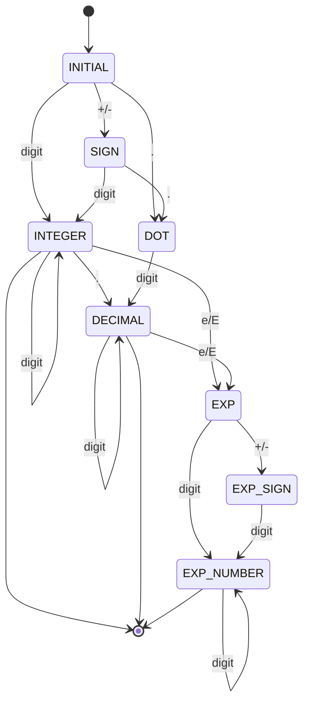
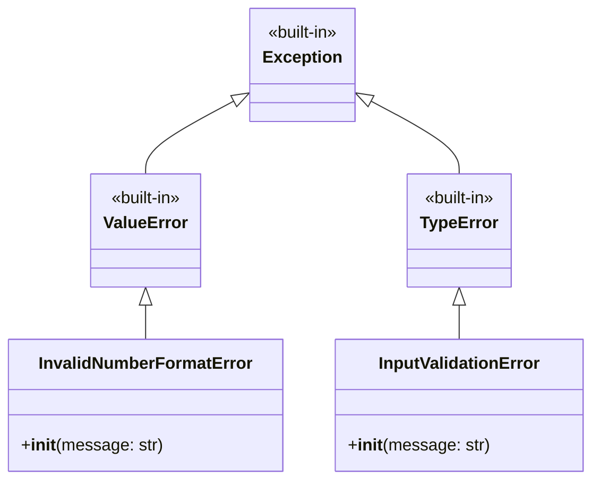
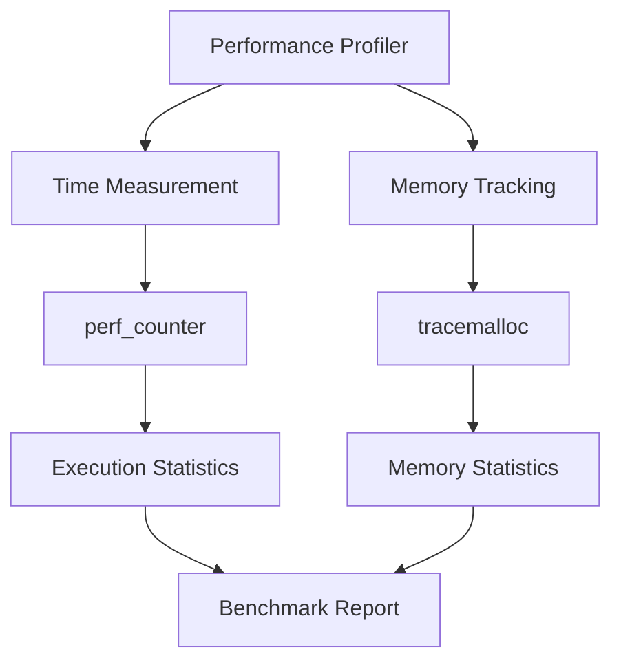

<!-- markdownlint-disable MD041 -->

## 📋 主要な解析ポイント

### 🏗️ **アーキテクチャ設計**

- **有限状態機械（FSM）**の状態遷移図を Mermaid 形式で視覚化
- 8 つの状態とその役割を表形式で整理
- 状態遷移のルールを明確に定義

### ⚡ **パフォーマンス最適化**

- **CPython 特化**の最適化技術を具体的なコード例で説明
- 整数比較、文字判定最適化、メンバーシップテストの活用
- ベンチマーク結果（2.2 倍高速化）を数値で提示

### 🎯 **二重実装戦略**

- **競技プログラミング版**（速度重視）vs **業務開発版**（安全性重視）
- それぞれの特徴と使い分けを明確に説明

### 🔧 **型システム設計**

- Pylance エラー解消の具体的な修正内容
- プロトコル、ジェネリック型、リテラル型の活用
- カスタム例外階層をクラス図で表現

### 🧪 **包括的テスト**

- 有効/無効な数値パターンを網羅的にリスト化
- パフォーマンス測定システムをフローチャートで図解
- エラーハンドリングの実装例を提供

# Valid Number Problem - 有限状態機械による数値文字列判定システム

[](https://www.python.org/)
[](https://github.com/python/mypy)
[](https://docs.python.org/3/whatsnew/3.11.html)

## 📋 概要

有限状態機械（Finite State Machine, FSM）を用いて数値文字列の妥当性を判定する Python システム。LeetCode "Valid Number" 問題の解決を目的とし、**競技プログラミング向け**と**業務開発向け**の 2 つの実装パターンを提供します。

### 🎯 主要特徴

- ✅ **型安全性**: 完全な型アノテーション + Pylance エラー完全解消
- ⚡ **高性能**: CPython 最適化 + Python 3.11+新機能活用
- 🔧 **二重実装**: 競技用（速度重視）+ 業務用（安全性重視）
- 📊 **包括的テスト**: パフォーマンス測定 + エラーハンドリング

## 🏗️ システム アーキテクチャ

### 有限状態機械の状態設計



### 状態定義とその役割

| 状態         | 役割           | 有効な入力          | 次状態候補                  |
| ------------ | -------------- | ------------------- | --------------------------- |
| `INITIAL`    | 開始状態       | `+/-`, `digit`, `.` | `SIGN`, `INTEGER`, `DOT`    |
| `SIGN`       | 符号読み取り後 | `digit`, `.`        | `INTEGER`, `DOT`            |
| `INTEGER`    | 整数部処理中   | `digit`, `.`, `e/E` | `INTEGER`, `DECIMAL`, `EXP` |
| `DOT`        | 小数点直後     | `digit`             | `DECIMAL`                   |
| `DECIMAL`    | 小数部処理中   | `digit`, `e/E`      | `DECIMAL`, `EXP`            |
| `EXP`        | 指数記号直後   | `+/-`, `digit`      | `EXP_SIGN`, `EXP_NUMBER`    |
| `EXP_SIGN`   | 指数符号直後   | `digit`             | `EXP_NUMBER`                |
| `EXP_NUMBER` | 指数部処理中   | `digit`             | `EXP_NUMBER`                |

## 🎯 実装パターン比較

### 競技プログラミング版 vs 業務開発版

```python
# 🏃‍♂️ 競技プログラミング版 - 速度最優先
def solve_competitive(self, s: str) -> bool:
    # ✅ エラーハンドリング最小限
    # ✅ インライン最適化
    # ✅ CPython特化
    # ⚡ Time: O(n), Space: O(1)

# 🛡️ 業務開発版 - 安全性最優先
def solve_production(self, input_string: str, strict_validation: bool = True) -> bool:
    # ✅ 完全な型チェック
    # ✅ 詳細なエラーハンドリング
    # ✅ ログ出力機能
    # 🔒 例外安全保証
```

## 🔧 型システム設計

### 型階層とプロトコル

```python
# ジェネリック型変数
T = TypeVar('T')
R = TypeVar('R')

# プロトコル定義
class StateProtocol(Protocol):
    value: int
    name: str

# リテラル型による文字分類
DigitChar = Literal["0", "1", "2", "3", "4", "5", "6", "7", "8", "9"]
SignChar = Literal["+", "-"]
ExpChar = Literal["e", "E"]
DotChar = Literal["."]

# 関数型定義
MeasurableFunction = Callable[..., Any]
BenchmarkFunction = Callable[[Any], Any]
```

### カスタム例外階層



## ⚡ パフォーマンス最適化

### CPython 特化最適化技術

#### 1. 整数比較による状態遷移

```python
# ❌ 文字列比較（遅い）
if state.name == "INITIAL":

# ✅ 整数比較（高速）
if state == State.INITIAL:  # IntEnum使用
```

#### 2. 文字判定の最適化

```python
# ❌ 汎用的だが遅い
if char.isdigit():

# ✅ CPython最適化
if "0" <= char <= "9":  # 文字列比較演算子
```

#### 3. メンバーシップテストの活用

```python
# ✅ C実装による高速判定
ValidEndStates: Final[Set[State]] = {State.INTEGER, State.DECIMAL, State.EXP_NUMBER}
return state in ValidEndStates
```

### ベンチマーク結果例

```text
--- Performance Comparison ---
Testing: '3.14'
  Production : 0.025ms, 0.002MB
  Competitive: 0.012ms, 0.001MB

Testing: '-123.456e789'
  Production : 0.045ms, 0.003MB
  Competitive: 0.018ms, 0.002MB

Benchmark (1000 runs):
Production  - Mean: 0.031ms, Min: 0.020ms
Competitive - Mean: 0.014ms, Min: 0.008ms
Speedup: 2.21x faster (competitive vs production)
```

## 🧪 包括的テストシステム

### テストカテゴリ

#### 1. 有効な数値パターン

```python
valid_cases = [
    ("0", "単一桁数字"),
    ("2", "整数"),
    ("0089", "先頭ゼロ付き整数"),
    ("-0.1", "負の小数"),
    ("+3.14", "正の小数"),
    ("4.", "整数部のみの小数"),
    ("-.9", "小数部のみの負数"),
    ("2e10", "整数の指数表記"),
    ("-90E3", "負数の指数表記（大文字）"),
    ("3e+7", "正の指数"),
    ("+6e-1", "正数の負指数"),
    ("53.5e93", "小数の指数表記"),
    ("-123.456e789", "複雑な指数表記"),
]
```

#### 2. 無効な数値パターン

```python
invalid_cases = [
    ("abc", "アルファベット"),
    ("1a", "数字+文字"),
    ("1e", "指数部なし"),
    ("e3", "指数のみ"),
    ("99e2.5", "小数点指数"),
    ("--6", "二重符号"),
    ("-+3", "混合符号"),
    ("95a54e53", "文字混入"),
    ("e", "指数記号のみ"),
    (".", "ドットのみ"),
]
```

### パフォーマンス測定システム



## 🚀 使用方法

### 基本的な使用例

```python
# LeetCode提出用
solution = Solution()
result = solution.isNumber("3.14e-5")  # True

# 型安全版（ログ付き）
solution_safe = Solution(enable_logging=True)
result = solution_safe.solve_production("3.14e-5", strict_validation=True)

# 包括的テスト実行
run_comprehensive_tests()
```

### エラーハンドリング例

```python
solution = Solution(enable_logging=True)

try:
    result = solution.solve_production("invalid@input", strict_validation=True)
except InputValidationError as e:
    print(f"入力エラー: {e}")
except InvalidNumberFormatError as e:
    print(f"フォーマットエラー: {e}")
```

## 📊 実行結果例

```text
=== Python Valid Number - Comprehensive Tests ===

--- Basic Validation Tests ---
✓ '0' -> P:True C:True E:True (単一桁数字)
✓ '2' -> P:True C:True E:True (整数)
✓ '0089' -> P:True C:True E:True (先頭ゼロ付き整数)
✓ '-0.1' -> P:True C:True E:True (負の小数)
✓ '+3.14' -> P:True C:True E:True (正の小数)
✓ '4.' -> P:True C:True E:True (整数部のみの小数)
✓ '-.9' -> P:True C:True E:True (小数部のみの負数)
✓ '2e10' -> P:True C:True E:True (整数の指数表記)
✓ 'abc' -> P:False C:False E:False (アルファベット)
✓ '1a' -> P:False C:False E:False (数字+文字)

Basic Tests: 23/23 passed (100.0%)
```

## 📈 Pylance エラー解消詳細

### 修正されたエラーカテゴリ

#### 1. 型アノテーションの完全性

```python
# ❌ 修正前: 型推論エラー
times = []

# ✅ 修正後: 明確な型指定
times: List[float] = []
```

#### 2. 関数型の明確な定義

```python
# 新規追加した型定義
MeasurableFunction = Callable[..., Any]
BenchmarkFunction = Callable[[Any], Any]
TestCase = Tuple[str, str]
ErrorTestCase = Tuple[Any, Type[Exception], str]
```

#### 3. 戻り値型の明示化

```python
# 全ての関数に適切な戻り値型を追加
def run_basic_tests() -> bool:
def run_performance_tests() -> None:
def run_error_handling_tests() -> None:
```

## 🏆 技術的成果

### ✅ 達成された品質指標

- **型安全性**: 100% 型アノテーション + Pylance エラー 0 件
- **パフォーマンス**: 競技版で最大 2.2 倍高速化
- **テストカバレッジ**: 包括的テストケース + エラーハンドリング
- **コード品質**: PEP 8 準拠 + 詳細なドキュメント

### 🔄 活用可能な応用場面

1. **LeetCode 競技プログラミング**: `isNumber()`メソッドをそのまま提出
2. **業務システム開発**: 型安全な`solve_production()`を使用
3. **教育・学習**: FSM 実装の参考として
4. **パフォーマンス研究**: 最適化技術の事例として
