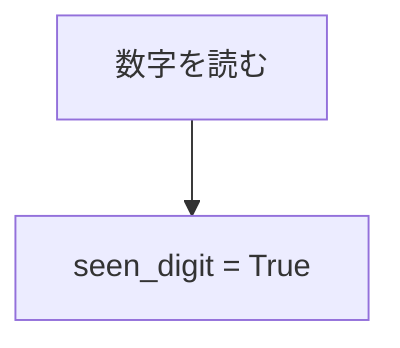
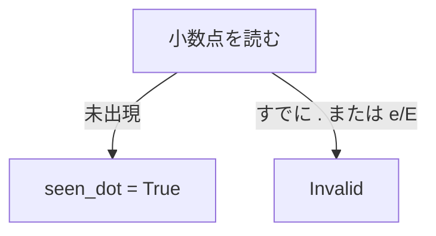
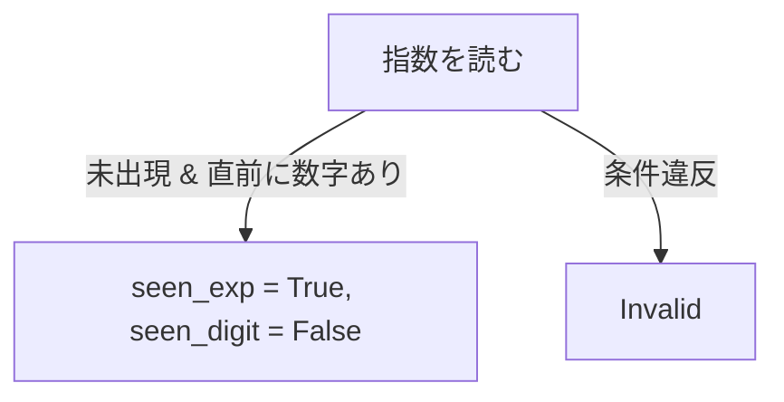
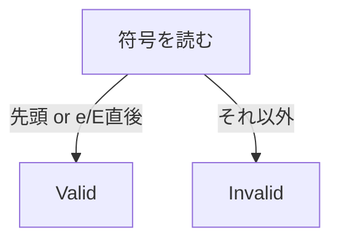
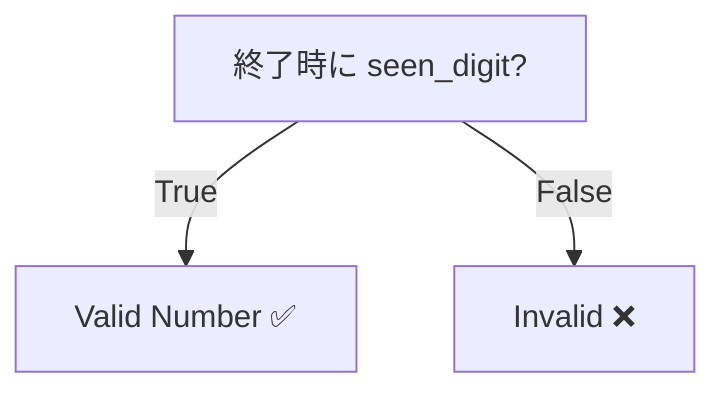

<!-- markdownlint-disable MD041 -->
先ほどの **有効な数字判定アルゴリズム (`isNumber`)** を題材にして、GitHub の `README.md` 用に **図解付きで解析・説明** をマークダウン形式でまとめました。
（図はすべて [Mermaid](https://mermaid.js.org/) を使っているので、そのまま README.md に埋め込めます）

---

````markdown
# 有効な数字判定アルゴリズム解析

このリポジトリでは、文字列が **有効な数値かどうか** を判定するアルゴリズムを実装しています。  
対象となる文字列は以下を含みます:

- 整数 (`"123"`)
- 符号付き整数 (`"+42"`, `"-7"`)
- 小数 (`"3.14"`, `".5"`, `"2."`)
- 指数表記 (`"1e9"`, `"6.022e23"`, `"-1.2E-4"`)

無効な例は以下です:

- `"e"` （指数の基数がない）
- `"."` （数字が存在しない）
- `"1e"` （指数が途中で終わっている）

---

## アルゴリズム概要

文字列を **1文字ずつ走査** しながら以下を管理します:

- `seen_digit`: 数字を見たかどうか  
- `seen_dot`: 小数点を見たかどうか  
- `seen_exp`: 指数 (`e` または `E`) を見たかどうか  

### 状態遷移図

```mermaid
stateDiagram-v2
    [*] --> Start

    Start --> Sign: '+' or '-'
    Start --> Digit: '0-9'
    Start --> Dot: '.'

    Digit --> Digit: '0-9'
    Digit --> Dot: '.'
    Digit --> Exp: 'e' or 'E'

    Dot --> Digit: '0-9'
    Dot --> Exp: 'e' or 'E'

    Exp --> Sign: '+' or '-'
    Exp --> ExpDigit: '0-9'

    ExpDigit --> ExpDigit: '0-9'

    Sign --> Digit: '0-9'
    Sign --> Dot: '.'
````

---

## 各処理の流れ

### 1. 初期化

```python
seen_digit = False
seen_dot = False
seen_exp = False
```

* 数字や記号を見ていない状態からスタートします。

---

### 2. 文字の分類と処理

#### (1) 数字 (`0-9`)

* `seen_digit = True` に設定
* **指数の後の数字**も含めて必須



---

#### (2) 小数点 (`.`)

* すでに小数点や指数が出ていたら **無効**
* そうでなければ `seen_dot = True`



---

#### (3) 指数 (`e` / `E`)

* すでに指数が出ていたら **無効**
* 直前に数字がなければ **無効**
* 以降は新しい数字を必ず要求するため `seen_digit = False`



---

#### (4) 符号 (`+` / `-`)

* 文字列の先頭 or 指数直後のみ有効
* それ以外は **無効**



---

### 3. 最終判定

最後に **`seen_digit == True`** なら有効な数値。



---

## 例題の解析

### 入力: `"e"`

1. 最初の文字 `e` を読む

   * `数字がないのに指数を読んだため Invalid`

✅ 出力: `False`

---

### 入力: `"3.14"`

1. `3` → 数字を読んだ → `seen_digit = True`
2. `.` → 小数点を読んだ → `seen_dot = True`
3. `1` → 数字を読んだ → `seen_digit = True`
4. `4` → 数字を読んだ

✅ 出力: `True`

---

### 入力: `"1e"`

1. `1` → 数字を読んだ → `seen_digit = True`
2. `e` → 指数を読んだ → `seen_exp = True`, `seen_digit = False`
3. 文字列終了 → `seen_digit == False`

✅ 出力: `False`

---

## 計算量解析

* **時間計算量**: `O(n)` （文字列を1回走査）
* **空間計算量**: `O(1)` （定数個のフラグのみ）

---
