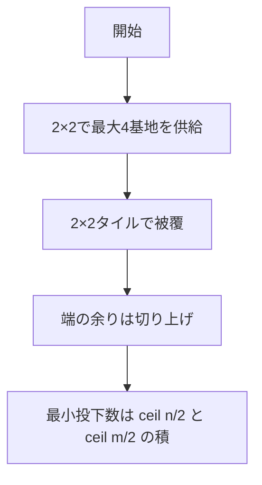
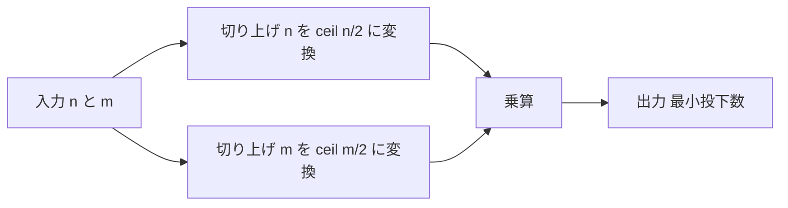

# Game with Cells（Army Game） - 最小投下数は「2×2 タイル枚数」

**対応言語**: Python (CPython 3.13.3)／**プラットフォーム**: HackerRank “Game with Cells”
**関数シグネチャ**: `gameWithCells(n: int, m: int) -> int`

---

## 目次

- [概要](#overview)
- [アルゴリズム要点 (TL;DR)](#tldr)
- [図解](#figures)
- [証明のスケッチ](#proof)
- [計算量](#complexity)
- [Python 実装](#impl)
- [CPython 最適化ポイント](#cpython)
- [エッジケースと検証](#edgecases)
- [FAQ](#faq)

---

<h2 id="overview">概要</h2>

- グリッドは $n$ 行 $m$ 列、各マスが基地。
- 1 回の投下は交点や辺上も含め、**最大で $2\times 2$ の 4 マス**を同時に供給可能。
- すべての基地を供給するための**最小投下数**を求める。
- 結論は **$\lceil n/2\rceil\cdot \lceil m/2\rceil$**。整数演算では **$((n+1)//2)\cdot((m+1)//2)$**。

### **入出力仕様（簡潔）**

- 入力: $n, m$（正の整数）
- 出力: 最小投下数（整数）

### **想定データ構造**

- 追加のデータ構造は不要（定数時間の算術のみ）

### **代表例**

| 入力 $n,m$ | 数式                                                | 出力 |
| ---------: | --------------------------------------------------- | ---: |
|     $2, 2$ | $\lceil 2/2\rceil\cdot \lceil 2/2\rceil = 1\cdot 1$ |  $1$ |
|     $2, 3$ | $\lceil 2/2\rceil\cdot \lceil 3/2\rceil = 1\cdot 2$ |  $2$ |
|     $3, 3$ | $\lceil 3/2\rceil\cdot \lceil 3/2\rceil = 2\cdot 2$ |  $4$ |
|     $1, 5$ | $\lceil 1/2\rceil\cdot \lceil 5/2\rceil = 1\cdot 3$ |  $3$ |

---

<h2 id="tldr">アルゴリズム要点 (TL;DR)</h2>

- 各投下は最大 $2\times 2$ をカバー ⇒ グリッドを $2\times 2$ タイルで最小枚数タイル張り
- **答え**: $,\lceil n/2\rceil\cdot \lceil m/2\rceil$
- **整数のみで計算**: $,((n+1)//2)\cdot((m+1)//2)$
- **計算量**: 時間 $O(1)$、空間 $O(1)$

---

<h2 id="figures">図解</h2>

### **フローチャート（発想の流れ）**



_説明_: 2×2 カバーの抽象化から、切り上げを使った被覆枚数に導く流れ。

### **データフロー（計算手順）**



_説明_: 切り上げを 2 回適用して積を取るだけの処理。

---

<h2 id="proof">証明のスケッチ</h2>

- **上界**（実現可能性）
  $2\times 2$ の交点に投下すれば、そのブロック内の 4 マスが供給される。
  端で $1$ 行や $1$ 列余っても、追加の投下でカバー可能。
  よって $,\lceil n/2\rceil\cdot \lceil m/2\rceil,$ 回で必ず被覆できる。

- **下界**（必要性）
  1 回で供給できるのは最大で $4$ マス（$2\times 2$）である。
  基地総数は $nm$ 個なので、少なくとも $,\lceil nm/4\rceil,$ 回は必要。
  さらに、行方向と列方向の端の余りを考えると、
  $,\lceil nm/4\rceil \le \lceil n/2\rceil\cdot \lceil m/2\rceil,$ が成り立ち、
  タイル張り構成がこの下界を達成する。

- **結論**
  最小投下数は $,\boxed{\lceil n/2\rceil\cdot \lceil m/2\rceil}$。

---

<h2 id="complexity">計算量</h2>

- **時間計算量**: $O(1)$
- **空間計算量**: $O(1)$

---

<h2 id="impl">Python 実装</h2>

> HackerRank の採点器は I/O を別ハーネスで行うため、**関数のみ**を実装します。
> 実装は副作用なしの Pure 関数です。

```python
from __future__ import annotations
from typing import Final

def gameWithCells(n: int, m: int) -> int:
    """
    最小投下数を返す関数（HackerRank 準拠）

    数学的根拠:
      - 1 投下で最大 2×2 = 4 マスを供給できる
      - よって 2×2 タイルでグリッドを被覆した最小枚数が答え
      - 端の余りは切り上げで 1 枚追加: ceil(n/2)・ceil(m/2)
      - 整数演算のみで: ((n+1)//2) * ((m+1)//2)

    対応式:
      # ceil(n/2) × ceil(m/2)
      # = ((n+1)//2) × ((m+1)//2)

    Args:
        n: 行数 (>= 1)
        m: 列数 (>= 1)

    Returns:
        int: 最小投下数
    """
    # (1) n 側の切り上げ: ceil(n/2) = (n+1)//2
    half_rows: Final[int] = (n + 1) // 2
    # (2) m 側の切り上げ: ceil(m/2) = (m+1)//2
    half_cols: Final[int] = (m + 1) // 2
    # (3) 乗算: 最小投下数
    return half_rows * half_cols
```

---

<h2 id="cpython">CPython 最適化ポイント</h2>

- **整数演算のみ**で完結（`math.ceil` 不要）

  - `ceil(x/2)` の代替として `(x+1)//2` を使用
  - 依存削減・高速・分岐なし

- **定数時間**・**定数メモリ**でブランチミス最小化
- ループ・配列確保・関数呼び出しのオーバーヘッド皆無

---

<h2 id="edgecases">エッジケースと検証</h2>

- **最小値**

  - $n=1, m=1 \Rightarrow \lceil 1/2\rceil\cdot \lceil 1/2\rceil = 1$

- **片側が 1**

  - $n=1, m=5 \Rightarrow 1\cdot 3 = 3$

- **奇偶混在**

  - $n=2, m=3 \Rightarrow 1\cdot 2 = 2$
  - $n=3, m=4 \Rightarrow 2\cdot 2 = 4$

- **両方奇数**

  - $n=3, m=3 \Rightarrow 2\cdot 2 = 4$

- **大規模**

  - $n, m$ が非常に大きくても任意精度整数で安全、時間 $O(1)$

---

<h2 id="faq">FAQ</h2>

- **Q. なぜ $,\lceil nm/4\rceil,$ ではなく $,\lceil n/2\rceil\cdot \lceil m/2\rceil,$ なのか**

  **A.** 下界として $,\lceil nm/4\rceil,$ は妥当だが、端の余り（片側だけ 1 行余る等）で実現不能なケースがある。
  一方、$,\lceil n/2\rceil\cdot \lceil m/2\rceil,$ は常に構成可能で、下界を満たすため**ちょうど最小**となる。

- **Q. 実装で `math.ceil` を使わない理由**

  **A.** `(x+1)//2` の方が import 不要で速く、I/O ハーネス上でも安定。可読性も十分。

- **Q. 2×2 以外のブロックで考えるとどうなるか**

  **A.** 問題の供給モデル上、1 投下の最大効果が $2\times 2$ である。
  これより大きいブロックは 1 投下ではカバーできないため意味がない。
