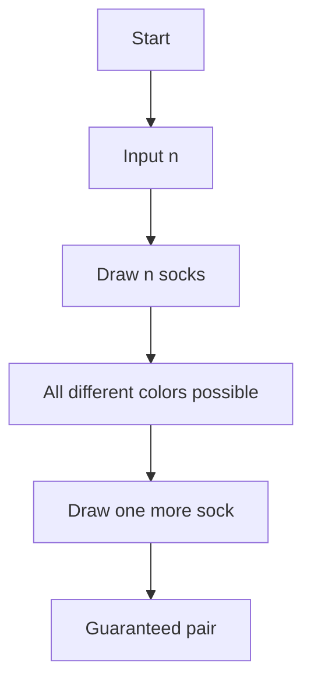

# Maximum Draws - 必ずペアが揃うために必要な靴下の本数

## 目次

- [概要](#overview)
- [アルゴリズム要点 (TL;DR)](#tldr)
- [図解](#figures)
- [証明のスケッチ](#proof)
- [計算量](#complexity)
- [Python 実装](#impl)
- [CPython 最適化ポイント](#cpython)
- [エッジケースと検証](#edgecases)
- [FAQ](#faq)

---

<h2 id="overview">概要</h2>

**問題要約**
n 色の靴下が引き出しに入っている。最悪の場合でも必ず 1 ペアの同色靴下を得るには、何本引き出す必要があるかを求めよ。

- 入力:
    - t: テストケース数
    - 各テストケースで n（靴下の色数）

- 出力:
    - 各 n に対して「最小の本数」

---

<h2 id="tldr">アルゴリズム要点 (TL;DR)</h2>

- **鳩の巣原理 (Pigeonhole Principle)**
    - 各色から 1 本ずつ → n 本までは全て異なる色を引ける可能性あり
    - n+1 本目を引くと、必ずいずれかが 2 本目となりペア成立
- **結論**: 答え = `n + 1`
- **計算量**: Time O(1), Space O(1)

---

<h2 id="figures">図解</h2>



**説明**: n 本までなら異色で揃う最悪ケースが存在。n+1 本目で必ずペアができる。

---

<h2 id="proof">証明のスケッチ</h2>

1. **基底ケース**: n=1
    - 1 色しかないので 2 本引けば必ずペア。答え = 2 = 1+1。

2. **一般ケース**: n≥2
    - 仮に最悪シナリオとして n 色すべて 1 本ずつ取った場合、まだペアが存在しない。
    - n+1 本目で必ず既存の色と一致し、ペア成立。

3. **帰納法**
    - n 本で保証できないが、n+1 本なら保証できることを帰納的に示せる。

---

<h2 id="complexity">計算量</h2>

- **時間計算量**: O(1)
- **空間計算量**: O(1)

---

<h2 id="impl">Python 実装</h2>

```python
from __future__ import annotations
from typing import Final

#
# HackerRank Maximum Draws
# CPython 3.13.3
#

def maximumDraws(n: int) -> int:
    """
    n色の靴下があるとき、必ずペアを得るために必要な最小の本数を返す。
    数学的根拠: 鳩の巣原理
    証明: n本までは異なる色を取れる可能性がある。n+1本目で必ずペア成立。
    """
    return n + 1
```

---

<h2 id="cpython">CPython 最適化ポイント</h2>

- 計算は整数演算 1 回のみ → 最適化不要
- I/O の方が支配的コスト
- CPython 特有の高速化テクニックは不要（`n+1` は定数時間）

---

<h2 id="edgecases">エッジケースと検証</h2>

- **n=1** → 出力 2（最小ケース）
- **n=2** → 出力 3（サンプル一致）
- **n=大規模**（例: 10^9） → 計算は O(1) で即時処理

---

<h2 id="faq">FAQ</h2>

- **Q: 靴下の枚数は無制限と仮定して良いか?**
  A: 問題設定上、各色は十分に存在すると仮定する。

- **Q: ペア成立条件は「同じ色が 2 枚」だけで良いか?**
  A: はい。形や左右は無視される。

---
