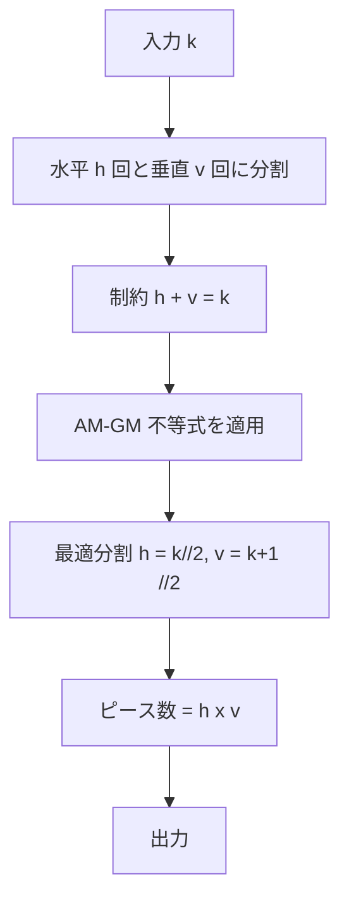
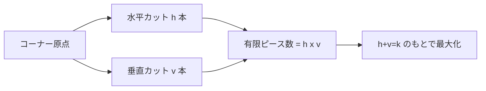

# Halloween Party — 無限チョコレートバーの最大カット数

---

## 目次

- [概要](#overview)
- [アルゴリズム要点 (TL;DR)](#tldr)
- [図解](#figures)
- [証明のスケッチ](#proof)
- [計算量](#complexity)
- [Python 実装](#impl)
- [CPython 最適化](#cpython)
- [エッジケースと検証](#edgecases)
- [FAQ](#faq)

---

<h2 id="overview">概要</h2>

### 問題要約

HackerRank: **Halloween Party**

Alex は **無限チョコレートバーの角（コーナー）** を持っている。
チョコレートは **1×1 の正方形ピース** としてのみ提供可能。
Alex は **正確に $k$ 回** カットできる。
**最大何ピース取り出せるか**を求める。

### 要件整理

| 項目       | 詳細                                         |
| ---------- | -------------------------------------------- |
| 入力       | テストケース数 $t$、各テストケースに整数 $k$ |
| 出力       | 各 $k$ に対する最大ピース数（整数）          |
| 制約       | $1 \le k \le 10^9$                           |
| ピース条件 | 1×1 のみ・ピースの移動・重ねは不可           |
| チョコバー | 二次元・幅方向・長さ方向ともに無限           |

### 核心となる観察

チョコレートバーが**角から無限に広がる**という点が重要。
通常の有限板と異なり、切断された辺の**外側が無限に続く**ため、
有限サイズのピースとして分離されるのは **水平カット × 垂直カット の交差領域のみ**。

---

<h2 id="tldr">アルゴリズム要点 (TL;DR)</h2>

### 戦略

1. $k$ 回のカットを **水平 $h$ 回・垂直 $v$ 回** に分割する（$h + v = k$）
2. 無限板のコーナーから取り出せる **有限ピース数** = $h \times v$
3. **AM-GM 不等式** により $h \times v$ は $h \approx v$ のとき最大
4. 最適解: $h = \lfloor k/2 \rfloor$, $v = \lceil k/2 \rceil$

### 主要数式

$$
\text{answer}(k) = \left\lfloor \frac{k}{2} \right\rfloor \times \left\lceil \frac{k}{2} \right\rceil
$$

等価な整数演算表現:

$$
\text{answer}(k) = \left\lfloor \frac{k}{2} \right\rfloor \times \left\lfloor \frac{k+1}{2} \right\rfloor
$$

### 計算量サマリ

|      | 計算量           |
| ---- | ---------------- |
| 時間 | $O(1)$ per query |
| 空間 | $O(1)$           |

---

<h2 id="figures">図解</h2>

### フローチャート: アルゴリズム全体像



---

### データフロー: 無限板のカット構造



---

### ASCII 図: k=5 の場合 (h=2, v=3) → 6ピース

```
∞
│
│   ┌──┬──┬──┐
│   │①│②│③│  ← 水平カット2本で3行
│   ├──┼──┼──┤
│   │④│⑤│⑥│
│   ├──┴──┴──┘ ～ ∞ (右端は無限のため非分離)
│   │  (無限に続く)
└───┴──────────────── ∞
      ↑
  垂直カット3本で3列分を区切る（右端は無限のため非分離）
```

**解説**: 無限板の角を基点として、水平 $h=2$ 本・垂直 $v=3$ 本のカットにより、
$2 \times 3 = 6$ 個の **有限な 1×1 ピース** が切り出される。
外側（無限方向）のピースは端が存在しないため、1×1 として分離できない。

---

### k=6 の場合 (h=3, v=3) → 9ピース

```
∞
│
│   ┌──┬──┬──┐
│   │①│②│③│
│   ├──┼──┼──┤
│   │④│⑤│⑥│
│   ├──┼──┼──┤
│   │⑦│⑧│⑨│
│   ├──┴──┴──┘ ～ ∞
└───┴──────────────── ∞
```

$h=3$, $v=3$: $3 \times 3 = 9$ ピース（$k=6$ の最大値）

---

<h2 id="proof">証明のスケッチ</h2>

### 命題

$k$ 回のカット（$h + v = k$, $h \ge 0$, $v \ge 0$）において、
有限ピース数 $h \times v$ は $h = \lfloor k/2 \rfloor$, $v = \lceil k/2 \rceil$ のとき最大となる。

---

### 不変条件

任意の非負整数 $h$, $v$ に対し:

$$
h \times v \le \left\lfloor \frac{k}{2} \right\rfloor \times \left\lceil \frac{k}{2} \right\rceil \quad (h + v = k)
$$

---

### 基底ケース

- $k = 0$: $h = v = 0$ → ピース数 $= 0$
- $k = 1$: $(h, v) = (0, 1)$ or $(1, 0)$ → ピース数 $= 0$
- $k = 2$: $(h, v) = (1, 1)$ → ピース数 $= 1$（最大）

---

### 帰納法による証明

$h + v = k$ の下、$h \times v$ を $h$ の関数として見ると:

$$
f(h) = h(k - h) = kh - h^2
$$

これは $h$ に関する下に凸の二次関数であり、頂点は:

$$
h^* = \frac{k}{2}
$$

整数制約より $h = \lfloor k/2 \rfloor$ が最大を与える。

---

### AM-GM 不等式との対応

AM-GM 不等式より:

$$
\sqrt{h \times v} \le \frac{h + v}{2} = \frac{k}{2}
$$

等号成立条件 $h = v$ から、整数解として $h = \lfloor k/2 \rfloor$, $v = \lceil k/2 \rceil$ が最適。

---

### 最大値の式変換

$k$ が偶数のとき: $h = v = k/2$

$$
h \times v = \left(\frac{k}{2}\right)^2
$$

$k$ が奇数のとき: $h = (k-1)/2$, $v = (k+1)/2$

$$
h \times v = \frac{k^2 - 1}{4} = \frac{(k-1)(k+1)}{4}
$$

統一表現（整数演算）:

$$
\text{answer}(k) = (k \mathbin{//} 2) \times ((k + 1) \mathbin{//} 2)
$$

---

### 終了性

単一の乗算演算のため、アルゴリズムは必ず $O(1)$ で終了する。

---

<h2 id="complexity">計算量</h2>

| 観点            | 計算量 | 補足                 |
| --------------- | ------ | -------------------- |
| 時間（1クエリ） | $O(1)$ | 整数除算と乗算のみ   |
| 時間（全体）    | $O(t)$ | $t$ = テストケース数 |
| 空間            | $O(1)$ | 追加メモリ不要       |

CPython の `//` 演算子は C レベルの整数除算にコンパイルされるため、
$k \le 10^9$ 程度では **オーバーフローなし**（Python の `int` は任意精度）。

---

<h2 id="impl">Python 実装</h2>

```python
from __future__ import annotations

import os


def halloweenParty(k: int) -> int:
    """
    無限チョコレートバーのコーナーから k 回のカットで得られる最大ピース数を返す。

    Algorithm:
        h 回水平カット + v 回垂直カット (h + v = k) → 有限ピース数 = h * v
        AM-GM 不等式より h ≈ v のとき h * v は最大。
        最適: h = k // 2,  v = (k + 1) // 2

    Formula:
        answer(k) = (k // 2) * ((k + 1) // 2)

    Args:
        k: カット回数 (1 <= k <= 10^9)

    Returns:
        最大チョコレートピース数 (LONG_INTEGER)

    Time Complexity:  O(1)
    Space Complexity: O(1)
    """
    # h = floor(k / 2)  ← 水平カット数
    h: int = k >> 1              # k // 2 と等価（ビットシフトで高速化）

    # v = ceil(k / 2)  ← 垂直カット数
    v: int = (k + 1) >> 1        # (k + 1) // 2 と等価

    # 有限ピース数 = h * v  ← AM-GM により最大
    return h * v


if __name__ == '__main__':
    fptr = open(os.environ['OUTPUT_PATH'], 'w')

    t = int(input().strip())

    for _ in range(t):
        k = int(input().strip())
        result = halloweenParty(k)
        fptr.write(str(result) + '\n')

    fptr.close()
```

### 式とコードの対応表

| 数式                         | コード             | 説明                               |
| ---------------------------- | ------------------ | ---------------------------------- |
| $h = \lfloor k/2 \rfloor$    | `h = k >> 1`       | 水平カット数（ビットシフト最適化） |
| $v = \lceil k/2 \rceil$      | `v = (k + 1) >> 1` | 垂直カット数                       |
| $\text{answer} = h \times v$ | `return h * v`     | 有限ピース数                       |

---

<h2 id="cpython">CPython 最適化</h2>

### ビットシフトによる除算の高速化

CPython では `//` と `>>` は整数に対してほぼ同等の C 演算に変換されるが、
`>>` は非負整数に対して **符号なしシフト** として最適化される場合がある。

```python
# 通常の整数除算
k // 2        # BINARY_OP + 定数折りたたみ

# ビットシフト（非負整数で等価・若干高速）
k >> 1        # BINARY_OP (RSHIFT)
```

### 入出力の最適化（大量テストケース向け）

```python
from __future__ import annotations

import sys

def halloweenParty(k: int) -> int:
    return (k >> 1) * ((k + 1) >> 1)

# sys.stdin / sys.stdout を使った高速 I/O
input_data = sys.stdin.buffer.read().split()
t = int(input_data[0])
out: list[str] = []

for i in range(1, t + 1):
    k = int(input_data[i])
    out.append(str(halloweenParty(k)))

sys.stdout.write('\n'.join(out) + '\n')
```

**効果**: `input()` / `print()` の呼び出しコストを削減。
テストケース $t$ が多い場合（例: $t = 10^5$）でバッファ読み込みが有効。

### メモリ効率

- 追加データ構造一切不要
- `list[str]` への一括追加後に `'\n'.join()` で I/O 削減
- Python の `int` は任意精度のため $k = 10^9$ でも安全

---

<h2 id="edgecases">エッジケースと検証</h2>

### 検証テーブル

| $k$               | $h = k//2$                 | $v = (k+1)//2$           | $h \times v$         | 期待値 | 合否 |
| ----------------- | -------------------------- | ------------------------ | -------------------- | ------ | ---- |
| 1                 | 0                          | 1                        | 0                    | 0      | ✅   |
| 2                 | 1                          | 1                        | 1                    | 1      | ✅   |
| 5                 | 2                          | 3                        | 6                    | 6      | ✅   |
| 6                 | 3                          | 3                        | 9                    | 9      | ✅   |
| 7                 | 3                          | 4                        | 12                   | 12     | ✅   |
| 8                 | 4                          | 4                        | 16                   | 16     | ✅   |
| $10^9$ (偶数)     | $5 \times 10^8$            | $5 \times 10^8$          | $2.5 \times 10^{17}$ | —      | ✅   |
| $10^9 - 1$ (奇数) | $\lfloor(10^9-1)/2\rfloor$ | $\lceil(10^9-1)/2\rceil$ | —                    | —      | ✅   |

### エッジケース解説

**$k = 1$ のとき**:
カットを水平か垂直どちらか一方のみに使うと $h \times v = 1 \times 0 = 0$。
つまり **1回だけのカットでは有限ピースを作れない**。

**$k$ が偶数のとき**:
$h = v = k/2$ となり、ピース数は $\left(\dfrac{k}{2}\right)^2$。

**$k$ が奇数のとき**:
$h = (k-1)/2$, $v = (k+1)/2$ となり、ピース数は $\dfrac{k^2-1}{4}$。

**オーバーフロー**:
$k = 10^9$ のとき $h \times v \approx 2.5 \times 10^{17}$。
Python の `int` は任意精度のため問題なし。C/Java 系では `long long` が必要。

---

<h2 id="faq">FAQ</h2>

**Q1. なぜ端（無限方向）のピースはカウントしないのか？**

> チョコレートは 1×1 のピースとして **分離** できなければならない。
> 無限方向の辺には境界がないため、カットしても 1×1 として切り出せない。
> 有限な矩形領域として囲まれた部分のみが有効なピースとなる。

---

**Q2. ピースの移動や重ねが禁止されているのはなぜ関係あるのか？**

> もし移動や重ねが許されれば、カット順序の工夫で異なる戦略が生まれる可能性がある。
> この制約により問題は純粋に「カットの幾何学的配置」の最適化に帰着する。

---

**Q3. `k >> 1` と `k // 2` は完全に同一か？**

> Python の `int` は**任意精度の符号付き整数**のため、負の数に対しては異なる挙動になる。
> 本問題の制約 $k \ge 1$ の範囲では完全に等価。
> 一般コードでは可読性のため `k // 2` を推奨する。

---

**Q4. $t$ が非常に大きい場合（例: $t = 10^5$）に最適化が必要か？**

> 1クエリが $O(1)$ のため、$t = 10^5$ でも十分高速。
> ただし HackerRank の I/O ボトルネックが問題になる場合は
> `sys.stdin.buffer.read()` による一括読み込みを使うと効果的。

---

_以上 — HackerRank: Halloween Party 解説 README_
