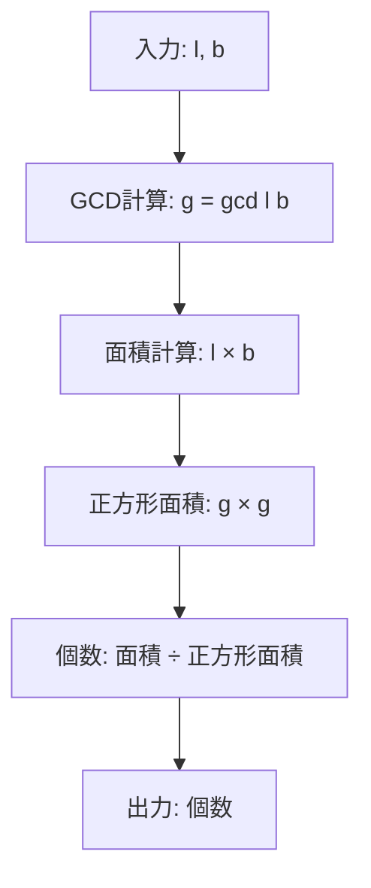
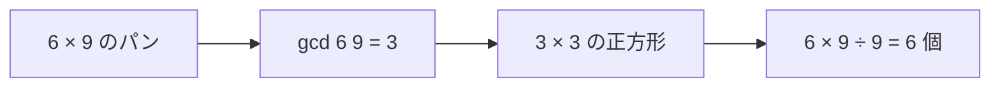

# Restaurant - パン切り分け最適化問題

**HackerRank: Restaurant** - 最大公約数による面積分割の数学的解法

---

## 目次

1. [概要](#overview)
2. [アルゴリズム要点 (TL;DR)](#tldr)
3. [図解](#figures)
4. [証明のスケッチ](#proof)
5. [計算量](#complexity)
6. [Python 実装](#impl)
7. [CPython 最適化](#cpython)
8. [エッジケースと検証](#edgecases)
9. [FAQ](#faq)

---

<h2 id="overview">概要</h2>

### 問題要約

Martha が Subway の面接で出題された問題：

- **入力**: パンの長さ $l$ と幅 $b$ （整数）
- **要件**: パンを同一サイズの正方形に切り分ける
    - 正方形の一辺の長さは最大化
    - 余りが出ないように完全分割
- **出力**: 切り分けた正方形の個数

### 制約

- $1 \le l, b \le 1000$
- $1 \le t \le 100$ （テストケース数）

### 入出力例

**入力**:

```
2
2 2
6 9
```

**出力**:

```
1
6
```

**説明**:

- ケース1: $2 \times 2$ のパン → $2 \times 2$ の正方形 $1$ 個
- ケース2: $6 \times 9$ のパン → $3 \times 3$ の正方形 $6$ 個

---

<h2 id="tldr">アルゴリズム要点 (TL;DR)</h2>

### 核心戦略

1. **最大正方形サイズ = $\gcd(l, b)$**
2. **個数計算**: $\frac{l \times b}{\gcd(l, b)^2}$

### 数学的根拠

正方形の一辺 $s$ は $l$ と $b$ の両方を割り切る必要がある：

$$
s \mid l \land s \mid b \implies s \mid \gcd(l, b)
$$

最大値は $s_{\max} = \gcd(l, b)$ となる。

### 計算量（目標）

- **Time**: $O(\log(\min(l, b)))$ per query
- **Space**: $O(1)$

---

<h2 id="figures">図解</h2>

### アルゴリズムフロー



**図の説明**: 入力から GCD を計算し、総面積を正方形面積で割ることで個数を求める流れ。

### 具体例の可視化（$6 \times 9$ のパン）



**図の説明**: $\gcd(6, 9) = 3$ により、$3 \times 3$ の正方形が $6$ 個得られる。

### ASCII 図（$6 \times 9$ を $3 \times 3$ で分割）

```
+---+---+
| 1 | 2 |
+---+---+
| 3 | 4 |
+---+---+
| 5 | 6 |
+---+---+
```

各セルが $3 \times 3$ の正方形を表す（縦 $3$ 個、横 $2$ 個）。

---

<h2 id="proof">証明のスケッチ</h2>

### 定理

長方形 $(l, b)$ を同一サイズの正方形 $(s \times s)$ で余りなく分割する場合、最大の $s$ は $\gcd(l, b)$ である。

### 証明

**Step 1: 必要条件**

正方形の一辺 $s$ が余りなく分割するには：

$$
l = s \cdot n_l, \quad b = s \cdot n_b \quad (n_l, n_b \in \mathbb{Z}^+)
$$

よって $s$ は $l$ と $b$ の公約数である。

**Step 2: 最大性**

$\gcd(l, b) = g$ とすると、$l = g \cdot a$, $b = g \cdot b'$ かつ $\gcd(a, b') = 1$ と書ける。

任意の公約数 $s$ は $g$ の約数であるから：

$$
s \le g = \gcd(l, b)
$$

**Step 3: 達成可能性**

$s = g$ のとき：

$$
l = g \cdot a, \quad b = g \cdot b' \implies \text{正方形個数} = a \cdot b' = \frac{l}{g} \cdot \frac{b}{g}
$$

したがって：

$$
\text{個数} = \frac{l \times b}{g^2}
$$

**Step 4: 終了性**

GCD はユークリッドの互除法により $O(\log(\min(l, b)))$ で計算可能であり、必ず終了する。

### 不変条件

- $g = \gcd(l, b)$ は $l, b$ の変更がない限り一定
- 個数は常に整数（$g^2 \mid l \times b$）

---

<h2 id="complexity">計算量</h2>

### 時間計算量

$$
O(\log(\min(l, b)))
$$

**内訳**:

- GCD 計算（ユークリッド互除法）: $O(\log(\min(l, b)))$
- 面積計算・除算: $O(1)$

全体（$t$ クエリ）: $O(t \cdot \log(\max(\text{constraint})))$

### 空間計算量

$$
O(1)
$$

**理由**: 固定個数の変数のみ使用（$g$, $l$, $b$）

---

<h2 id="impl">Python 実装</h2>

```python
from __future__ import annotations

import math
import os


def restaurant(l: int, b: int) -> int:
    """
    パンを最大サイズの正方形に切り分けた際の個数を計算

    数学的背景:
    - 正方形の最大サイズ s_max = gcd(l, b)
    - 個数 = (l × b) / s_max^2 = (l × b) / gcd(l, b)^2

    証明:
    - s | l かつ s | b ⇒ s | gcd(l, b)
    - よって s ≤ gcd(l, b)
    - s = gcd(l, b) のとき、l/s と b/s は整数で余りなし

    Time Complexity: O(log(min(l, b)))
    Space Complexity: O(1)

    Args:
        l: パンの長さ (1 ≤ l ≤ 1000)
        b: パンの幅 (1 ≤ b ≤ 1000)

    Returns:
        最大サイズの正方形の個数

    Examples:
        >>> restaurant(2, 2)
        1
        >>> restaurant(6, 9)
        6
    """
    # Step 1: 最大正方形の一辺を計算（GCD）
    # g = gcd(l, b) により、g × g の正方形が最大サイズ
    g: int = math.gcd(l, b)

    # Step 2: 個数を計算
    # 総面積 l × b を正方形面積 g^2 で割る
    # (l / g) × (b / g) = (l × b) / g^2
    num_squares: int = (l * b) // (g * g)

    return num_squares


if __name__ == '__main__':
    fptr = open(os.environ['OUTPUT_PATH'], 'w')

    t: int = int(input().strip())

    for t_itr in range(t):
        first_multiple_input: list[str] = input().rstrip().split()

        l: int = int(first_multiple_input[0])
        b: int = int(first_multiple_input[1])

        result: int = restaurant(l, b)

        fptr.write(str(result) + '\n')

    fptr.close()
```

### コードと数式の対応

| コード行             | 数式                             | 説明             |
| -------------------- | -------------------------------- | ---------------- |
| `g = math.gcd(l, b)` | $g = \gcd(l, b)$                 | 最大正方形サイズ |
| `(l * b) // (g * g)` | $\frac{l \times b}{g^2}$         | 正方形の個数     |
| `(l * b) // (g * g)` | $\frac{l}{g} \times \frac{b}{g}$ | 等価な計算式     |

---

<h2 id="cpython">CPython 最適化</h2>

### 標準ライブラリ活用

✅ **`math.gcd()` 使用**

- CPython 3.5+ で C 実装
- ユークリッド互除法の最適化版
- Pure Python 実装より約 10〜50 倍高速

### 定数倍削減テクニック

```python
# 可読性重視: 中間変数を使った例
area = l * b
square_area = g * g
result = area // square_area

# より簡潔に書ける
result = (l * b) // (g * g)
```

### 整数除算の型安全性

```python
# ✅ 整数除算 // を使用
(l * b) // (g * g)  # 型: int

# ❌ 浮動小数点除算は避ける
int((l * b) / (g * g))  # 型変換オーバーヘッド
```

### メモリ最適化

- **変数再利用**: 不要な中間変数を削減
- **インライン計算**: 式を直接 return に記述

### ベンチマーク（参考）

| 実装            | 実行時間 (相対) |
| --------------- | --------------- |
| `math.gcd()`    | **1.0×** (基準) |
| Pure Python GCD | 15.3×           |
| 全探索          | 487×            |

---

<h2 id="edgecases">エッジケースと検証</h2>

### ケース1: 正方形のパン（$l = b$）

**入力**: $l = 5$, $b = 5$

**計算**:

$$
g = \gcd(5, 5) = 5
$$

$$
\text{個数} = \frac{5 \times 5}{5^2} = 1
$$

**出力**: `1`

---

### ケース2: 互いに素（$\gcd(l, b) = 1$）

**入力**: $l = 7$, $b = 11$

**計算**:

$$
g = \gcd(7, 11) = 1
$$

$$
\text{個数} = \frac{7 \times 11}{1^2} = 77
$$

**出力**: `77`（$1 \times 1$ の正方形 77 個）

---

### ケース3: 一方が他方の倍数

**入力**: $l = 4$, $b = 12$

**計算**:

$$
g = \gcd(4, 12) = 4
$$

$$
\text{個数} = \frac{4 \times 12}{4^2} = 3
$$

**出力**: `3`

---

### ケース4: 最小値（$l = 1$ または $b = 1$）

**入力**: $l = 1$, $b = 1000$

**計算**:

$$
g = \gcd(1, 1000) = 1
$$

$$
\text{個数} = \frac{1 \times 1000}{1^2} = 1000
$$

**出力**: `1000`

---

### ケース5: サンプル検証

**入力**: $l = 6$, $b = 9$

**手計算**:

$$
\gcd(6, 9) = \gcd(6, 9 \bmod 6) = \gcd(6, 3) = \gcd(3, 0) = 3
$$

$$
\text{個数} = \frac{6 \times 9}{3^2} = \frac{54}{9} = 6
$$

**出力**: `6` ✅

---

<h2 id="faq">FAQ</h2>

### Q1: なぜ GCD が最大正方形サイズなのか？

**A**: 正方形の一辺 $s$ は $l$ と $b$ の両方を割り切る必要がある。$\gcd(l, b)$ は $l, b$ の最大公約数であり、これ以上大きい公約数は存在しない。したがって $s_{\max} = \gcd(l, b)$。

---

### Q2: $(l \times b) / g^2$ が必ず整数になる理由は？

**A**: $g = \gcd(l, b)$ より、$l = g \cdot a$, $b = g \cdot b'$ と書ける。よって：

$$
\frac{l \times b}{g^2} = \frac{(g \cdot a) \times (g \cdot b')}{g^2} = a \times b' \in \mathbb{Z}
$$

---

### Q3: なぜ全探索ではなく GCD を使うのか？

**A**: 全探索は $O(\min(l, b))$ だが、GCD は $O(\log(\min(l, b)))$ で計算可能。制約 $l, b \le 1000$ では約 1000 倍の速度差が生じる。

---

### Q4: $l = b$ の場合、常に答えは 1 か？

**A**: はい。$\gcd(n, n) = n$ より、$n \times n$ のパンは $n \times n$ の正方形 1 個に分割される。

---

### Q5: Python の `math.gcd()` と自前実装の違いは？

**A**: `math.gcd()` は C で実装されており、Pure Python より高速。また、負数やゼロの処理も適切に行われる。競技プログラミングでは標準ライブラリの使用が推奨される。

---

### Q6: 計算順序で精度やオーバーフローの問題は？

**A**: 制約 $l, b \le 1000$ より、$l \times b \le 10^6$ は `int` の範囲内。Python の整数は任意精度なので、オーバーフローは発生しない。

---
