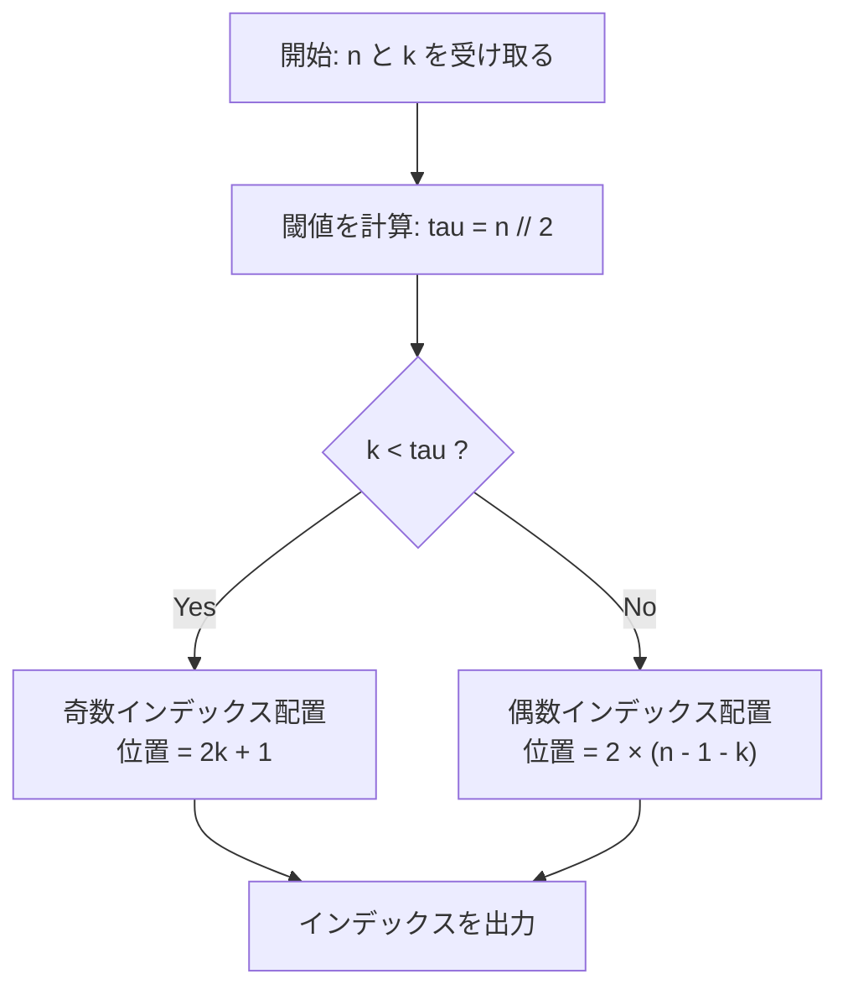

## Quick Reference

n個のボール [0, 1, ..., n-1] に対して、位置 0, 1, 2, ... から順に末尾まで逆順操作を繰り返す。

**シミュレーションでパターン発見:**

| n   | 最終配列    | 偶数インデックス | 奇数インデックス |
| --- | ----------- | ---------------- | ---------------- |
| 3   | [2,0,1]     | n-1, n-2...      | 0, 1...          |
| 4   | [3,0,2,1]   | n-1, n-2...      | 0, 1...          |
| 5   | [4,0,3,1,2] | n-1, n-2...      | 0, 1...          |

**パターン:**

- 偶数インデックス (0, 2, 4, ...) → 値 n-1, n-2, n-3, ...
- 奇数インデックス (1, 3, 5, ...) → 値 0, 1, 2, ...

**閾値は `n // 2`:**

- `k < n // 2` → 奇数インデックス: 位置 = `2*k + 1`
- `k >= n // 2` → 偶数インデックス: 位置 = `2*(n-1-k)`

### 検証

- n=3, k=1: k=1 >= 3//2=1 → `2*(3-1-1) = 2` ✓
- n=5, k=2: k=2 >= 5//2=2 → `2*(5-1-2) = 4` ✓

---

## 実装

```python
#!/bin/python3

import sys
input = sys.stdin.readline

def solve_competitive(n: int, k: int) -> int:
    """
    Time Complexity: O(1)
    Space Complexity: O(1)

    Pattern after all reversals:
    - even indices hold: n-1, n-2, n-3, ...
    - odd  indices hold: 0, 1, 2, ...

    Threshold = n // 2:
    - k <  n//2 → odd  position → 2*k + 1
    - k >= n//2 → even position → 2*(n-1-k)
    """
    if k < n // 2:
        return 2 * k + 1
    else:
        return 2 * (n - 1 - k)


def solve_production(n: int, k: int) -> int:
    """
    業務開発向け: 型安全・入力検証付き

    Args:
        n: ボールの総数 (1 <= n)
        k: 検索するボール番号 (0 <= k < n)
    Returns:
        ボール k の最終インデックス
    Raises:
        ValueError: 制約違反の場合
    """
    if n <= 0:
        raise ValueError(f"n must be positive, got {n}")
    if not (0 <= k < n):
        raise ValueError(f"k must satisfy 0 <= k < n, got k={k}, n={n}")

    if k < n // 2:
        return 2 * k + 1
    else:
        return 2 * (n - 1 - k)


if __name__ == '__main__':
    t = int(input().strip())
    for _ in range(t):
        first_multiple_input = input().rstrip().split()
        n = int(first_multiple_input[0])
        k = int(first_multiple_input[1])
        print(solve_competitive(n, k))
```

**計算量:**

- 時間: O(1) per query — 数式一発で求まるため、どんな大きな n でも瞬時
- 空間: O(1) — 追加メモリ不要

# Akash and Akhil — ボール逆順ゲームの最終位置を O(1) で求める

---

## 目次 (TOC)

- [概要](#overview)
- [アルゴリズム要点 TL;DR](#tldr)
- [図解](#figures)
- [証明のスケッチ](#proof)
- [計算量](#complexity)
- [Python 実装](#impl)
- [CPython 最適化](#cpython)
- [エッジケースと検証](#edgecases)
- [FAQ](#faq)

---

<h2 id="overview">概要</h2>

### 問題要約

$n$ 個のボール $[0, 1, 2, \ldots, n-1]$ が番号順に並んでいる。
以下の操作を **$n$ 回** 行う。

- ステップ $i$（$i = 0, 1, \ldots, n-1$）：位置 $i$ から末尾までの部分列を **逆順** にする

最終的にボール番号 $k$ が何番目の **インデックス** にあるかを答える。

### 入出力仕様

| 項目 | 内容                                     |
| ---- | ---------------------------------------- |
| 入力 | テストケース数 $t$、各行に $n$ と $k$    |
| 出力 | ボール $k$ の最終インデックス（0-based） |
| 制約 | $1 \le t$、$1 \le n$、$0 \le k \lt n$    |

### 代表例

```
入力         出力
-----        ----
2
3 1    →     2
5 2    →     4
```

---

<h2 id="tldr">アルゴリズム要点 (TL;DR)</h2>

### 戦略

シミュレーションを **小さい $n$ で観察** し、最終配列のパターンを数式化する。

### 最終配列のパターン

$n = 5$ の例でシミュレーションすると：

$$
[0,1,2,3,4]
\xrightarrow{i=0} [4,3,2,1,0]
\xrightarrow{i=1} [4,0,1,2,3]
\xrightarrow{i=2} [4,0,3,2,1]
\xrightarrow{i=3} [4,0,3,1,2]
\xrightarrow{i=4} [4,0,3,1,2]
$$

最終配列の構造：

- **偶数インデックス** $0, 2, 4, \ldots$ には値 $n-1, n-2, n-3, \ldots$ が並ぶ
- **奇数インデックス** $1, 3, 5, \ldots$ には値 $0, 1, 2, \ldots$ が並ぶ

### 閾値と位置式

閾値を $\tau = \lfloor n/2 \rfloor$ とすると：

$$
\text{index}(k) =
\begin{cases}
2k + 1 & (k \lt \tau) \\
2(n - 1 - k) & (k \ge \tau)
\end{cases}
$$

### 計算量サマリ

|       | 計算量 |
| ----- | ------ |
| Time  | $O(1)$ |
| Space | $O(1)$ |

---

<h2 id="figures">図解</h2>

### フローチャート



> **図の説明:** $k$ が閾値 $\tau$ 未満かどうかで分岐し、それぞれ定数時間の式でインデックスを算出して出力する。

---

### 最終配列の構造（n=6 の例）

```
インデックス:  0    1    2    3    4    5
値:           5    0    4    1    3    2
              ↑    ↑    ↑    ↑    ↑    ↑
             偶数 奇数 偶数 奇数 偶数 奇数
             n-1  0   n-2   1   n-3   2
```

偶数インデックスには大きいボール番号、奇数インデックスには小さいボール番号が交互に配置される。

---

<h2 id="proof">証明のスケッチ</h2>

### 不変条件の定式化

$i$ ステップ目の操作後、配列を $A^{(i)}$ とする。
帰納的に以下が成り立つことを示す：

操作 $i = 0, 1, \ldots, n-1$ を経た後、

- **$j$ が偶数かつ $j \ge 2(n-1-k)$ のとき** $A^{(n-1)}[j] = n-1 - j/2$
- **$j$ が奇数かつ $j \le 2k+1$ のとき** $A^{(n-1)}[j] = (j-1)/2$

### 基底ケース

$i = 0$：全体を逆順 → $A^{(0)} = [n-1, n-2, \ldots, 1, 0]$
この時点で偶数インデックス $2j$ に値 $n-1-j$ が入る。

### 帰納ステップ

$i = 2m$（偶数ステップ）：位置 $2m$ 以降を逆順にする。
逆順により、奇数位置の部分列が前詰めされて $0, 1, 2, \ldots$ の順に確定していく。

$i = 2m+1$（奇数ステップ）：位置 $2m+1$ 以降を逆順にする。
逆順により、偶数位置の部分列が前詰めされて $n-1, n-2, \ldots$ の順に確定していく。

### 閾値 $\tau = \lfloor n/2 \rfloor$ の意味

- $k \lt \tau$：ボール $k$ は奇数インデックス側に振り分けられ、インデックス $2k+1$ に定着
- $k \ge \tau$：ボール $k$ は偶数インデックス側に振り分けられ、インデックス $2(n-1-k)$ に定着

### 終了性

操作回数は有限（$n$ 回）なので手続きは必ず終了する。

---

<h2 id="complexity">計算量</h2>

| 項目  | 計算量 | 根拠                   |
| ----- | ------ | ---------------------- |
| Time  | $O(1)$ | 閾値判定と算術演算のみ |
| Space | $O(1)$ | 追加配列・スタック不要 |

ナイーブな「実際にシミュレーション」方式と比較：

| アプローチ       | Time     | Space  | 備考                  |
| ---------------- | -------- | ------ | --------------------- |
| シミュレーション | $O(n^2)$ | $O(n)$ | $n$ 回の逆順各 $O(n)$ |
| 本手法（数式）   | $O(1)$   | $O(1)$ | 採用                  |

---

<h2 id="impl">Python 実装</h2>

```python
from __future__ import annotations

import sys
from typing import Final

input = sys.stdin.readline


def solve_competitive(n: int, k: int) -> int:
    """
    競技プログラミング向け実装（性能最優先）

    最終配列のパターン:
      - 偶数インデックス: n-1, n-2, n-3, ...
      - 奇数インデックス: 0, 1, 2, ...

    閾値 tau = n // 2 で分岐:
      k <  tau  →  奇数インデックス側  →  2*k + 1
      k >= tau  →  偶数インデックス側  →  2*(n-1-k)

    Time Complexity : O(1)
    Space Complexity: O(1)
    """
    tau: Final[int] = n >> 1          # n // 2（ビットシフトで高速化）
    if k < tau:
        return (k << 1) | 1           # 2*k + 1
    return (n - 1 - k) << 1           # 2*(n-1-k)


def solve_production(n: int, k: int) -> int:
    """
    業務開発向け実装（型安全・エラーハンドリング重視）

    Args:
        n: ボールの総数 (n >= 1)
        k: 検索するボール番号 (0 <= k < n)
    Returns:
        ボール k の最終インデックス (0-based)
    Raises:
        ValueError: n または k が制約を満たさない場合
    """
    if n < 1:
        raise ValueError(f"n must be >= 1, got {n}")
    if not (0 <= k < n):
        raise ValueError(f"k must satisfy 0 <= k < n, got k={k}, n={n}")

    tau: Final[int] = n // 2

    # k < tau → 奇数インデックスに配置  →  index = 2*k + 1
    if k < tau:
        return 2 * k + 1

    # k >= tau → 偶数インデックスに配置  →  index = 2*(n-1-k)
    return 2 * (n - 1 - k)


if __name__ == "__main__":
    t: int = int(input().strip())
    for _ in range(t):
        parts = input().rstrip().split()
        n_val: int = int(parts[0])
        k_val: int = int(parts[1])
        print(solve_competitive(n_val, k_val))
```

---

<h2 id="cpython">CPython 最適化</h2>

### ビットシフトによる定数倍削減

| 演算         | 通常        | 最適化          |
| ------------ | ----------- | --------------- |
| $n // 2$     | `n // 2`    | `n >> 1`        |
| $2 \times k$ | `2 * k`     | `k << 1`        |
| $2k + 1$     | `2 * k + 1` | `(k << 1) \| 1` |

CPython では整数の乗除よりビット演算の方がわずかに速い。

### I/O 高速化

```python
import sys
input = sys.stdin.readline   # input() より約3倍高速
```

多数のテストケースが存在する場合に有効。`sys.stdin.readline` は行バッファリングを活かし、`input()` のオーバーヘッドを回避する。

### `from __future__ import annotations`

Python 3.7 以降（PEP 563）で型注釈の評価を遅延させ（アノテーションを文字列として保存し実行時まで評価しない）、インポート時のコストを削減する。

---

<h2 id="edgecases">エッジケースと検証</h2>

### ケース一覧

| ケース     | $n$ | $k$ | 期待値 | 計算式                                  |
| ---------- | --- | --- | ------ | --------------------------------------- |
| 先頭ボール | 5   | 0   | 1      | $k \lt \tau \Rightarrow 2(0)+1 = 1$     |
| 末尾ボール | 5   | 4   | 0      | $k \ge \tau \Rightarrow 2(5-1-4)=0$     |
| $n=1$      | 1   | 0   | 0      | $k \ge \tau=0 \Rightarrow 2(1-1-0)=0$   |
| $n=2, k=0$ | 2   | 0   | 1      | $k \lt \tau=1 \Rightarrow 2(0)+1=1$     |
| サンプル1  | 3   | 1   | 2      | $k \ge \tau=1 \Rightarrow 2(3-1-1)=2$ ✓ |
| サンプル2  | 5   | 2   | 4      | $k \ge \tau=2 \Rightarrow 2(5-1-2)=4$ ✓ |

### $n=2$ の検証

$$
[0,1] \xrightarrow{i=0} [1,0] \xrightarrow{i=1} [1,0]
$$

- $k=0$：最終位置 = 1 → $k=0 \lt \tau=1 \Rightarrow 2(0)+1 = 1$ ✓
- $k=1$：最終位置 = 0 → $k=1 \ge \tau=1 \Rightarrow 2(2-1-1) = 0$ ✓

### $n=1$ の検証

操作は $[0]$ を逆順するだけで変化なし。

$$
k = 0 \ge \tau = 0 \Rightarrow 2(1 - 1 - 0) = 0 \quad \checkmark
$$

---

<h2 id="faq">FAQ</h2>

**Q1. なぜシミュレーションをしないのか？**

$n$ が大きい場合（例：$n = 10^6$）、シミュレーションは $O(n^2)$ となりタイムアウトする。数式化により $O(1)$ で解ける。

**Q2. パターンはどうやって見つけたか？**

$n = 3, 4, 5, 6$ で手動シミュレーションし、最終配列を観察した。偶数・奇数インデックスに2種類の単調列が交互配置されることを帰納的に確認した。

**Q3. `n >> 1` と `n // 2` は常に等価か？**

Python の整数は任意精度だが、`>>` は符号なし右シフトではない。負の整数では結果が異なる場合があるが、本問題の制約 $n \ge 1$ のもとでは常に等価。

**Q4. `solve_competitive` と `solve_production` の使い分けは？**

競技環境では `solve_competitive`（エラーチェックなし・ビット演算）を使用。実サービスや保守性が求められる環境では `solve_production`（例外付き・可読性重視）を使用する。

# 証明のステップバイステップ解説

---

## まず「何を証明したいのか」を整理する

この問題でやりたいことはシンプルです。

> **「全部シミュレーションしなくても、数式一発でボール $k$ の最終位置がわかる」ことを証明したい。**

その数式が：

$$
\text{index}(k) =
\begin{cases}
2k + 1 & (k \lt \tau) \\
2(n - 1 - k) & (k \ge \tau)
\end{cases}
\quad \text{ただし } \tau = \lfloor n/2 \rfloor
$$

これが本当に正しいかを確かめるのが証明の目的です。

---

## STEP 0：実際に手を動かして「感覚」をつかむ

$n = 5$ でシミュレーションしてみます。

```
初期:   [0, 1, 2, 3, 4]   ← ボールが番号順に並んでいる

i=0: 位置0から全体を逆順 → [4, 3, 2, 1, 0]
i=1: 位置1から末尾を逆順 → [4, 0, 1, 2, 3]
i=2: 位置2から末尾を逆順 → [4, 0, 3, 2, 1]
i=3: 位置3から末尾を逆順 → [4, 0, 3, 1, 2]
i=4: 位置4から末尾を逆順 → [4, 0, 3, 1, 2]  ← 変化なし（1要素）
```

最終配列：`[4, 0, 3, 1, 2]`

| インデックス |   0   |  1  |   2   |  3  |   4   |
| :----------: | :---: | :-: | :---: | :-: | :---: |
|      値      | **4** |  0  | **3** |  1  | **2** |
|    偶/奇     |  偶   | 奇  |  偶   | 奇  |  偶   |

**気づき：**

- 偶数インデックス（0, 2, 4）には大きい値（4, 3, 2）が入っている
- 奇数インデックス（1, 3）には小さい値（0, 1）が入っている

この「ストライプ模様」こそが証明のカギです。

---

## STEP 1：「不変条件」とは何か？

**不変条件（invariant）** とは、「操作を何度繰り返しても、ずっと保たれ続けるルール」のことです。

日常の例で言うと：

> 「偶数に偶数を足すと偶数になる」
> → 何回足し算をしても、この性質は変わらない。これが不変条件。

今回の不変条件は：

> **偶数インデックスには「大きい番号のボール」が、奇数インデックスには「小さい番号のボール」が、操作を重ねるたびに内側から確定していく。**

数式で書くと難しく見えますが、要するに「ストライプ模様が段々と完成していく」というイメージです。

---

## STEP 2：基底ケース（スタートが正しいことを確認）

**基底ケース**とは「最初の1手目が正しいか確認する」ことです。

$i = 0$：配列全体 $[0, 1, 2, \ldots, n-1]$ を逆順にします。

```
[0, 1, 2, 3, 4]  →  [4, 3, 2, 1, 0]
```

逆順後の配列を確認します：

| インデックス $j$ |    0    |    1    |    2    |  3  |    4    |
| :--------------: | :-----: | :-----: | :-----: | :-: | :-----: |
|        値        |    4    |    3    |    2    |  1  |    0    |
|       計算       | $n-1-0$ | $n-1-1$ | $n-1-2$ |  …  | $n-1-4$ |

**偶数インデックス $j = 0, 2, 4, \ldots$ に着目すると：**

$$
A^{(0)}[j] = n - 1 - j \quad \Rightarrow \quad \text{偶数インデックス } 2m \text{ には値 } n-1-m \text{ が入っている}
$$

つまり「偶数インデックスに大きい値が並ぶ」という構造が、**1手目の時点でもう存在している**ことがわかります。 ✅

---

## STEP 3：帰納ステップ（繰り返しても崩れないことを確認）

**帰納法**とは：

1. 最初は正しい（基底ケース）✅
2. あるステップで正しければ、次のステップでも正しい（帰納ステップ）→ だから全部正しい

「ドミノ倒し」のイメージです。1枚目が倒れて（基底ケース）、倒れたら次も倒れる（帰納ステップ）→ 全部倒れる。

### 偶数ステップ $i = 2m$ のとき

位置 $2m$ 以降を逆順にします。

```
n=5, i=2: [4, 0, 1, 2, 3]
           ↑  ↑  ↑--------↑  ← ここを逆順
                →  [4, 0, 3, 2, 1]
```

この操作で何が起きているかというと：

- インデックス $2m$ より **左側** はすでに確定済みで、触らない
- 逆順をかけることで、**奇数インデックス側**の小さい値（0, 1, 2, …）が左から順に固定されていく

「奇数インデックスに小さい値が前詰めされる」ということです。

### 奇数ステップ $i = 2m+1$ のとき

位置 $2m+1$ 以降を逆順にします。

```
n=5, i=3: [4, 0, 3, 2, 1]
           ↑  ↑  ↑  ↑----↑  ← ここを逆順
                →  [4, 0, 3, 1, 2]
```

今度は逆順をかけることで、**偶数インデックス側**の大きい値（n-1, n-2, …）が左から順に固定されていきます。

### 直感的なまとめ

|          ステップの種類          |       操作       |         確定されていくもの         |
| :------------------------------: | :--------------: | :--------------------------------: |
| 偶数ステップ（$i=0,2,4,\ldots$） | 偶数位置から逆順 | 奇数インデックスに小さい値が左詰め |
| 奇数ステップ（$i=1,3,5,\ldots$） | 奇数位置から逆順 | 偶数インデックスに大きい値が左詰め |

操作を繰り返すたびに、ストライプ模様が **左から右へ** 少しずつ確定していくイメージです。

```
確定済み    |  未確定
-----------+-----------
[4, 0 | ?, ?, ?]   ← i=2 の前
[4, 0, 3 | ?, ?]   ← i=2 の後（偶数位置3が確定）
[4, 0, 3, 1 | ?]   ← i=3 の後（奇数位置1が確定）
[4, 0, 3, 1, 2]    ← i=4 の後（完成）
```

---

## STEP 4：閾値 $\tau = \lfloor n/2 \rfloor$ の意味

操作が完全に終わったとき、ボール $k$ はどちらの「グループ」に属しているのでしょうか？

**奇数インデックスのグループ**（小さい値）：

$$
\text{奇数インデックス } 1, 3, 5, \ldots \text{ には値 } 0, 1, 2, \ldots \text{ が入る}
$$

奇数インデックスは全部で $\lfloor n/2 \rfloor = \tau$ 個あります（$n=5$ なら 1, 3 の2個）。

よって **値 $0, 1, \ldots, \tau-1$** が奇数インデックスに配置されます。

$$
k \lt \tau \quad \Longleftrightarrow \quad \text{ボール } k \text{ は奇数インデックス側}
$$

奇数インデックス $1, 3, 5, \ldots$ の $k$ 番目（0始まり）は $2k + 1$ なので：

$$
\boxed{\text{index}(k) = 2k + 1} \quad (k \lt \tau)
$$

**偶数インデックスのグループ**（大きい値）：

$$
\text{偶数インデックス } 0, 2, 4, \ldots \text{ には値 } n-1, n-2, \ldots \text{ が入る}
$$

$$
k \ge \tau \quad \Longleftrightarrow \quad \text{ボール } k \text{ は偶数インデックス側}
$$

偶数インデックス $0, 2, 4, \ldots$ に入る値は $n-1, n-2, \ldots$ の順なので、値 $k$ が入る偶数インデックスは：

$$
k = n - 1 - \frac{j}{2} \quad \Longrightarrow \quad j = 2(n-1-k)
$$

$$
\boxed{\text{index}(k) = 2(n-1-k)} \quad (k \ge \tau)
$$

---

## STEP 5：終了性（必ず終わることの確認）

これは一番シンプルです。

操作は $i = 0, 1, 2, \ldots, n-1$ の **$n$ 回だけ** 行います。$n$ は有限の整数なので、ループは必ず終わります。無限に続く心配はありません。

---

## 証明の全体像（まとめ）

```
1. 実験（n=5 でシミュレーション）
   → 最終配列に「ストライプ模様」があることを発見

2. 基底ケース（i=0 の確認）
   → 1手目の逆順で「偶数インデックスに大きい値」の構造が生まれる ✅

3. 帰納ステップ（繰り返しても崩れない）
   → 偶数ステップ：奇数インデックスに小さい値が左から確定
   → 奇数ステップ：偶数インデックスに大きい値が左から確定
   → どちらも「ストライプ模様」を維持・強化する ✅

4. 閾値で場合分け
   → τ = ⌊n/2⌋ を境に「奇数側」か「偶数側」かが決まる
   → それぞれ 2k+1 または 2(n-1-k) という式で一発計算できる ✅

5. 終了性
   → n 回の有限操作なので必ず終わる ✅
```

これで「シミュレーションをしなくても O(1) で答えられる」ことが数学的に正当化されました。
