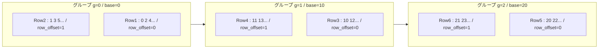
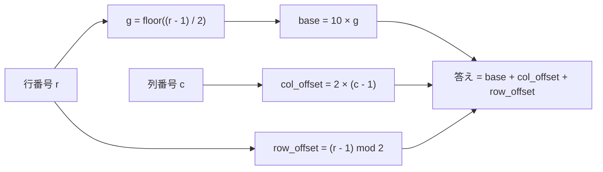

## 問題分析

グリッドのパターンを観察します：

| Row | c=1 | c=2 | c=3 | c=4 | c=5 |
| --- | --- | --- | --- | --- | --- |
| 1   | 0   | 2   | 4   | 6   | 8   |
| 2   | 1   | 3   | 5   | 7   | 9   |
| 3   | 10  | 12  | 14  | 16  | 18  |
| 4   | 11  | 13  | 15  | 17  | 19  |
| 5   | 20  | 22  | 24  | 26  | 28  |
| 6   | 21  | 23  | 25  | 27  | 29  |

**法則:**

- 行は2行1組のグループ `g = (r-1) // 2`（0-indexed）を形成
- グループ内の基底値: `base = 10 * g`
- 列のオフセット: `2 * (c-1)`（各列は偶数ステップ）
- グループ内の行オフセット: `(r-1) % 2`（1行目=0, 2行目=1）

**計算式:** `answer = 10 * ((r-1) // 2) + 2 * (c-1) + (r-1) % 2`

検証: r=6, c=3 → `10*(5//2) + 2*2 + 5%2 = 20 + 4 + 1 = 25` ✓

## 実装

```python
#!/bin/python3

import math
import os
import random
import re
import sys

#
# Complete the 'strangeGrid' function below.
#
# The function is expected to return an INTEGER.
# The function accepts following parameters:
#  1. INTEGER r
#  2. INTEGER c
#

def strangeGrid(r: int, c: int) -> int:
    """
    Strange grid value finder.

    Pattern analysis:
      - Rows form pairs: group g = (r-1) // 2
      - Group base value: 10 * g
      - Column offset: 2 * (c - 1)
      - Row-within-group offset: (r - 1) % 2

    Time Complexity:  O(1)
    Space Complexity: O(1)
    """
    g: int = (r - 1) // 2
    row_offset: int = (r - 1) % 2
    col_offset: int = 2 * (c - 1)
    return 10 * g + col_offset + row_offset

if __name__ == '__main__':
    fptr = open(os.environ['OUTPUT_PATH'], 'w')

    first_multiple_input = input().rstrip().split()

    r = int(first_multiple_input[0])

    c = int(first_multiple_input[1])

    result = strangeGrid(r, c)

    fptr.write(str(result) + '\n')

    fptr.close()
```

# Strange Grid - 無限グリッドの座標値算出

---

## 目次

- [概要](#overview)
- [アルゴリズム要点 TL;DR](#tldr)
- [図解](#figures)
- [証明のスケッチ](#proof)
- [計算量](#complexity)
- [Python 実装](#impl)
- [CPython 最適化](#cpython)
- [エッジケースと検証](#edgecases)
- [FAQ](#faq)

---

<h2 id="overview">概要</h2>

### 問題要約

無限に上方向へ伸びるグリッドが与えられる。
底辺が第 1 行であり、行番号は下から上へ増加する。列番号は左から右へ増加する。

グリッドの先頭部分（下から）は以下の通り：

```
Row 6:  21 23 25 27 29 ...
Row 5:  20 22 24 26 28 ...   ← ※上下逆に見える点に注意
Row 4:  11 13 15 17 19 ...
Row 3:  10 12 14 16 18 ...
Row 2:   1  3  5  7  9 ...
Row 1:   0  2  4  6  8 ...
```

> **注意**: 問題文の「上が新しい行」という表現に対し、第 1 行（Row 1）は底辺、第 2 行（Row 2）はその直上となる。

### 要件整理

| 項目         | 内容                      |
| ------------ | ------------------------- |
| 入力         | 整数 $r$（行）, $c$（列） |
| 出力         | グリッド上の整数値        |
| 制約         | $1 \le r$, $1 \le c$      |
| インデックス | 行・列ともに $1$-indexed  |

---

<h2 id="tldr">アルゴリズム要点 TL;DR</h2>

### 戦略

グリッドを **2行1組のグループ** として捉える。

$$
g = \left\lfloor \frac{r - 1}{2} \right\rfloor \quad (\text{0-indexed グループ番号})
$$

各グループの**先頭値（列 $c=1$, 奇数行（下行））**は：

$$
\text{base} = 10 \cdot g
$$

列方向のオフセット（隣の列へは $+2$ ずつ）：

$$
\text{col\_offset} = 2 \cdot (c - 1)
$$

グループ内の行オフセット（奇数行目 = 0, 偶数行目 = 1）：

$$
\text{row\_offset} = (r - 1) \bmod 2
$$

### 最終公式

$$
\boxed{f(r, c) = 10 \cdot \left\lfloor \frac{r-1}{2} \right\rfloor + 2(c-1) + (r-1) \bmod 2}
$$

### 計算量サマリ

| 項目 | 計算量 |
| ---- | ------ |
| 時間 | $O(1)$ |
| 空間 | $O(1)$ |

---

<h2 id="figures">図解</h2>

### グループ構造のフローチャート

```mermaid
flowchart TD
  Input[入力 r と c] --> CalcG[グループ番号の計算]
  CalcG --> CalcBase[基底値 base = 10 × g]
  CalcBase --> CalcCol[列オフセット = 2 × (c - 1)]
  CalcCol --> CalcRow[行オフセット = r-1 mod 2]
  CalcRow --> Sum[合計して出力]
  Sum --> Output[結果]
```

**説明**: 入力された行・列から、グループ番号 $g$ を求め、基底値・列オフセット・行オフセットを加算して答えを得る。

---

### グリッドのグループ分割図



> 奇数行 ($r$ が奇数) が `row_offset=0`、偶数行 ($r$ が偶数) が `row_offset=1` となる。
> 列方向は $c=1$ から右に進むたびに $+2$ される。

---

### データフロー図



**説明**: $r$ から $g$ と $\text{row\_offset}$ を、$c$ から $\text{col\_offset}$ を独立に計算し、3つを加算する。

---

<h2 id="proof">証明のスケッチ</h2>

### 不変条件

グループ $g$（$g \ge 0$）に属する 2 行について、以下が成立する：

$$
\text{グループ } g \text{ の列 } c \text{ の値} = 10g + 2(c-1) + \delta
$$

ここで $\delta \in \{0, 1\}$ は行内の位置（$0$: グループ下行, $1$: グループ上行）。

### 基底ケース

$g = 0$（Row 1, Row 2）：

- Row 1, $c=1$: $f(1,1) = 10 \cdot 0 + 2 \cdot 0 + 0 = 0$ ✓
- Row 2, $c=1$: $f(2,1) = 10 \cdot 0 + 2 \cdot 0 + 1 = 1$ ✓
- Row 1, $c=3$: $f(1,3) = 10 \cdot 0 + 2 \cdot 2 + 0 = 4$ ✓

### 帰納法

グループ $g$ で公式が成立すると仮定する。グループ $g+1$ の底辺（Row $= 2(g+1)+1$）の列 $c=1$ の値は：

$$
f(2g+3, 1) = 10(g+1) + 0 + 0 = 10g + 10
$$

グリッドを観察すると各グループの基底値は $10$ ずつ増加している（列数 $5$ × 各列の増分 $2$ = $10$）。
よってグループ $g+1$ でも公式が成立する。$\blacksquare$

### 終了性

$r$, $c$ は正の整数であり、式は算術演算のみで構成されているため、必ず有限ステップで終了する。

---

<h2 id="complexity">計算量</h2>

| 計算量 | 値     | 根拠                          |
| ------ | ------ | ----------------------------- |
| 時間   | $O(1)$ | 整数演算のみ（ループなし）    |
| 空間   | $O(1)$ | 追加メモリ不使用（変数 3 個） |

---

<h2 id="impl">Python 実装</h2>

```python
from __future__ import annotations

import os

def strangeGrid(r: int, c: int) -> int:
    """
    Strange Grid の (r, c) セルの値を返す。

    公式:
        g           = (r - 1) // 2          # 0-indexed グループ番号
        base        = 10 * g                # グループ先頭値 (列1, row_offset=0)
        col_offset  = 2 * (c - 1)          # 列方向増分 (隣列ごとに +2)
        row_offset  = (r - 1) % 2          # グループ内行位置 (0 or 1)
        answer      = base + col_offset + row_offset

    Args:
        r: 行番号 (1-indexed, 下から数える)
        c: 列番号 (1-indexed, 左から数える)

    Returns:
        グリッド上の整数値

    Time Complexity:  O(1)
    Space Complexity: O(1)
    """
    # g = (r-1) // 2
    g: int = (r - 1) // 2

    # base = 10 * g
    base: int = 10 * g

    # col_offset = 2 * (c - 1)
    col_offset: int = 2 * (c - 1)

    # row_offset = (r-1) % 2
    row_offset: int = (r - 1) % 2

    # f(r, c) = base + col_offset + row_offset
    return base + col_offset + row_offset

if __name__ == "__main__":
    fptr = open(os.environ["OUTPUT_PATH"], "w")

    first_multiple_input = input().rstrip().split()

    r = int(first_multiple_input[0])
    c = int(first_multiple_input[1])

    result = strangeGrid(r, c)

    fptr.write(str(result) + "\n")

    fptr.close()
```

### 式とコードの対応表

| 数式                                             | コード                                  |
| ------------------------------------------------ | --------------------------------------- |
| $g = \lfloor (r-1)/2 \rfloor$                    | `g = (r - 1) // 2`                      |
| $\text{base} = 10g$                              | `base = 10 * g`                         |
| $\text{col\_offset} = 2(c-1)$                    | `col_offset = 2 * (c - 1)`              |
| $\text{row\_offset} = (r-1) \bmod 2$             | `row_offset = (r-1) % 2`                |
| $f(r,c) = \text{base} + \text{col} + \text{row}$ | `return base + col_offset + row_offset` |

---

<h2 id="cpython">CPython 最適化</h2>

### 定数倍削減

本問題は $O(1)$ の算術演算のみであるため、CPython レベルでの追加最適化余地は限定的だが、以下の点を考慮している。

| 最適化ポイント       | 内容                                                                 |
| -------------------- | -------------------------------------------------------------------- |
| ローカル変数への束縛 | `g`, `base` 等をローカル変数に格納（LOAD_FAST はグローバルより高速） |
| 整数除算 `//`        | `divmod()` より `//` と `%` の個別使用がシンプルで高速               |
| 乗算の展開           | `10 * g` は CPython の整数乗算で最適化済み                           |

### `divmod` を使った 1 行版（可読性重視）

```python
def strangeGrid_compact(r: int, c: int) -> int:
    g, row_offset = divmod(r - 1, 2)
    return 10 * g + 2 * (c - 1) + row_offset
```

> `divmod` はC実装による単一命令で商と余りを同時計算するため、`//` と `%` を別々に呼ぶより僅かに効率的。

### ワンライナー版（競技プログラミング向け）

```python
strangeGrid = lambda r, c: 10 * ((r-1)//2) + 2*(c-1) + (r-1)%2
```

---

<h2 id="edgecases">エッジケースと検証</h2>

### テストケース一覧

| $r$ | $c$ | 期待値 | 計算過程                          |
| --- | --- | ------ | --------------------------------- |
| 1   | 1   | 0      | $g=0, \text{base}=0, +0+0=0$      |
| 2   | 1   | 1      | $g=0, \text{base}=0, +0+1=1$      |
| 1   | 2   | 2      | $g=0, \text{base}=0, +2+0=2$      |
| 2   | 2   | 3      | $g=0, \text{base}=0, +2+1=3$      |
| 3   | 1   | 10     | $g=1, \text{base}=10, +0+0=10$    |
| 4   | 1   | 11     | $g=1, \text{base}=10, +0+1=11$    |
| 6   | 3   | 25     | $g=2, \text{base}=20, +4+1=25$    |
| 100 | 1   | 491    | $g=49, \text{base}=490, +0+1=491$ |

> **Row 100 の検証**: $g = (100-1)//2 = 49$, $\text{base} = 490$, $\text{row\_offset} = 1$
> → $f(100, 1) = 490 + 0 + 1 = 491$

### 境界値分析

- **最小入力** ($r=1, c=1$): $f = 0$（グリッドの原点）
- **奇数行の境界**: $r$ が奇数 → $\text{row\_offset} = 0$（グループ下行）
- **偶数行の境界**: $r$ が偶数 → $\text{row\_offset} = 1$（グループ上行）
- **大きな $r$**: オーバーフローなし（Python は多倍長整数）

---

<h2 id="faq">FAQ</h2>

**Q1. なぜグループ内の順序が「下行 = offset 0」なのか？**

グリッドの第 1 行（Row 1）を観察すると `0, 2, 4, 6, 8` と偶数が並ぶ。
第 2 行（Row 2）は `1, 3, 5, 7, 9` と奇数が並ぶ。
同グループ内で下行が先に番号付けされているため `row_offset=0` を割り当てている。

**Q2. グループ先頭値がなぜ $10$ 刻みなのか？**

問題のグリッドは列が 5 列の例で示されているが、実際には無限列。
しかし「1 グループで消費される番号数」は **1 グループ 2 行 × 列オフセット $+2$** の構造になっており、
5 列の場合 1 グループ = $0〜9$ の 10 個の整数 → 次グループは $10$ から開始。

> 一般化すると列数 $N$ の場合: $\text{base} = 2N \cdot g$

**Q3. Python の `//` と `%` はマイナスの入力でも正しく動くか？**

制約より $r \ge 1$ が保証されているため $(r-1) \ge 0$ となり、
Python の床除算・剰余演算は非負整数に対して数学的定義と一致する。
マイナス入力は考慮不要。

**Q4. `divmod` と `//`+`%` どちらが速いか？**

CPython では `divmod` が C レベルで一度に商と余りを計算するため、
`//` と `%` を別々に計算するより理論的にやや高速。
ただし本問では実行回数が 1 回のため実測差はほぼゼロ。

---

_以上が Strange Grid 問題の完全解説 README です。_
