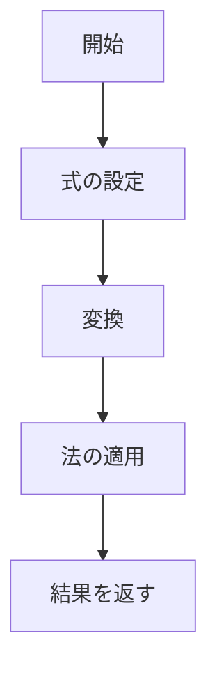

# Diwali Lights - 非空パターン数を式で一発算出

- [概要](#overview)
- [アルゴリズム要点 TL;DR](#tldr)
- [図解](#figures)
- [証明のスケッチ](#proof)
- [計算量](#complexity)
- [Python 実装](#impl)
- [CPython 最適化ポイント](#cpython)
- [エッジケースと検証](#edgecases)
- [FAQ](#faq)

<h2 id="overview">概要</h2>

- **プラットフォーム/ID**: HackerRank diwali-lights
- **問題タイトル**: Diwali Lights
- **要約**: 直線上に並ぶ $N$ 個の電球は各々 ON/OFF の 2 状態を取り得る。**少なくとも 1 個が点灯**しているパターン数を、各テストケースごとに **$10^5$** で割った余りとして求める。
- **入出力（簡潔）**

  - 入力: 1 行目 $T$。続く $T$ 行に $N$（電球数）。
  - 出力: 各行にパターン数 $\bmod 10^5$。

- **関数シグネチャ（HackerRank 準拠）**

  ```text
  lights(n: int) -> int
  ```

- **制約**: $1 \le T \le 1000,  0 < N < 10^4$

<h2 id="tldr">アルゴリズム要点 (TL;DR)</h2>

- 総状態数: $2^N$
- 禁止状態: **全消灯** ただ 1 通り
- 求める答え: $2^N - 1$
- 実装: Python の `pow(2, n, 100000)` を用い、

  $$
  \text{ans} \equiv (2^N - 1) \bmod 100000
  $$

  を

  ```python
  (pow(2, n, 100000) - 1) % 100000
  ```

  で計算（負値補正のため最後に `% 100000`）。

<h2 id="figures">図解</h2>



_図 1: 数式適用の手順。総数 $2^N$ から全消灯 1 を引き、最後に法 $10^5$ を適用。_


_図 2: 実装のデータフロー。`pow(2, n, M)` を中核に $O(\log n)$ で計算。_

<h2 id="proof">証明のスケッチ</h2>

- **不変条件**: 各電球は ON/OFF の 2 通り。独立な選択の総積より総状態数は $2^N$。
- **基底ケース**: $N=1$。許されるパターンは ${*}$ の 1 通り。式 $2^1-1=1$ と一致。
- **帰納法**: $N=k$ で $2^k-1$ が成り立つとする。
  $N=k+1$ では、追加電球の ON/OFF により総状態数が 2 倍の $2^{k+1}$。全消灯は依然 1 通りのみ。よって $2^{k+1}-1$。
- **終了性**: `pow(2, n, M)` は繰り返し二乗法（指数のビット長に比例）で有限回で終了。

<h2 id="complexity">計算量</h2>

- **Time**: $O(\log N)$（繰り返し二乗法）
- **Space**: $O(1)$

<h2 id="impl">Python 実装</h2>

> 要件: **CPython 3.13.3**, 型注釈必須, HackerRank I/O 互換。
> 関数 `lights` は **Pure**（副作用なし）。I/O は `__main__` ブロックに限定。

```python
from __future__ import annotations

import os
import sys
from typing import Final

# 定数: 法 M = 10^5
MOD: Final[int] = 100000

#
# Complete the 'lights' function below.
#
# The function is expected to return a LONG_INTEGER.
# The function accepts INTEGER n as parameter.
#

def lights(n: int) -> int:
    """
    非空パターン数を返す（副作用なし・純粋関数）

    数式:
        総数: 2^n
        禁止: 1 (all OFF)
        目的: (2^n - 1) mod MOD

    実装:
        Python 組み込み pow の三引数版を使用:
            pow(a, b, m) == (a**b) % m を O(log b) で計算
        負値対策として最後に再度 mod を適用
    """
    # Equation: (2^n - 1) mod MOD
    # Transform: pow(2, n, MOD) gives 2^n mod MOD
    # Proof Step: subtract 1, then normalize by MOD
    return (pow(2, n, MOD) - 1) % MOD


if __name__ == '__main__':
    # HackerRank の標準テンプレートに合わせた実行部
    fptr = open(os.environ['OUTPUT_PATH'], 'w')
    t = int(sys.stdin.readline().strip())
    for _ in range(t):
        n = int(sys.stdin.readline().strip())
        result = lights(n)
        fptr.write(str(result) + '\n')
    fptr.close()
```

<h2 id="cpython">CPython 最適化ポイント</h2>

- **`pow(2, n, MOD)` を使用**

  - C 実装の繰り返し二乗法で高速（Python レベルでのループ不要）。

- **整数は任意精度だが、三引数 `pow` により中間値は常に法で縮約**
  → 巨大な中間多倍長が生じず、**メモリ $O(1)$**。
- **定数を `Final` で明示**

  - Pylance/型チェッカが意図を把握し最適な警告を抑制。

<h2 id="edgecases">エッジケースと検証</h2>

- **最小 $N$**: $N=1$ → $2^1-1=1$
- **上限近傍**: $N=9999$ → 対数時間で処理可能
- **複数ケース**: $T$ が多い場合でも各ケース独立で $O(1)$ メモリ
- **負値補正**: `pow(2, n, MOD) - 1` が負になる可能性に備え、最後に `% MOD` を適用
- **入力妥当性**: HackerRank 側で制約保証。追加のバリデーションは不要（競技向け）。

<h2 id="faq">FAQ</h2>

- **Q. 先頭ゼロ埋めは必要？**
  A. いいえ。問題は単に余りを整数として出力するのみ。桁揃え指定は無し。
- **Q. 反復二乗法を自実装すべき？**
  A. 不要。`pow` 三引数版が最速かつ安全。
- **Q. なぜ $-1$ が必要？**
  A. **全消灯** は条件「少なくとも 1 つ点灯」に違反するため除外。式は $2^N - 1$。
- **Q. なぜ最後にもう一度 `% MOD`？**
  A. Python の `%` は常に非負を返すため、$((x-1) \bmod M)$ によって負値を正規化できる。
