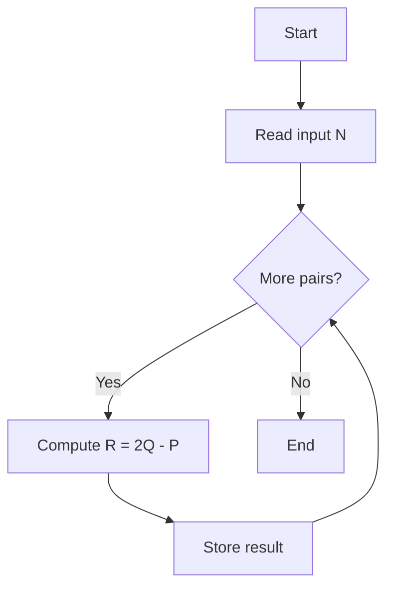
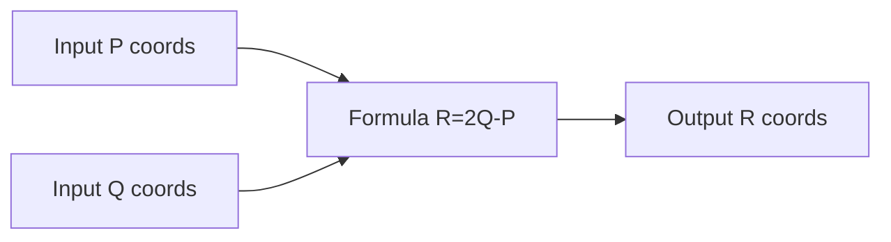

# Find Point - 点対称反射の座標計算

## Table of Contents

- [概要](#overview)
- [要点（TL;DR）](#tldr)
- [図解](#figures)
- [正しさのスケッチ](#correctness)
- [計算量](#complexity)
- [Python 実装](#impl)
- [CPython 最適化ポイント](#cpython)
- [エッジケースと検証観点](#edgecases)
- [FAQ](#faq)

---

<h2 id="overview">概要</h2>

2 点 P(px, py) と Q(qx, qy) が与えられたとき、P を Q に関して点対称に反転した点 R(rx, ry) を求める問題です。
Q が P と R の中点になるため、

- **rx = 2 \* qx - px**
- **ry = 2 \* qy - py**

を計算すればよい。
制約は整数範囲内で収まり、N セットの入力を効率よく処理する必要があります。

---

<h2 id="tldr">要点（TL;DR）</h2>

- Q を中点とする対称点の公式: **R = 2Q - P**
- 各入力ごとに O(1) で計算可能
- Python では整数演算のみ、浮動小数の誤差は発生しない
- Time Complexity: **O(N)**
- Space Complexity: **O(1)**

---

<h2 id="figures">図解</h2>

### フローチャート



**説明**: 入力を読み込み、各セットについて対称点を計算し出力します。

### データフロー



**説明**: 入力点 P, Q を数式に適用し、結果 R を出力します。

---

<h2 id="correctness">正しさのスケッチ</h2>

- **不変条件**: Q が常に P と R の中点である。
- **基底条件**: 1 つのペアに対して計算式 R=2Q-P を適用すれば正しい。
- **終了性**: N セットは有限個なので必ず終了する。
- **網羅性**: 全入力行に同じ計算を適用しているため漏れがない。

---

<h2 id="complexity">計算量</h2>

- **時間計算量**: O(N) （N は入力のセット数、各計算は O(1)）
- **空間計算量**: O(1) （定数領域のみ使用）

---

<h2 id="impl">Python 実装</h2>

```python
from __future__ import annotations
from typing import List

class Solution:
    def findPoint(self, px: int, py: int, qx: int, qy: int) -> List[int]:
        """
        点 P(px, py) を Q(qx, qy) に関して反転させた点 R(rx, ry) を返す。

        Args:
            px, py: 点 P の座標
            qx, qy: 点 Q の座標
        Returns:
            R の座標を [rx, ry] で返す
        """
        rx: int = 2 * qx - px
        ry: int = 2 * qy - py
        return [rx, ry]
```

---

<h2 id="cpython">CPython最適化ポイント</h2>

- 演算は単純な整数計算 → CPython の内部最適化 (C レベル演算) により高速。
- 不要なリスト生成を避ける場合、タプル `(rx, ry)` の返却も可能だが HackerRank I/O に合わせリスト使用。
- 入力処理を高速化する場合は `sys.stdin` の直接読み込みが有効。

---

<h2 id="edgecases">エッジケースと検証観点</h2>

- P = Q の場合 → R = P（同じ点に写る）。
- 負の座標 → 正しく反映されるか。
- 大きな整数（10^9 付近） → オーバーフローは Python の int では発生しない。
- 複数セット入力 → 逐次処理できるか。

---

<h2 id="faq">FAQ</h2>

**Q. 浮動小数点の誤差は出るか？**
A. 出ません。整数演算のみで完結します。

**Q. R の出力はリストかタプルか？**
A. HackerRank の仕様に合わせ **リスト** `[rx, ry]` を返す。

**Q. P が存在しない場合は？**
A. 入力は常に与えられるため考慮不要。

---
