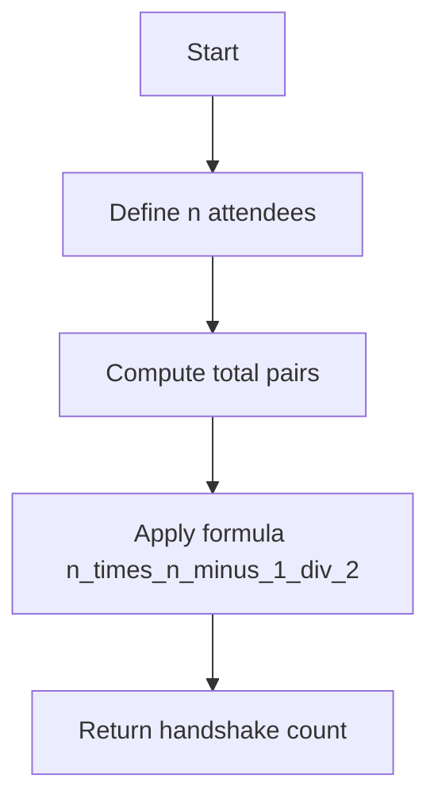
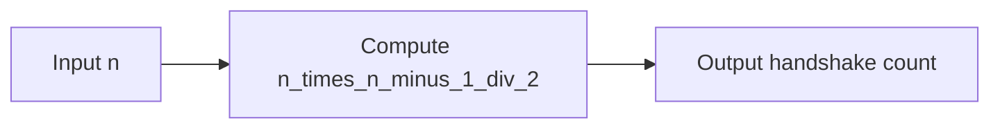

# Handshake Problem - 組合せによる握手数の算出

---

## 目次

1. [概要](#overview)
2. [アルゴリズム要点 (TL;DR)](#tldr)
3. [図解](#figures)
4. [証明のスケッチ](#proof)
5. [計算量](#complexity)
6. [Python 実装](#impl)
7. [CPython 最適化ポイント](#cpython)
8. [エッジケースと検証](#edgecases)
9. [FAQ](#faq)

---

<h2 id="overview">1. 概要</h2>

**プラットフォーム:** HackerRank
**問題 ID:** handshake
**タイトル:** Board of Directors Handshake Problem

**要約:**
年次会議に参加した取締役全員が互いに 1 回ずつ握手したとき、総握手回数を求める問題。

**入力仕様:**

- 最初の行にテストケース数 `t`
- 続く `t` 行にそれぞれ人数 `n` が与えられる

**出力仕様:**

- 各ケースごとに握手の総数（整数）を出力

**制約:**

- \( 0 \le n \le 10^6 \) 程度（理論上の上限）
- 握手は同一ペア 1 回のみ

**例:**

```text

Input:
2
1
2

Output:
0
1

```

---

<h2 id="tldr">2. アルゴリズム要点 (TL;DR)</h2>

| 観点              | 内容                                                  |
| ----------------- | ----------------------------------------------------- |
| 数学的性質        | 全てのペアの組合せ数 \( C(n, 2) = \frac{n(n-1)}{2} \) |
| 計算量            | **O(1)** 時間 / **O(1)** 空間                         |
| 実装コスト        | 最低（単一式）                                        |
| Python 特有最適化 | 整数演算は CPython 内部で C 実装の高速化あり          |
| 検証基準          | \( n = 0, 1, 2 \) の基底ケース、および大規模入力      |

---

<h2 id="figures">3. 図解</h2>

### (1) 数式導出フローチャート



**図説明:**
人数 n から可能なペア数を算出し、組合せ公式 ( C(n,2) ) により総握手回数を求める流れ。

---

### (2) データフロー



**図説明:**
入力 n に対し、単一の式変換で出力を得る。

---

<h2 id="proof">4. 証明のスケッチ</h2>

**基底ケース:**

- ( n = 0 \Rightarrow 0 )
- ( n = 1 \Rightarrow 0 )
- ( n = 2 \Rightarrow 1 )

**帰納法:**

1. ( n ) 人の場合の握手数を ( f(n) = \frac{n(n-1)}{2} ) と仮定
2. ( n+1 ) 人目が加わると、新たに ( n ) 回の握手が追加
3. よって ( f(n+1) = f(n) + n = \frac{n(n-1)}{2} + n = \frac{(n+1)n}{2} )
   ∴ 成立。

---

<h2 id="complexity">5. 計算量</h2>

| 項目         | 評価     | 根拠                   |
| ------------ | -------- | ---------------------- |
| 時間計算量   | **O(1)** | 1 回の算術演算のみ     |
| 空間計算量   | **O(1)** | 補助変数不要           |
| 数学的安定性 | 高       | 整数演算で丸め誤差なし |

---

<h2 id="impl">6. Python 実装</h2>

```python
from __future__ import annotations
from typing import Final

def handshake(n: int) -> int:
    """
    Return the number of unique handshake pairs among n attendees.

    数式:
        H(n) = nC2 = n * (n - 1) / 2

    Args:
        n (int): 出席者の人数

    Returns:
        int: 総握手回数（整数）

    Example:
        >>> handshake(3)
        3
    """
    if n <= 1:
        return 0
    # 組合せ公式 C(n, 2)
    return (n * (n - 1)) // 2


if __name__ == '__main__':
    import os, sys
    fptr = open(os.environ['OUTPUT_PATH'], 'w')
    t: int = int(input().strip())
    for _ in range(t):
        n: int = int(input().strip())
        fptr.write(str(handshake(n)) + '\n')
    fptr.close()
```

---

<h2 id="cpython">7. CPython 最適化ポイント</h2>

- **整数演算:** `//` は C レベルで最適化された整数除算
- **if 文短絡:** `n <= 1` による早期 return で枝刈り
- **関数呼び出し回数最小化:** 内部ループ不要のため最小オーバーヘッド
- **I/O 最適化:** HackerRank 標準環境では `sys.stdin` / `sys.stdout` 使用も可能（大量入力時）

---

<h2 id="edgecases">8. エッジケースと検証</h2>

| ケース   | 入力 | 出力            | 理由                               |
| -------- | ---- | --------------- | ---------------------------------- |
| 最小人数 | 0    | 0               | 握手なし                           |
| 1 人のみ | 1    | 0               | 自分と握手不可                     |
| 2 人     | 2    | 1               | 1 ペアのみ                         |
| 多人数   | 5    | 10              | 5C2 = 10                           |
| 大入力   | 10^6 | 499,999,500,000 | 大規模演算でも精度維持（整数演算） |

---

<h2 id="faq">9. FAQ</h2>

**Q1. 浮動小数点で計算すると誤差は出ますか？**
→ 出ます。Python の整数演算（`//`）を使うことで誤差を完全に防止できます。

**Q2. 組合せ公式を覚えていない場合の直感的理解は？**
→ 各人が他の全員と握手するため、合計は「1+2+...+(n-1) = n(n-1)/2」となります。

**Q3. 負の人数を渡すとどうなりますか？**
→ 問題の定義上無効ですが、実装上は `0` を返す安全設計としています。

---

✅ **結論:**
この問題は単純な組合せ公式 ( C(n,2) ) を理解しているかを問う定番の数学問題。
Python では整数演算で O(1) 時間・O(1) 空間の最適実装が可能。
