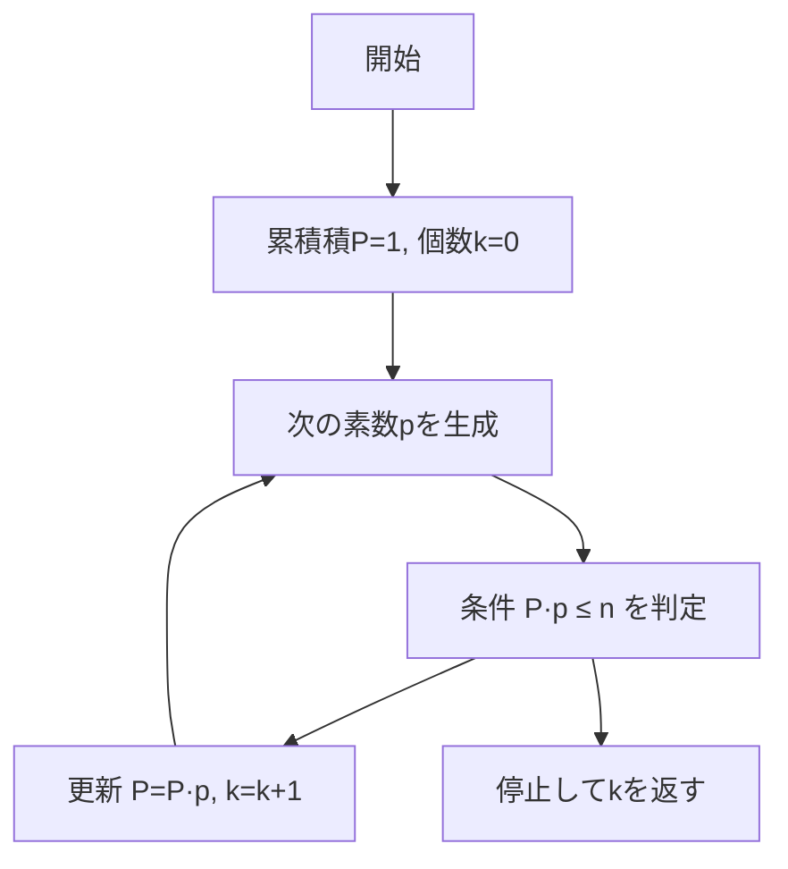
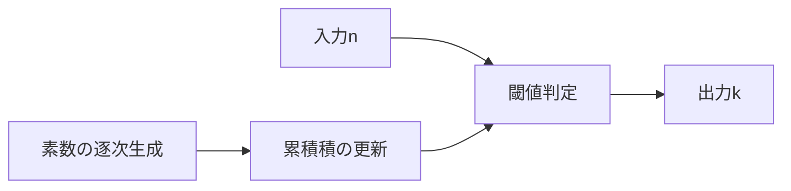

# Leonardo loves primes（最大異なる素因数個数） - 「積は小さい素数から」一撃解法

- Platform/ID: HackerRank – _primeCount_
- 関数シグネチャ（HackerRank 準拠）: `primeCount(n: int) -> int`
- 要旨: $n$ 以下で **相異なる素因数の個数** を最大化する整数は、$2,3,5,7,\ldots$ を小さい順に掛けた積（**Primorial**）で達成できる。
- よって $\prod_{i=1}^{k} p_i \le n$ を満たす最大の $k$ を返せばよい。

---

## 目次

- [概要](#overview)
- [アルゴリズム要点 (TL;DR)](#tldr)
- [図解](#figures)
- [証明のスケッチ](#proof)
- [計算量](#complexity)
- [Python 実装（HackerRank 形式）](#impl)
- [CPython 最適化ポイント](#cpython)
- [エッジケースと検証](#edgecases)
- [FAQ](#faq)

---

<h2 id="overview">概要</h2>

- **問題要約**
  入力 $n$ に対し、区間 $[1,n]$ の任意の整数が持ちうる **相異なる素因数の最大個数** を求める。出力は最大個数 $k$（非負整数）。

- **入出力仕様（簡潔）**
  入力: 複数クエリの各 $n$（HackerRank 側で関数が個別に呼ばれる）。
  出力: 最大個数 $k$ を返す（`int`）。

- **代表例**

  - $n=1 \Rightarrow 0$
  - $n=2 \Rightarrow 1$（$2$）
  - $n=3 \Rightarrow 1$（$3$ や $2$）
  - $n=500 \Rightarrow 4$（$2\cdot3\cdot5\cdot7=210 \le 500$ だが $2\cdot3\cdot5\cdot7\cdot11=2310 > 500$）
  - $n=10^{10} \Rightarrow 10$

- **想定データ構造**
  逐次生成される小さな素数列と、その累積積（整数ひとつ）。

---

<h2 id="tldr">アルゴリズム要点 (TL;DR)</h2>

- **戦略**
  小さい素数から順に掛け合わせた積（Primorial）

  $$
  P_k# ;=; \prod_{i=1}^{k} p_i ;=; p_1 \times p_2 \times \cdots \times p_k
  $$

  が $n$ を超えない最大の $k$ が答え。直観：同じ積の大きさで「異なる素因数の数」を最大化するには、因数はできるだけ小さい素数にすべき。

- **操作**
  $P \leftarrow 1,; k \leftarrow 0$ とし、素数列 $2,3,5,7,\ldots$ を順に試す。
  次の素数 $p$ について $P\cdot p \le n$ なら $P \leftarrow P\cdot p,; k \leftarrow k+1$、さもなくば停止。

- **主要式（定義同値）**
  $$
  \max_{1 \le x \le n}, \omega(x) ;=; \max \left{, k ;\middle|; \prod_{i=1}^{k} p_i \le n ,\right}
  $$

---

<h2 id="figures">図解</h2>

### フローチャート（Mermaid）



_説明_: 小さい素数から順に掛け、積が $n$ を超えたら直前の $k$ が答え。

### データフロー（Mermaid）



_説明_: 入力 $n$ と累積積の比較で停止条件を満たしたときの $k$ を返す。
※ 日本語が豆腐化する場合は、利用側 CSS で `.mermaid { font-family: "Noto Sans JP", sans-serif; }` を指定してください。

---

<h2 id="proof">証明のスケッチ</h2>

- **主張**
  $n$ 以下で $\omega(x)$ を最大化する $x$ は、$x = \prod_{i=1}^{k} p_i$（最小の $k$ 個の素数の積、Primorial）である。すなわち

  $$
  \max_{1 \le x \le n}, \omega(x) ;=; \max\left{, k ;\middle|; \prod_{i=1}^{k} p_i \le n ,\right}.
  $$

- **基底**
  $n < 2$ のとき $x=1$ のみで $\omega(1)=0$。よって結果は $0$。

- **交換引き下げ法（直観）**
  ある $x$ が互いに異なる素因数 $q_1 < q_2 < \cdots < q_t$ を持つとする。
  $q_i$ のいずれかが第 $i$ 素数 $p_i$ より大きければ、$q_i$ を $p_i$ に置き換えると $x$ は値が小さくなり、$\omega(x)$ は変わらない。
  この置換を繰り返すと、$\omega$ を保ったまま $x$ は Primorial 以下に最小化できる。
  よって $\omega$ を最大化するには、$x$ は小さい素数から順に使うのが最適。

- **終了性**
  素数を 1 つ進めるたびに積は単調増加し、有限回で $n$ を超えるため停止。

---

<h2 id="complexity">計算量</h2>

- **時間計算量**: $O!\left(k\sqrt{p_k}\right)$（素数の逐次判定を単純試し割りで実装、$k$ は典型的に $10$〜$15$ 程度）
- **空間計算量**: $O(1)$（累積積とカウンタのみ）

> 注: $n \le 10^{10}$ で $k=10$、$n \le 10^{18}$ でも $k \approx 15$ 程度に頭打ち。

---

<h2 id="impl">Python 実装（HackerRank 形式・型注釈付き）</h2>

> HackerRank では I/O はプラットフォーム側が行い、下記の関数 `primeCount` をクエリごとに呼び出します。実装は **Pure**（副作用なし）です。

```python
from __future__ import annotations
from typing import Final

def primeCount(n: int) -> int:
    """
    最大の k を返す:
      - 目的: max k s.t. Π_{i=1..k} p_i <= n（Primorial の閾値）
      - 数学的対応: ω(x) の最大値は小さい素数からの積で達成
        主要式: max_{1<=x<=n} ω(x) = max { k | Π_{i=1..k} p_i <= n }

    実装方針:
      1) 小さな素数を逐次生成（_is_prime の試し割り）
      2) 累積積 P に掛けられる限り掛ける
      3) 超えた瞬間の直前の個数が答え

    時間計算量: O(k*sqrt(p_k))  (k はとても小さい)
    空間計算量: O(1)
    """
    if n < 2:
        # n<2 では相異なる素因数を 1 個以上持つ整数が存在しない
        return 0

    def _is_prime(x: int) -> bool:
        if x < 2:
            return False
        if x % 2 == 0:
            return x == 2
        d: int = 3
        while d * d <= x:
            if x % d == 0:
                return False
            d += 2
        return True

    def _primes():
        # 需要分のみ動的に供給
        yield 2
        p: int = 3
        while True:
            if _is_prime(p):
                yield p
            p += 2  # 偶数はスキップ

    count: int = 0
    P: int = 1  # 累積積（Primorial）
    for p in _primes():
        # 実装と式の対応: P*p <= n が成り立つ限り k を増やす
        if P * p > n:
            break
        P *= p
        count += 1

    return count
```

---

<h2 id="cpython">CPython 最適化ポイント</h2>

- **分岐の早期打ち切り**: `if P * p > n: break` により無駄な素数生成を抑制。
- **偶数スキップ**: 素数判定では `d += 2`、生成では `p += 2`。
- **関数ローカル変数**: ループ内でのグローバル参照を避け、CPython のローカル参照最適化を享受。
- **十分な単純性**: $k$ が小さいため、高度な素数表や高速篩は不要。

> 上限がさらに大きくなる場合は、固定小素数タプル（例: 最初の 100 素数）を前計算・ハードコードする最適化も有効。

---

<h2 id="edgecases">エッジケースと検証</h2>

- **$n < 2$**: `0`（例: $n=0,1$）
- **境界（Primorial ちょうど）**: $n = \prod_{i=1}^{k} p_i \Rightarrow k$
- **直後（超える直前）**: $n = \prod_{i=1}^{k} p_i + c$（小さな $c$）でも結果は $k$
- **小値**: $n=2 \Rightarrow 1,\ n=3 \Rightarrow 1,\ n=6 \Rightarrow 2,\ n=30 \Rightarrow 3$
- **大値例**: $n=500 \Rightarrow 4,\ n=5000 \Rightarrow 5,\ n=10^{10} \Rightarrow 10$
- **整数性**: すべて `int`、オーバーフローは Python の任意精度整数により非問題。

---

<h2 id="faq">FAQ</h2>

- **Q. なぜ「最小の素数から」なのか？**
  A. 同じ素因数個数で積を最小化するには小さい素数を選ぶのが最適。大きい素数を小さい素数に置換すると積が減り、$n$ の制約を満たしやすくなる。

- **Q. エラトステネスの篩は使わないの？**
  A. 必要な素数個数 $k$ が非常に小さいため、逐次の試し割りが最速かつ実装が簡潔。篩の初期コストが支配的になりがち。

- **Q. $n$ が巨大な場合の上限は？**
  A. $10^{18}$ 級でも $k$ は十数個。Primorial の成長が速く、実務でも逐次法で十分。

- **Q. 返り値 $k$ の直観的意味は？**
  A. $n$ 以下で「異なる素因数を $k$ 個持つ最大の可能性」を与える個数。該当例は $x=\prod_{i=1}^{k} p_i$ が代表。

---
