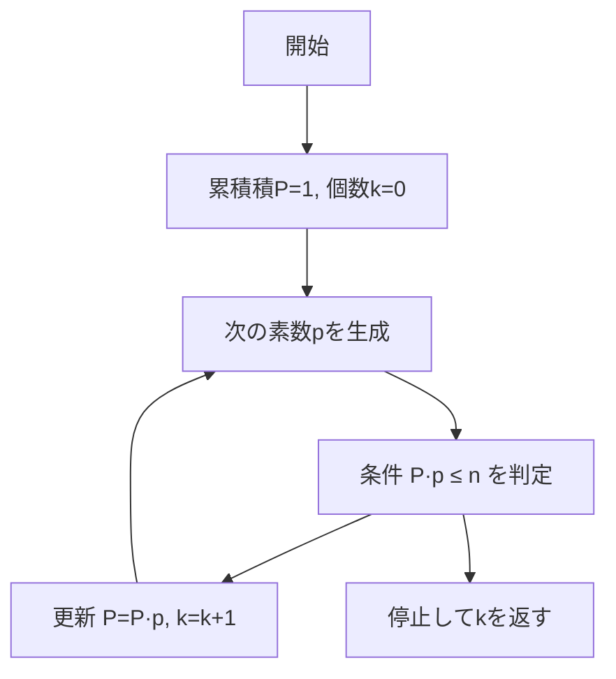
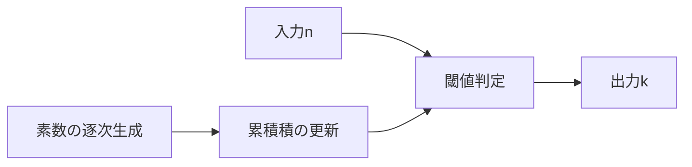

# Leonardo loves primes（最大異なる素因数個数） - 「積は小さい素数から」一撃解法

- Platform/ID: HackerRank – _primeCount_
- 関数シグネチャ（HackerRank 準拠）: `primeCount(n: int) -> int`
- 要旨: $n$ 以下で **相異なる素因数の個数** を最大化する整数は、$2,3,5,7,\ldots$ を小さい順に掛けた積（**Primorial**）で達成できる。
  よって $\prod_{i=1}^{k} p_i \le n$ を満たす最大の $k$ を返せばよい。

---

## 目次

- [概要](#overview)
- [アルゴリズム要点 (TL;DR)](#tldr)
- [図解](#figures)
- [証明のスケッチ](#proof)
- [計算量](#complexity)
- [Python 実装（HackerRank 形式）](#impl)
- [CPython 最適化ポイント](#cpython)
- [エッジケースと検証](#edgecases)
- [FAQ](#faq)

---

<h2 id="overview">概要</h2>

- **問題要約**
  入力 $n$ に対し、区間 $[1,n]$ の任意の整数が持ちうる **相異なる素因数の最大個数** を求める。
  出力は最大個数 $k$（非負整数）。

- **入出力仕様（簡潔）**
  入力: 複数クエリの各 $n$（HackerRank 側で関数が個別に呼ばれる）。
  出力: 最大個数 $k$ を返す（`int`）。

- **代表例**

  - $n=1 \Rightarrow 0$
  - $n=2 \Rightarrow 1$（$2$）
  - $n=3 \Rightarrow 1$（$3$ や $2$）
  - $n=500 \Rightarrow 4$（$2\cdot3\cdot5\cdot7=210 \le 500$ だが $2\cdot3\cdot5\cdot7\cdot11=2310 > 500$）
  - $n=10^{10} \Rightarrow 10$

- **想定データ構造**
  逐次生成される小さな素数列と、その累積積（整数ひとつ）。

---

<h2 id="tldr">アルゴリズム要点 (TL;DR)</h2>

- **戦略**
  小さい素数から順に掛け合わせた積（Primorial）
  $P_k\# = \prod_{i=1}^{k} p_i = p_1 \times p_2 \times p_3 \times \dots \times p_k$
  が $n$ を超えない最大の $k$ が答え。
  直観: 同じ積の大きさで「異なる素因数の数」を最大化するには、因数はできるだけ小さい素数にすべき。

- **操作**
  $P \leftarrow 1,\ k \leftarrow 0$ とし、素数列 $2,3,5,7,\ldots$ を順に試す。
  次の素数 $p$ について $P\cdot p \le n$ なら $P \leftarrow P\cdot p,\ k \leftarrow k+1$、さもなくば停止。

$
\max_{1 \le x \le n} \omega(x) = \max \left\{ k \mid \prod_{i=1}^{k} p_i \le n \right\}
$

---

<h2 id="figures">図解</h2>

### **フローチャート（Mermaid）**



_説明_: 小さい素数から順に掛け、積が $n$ を超えたら直前の $k$ が答え。

### **データフロー（Mermaid）**



_説明_: 入力 $n$ と累積積の比較で停止条件を満たしたときの $k$ を返す。

> フォントが豆腐化する場合は、利用側 CSS で `.mermaid { font-family: "Noto Sans JP", sans-serif; }` を指定してください。

---

<h2 id="proof">証明のスケッチ</h2>

- **主張**
  $n$ 以下で $\omega(x)$ を最大化する $x$ は、$x = \prod_{i=1}^{k} p_i$（最小の $k$ 個の素数の積、以下 Primorial）である。すなわち
  $ \max*{1 \le x \le n} \omega(x) = \max\left\{ k \mid \prod*{i=1}^{k} p_i \le n \right\}. $

- **基底**
  $n < 2$ のとき $x=1$ のみで $\omega(1)=0$。よって結果は $0$。

- **交換引き下げ法（直観）**
  ある $x$ が互いに異なる素因数 $q_1 < q_2 < \cdots < q_t$ を持つとする。
  $q_i$ のいずれかが第 $i$ 素数 $p_i$ より大きければ、$q_i$ を $p_i$ に置き換えると $x$ は値が**小さく**なり、$\omega(x)$ は変わらない。
  この置換を繰り返すと、$\omega$ を保ったまま $x$ は Primorial 以下に**最小化**できる。
  よって $\omega$ を最大化するには、$x$ は小さい素数から順に使うのが最適。

- **終了性**
  素数を 1 つ進めるたびに積は単調増加し、有限回で $n$ を超えるため停止。

---

<h2 id="complexity">計算量</h2>

- **時間計算量**: $O(k\sqrt{p_k})$（素数の逐次判定を単純試し割りで実装、$k$ は典型的に $10$〜$15$ 程度）
- **空間計算量**: $O(1)$（累積積とカウンタのみ）

> 注: $n \le 10^{10}$ で $k=10$、$n \le 10^{18}$ でも $k \approx 15$ 程度に頭打ち。

---

<h2 id="impl">Python 実装（HackerRank 形式・型注釈付き）</h2>

> HackerRank では I/O はプラットフォーム側が行い、下記の関数 `primeCount` をクエリごとに呼び出します。実装は **Pure**（副作用なし）です。

```python
from __future__ import annotations
from typing import Final

def primeCount(n: int) -> int:
    """
    最大の k を返す:
      - 目的: max k s.t. Π_{i=1..k} p_i <= n（Primorial の閾値）
      - 数学的対応: ω(x) の最大値は小さい素数からの積で達成
        主要式: max_{1<=x<=n} ω(x) = max { k | Π_{i=1..k} p_i <= n }

    実装方針:
      1) 小さな素数を逐次生成（_is_prime の試し割り）
      2) 累積積 P に掛けられる限り掛ける
      3) 超えた瞬間の直前の個数が答え

    時間計算量: O(k*sqrt(p_k))  (k はとても小さい)
    空間計算量: O(1)
    """
    if n < 2:
        # n<2 では相異なる素因数を 1 個以上持つ整数が存在しない
        return 0

    def _is_prime(x: int) -> bool:
        if x < 2:
            return False
        if x % 2 == 0:
            return x == 2
        d: int = 3
        while d * d <= x:
            if x % d == 0:
                return False
            d += 2
        return True

    def _primes():
        # 需要分のみ動的に供給
        yield 2
        p: int = 3
        while True:
            if _is_prime(p):
                yield p
            p += 2  # 偶数はスキップ

    count: int = 0
    P: int = 1  # 累積積（Primorial）
    for p in _primes():
        # 実装と式の対応: P*p <= n が成り立つ限り k を増やす
        if P * p > n:
            break
        P *= p
        count += 1

    return count
```

---

<h2 id="cpython">CPython 最適化ポイント</h2>

- **分岐の早期打ち切り**: `if P * p > n: break` により無駄な素数生成を抑制。
- **偶数スキップ**: 素数判定では `d += 2`、生成では `p += 2`。
- **関数ローカル変数**: ループ内でのグローバル参照を避け、CPython のローカル参照最適化を享受。
- **十分な単純性**: $k$ が小さいため、高度な素数表や高速篩は不要。

> 上限がさらに大きくなる場合は、固定小素数タプル（例: 最初の 100 素数）を前計算・ハードコードする最適化も有効。

---

<h2 id="edgecases">エッジケースと検証</h2>

- **$n < 2$**: `0`（例: $n=0,1$）
- **境界（Primorial ちょうど）**: $n = \prod_{i=1}^{k} p_i \Rightarrow k$
- **直後（超える直前）**: $n = \prod_{i=1}^{k} p_i + c$（小さな $c$）でも結果は $k$
- **小値**: $n=2 \Rightarrow 1,\ n=3 \Rightarrow 1,\ n=6 \Rightarrow 2,\ n=30 \Rightarrow 3$
- **大値例**: $n=500 \Rightarrow 4,\ n=5000 \Rightarrow 5,\ n=10^{10} \Rightarrow 10$
- **整数性**: すべて `int`、オーバーフローは Python の任意精度整数により非問題。

---

<h2 id="faq">FAQ</h2>

- **Q. なぜ「最小の素数から」なのか？**
  A. 同じ素因数個数で積を最小化するには小さい素数を選ぶのが最適。大きい素数を小さい素数に置換すると積が減り、$n$ の制約を満たしやすくなる。

- **Q. エラトステネスの篩は使わないの？**
  A. 必要な素数個数 $k$ が非常に小さいため、逐次の試し割りが最速かつ実装が簡潔。篩の初期コストが支配的になりがち。

- **Q. $n$ が巨大な場合の上限は？**
  A. $10^{18}$ 級でも $k$ は十数個。Primorial の成長が速く、実務でも逐次法で十分。

- **Q. 返り値 $k$ の直観的意味は？**
  A. $n$ 以下で「異なる素因数を $k$ 個持つ最大の可能性」を与える個数。該当例は $x=\prod_{i=1}^{k} p_i$ が代表。

---

$\prod_{i=1}^{k} p_i \le N$

この数式は、**「最初の $k$ 個の素数の積が $N$ 以下である」** ことを意味します。

---

### 記号の解説

1. **$\prod$ (パイ・プロダクト記号)**:

   - これは**総乗**（そうじょう、Product）を表す記号です。
   - 数列のすべての項を掛け合わせることを意味します。
   - 和を表す $\sum$ (シグマ) と似ていますが、足し算ではなく掛け算を行います。

2. **$p_i$**:

   - これは**$i$ 番目の素数**を表します。
   - $p_1 = 2$ (最初の素数)
   - $p_2 = 3$ (2 番目の素数)
   - $p_3 = 5$ (3 番目の素数)
   - ...という具合です。

3. **$\prod_{i=1}^{k} p_i$**:

   - これは「$i$ が $1$ から $k$ まで動くときの $p_i$ の総乗」を意味します。
   - 具体的には、**最初の $k$ 個の素数すべてを掛け合わせた値**です。
   - $\prod_{i=1}^{k} p_i = p_1 \times p_2 \times p_3 \times \dots \times p_k$
   - 例: $k=4$ の場合、積は $p_1 \times p_2 \times p_3 \times p_4 = 2 \times 3 \times 5 \times 7 = 210$ です。

4. **$\le N$**:
   - これは、左側の値（最初の $k$ 個の素数の積）が、右側の値 **$N$ 以下**である、という大小関係を示しています。

---

### 問題文における文脈（**素因数の最大数**）

元の問題（$[1, N]$ の範囲で相異なる素因数の最大数を求める）の文脈では、この式は**「相異なる素因数の個数 $k$」**を決定するために使われます。

相異なる $k$ 個の素因数を持つ最小の数は、その**$k$ 個の素数をすべて掛け合わせた数**（つまり $\prod_{i=1}^{k} p_i$）です。

この $\prod_{i=1}^{k} p_i$ が、与えられた上限 $N$ を超えない範囲で、**$k$ を最大にする**ことが、求める答えとなります。

つまり、数式 $\prod_{i=1}^{k} p_i \le N$ は、**「相異なる $k$ 個の素因数を持つ数が $N$ 以下に存在するための必要条件」**を表しています。

承知いたしました。この数学的な主張が、なぜ元の問題の解法として成り立つのかを解説します。

---

## $\omega(x)$ の最大化：Primorial の重要性

この主張は、「$N$ 以下の数の中で、相異なる素因数の個数 ($\omega(x)$) を最大にする $x$ は、**最初の $k$ 個の素数の積**（Primorial $P_k\#$）である」という事実に基づいています。

$
\max_{1 \le x \le N} \omega(x) = \max\left\{ k \mid \prod_{i=1}^{k} p_i \le N \right\}
$

### 1. 相異なる素因数の個数を増やすには？

ある数 $x$ が相異なる $k$ 個の素因数を持つ場合、その素因数分解は次のようになります。

$
x = p_{a_1}^{e_1} \cdot p_{a_2}^{e_2} \cdot \dots \cdot p_{a_k}^{e_k} \quad (\text{ここで } e_i \ge 1)
$

$k$ の値を大きくしたい（相異なる素因数の個数を増やしたい）とき、**$x$ の値を $N$ 以下に保ちながら**、**$k$ を最大にする**必要があります。

### 2. $k$ 個の相異なる素因数を持つ最小の数

$k$ 個の相異なる素因数を持つ数の中で、**最も小さい数**はどれでしょうか？

1. **素因数の種類**: $x$ を最小にするには、素因数としてできるだけ**小さい素数**を選ぶ必要があります。つまり、$p_1, p_2, \dots, p_k$ を選ぶのが最適です。
2. **指数**: 各素因数の指数 $e_i$ を最小にするには、$e_i = 1$ にします（素因数として存在する限り、指数は $1$ 以上でなければなりません）。

したがって、$k$ 個の相異なる素因数を持つ**最小の数 $x_{\min}$**は、
最初の $k$ 個の素数を指数 $1$ で掛け合わせた積、すなわち**$k$ 番目の素数階乗 (Primorial)** になります。

$
x_{\min} = p_1^1 \cdot p_2^1 \cdot \dots \cdot p_k^1 = \prod_{i=1}^{k} p_i
$

### 3. $k$ の最大値の決定

これで、元の数式が示す意味が明確になります。

- **目標**: $\max_{1 \le x \le N} \omega(x)$ を求める。
- **論理**: $\omega(x) = k$ となる $x$ が $N$ 以下に存在するならば、$k$ 個の素因数を持つ**最小の数**である $P_k\#$ もまた $N$ 以下でなければなりません。

$
\text{もし } \exists x \le N \text{ で } \omega(x) = k \quad \Rightarrow \quad P_k\# \le x \le N
$

このことから、$\omega(x)$ を最大にする $k$ の値は、**$P_k\#$ が $N$ を超えない**という条件を満たす**最大の整数 $k$** に他なりません。

$
\max\left\{ k \mid \prod_{i=1}^{k} p_i \le N \right\}
$

### まとめ

この数式は、**計算を大幅に簡略化できる**ことを示しています。

- **愚直な方法**: $1$ から $N$ までのすべての数 $x$ を調べ、それぞれの相異なる素因数の個数 $\omega(x)$ を求めて最大値を取る。
- **Primorial を使う方法**: $2, 6, 30, 210, \dots$ と素数階乗を計算していき、**初めて $N$ を超えたときの $k-1$ が答え**となる。

後者の方法の方が圧倒的に効率的であり、これが元の問題 $\text{primeCount}(N)$ の**最適な解法**となります。

お示しの数式は、元の問題文の文脈で**「相異なる素因数の最大数」**を定義しているものと思われます。これは、数学的な表記と、元の問題文（$\text{primeCount}$ 関数）の制約を組み合わせたものです。

お示しの表記は、**「$k$ 番目の素数階乗 (Primorial)」**を意味しています。

$P_k\# = \prod_{i=1}^{k} p_i = p_1 \times p_2 \times p_3 \times \dots \times p_k$

元の入力に含まれる「$\text{P}*k$」や「$\text{P}*_k$」は、素数階乗の標準的な表記である **$p_k\#$** または単に **$P_k$**（素数のみの集合を扱っている場合）を簡略化したり、不完全に表したりしたものと解釈されます。

---

## 素数階乗 ($P_k\#$) の意味

**素数階乗 (Primorial)** とは、**最初の $k$ 個の素数をすべて掛け合わせた積**を指します。

| 記号                  | 意味                                            |
| :-------------------- | :---------------------------------------------- |
| $P_k\#$               | $k$ 番目の素数階乗                              |
| $\prod_{i=1}^{k} p_i$ | $i=1$ から $k$ までの $i$ 番目の素数 $p_i$ の積 |

### 具体的な計算例

| $k$ | 素数 $p_k$ | 計算                                     | 素数階乗 $P_k\#$ |
| :-- | :--------- | :--------------------------------------- | :--------------- |
| 1   | $p_1 = 2$  | $2$                                      | **2**            |
| 2   | $p_2 = 3$  | $2 \times 3$                             | **6**            |
| 3   | $p_3 = 5$  | $2 \times 3 \times 5$                    | **30**           |
| 4   | $p_4 = 7$  | $2 \times 3 \times 5 \times 7$           | **210**          |
| 5   | $p_5 = 11$ | $2 \times 3 \times 5 \times 7 \times 11$ | **2,310**        |

### 元の問題文との関係

この素数階乗は、元の問題（$[1, N]$ の範囲で相異なる素因数の最大数を求める）において、**相異なる $k$ 個の素因数を持つ最小の数**を与えます。

- 相異なる $k$ 個の素因数を持つ数は、必ず $P_k\#$ の**倍数**か、または $P_k\#$ **自身**よりも大きい数になります（$P_k\#$ が、その $k$ 個の素因数を持つ最小の数であるため）。
- したがって、**$\text{primeCount}(N)$ の答え**は、この $P_k\#$ が $N$ を超えない最大の $k$ になります。

$\text{primeCount}(N) = \max \{k \mid P_k\# \le N\}$

---

## 数式の解釈

お示しの数式は、以下のような構造をしていると解釈できます。

$
\max_{1 \le x \le N} \omega(x) = \max \left\{ k \mid \prod_{i=1}^{k} p_i \le N \right\}
$

※元の入力に含まれる「$\text{len}$」や「$\text{mid}$」といった不完全な文字列は、
範囲を示す $N$ や、総乗を表す $\prod$ のインデックス、あるいは単なるタイポ（誤入力）とみなし、文脈上最も自然な **$N$**（範囲の上限）として解釈しました。

---

## 記号と意味の解説

| 記号                                 | 数学的な意味                                                              | 問題文の文脈における意味                                                                                         |
| :----------------------------------- | :------------------------------------------------------------------------ | :--------------------------------------------------------------------------------------------------------------- |
| $\max$                               | 最大値（Maximum）                                                         | 求める**最大数**を表す。                                                                                         |
| $1 \le x \le N$                      | $x$ が $1$ 以上 $N$ 以下である範囲                                        | 考慮する数の範囲。元の問題の $[1, N]$ のこと。                                                                   |
| $\omega(x)$                          | **相異なる素因数の個数**を表す関数 (prime omega function)                 | $x$ を素因数分解したときに現れる、種類の異なる素数の個数。例: $\omega(12) = \omega(2^2 \cdot 3) = 2$。           |
| $\max_{1 \le x \le N} \omega(x)$     | 範囲 $[1, N]$ の中のすべての数 $x$ についての $\omega(x)$ の**最大値**。  | **問題の答え**。$[1, N]$ の数の中で、最も多くの種類の素因数を持つ数の、その個数。                                |
| $\prod_{i=1}^{k} p_i$                | **最初の $k$ 個の素数の積** ($p_1 \times p_2 \times \dots \times p_k$ )。 | $k$ 個の相異なる素因数を持つ**最小の数**。                                                                       |
| $k$                                  | 相異なる素因数の個数。                                                    | 求める個数。                                                                                                     |
| $\prod_{i=1}^{k} p_i \le N$          | 最初の $k$ 個の素数の積が $N$ 以下である。                                | $k$ 個の相異なる素因数を持つ数が、まだ範囲 $[1, N]$ の中に存在する（あるいは、存在する可能性がある）という条件。 |
| $\max \left\{ k \mid \dots \right\}$ | 条件 ($\dots$) を満たす $k$ の**最大値**。                                | 上記の条件を満たす**最大の $k$**。                                                                               |

---

## 数式全体が意味すること

この数式は、**$\text{primeCount}(N)$ が求める答え**を、等号で結ばれた二つの最大値として定義しています。

1. **左辺**: $\max_{1 \le x \le N} \omega(x)$

   - **$[1, N]$ の範囲にある任意の数 $x$ が持つ、相異なる素因数の個数 $\omega(x)$ の最大値**。

2. **右辺**: $\max \left\{ k \mid \prod_{i=1}^{k} p_i \le N \right\}$
   - **最初の $k$ 個の素数を掛け合わせた数**（$k$ 個の素因数を持つ最小の数）**が $N$ を超えない**という条件を満たす、**最大の $k$**。

これらの最大値は**等しくなります**。なぜなら、相異なる $k$ 個の素因数を持つ数は、最小でも $p_1 \cdot p_2 \cdot \dots \cdot p_k$ だからです。
この最小値が $N$ を超えなければ、**少なくとも $k$ 個の相異なる素因数を持つ数**が範囲内に存在することになり、$k$ が最大になるところが答えとなるからです。
