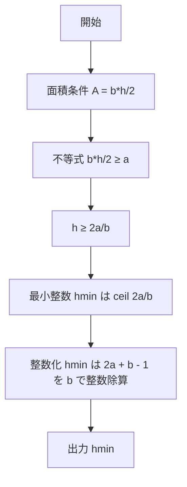

# Lowest Triangle - 最小の整数高さを一発で求める

- [概要](#overview)
- [アルゴリズム要点 (TL;DR)](#tldr)
- [図解](#figures)
- [証明のスケッチ](#proof)
- [計算量](#complexity)
- [Python 実装（HackerRank 形式）](#impl)
- [CPython 最適化ポイント](#cpython)
- [エッジケースと検証](#edgecases)
- [FAQ](#faq)

---

<h2 id="overview">概要</h2>

- **プラットフォーム/ID**: HackerRank `lowest-triangle`
- **問題タイトル**: Lowest Triangle
- **要約**:
  底辺の長さ $b$、高さ $h$ の三角形の面積は $A=\dfrac{b\cdot h}{2}$。
  面積が少なくとも $a$ となるような三角形の**最小の整数高さ** $h_{\min}$ を求める。
- **入出力仕様（簡潔）**:

  - 入力: 1 行、空白区切りの 2 整数 $b,\ a$
  - 出力: 条件を満たす最小の整数高さ $h_{\min}$

- **関数シグネチャ（HackerRank 準拠）**:

  - `lowestTriangle(trianglebase: int, area: int) -> int`

- **代表例**:

  - 例 1: 入力 $b=2,\ a=2$ → 出力 $2$
  - 例 2: 入力 $b=17,\ a=100$ → 出力 $12$

---

<h2 id="tldr">アルゴリズム要点 (TL;DR)</h2>

- 面積条件 $ \dfrac{b\cdot h}{2} \ge a $ より、$ h \ge \dfrac{2a}{b} $。
- 求めるのは **最小の整数** $h$ なので
  $$h_{\min}=\left\lceil \frac{2a}{b} \right\rceil.$$
- 浮動小数を使わず**純整数演算**で天井を計算する：
  $$\left\lceil \frac{x}{y} \right\rceil ;=; \frac{x+y-1}{y}\quad\text{(整数除算)},\ \ x=2a,\ y=b.$$
- 実装は 1 行：`(2*area + trianglebase - 1) // trianglebase`。
- 計算量は **Time $O(1)$ / Space $O(1)$**。

---

<h2 id="figures">図解</h2>

## **フローチャート（計算の流れ）**



_説明_: 面積条件から不等式を立て、必要最小高さを天井で求め、浮動小数を避けて整数演算に落とす手順を示す。

### **データフロー（入力から出力まで）**


_説明_: $b,a$ から $2a$ を作り、天井演算を整数の割り算へ変換して結果を返す。

---

<h2 id="proof">証明のスケッチ</h2>

- **不変条件**: 面積は常に $A=\dfrac{b\cdot h}{2}$。
- **導出**: 面積下限 $A\ge a$ より
  $$
  \frac{b\cdot h}{2} \ge a ;\Longleftrightarrow; h \ge \frac{2a}{b}.
  $$
- **最小整数の存在**: 右辺は実数。したがって最小の整数 $h$ は
  $$
  h_{\min}=\left\lceil \frac{2a}{b} \right\rceil
  $$
  で一意に定まる。
- **整数天井の等価変形**: 正の整数 $x,y$ に対し
  $$
  \left\lceil \frac{x}{y} \right\rceil = \frac{x+y-1}{y}
  $$
  が成り立つ（$x$ を $y$ で割るときの切り上げを余りで分類すれば示せる）。
- **終了性**: 単一の四則演算と整数除算のみで有限回で終了。

---

<h2 id="complexity">計算量</h2>

- **Time**: $O(1)$
- **Space**: $O(1)$

---

<h2 id="impl">Python 実装（HackerRank 形式・型注釈付き）</h2>

> 実装は **純粋関数**（副作用なし）。数式とコードの対応をコメントで明示。

```python
from __future__ import annotations
from typing import Final

#
# Complete the 'lowestTriangle' function below.
#
# The function is expected to return an INTEGER.
# The function accepts following parameters:
#  1. INTEGER trianglebase
#  2. INTEGER area
#

def lowestTriangle(trianglebase: int, area: int) -> int:
    """
    面積が少なくとも `area` になるような、底辺 `trianglebase` を持つ三角形の
    最小の整数高さを返す。

    数式対応:
      A = (b * h) / 2 >= a  ⇒  h >= (2a) / b
      h_min = ceil((2a)/b) = (2a + b - 1) // b   （整数演算での天井）
    """
    # x := 2a, y := b とおく。ceil(x/y) = (x + y - 1) // y（x,y>0 の整数）
    # 浮動小数点を使わず誤差ゼロ・一定時間で計算
    x: Final[int] = 2 * area
    y: Final[int] = trianglebase
    return (x + y - 1) // y
```

> **HackerRank の入出力ラッパ**（`if __name__ == "__main__": ...`）はプラットフォーム側に用意済み。上記関数だけを完成させればよい。

---

<h2 id="cpython">CPython 最適化ポイント</h2>

- **整数は任意精度**: オーバーフロー無しで安全に扱える。
- **浮動小数の不使用**: `math.ceil(2*a/b)` よりも整数演算が速く、丸め誤差もゼロ。
- **定数時間演算**: 加減乗と単一の整数除算のみ。分岐・ループは無し。
- **Final ヒント**: `Final` は実行速度に直接効かないが、読み手と型チェッカに不変意図が伝わり保守性向上。

---

<h2 id="edgecases">エッジケースと検証</h2>

- **厳密割り切り**: $2a \bmod b = 0$ のとき、$h_{\min} = \dfrac{2a}{b}$（整数）。
  例: $b=4,\ a=6$ → $2a=12$ は $b=4$ で割り切れるので $h_{\min}=3$。
- **非割り切り**: $2a \bmod b \ne 0$ のとき、$h_{\min} = \left\lceil \dfrac{2a}{b} \right\rceil$。
  例: $b=17,\ a=100$ → $h_{\min}=12$。
- **小さな底辺**: $b=1$ でも式はそのまま適用可（$h_{\min}=2a$）。
- **$a=0$ のケース**: 数学的には $h_{\min}=0$ が最小（面積 $0$ で十分）。ただし問題の制約で $a\ge1$ が想定されることが多い。
- **大きな値**: 非常に大きな $a,b$ でも任意精度整数により安全に処理。

### **代表例の再確認**

| 入力例         | 期待する式                                             | 出力 |
| -------------- | ------------------------------------------------------ | ---- |
| $b=2,\ a=2$    | $h_{\min}=\left\lceil \dfrac{4}{2} \right\rceil=2$     | $2$  |
| $b=17,\ a=100$ | $h_{\min}=\left\lceil \dfrac{200}{17} \right\rceil=12$ | $12$ |

---

<h2 id="faq">FAQ</h2>

- **Q. 浮動小数で `math.ceil(2*a/b)` としてはいけないの？**
  **A.** 可能だが、極端に大きな整数で丸め誤差が紛れる恐れがある。整数演算の天井 `(2*a + b - 1)//b` は誤差ゼロで同等以上に高速。

- **Q. なぜ $h_{\min}$ は一意？**
  **A.** $h$ の下限は実数で $\dfrac{2a}{b}$ によって決まり、その上で最小の整数は天井関数で一意に定まるから。

- **Q. 計算量をもっと下げられる？**
  **A.** これ以上は下がらない。定数個の演算のみで $O(1)$ が下限。

- **Q. 実装での注意点は？**
  **A.** ゼロ除算を避けるため $b>0$ は前提（問題制約）。また、型は `int` を用い、浮動小数を生成しない。

---
