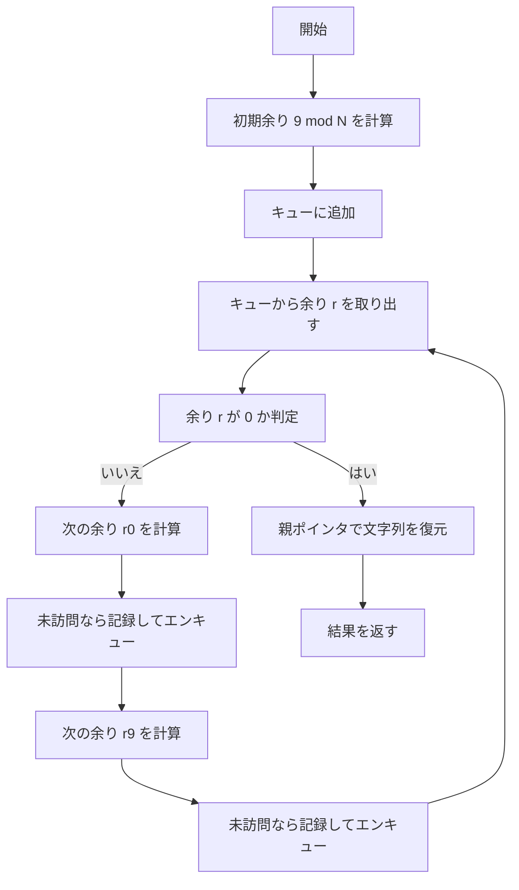
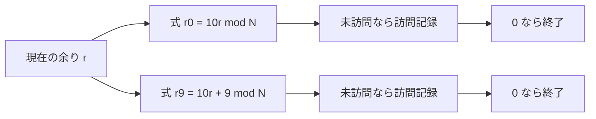

# Special Multiple - 最小の 9 と 0 のみで作る倍数を求める

- **Platform / ID**: HackerRank `special-multiple`
- **CPython**: 3.13.3
- **要旨**: 与えられた整数 $N$ に対し、数字 $9$ と $0$ のみからなる正の整数のうち、**最小**で $N$ の倍数となる数を各テストケースごとに求める。

---

## 目次

- [概要](#overview)
- [アルゴリズム要点 TL;DR](#tldr)
- [図解](#figures)
- [証明のスケッチ](#proof)
- [計算量](#complexity)
- [Python 実装](#impl)
- [CPython 最適化ポイント](#cpython)
- [エッジケースと検証](#edgecases)
- [FAQ](#faq)

---

<h2 id="overview">概要</h2>

- **問題要約**: 任意の $N$ に対し、数字集合 ${0,9}$ のみで構成される正の整数 $X$（先頭は $0$ 不可）のうち、**最小**で $N$ の倍数となるものを求める。
- **入出力仕様（簡潔）**:

  - 入力: 最初の行にテスト数 $T$。続く $T$ 行に各 $N$（$1 \le N \le 500$）。
  - 出力: 各 $N$ について最小の $X$ を 1 行ずつ出力。

- **関数シグネチャ（HackerRank 準拠）**: `solve(n: int) -> str`
- **想定データ構造**: キュー（BFS 用 `deque`）、配列（`visited`, `parent`, `digit`）
- **代表例**:

| 入力 $N$ | 出力 $X$ | 理由                                          |
| -------: | -------: | --------------------------------------------- |
|      $1$ |      $9$ | $9 \bmod 1 = 0$                               |
|      $5$ |     $90$ | $90 \bmod 5 = 0$ かつ $90$ は $9$ と $0$ のみ |
|      $7$ |   $9009$ | $9009 \bmod 7 = 0$                            |

---

<h2 id="tldr">アルゴリズム要点 (TL;DR)</h2>

- 実数の桁列を直接巨大化させず、**剰余に対する BFS** を行う。
- **状態**: 余り $r \in {0,\dots,N-1}$
- **遷移**（末尾に $d \in {0,9}$ を付与）:
  $$
  r' \;=\; (10r + d) \bmod N
  $$
  特に $d=0,9$ より
  $$
  r_0 \;=\; (10r) \bmod N,\quad r_9 \;=\; (10r + 9) \bmod N
  $$
- **開始**: 文字列 "9"（余り $9 \bmod N$）
- **終了**: 余り $0$ に到達したら、記録した親ポインタから桁列を復元
- **最小性**:

  - BFS により**桁数最小**が保証される。
  - 同一桁数での数値最小は、**'0' → '9' の順に展開**して担保。

- **計算量**: 1 個の $N$ につき **Time $O(N)$**, **Space $O(N)$**

---

<h2 id="figures">図解</h2>



**説明**: 余りを頂点、末尾に '0' と '9' を付ける操作を辺とみなすグラフで BFS。最初に余り $0$ に到達した経路が、桁数・数値の両面で最小。



**説明**: 遷移式 $r_0=(10r)\bmod N$ と $r_9=(10r+9)\bmod N$ に基づくデータフロー。

---

<h2 id="proof">証明のスケッチ</h2>

- **不変条件**: キュー内の各余りは、ある桁列 $s$（$s$ は $9$ と $0$ のみ）の値を $N$ で割った余りである。
  基底: 開始 "9" は条件を満たす。
  保持: $s$ の末尾に $0$ または $9$ を付けても桁列は ${0,9}$ のみで構成。
- **到達可能性**: 余り集合は有限（$N$ 個）。BFS は有限回の探索で必ず既訪問に戻るか $0$ に到達する。
- **最小性**:

  - BFS はレベル順（桁数順）探索なので、最初に $0$ に到達した経路は**桁数最小**。
  - 同一レベル内で '0' を先に展開することで、**数値として最小**の候補が先に到達する。

- **終了性**: 各余りは高々 1 度のみ訪問されるため、探索は高々 $N$ 回のノード展開で終了。

数式の対応（遷移）:

$$
\begin{aligned}
\text{末尾に } 0 &: \quad r' = (10r) \bmod N \
\text{末尾に } 9 &: \quad r' = (10r + 9) \bmod N
\end{aligned}
$$

---

<h2 id="complexity">計算量</h2>

- **時間計算量**: $O(N)$（各余りは 1 回のみ訪問）
- **空間計算量**: $O(N)$（`visited`, `parent`, `digit`, キュー）

---

<h2 id="impl">Python 実装</h2>

> **HackerRank 形式**: 既定の入出力はテンプレートに委ね、関数 `solve(n: int) -> str` を完成。
> 実装は **Pure**（関数は引数のみに依存）。数式との対応をコメントで記述。

```python
from __future__ import annotations

import os
from collections import deque
from typing import Dict, List, Final

# 同一 N へ再利用するためのメモ化
_MEMO: Dict[int, str] = {}

def _bfs_smallest_zeros_nines(n: int) -> str:
    """
    {0, 9} だけで構成される N の倍数のうち、最小のものを BFS で求める。

    数式対応:
      現在の余りを r とする。末尾に桁 d∈{0,9} を付与すると、
        r' = (10 * r + d) mod N
      特に:
        d = 0 のとき r0 = (10 * r) mod N
        d = 9 のとき r9 = (10 * r + 9) mod N
    """
    if n == 1:
        return "9"

    # remainder ∈ [0, n-1] で配列を確保
    parent: List[int] = [-1] * n     # 到達直前の余り
    digit: List[str] = [''] * n      # 到達に使った末尾文字 '0' or '9'
    visited: List[bool] = [False] * n

    # 開始ノードは "9"
    start: int = 9 % n
    visited[start] = True
    parent[start] = -1
    digit[start] = '9'
    if start == 0:
        return "9"

    q: deque[int] = deque([start])

    # 数値の最小性を担保するため、'0' → '9' の順で展開
    while q:
        r = q.popleft()

        # 末尾に '0' を付与: r0 = (10 * r) mod n
        r0: int = (r * 10) % n
        if not visited[r0]:
            visited[r0] = True
            parent[r0] = r
            digit[r0] = '0'
            if r0 == 0:
                break
            q.append(r0)

        # 末尾に '9' を付与: r9 = (10 * r + 9) mod n
        r9: int = (r * 10 + 9) % n
        if not visited[r9]:
            visited[r9] = True
            parent[r9] = r
            digit[r9] = '9'
            if r9 == 0:
                break
            q.append(r9)

    # 余り 0 から親ポインタで復元（逆順）してから反転
    out: List[str] = []
    cur: int = 0
    while cur != -1:
        out.append(digit[cur])
        cur = parent[cur]
    return ''.join(reversed(out))  # 先頭 0 は構成上生じない

def solve(n: int) -> str:
    """
    HackerRank から呼ばれる純粋関数。
    戻り値は文字列（巨大数に備える）。
    計算量: Time O(n), Space O(n)
    """
    cached = _MEMO.get(n)
    if cached is not None:
        return cached
    ans = _bfs_smallest_zeros_nines(n)
    _MEMO[n] = ans
    return ans
```

---

<h2 id="cpython">CPython 最適化ポイント</h2>

- **巨大整数の抑制**: 実数の連結生成を避け、常に $r \bmod N$ の計算のみ。
- **配列アクセス最適化**: `list` を用いた連続領域アクセス（`visited`, `parent`, `digit`）。
- **`deque` の使用**: BFS の `popleft`/`append` を $O(1)$ に。
- **早期終了**: 余り $0$ 到達時に探索を直ちに打ち切り。
- **メモ化**: 同一 $N$ の再計算を $O(1)$ に短絡。

---

<h2 id="edgecases">エッジケースと検証</h2>

- $N=1$ → 出力は $9$
- $N \mid 9$（例: $N=3,9$）→ 初手で解に到達
- 偶数 $N$ → 先頭が $0$ にならないように開始は常に "9"
- 大量テスト $T \le 10^4$ → 同一 $N$ はメモ化で高速
- 制約上限 $N=500$ → 配列長 $500$、メモリは定数級で軽量
- 前ゼロ → 構成上発生しない（開始が '9'、復元は `digit` ベース）

### **入出力例（要点確認）**

```text
入力:
3
5
7
1

出力:
90
9009
9
```

- 検算: $90 \bmod 5 = 0$, $9009 \bmod 7 = 0$, $9 \bmod 1 = 0$

---

<h2 id="faq">FAQ</h2>

- **Q. なぜ BFS が「最小の数」を保証できるのですか？**
  **A.** レベル順探索により**桁数**が最小の解が最初に見つかります。さらに各レベル内で '0' を先に展開するため、**同一桁数での数値**も最小になります。

- **Q. 実際の数を作らずに余りだけを追って本当に正しいのですか？**
  **A.** 任意の中間値 $x$ に対して末尾付加は $x \mapsto 10x$ または $x \mapsto 10x+9$。
  よって余りは $r \mapsto (10r+d) \bmod N$ で完全に追跡できます。$r=0$ に到達した経路は必ず $N$ の倍数の実体に対応します。

- **Q. 文字列連結のコストは問題になりませんか？**
  **A.** 復元時に 1 回だけ `''.join(...)` を行い、中間連結は行いません。最大桁数は高々 $N$（$N \le 500$）で十分軽量です。

- **Q. '9' と '0' の展開順は逆でもよいですか？**
  **A.** 実行上は可能ですが、**数値最小性**を素直に満たすためには '0' を先に展開するのが簡潔で安全です。

---

## **表示に関する注意**

- Mermaid の日本語が文字化けする場合は、利用側のスタイルで `.mermaid { font-family: "Noto Sans JP", ... }` の指定を推奨します。
- KaTeX はインライン `$...$`、ブロック `$$...$$` を使用しています。

### 正しい書き方（2 通り）

本来はイコールの前後に**空き**を入れたかったところで、`\;=\;` と書くべきところが `;=;` になっています。`KaTeX` では `;` はただのセミコロンとして表示されてしまうので、不適切です。

1. 単にイコールだけ（最も素直）

   $$
   r' = (10r + d) \bmod N
   $$

2. イコール前後に**薄い空き**を入れる（読みやすさ重視）
   $$
   r' ;=; (10r + d) \bmod N
   $$

特に $d=0,9$ より

$$
r_0 ;=; (10r) \bmod N,\quad r_9 ;=; (10r + 9) \bmod N
$$

> 参考：空きのコマンドは `$\, \: \; \quad \qquad$` などが使えます（小さい順におおよそ `\, < \: < \; < \quad < \qquad`）。
> また剰余は文脈に応じて `\bmod N` や `\pmod{N}`（括弧の外で使う形式）を使い分けると綺麗です。
