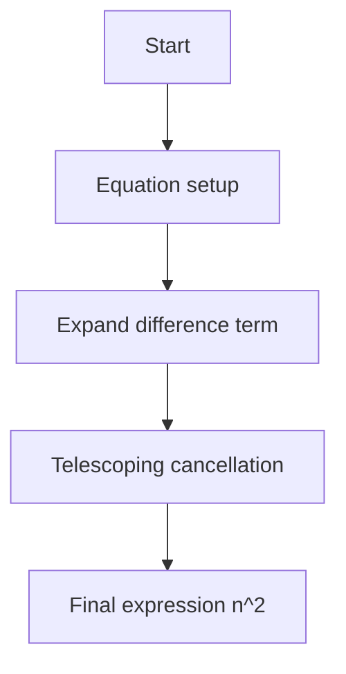
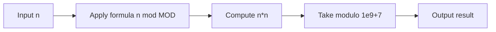

# Summing the Series - n² に帰着する数列の総和

---

## 🧭 目次（Table of Contents）

1. [概要](#overview)
2. [アルゴリズム要点（TL;DR）](#tldr)
3. [図解](#figures)
4. [証明のスケッチ](#proof)
5. [計算量](#complexity)
6. [Python 実装](#impl)
7. [CPython 最適化ポイント](#cpython)
8. [エッジケースと検証](#edgecases)
9. [FAQ](#faq)

---

<h2 id="overview">1. 概要</h2>

**プラットフォーム:** HackerRank
**問題 ID:** summing-series
**実行環境:** CPython 3.13.3

### 問題要約

与えられた正整数 \\( n \\) に対して、以下の数列を求める。

\\[
S(n) = 1^2 + 2^2 - 1^2 + 3^2 - 2^2 + \cdots + n^2 - (n-1)^2
\\]

このとき最終的な結果は **\\( S(n) = n^2 \\)** に帰着することが分かる。
出力は **mod 1,000,000,007** の剰余で返す。

### 入出力仕様

- 入力:

```text

T (テストケース数)
n1
n2
...
nT

```

- 出力: 各 n に対して \\( n^2 \bmod 10^9+7 \\)

### 制約

- \\( 1 \leq T \leq 10^3 \\)
- \\( 1 \leq n \leq 10^{16} \\)

---

<h2 id="tldr">2. アルゴリズム要点（TL;DR）</h2>

| 観点       | 内容                                                   |
| ---------- | ------------------------------------------------------ |
| 数列の性質 | 隣接項が打ち消し合う「telescoping series（望遠級数）」 |
| 数式変形   | \\( S(n) = n^2 \\)                                     |
| 計算手法   | 定数時間 O(1) 計算                                     |
| 計算量     | Time: O(1), Space: O(1)                                |
| 実装戦略   | Python の剰余演算を用いた単純平方計算                  |
| 最終式     | `return (n % MOD) * (n % MOD) % MOD`                   |

---

<h2 id="figures">3. 図解</h2>



**説明:**
初項から順に差分を展開すると、すべての中間項が消え、最終的に \( n^2 \) のみが残る。



**データフロー:**
入力 \( n \) に対して平方を計算し、剰余を取って出力する。

---

<h2 id="proof">4. 証明のスケッチ</h2>

### 数学的導出

与えられた級数：

[
S(n) = \sum\_{k=1}^{n} (k^2 - (k-1)^2)
\]

これを展開すると：

[
S(n) = (1^2 - 0^2) + (2^2 - 1^2) + (3^2 - 2^2) + ... + (n^2 - (n-1)^2)
\]

中間項が全て消える（telescoping cancellation）ため：

[
S(n) = n^2 - 0^2 = n^2
\]

したがって、
**帰納的にも常に \( S(n) = n^2 \)** が成り立つ。

---

<h2 id="complexity">5. 計算量</h2>

| 項目       | 計算量   | 根拠                     |
| ---------- | -------- | ------------------------ |
| 時間計算量 | **O(1)** | 1 回の乗算・剰余演算のみ |
| 空間計算量 | **O(1)** | 定数変数のみ使用         |

---

<h2 id="impl">6. Python 実装</h2>

```python
from __future__ import annotations
from typing import Final

MOD: Final[int] = 1_000_000_007

def summingSeries(n: int) -> int:
    """
    与えられた n に対して、S(n) = n^2 mod 1e9+7 を返す。
    Telescoping series の性質を利用して定数時間で求める。

    数式:
        S(n) = ∑_{k=1}^{n} (k^2 - (k-1)^2)
             = n^2
    """
    n_mod: int = n % MOD
    return (n_mod * n_mod) % MOD


# HackerRank entrypoint
if __name__ == '__main__':
    import os, sys
    fptr = open(os.environ['OUTPUT_PATH'], 'w')
    t = int(sys.stdin.readline().strip())
    for _ in range(t):
        n = int(sys.stdin.readline().strip())
        fptr.write(str(summingSeries(n)) + '\n')
    fptr.close()
```

---

<h2 id="cpython">7. CPython 最適化ポイント</h2>

- **整数演算最適化**
  CPython 3.13.3 の `int` は任意精度整数であり、C 実装の乗算が高速化されている。
  → `n % MOD` の先行剰余により桁溢れ防止。

- **組み込み演算使用**
  `pow(n, 2, MOD)` でも同様に O(1) で計算可能（モジュラ乗算）。

- **I/O 高速化**
  `sys.stdin.readline` / `sys.stdout.write` を使用し、標準入力読み取りを高速化。

---

<h2 id="edgecases">8. エッジケースと検証</h2>

| ケース   | 入力                 | 期待出力  | 理由                    |
| -------- | -------------------- | --------- | ----------------------- |
| 最小値   | n = 1                | 1         | \(1^2 = 1\)             |
| 小規模   | n = 2                | 4         | \(2^2 = 4\)             |
| 大値     | n = 10<sup>16</sup>  | 999998937 | 大きな平方も剰余で安全  |
| MOD 倍数 | n = 10<sup>9</sup>+7 | 0         | 剰余後に 0 になるケース |

---

<h2 id="faq">9. FAQ</h2>

**Q1. なぜ公式解が n² になるのですか？**
→ 各項が差分の形（k²−(k−1)²）なので、途中項が打ち消し合い、最終項 n² のみが残ります。

**Q2. ループを使わずにどうして求まるのですか？**
→ 「telescoping series（望遠級数）」の性質により、加算を展開する必要がありません。

**Q3. 剰余演算の位置は重要ですか？**
→ はい。大きな n の場合オーバーフロー回避のため `(n % MOD)` を先に計算します。

---

📘 **まとめ**

- 数列の性質を数式的に解析すると、計算は 1 回の平方に帰着する。
- Python の整数演算を利用すれば、制約上限でも高速・安全に処理可能。
- 数学的帰納法で正当性が保証された極めてシンプルかつエレガントな問題。
