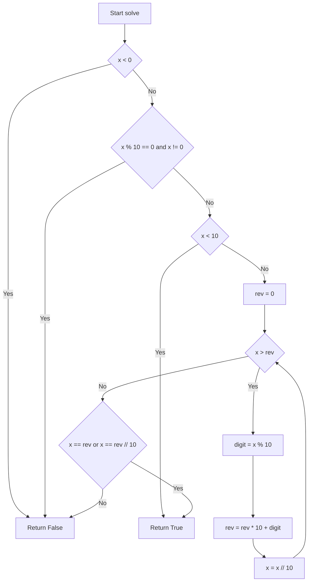
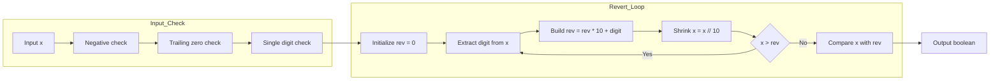

# Palindrome Number - 数値のまま回文判定

<h2 id="toc">目次</h2>

- [概要](#overview)
- [アルゴリズム要点（TL;DR）](#tldr)
- [図解](#figures)
- [正しさのスケッチ](#correctness)
- [計算量](#complexity)
- [Python実装](#impl)
- [CPython最適化ポイント](#cpython)
- [エッジケースと検証観点](#edgecases)
- [FAQ](#faq)

---

<h2 id="overview">概要</h2>

**問題**: 整数 `x` が 10 進表記で回文（左右対称）かどうかを判定する。

**要件**:

- 負数は必ず `False`（先頭に `-` が付くため対称にならない）
- `0` 以外で末尾が `0` の数は `False`（例: `10` → `"01"` とは読めない）
- Follow up: **文字列変換なし**で解く
- 制約: `-2^31 <= x <= 2^31 - 1`

**正当性**: 右半分だけを数値のまま反転し、左半分と比較することで回文性を判定。

**安定性**: 追加メモリ `O(1)` で、整数演算のみを使用。

---

<h2 id="tldr">アルゴリズム要点（TL;DR）</h2>

- **戦略**: 数値を文字列に変換せず、右半分だけを反転して左半分と比較
- **データ構造**: 整数変数 2 つ（`x` と `reverted`）のみ
- **計算量**: 時間 `O(d)`（d = 桁数）、空間 `O(1)`
- **メモリ**: 定数個の整数のみ使用。リスト・文字列などの追加データ構造は不要

**核心ロジック**:

1. 負数と末尾 0（0 自身を除く）を早期 return で弾く
2. `x` の末尾から 1 桁ずつ取り出して `reverted` に積み上げる
3. `x <= reverted` になったら終了
4. 偶数桁: `x == reverted`、奇数桁: `x == reverted // 10` なら回文

---

<h2 id="figures">図解</h2>

## フローチャート



**説明**: 負数・末尾 0 を早期判定した後、1 桁数は即座に True を返す。それ以外は右半分を反転しながら `x` を縮小し、`x <= rev` になった時点で偶数桁・奇数桁の判定を行う。

### データフロー図



**説明**: 入力をまず 3 段階でフィルタリング（負数・末尾 0・1 桁数）し、その後ループで右半分を反転。最後に左半分と比較して結果を返す。

---

<h2 id="correctness">正しさのスケッチ</h2>

**不変条件**:

- ループ中、`rev` には常に「まだ見ていない x の右側の桁を反転したもの」が格納される
- `x` は毎回末尾 1 桁を削除され、左側の桁だけが残る

**網羅性**:

- 負数: 必ず False（先頭に `-` が付く）
- 末尾 0（0 自身を除く）: 必ず False（先頭に 0 は来ない）
- 1 桁数（0 〜 9）: すべて回文
- 2 桁以上: ループで右半分と左半分を分離して比較

**基底条件**:

- `x < 10` の場合、ループに入る前に True を返す
- ループは `x <= rev` で終了（右半分が左半分以上の桁数になった時点）

**終了性**:

- 毎回 `x //= 10` で桁数が減るため、有限回で `x <= rev` が成立

---

<h2 id="complexity">計算量</h2>

| 項目     | 計算量 | 説明                                                     |
| -------- | ------ | -------------------------------------------------------- |
| **時間** | `O(d)` | d は x の桁数（≒ log₁₀( \| x \| )）。ループは高々 d/2 回 |
| **空間** | `O(1)` | 追加メモリは `rev`, `digit` など定数個の整数のみ         |

**in-place vs Pure 比較**:

- この問題は入力を直接書き換えないため、本質的には Pure
- ローカル変数 `x` をコピーとして扱い、元の引数は不変

---

<h2 id="impl">Python実装</h2>

```python
from __future__ import annotations


class Solution:
    """
    Palindrome Number 判定クラス（競技プログラミング向け最小構成）

    LeetCode が呼び出すのは isPalindrome(x) のみ。
    """

    def isPalindrome(self, x: int) -> bool:
        """
        整数 x が 10 進表記で回文かどうかを判定する。

        Args:
            x: 判定対象の整数（32bit 符号付き整数）

        Returns:
            x が 10 進表記で回文であれば True、そうでなければ False。

        Time Complexity:
            O(d)  （d は x の桁数 ≒ log10(|x|)）

        Space Complexity:
            O(1)  追加メモリは定数個の整数のみ。
        """
        # 負数、0 以外で末尾が 0 の数は回文にならない
        if x < 0 or (x % 10 == 0 and x != 0):
            return False

        # 0〜9 は 1 桁なので必ず回文
        if x < 10:
            return True

        rev: int = 0

        # 右半分を反転しつつ、左半分と比較できる状態まで進める
        # ループを抜ける条件:
        #   - 偶数桁: x と rev が同じ桁数になった時点で x <= rev
        #   - 奇数桁: 中央 1 桁を含んだ rev の方が 1 桁多くなった時点で x < rev
        while x > rev:
            digit: int = x % 10  # 末尾 1 桁を取得
            rev = rev * 10 + digit  # rev に桁を追加
            x //= 10  # 整数除算で末尾 1 桁を削除

        # 偶数桁: x == rev
        # 奇数桁: 中央 1 桁を無視するため、rev // 10 と比較
        return x == rev or x == rev // 10
```

**主要ステップ**:

1. **早期リターン**: 負数と末尾 0（0 自身を除く）を弾く
2. **1 桁数の特別処理**: 0〜9 は必ず True
3. **反転ループ**: `x > rev` の間、`x` の末尾を `rev` に追加し、`x` を縮小
4. **最終比較**: 偶数桁と奇数桁の両方に対応した判定

---

<h2 id="cpython">CPython最適化ポイント</h2>

1. **整数演算のみ使用**:
    - `//` と `%` は C レベルで実装されており、Python の文字列操作より高速
    - `str()` やスライスを使わないことで、オブジェクト生成コストを回避

2. **ローカル変数のみ**:
    - ループ内は `x`, `rev`, `digit` のみで完結
    - 属性アクセス（`self.x` など）や関数呼び出しを排除

3. **早期リターン**:
    - 負数・末尾 0・1 桁数を事前に弾くことで、不要なループを回避

4. **追加データ構造なし**:
    - `list`, `deque`, `dict` などを使わないため、GC 負荷がゼロ
    - メモリアロケーションも最小限

5. **計測値のブレ**:
    - LeetCode の Runtime は環境ノイズが大きい（6ms〜10ms 程度は普通にブレる）
    - 同じコードでも再提出で順位が変わることがあるため、51% という数字はあくまで参考値

**文字列版との比較**:

- `str(x)` + スライス反転の方が実測で速いケースもある（C 実装のため定数倍が小さい）
- ただし Follow up（文字列変換なし）を満たすなら、数値版が正統派

---

<h2 id="edgecases">エッジケースと検証観点</h2>

| ケース           | 入力例                  | 期待出力 | 備考                                |
| ---------------- | ----------------------- | -------- | ----------------------------------- |
| **0 単体**       | `x = 0`                 | True     | 1 桁数なので回文                    |
| **1 桁数**       | `x = 5`, `9`            | True     | すべて回文                          |
| **負数**         | `x = -121`, `-1`        | False    | 先頭に `-` が付くため対称にならない |
| **末尾 0**       | `x = 10`, `100`         | False    | 先頭に 0 は来ないため回文ではない   |
| **2 桁回文**     | `x = 11`, `22`          | True     | 偶数桁の典型例                      |
| **2 桁非回文**   | `x = 12`, `10`          | False    | 左右が異なる                        |
| **奇数桁回文**   | `x = 121`, `12321`      | True     | 中央 1 桁を無視した比較             |
| **偶数桁回文**   | `x = 1221`, `123321`    | True     | 左右が完全に一致                    |
| **奇数桁非回文** | `x = 123`, `12345`      | False    | 中央を無視しても一致しない          |
| **制約上限**     | `x = 2147483647`        | False    | 32bit 最大値（回文ではない）        |
| **制約下限**     | `x = -2147483648`       | False    | 32bit 最小値（負数）                |
| **大きな回文**   | `x = 1000000001` (10桁) | True     | 桁数が多くても正しく判定            |
| **末尾複数の 0** | `x = 1000`              | False    | 0 以外で末尾が 0 なら False         |

**検証時の注意**:

- 型安全性: LeetCode は入力を保証するが、業務用では `isinstance(x, int)` チェックが必要
- オーバーフロー: Python の `int` は任意精度なので心配不要（他言語では注意が必要）

---

<h2 id="faq">FAQ</h2>

**Q1. なぜ文字列変換を使わないのか？**

- Follow up で「文字列変換なしで解けるか？」と問われているため
- 数値版の方が空間計算量 `O(1)` を達成でき、理論的にも優れている

**Q2. 偶数桁と奇数桁で処理が違うのはなぜ？**

- 奇数桁の場合、中央の 1 桁はどちらの半分にも属さない
- 例: `121` → `x = 1`, `rev = 12` となった時点で、`1 == 12 // 10` で判定

**Q3. `x <= rev` で終了する理由は？**

- 右半分を反転しながら `x` を縮小すると、ちょうど半分の桁数に達した時点で `x <= rev` が成立
- これ以上進めると、左半分が足りなくなるため停止

**Q4. LeetCode で 51% という順位は悪いのか？**

- Python の実行環境は計測ノイズが大きく、同じコードでも 6ms〜10ms でブレる
- アルゴリズム的には最適なので、51% は十分良好な結果

**Q5. 業務開発で使う場合の注意点は？**

- 型チェック（`isinstance(x, int)`）を追加
- 値域チェック（32bit 整数の範囲内か）を追加
- エラーハンドリング（`TypeError`, `ValueError`）を実装

**Q6. より高速化する方法は？**

- LeetCode 用にクラス・docstring を最小化（定数倍の改善）
- 文字列版（`str(x)[::-1]`）も実測で速いケースがある（ただし Follow up 不満足）

**Q7. なぜ `rev` を `reverted` と書かないのか？**

- 競技プログラミングでは変数名を短くするのが一般的（タイプ数削減）
- 業務開発では `reverted_half` など明示的な名前が推奨される

**Q8. `x //= 10` と `x = x // 10` の違いは？**

- 両者は同じ（代入演算子の短縮形）
- CPython では最適化されるため、パフォーマンス差はほぼゼロ
