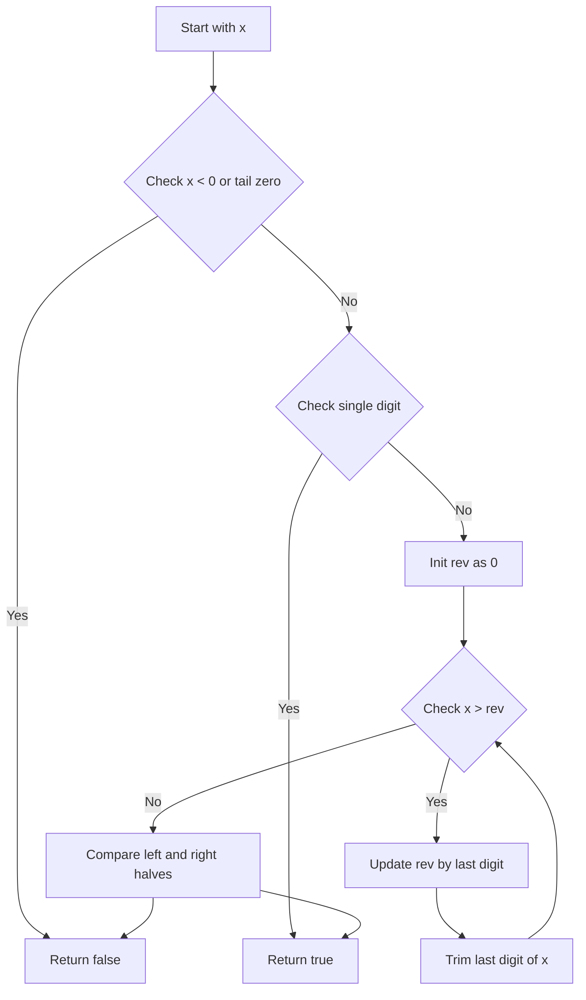
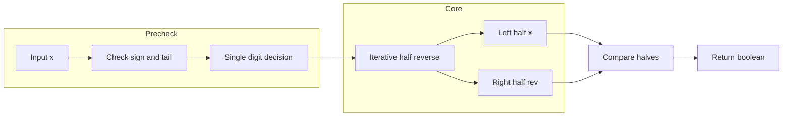

# Palindrome Number - 整数が回文かを数値だけで判定する

## Table of Contents

- [概要](#overview)
- [アルゴリズム要点（TL;DR）](#tldr)
- [図解](#figures)
- [正しさのスケッチ](#correctness)
- [計算量](#complexity)
- [Python 実装](#impl)
- [CPython 最適化ポイント](#cpython)
- [エッジケースと検証観点](#edgecases)
- [FAQ](#faq)

---

<h2 id="overview">概要</h2>

- **問題タイトル**: Palindrome Number

- **プラットフォーム / ID**: LeetCode 9

- **関数シグネチャ**:

    ```python
    class Solution:
        def isPalindrome(self, x: int) -> bool:
            ...
    ```

- **問題要約**:
    - 整数 `x` が 10 進数表記で「左右対称（回文）」かどうかを判定する。
    - 例:
        - `121` → `True`
        - `-121` → `False`（`-121` vs `121-`）
        - `10` → `False`（`10` vs `01`）

- **入出力仕様（簡潔）**:
    - 入力: 整数 `x` （`-2^31 <= x <= 2^31 - 1`）
    - 出力: 回文なら `True`、そうでなければ `False`

- **Follow up**:
  「**整数を文字列に変換せずに**解けるか？」が問われる。

この解説では、**文字列変換を使わずに数値だけで判定する O(log10|x|)・O(1) アルゴリズム**と、その Python 実装を扱います。

---

<h2 id="tldr">アルゴリズム要点（TL;DR）</h2>

- 戦略（数値のみ）:
    - 負数 → 即 `False`
    - `0` 以外で末尾が `0` の数 → 即 `False`（先頭に `0` は立てられない）
    - `0..9` の 1 桁 → 即 `True`
    - それ以外は、**右半分の桁だけを反転**して整数 `rev` を作り、
        - `x == rev`（偶数桁）または
        - `x == rev // 10`（奇数桁、中央 1 桁を無視）
          なら回文と判定。

- データ構造:
    - すべて `int`（Python の整数）のみ。配列・文字列・追加構造体は不要。

- 想定計算量:
    - 時間: `O(d)` (`d` は桁数、≒ `O(log10|x|)`)
    - 空間: `O(1)`（定数個の整数だけ）

- 主要な数値操作:
    - `digit = x % 10` で末尾 1 桁
    - `x //= 10` で末尾 1 桁を削除
    - `rev = rev * 10 + digit` で反転側に桁を追加

---

<h2 id="figures">図解</h2>

### フローチャート（制御フロー）



- 負数・末尾 0 のパターン・1 桁のパターンを先にフィルタし、その後ループで右側半分を反転して比較する流れを表しています。

### データフロー図（x と rev の関係）



- 入力 `x` が事前チェックを通過したあと、コア部で `x` と `rev` の 2 つの整数に分かれ、最終的に「左右の半分を比較して bool を返す」というデータの流れを示しています。

---

<h2 id="correctness">正しさのスケッチ</h2>

このアルゴリズムが常に正しい結果を返す理由を、いくつかの観点から簡潔に整理します。

### 1. 事前フィルタの正しさ

1. **負数** (`x < 0`)
    - 10 進表記では必ず先頭に `-` が付くため、左右対称にはなり得ない。
    - よって負数は常に回文ではない → `False` が正しい。

2. **末尾が 0 の数** (`x % 10 == 0 and x != 0`)
    - 先頭に `0` を付けて表記することはないため、
        - 例: `10` → `"10"` と `"01"` は異なる。

    - `0` 自体は回文だが、それ以外で末尾が 0 の数は必ず非回文 → `False` が正しい。

3. **1 桁の数** (`0 <= x <= 9`)
    - 1 桁の数は左右から読んでも同じなので、必ず回文 → `True` が正しい。

### 2. ループ中の不変条件（invariant）

ループ本体では、毎回以下を行います。

- `digit = x % 10` で末尾 1 桁を取り出す
- `rev = rev * 10 + digit` で `rev` の末尾にこの桁を追加
- `x //= 10` で `x` の末尾 1 桁を削除

このとき、ループの各反復において次の不変条件が成り立ちます。

- `rev` は、**元の数の下位から取り出した桁列の反転**になっている。
- `x` は、**元の数の上位側が残っている**数になっている。
- 「現在までに `rev` に取り込んだ桁列」と「`x` に残っている桁列」を並べると、元の `x` の桁列に対応する。

### 3. ループ終了条件と偶数/奇数桁の扱い

ループは `while x > rev:` という条件で回します。

- **偶数桁**の場合:
    - 例: `1221`
    - 途中で `x` と `rev` は同じ桁数になり、最後には `x == rev` となる。
    - このとき `x == rev` であれば左右対称、そうでなければ非対称と判定できる。

- **奇数桁**の場合:
    - 例: `12321`
    - 最後には `rev` の方が 1 桁多い（中央の桁を含む）状態で `x < rev` となりループを抜ける。
    - このとき、`rev // 10` を取ると中央の 1 桁が削除されるため、
        - `x == rev // 10` なら左右対称、
        - そうでなければ非対称と判断できる。

このため、ループ後の条件

```python
x == rev or x == rev // 10
```

は、「元の数が回文である」ための必要十分条件になります。

### 4. 終了性

- 毎回 `x //= 10` により `x` は桁数が 1 つずつ減少していく。
- `x` は有限桁数なので、必ず有限回の反復で `x <= rev` となりループを抜ける。
- したがってアルゴリズムは必ず終了します。

---

<h2 id="complexity">計算量</h2>

- 入力整数 `x` の桁数を `d` とする。

### 時間計算量

- 各ループ反復で、`x` の桁数を 1 つ削減していく。
- 最大でも `d` 回程度の反復でループが終了する。
- 各反復内の処理は定数時間（数回の算術演算と比較）のみ。

**時間計算量:**

- `O(d)` （≒ `O(log10 |x|)`）

### 空間計算量

- 使用している追加の変数は
    - `rev`（反転した右半分）
    - `digit`（一時的な 1 桁）
    - `x`（破壊的に更新）

- いずれも `int` であり、配列や辞書などの追加データ構造は使用していない。

**空間計算量:**

- 追加メモリは定数個の整数 → `O(1)`

---

<h2 id="impl">Python 実装</h2>

以下は、LeetCode の Python 環境（CPython 3.11+）で動作する、`class Solution` 形式の実装です。
pylance で型エラーが出ないように、引数・戻り値には明示的に型注釈を付けています。

```python
from __future__ import annotations


class Solution:
    def isPalindrome(self, x: int) -> bool:
        """
        整数 x が 10 進表記で回文かどうかを判定する。

        Args:
            x: 判定対象の整数

        Returns:
            x が回文であれば True、そうでなければ False。
        """
        # 1. 負数、0 以外で末尾が 0 の数は回文にならない
        #    例: -121, 10, 100 など
        if x < 0 or (x % 10 == 0 and x != 0):
            return False

        # 2. 0〜9 の 1 桁の整数は必ず回文
        if x < 10:
            return True

        # 3. 右半分の桁を反転して作る整数 rev
        rev: int = 0

        # 4. x が rev 以下になるまで、末尾の桁を移動し続ける
        #    - 偶数桁: 最終的に x と rev は同じ桁数になる
        #    - 奇数桁: rev の方が 1 桁多くなる（中央の桁を含む）
        while x > rev:
            # x の末尾 1 桁を取り出して rev に追加
            rev = rev * 10 + (x % 10)
            # x から末尾 1 桁を削除
            x //= 10

        # 5. 偶数桁: x == rev であれば回文
        #    奇数桁: rev の中央 1 桁を無視するため rev // 10 と比較
        return x == rev or x == rev // 10
```

- この実装は問題文の制約（32bit 整数）に依存せず、任意の Python `int` に対しても正しく動作します（Python `int` は任意精度のため）。
- LeetCode 上ではこの `Solution.isPalindrome` だけが呼び出され、外部状態には依存しない **純粋関数的な実装**です。

---

<h2 id="cpython">CPython 最適化ポイント</h2>

この問題はシンプルですが、CPython 3.11+ での挙動を踏まえた細かな最適化ポイントも押さえておきます。

1. **整数演算のみを使用** - `str()` で文字列に変換してからスライスで比較する方法もありますが、- 文字列オブジェクトの作成 - スライスによる新しい文字列の生成
   と、余分なオブジェクトが増えます。- 今回の実装は、C 実装の `int` 演算（`%`, `//`, `*`, `+`）だけを使うため、オブジェクト生成を最小限にできます。

2. **ループ内で関数呼び出しを行わない**
    - `while` ループの本体は、すべてローカル変数へのアクセスと算術演算のみ。
    - 属性アクセス・関数呼び出しをループ外に追い出しているので、バイトコードレベルでのオーバーヘッドが小さいです。

3. **追加データ構造を持たない**
    - `list`, `deque`, `dict`, `set` などを使わないため、GC による負荷もほぼありません。
    - メモリ局所性もよく、CPU キャッシュにも優しい構造です。

4. **条件分岐の位置**
    - 高頻度でヒットする可能性のある条件（負数・末尾 0・1 桁）をループの前に寄せることで、ループに入るケースを削減しています。

---

<h2 id="edgecases">エッジケースと検証観点</h2>

主なエッジケースと、それぞれで期待される挙動を整理します。

1. **負数**
    - 例: `x = -1`, `x = -121`, `x = -10`
    - 期待結果: すべて `False`
    - 理由: 10 進表記で `-` が付くため必ず非回文。

2. **0（ゼロ）**
    - 例: `x = 0`
    - 期待結果: `True`
    - 理由: `"0"` は左右対称。

3. **1 桁の正の整数**
    - 例: `x = 1..9`
    - 期待結果: すべて `True`
    - 理由: 1 桁は必ず回文。

4. **末尾が 0 の正の整数**
    - 例: `x = 10`, `x = 100`, `x = 1010`
    - 期待結果: すべて `False`
    - 理由: 先頭に `0` を置く表記はしないため、左右対称になり得ない。

5. **典型的な回文**
    - 例: `x = 121`, `x = 1221`, `x = 12321`, `x = 1001`
    - 期待結果: すべて `True`

6. **非回文の正の整数**
    - 例: `x = 123`, `x = 1231`, `x = 1002`
    - 期待結果: すべて `False`

7. **制約の境界付近**
    - 例:
        - `x = 2**31 - 1 = 2147483647`
        - `x = -2**31 = -2147483648`

    - 期待:
        - 正側: 回文でなければ `False`
        - 負側: 負数なので `False`

    - Python `int` は任意精度なのでオーバーフローの心配はないが、LeetCode の制約範囲として確認。

これらのケースを手計算で追うことで、実装が期待どおりに動いているか、境界条件を誤っていないかを確認できます。

---

<h2 id="faq">FAQ</h2>

**Q1. 文字列に変換して `s == s[::-1]` ではダメなの？**

- アルゴリズムとしてはそれでも正しく解けますし、Python ではかなり簡潔で高速です。
- ただし、この問題には「文字列に変換せずに解けるか？」という Follow up が付いているため、
    - **低レイヤの数値アルゴリズムを設計できるか**
    - **余分なメモリを使わずに O(1) 空間で解けるか**
      が評価ポイントになります。

- 本実装はその Follow up を満たす形になっています。

---

**Q2. どうして「数値全体を反転」ではなく「半分だけ反転」するの？**

- 全体を反転して `rev == x` を確かめる方法でも解けますが、
    - 反転の途中でオーバーフローする可能性がある言語（C++ / Java 等）では追加のチェックが必要になります。

- 半分だけ反転する方法は、
    - 途中で値が必要以上に大きくなりにくい
    - 奇数桁と偶数桁を一貫して処理できる
      といった利点があります。

- Python では任意精度整数なので overflow は問題になりませんが、**他言語でもそのまま通用する堅牢な設計**という意味でもこの方法が好まれます。

---

**Q3. 関数の中で引数 `x` を書き換えているけれど、これは問題ないの？**

- Python では整数 `int` はイミュータブルですが、**変数 `x` が指す値を更新しているだけ**なので問題ありません。
- 外部から渡されたオブジェクト（リストや辞書など）を破壊的に変更しているわけではなく、
    - 引数 `x` のスコープは関数内部に閉じています。

- この問題の仕様では、関数の外側から `x` の元の値にアクセスすることはないため、**純粋関数的な意味での「副作用」はありません。**

---

以上が、LeetCode 9「Palindrome Number」の Python / CPython 3.11+ 向け解説と実装です。数値だけで回文判定を行うパターンは、他の「桁ごとの処理」問題にも応用しやすいので、仕組みごと理解しておくと再利用性が高まります。
