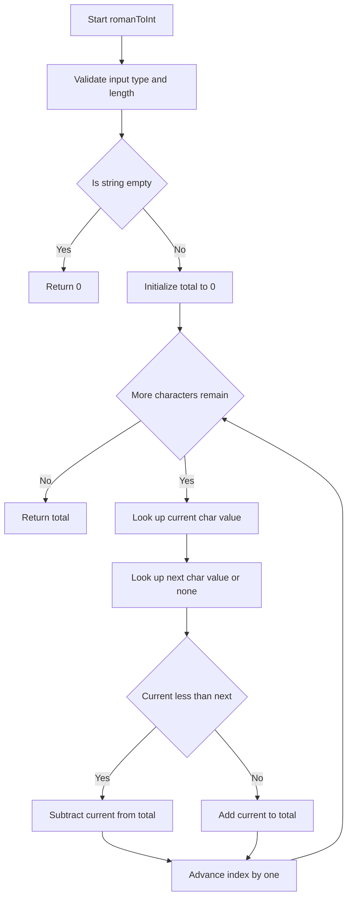
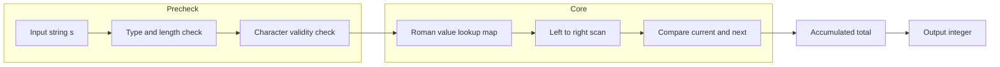

# Roman to Integer - ローマ数字の文字列を整数に変換する問題

## 目次

- [概要](#overview)
- [アルゴリズム要点（TL;DR）](#tldr)
- [図解](#figures)
- [正しさのスケッチ](#correctness)
- [計算量](#complexity)
- [Python 実装](#impl)
- [CPython最適化ポイント](#cpython)
- [エッジケースと検証観点](#edgecases)
- [FAQ](#faq)

---

<h2 id="overview">概要</h2>

> 💡 **初学者向け補足**：この問題は、一言で言うと「ローマ数字（`I`, `V`, `X`, `L`, `C`, `D`, `M`）で書かれた文字列を読み取り、対応する整数に変換する問題」です。

ローマ数字は基本的に「大きい記号から小さい記号へ左から右に並べる」というルールで書かれますが、`IV`（4）や`IX`（9）のように「小さい記号を大きい記号の前に置くことで引き算を表す」という例外ルールが6パターン存在します。この問題の難しさは、単純に文字を数値に置き換えて足し算するだけでは正しい答えが出せず、**「今見ている文字」と「次に来る文字」の大小関係を見て、足すか引くかを判断する必要がある**という点にあります。

制約は `1 <= s.length <= 15` と非常に小さく、かつ「`s` は `[1, 3999]` の範囲で有効なローマ数字であることが保証されている」ため、複雑な検証ロジックや高度なアルゴリズムは不要です。むしろ、いかにシンプルで読みやすく、かつ型安全なコードを書けるかがポイントになります。

- 入力：ローマ数字を表す文字列 `s`（例：`"MCMXCIV"`）
- 出力：対応する整数（例：`1994`）
- 制約：`s` は有効なローマ数字であることが保証されている（不正な文字列は入力として来ない）

> 📖 **この章で登場した用語**
>
> - **制約**：入力として与えられる値の範囲や条件のこと。今回は「文字列の長さは1〜15」「有効なローマ数字であること」が制約
> - **正当性**：アルゴリズムが常に正しい答えを返すことの保証

---

<h2 id="tldr">アルゴリズム要点（TL;DR）</h2>

> 💡 **初学者向け補足**：TL;DR（Too Long; Didn't Read、＝「長くて読めない人向けの要約」）とは、詳しい説明を読む前に「なんとなくこういう手順で解くんだな」というイメージを掴むための要約です。詳しい理由は後の章で説明します。

- **文字→数値の対応表（`dict`）を用意する**：7種類の記号を毎回`if-elif`で判定するより、辞書（＝キーから値を高速に取り出せるデータ構造）を1回引く方が速く、コードも短くなるため。
- **文字列を左から右へ1回だけ走査する**：追加のメモリやソートを必要とせず、`O(n)` 時間・`O(1)` 空間で解けるため。
- **「現在の文字の値」と「次の文字の値」を比較する**：現在値が次の値より小さければ引き算（例：`IV`のとき`I`は引く）、そうでなければ足し算する、というルールで判定できるため。
- **走査が終わったら合計値をそのまま返す**：追加の後処理は不要なため、シンプルな構造で完結する。

> 📖 **この章で登場した用語**
>
> - **TL;DR**：「長くて読めない人向けの要約」を意味する略語
> - **辞書（`dict`）**：キーを指定して値を取り出せるデータ構造。今回は文字（キー）から数値（値）を取り出すのに使う
> - **走査**：データを順番に1つずつ調べていくこと

---

<h2 id="figures">図解</h2>

> 💡 **初学者向け補足**：図はアルゴリズムの「処理の流れ」を視覚的に示したものです。Mermaidフローチャートでは、**ひし形（`{}`）は条件分岐**、**長方形（`[]`）は処理ステップ**を表します。矢印を上から下へたどっていくことで、プログラムがどう動くかを追うことができます。

### フローチャート

この図は、`romanToInt` 関数が入力文字列を受け取ってから合計値を返すまでの処理の流れを表しています。上から下へ読み進めてください。



主要なノードの意味：

- `Start[Start romanToInt]`：関数の入り口。ローマ数字の文字列を受け取る
- `CheckEmpty{Is string empty}`：入力が空文字列かどうかを判定するひし形（条件分岐）
- `LoopCheck{More characters remain}`：まだ処理していない文字が残っているかを判定する、ループの継続条件
- `Compare{Current less than next}`：「今見ている文字の値」が「次の文字の値」より小さいかを判定する、このアルゴリズムの核心部分
- `Subtract[Subtract current from total]` / `Add[Add current to total]`：判定結果に応じて合計値を引くか足すかを行うステップ

### データフロー図

この図は、入力文字列がどのようなデータの変換を経て最終的な整数値になるかを表しています。



主要な流れの説明：

- 入力文字列から検証済みの文字列へ：型・長さ・文字の妥当性をチェックする
- 検証済みの文字列から対応表の参照へ：`dict`を使って文字を数値に変換する準備を行う
- スキャンから比較・蓄積へ：1文字ずつ処理しながら合計値（`total`）を更新していく

> 💡 **代表例でのトレース**：入力 `s = "MCMXCIV"` を使って、上記フローチャートの各ノードをどのように通過するかを示します。

```
Step 1: Start → 入力 = "MCMXCIV"
Step 2: Validate → 文字列であり、長さも1〜15の範囲内 → 問題なし
Step 3: CheckEmpty → 空ではない → No
Step 4: InitTotal → total = 0
Step 5: i=0, current='M'(1000), next='C'(100) → Compare: 1000 < 100 は False → Add → total=1000
Step 6: i=1, current='C'(100), next='M'(1000) → Compare: 100 < 1000 は True → Subtract → total=900
Step 7: i=2, current='M'(1000), next='X'(10) → Compare: False → Add → total=1900
Step 8: i=3, current='X'(10), next='C'(100) → Compare: True → Subtract → total=1890
Step 9: i=4, current='C'(100), next='I'(1) → Compare: False → Add → total=1990
Step 10: i=5, current='I'(1), next='V'(5) → Compare: True → Subtract → total=1989
Step 11: i=6, current='V'(5), next=なし → 無条件でAdd → total=1994
Step 12: LoopCheck → 残り文字なし → ReturnTotal
結果: 1994
```

> 📖 **この章で登場した用語**
>
> - **フローチャート**：処理の手順を図形と矢印で表したもの。ひし形＝条件分岐、長方形＝処理
> - **データフロー図**：データがどのように変換・移動するかを示す図
> - **サブグラフ**：フローチャートの中で関連する処理をグループ化したもの。今回は「事前チェック（Precheck）」と「本処理（Core）」に分けている

---

<h2 id="correctness">正しさのスケッチ</h2>

> 💡 **初学者向け補足**：「正しさのスケッチ」とは、アルゴリズムが常に正しい答えを返すことの根拠を整理したものです。数学的な厳密証明ではなく、「なぜ正しいと言えるか」を直感的に説明するものです。

- **不変条件（＝処理中ずっと成り立ち続けるべき条件）**：ループの各ステップが終わった時点で、`total`には「それまでに処理した文字列の先頭部分（プレフィックス）を正しく変換した値」が入っている。例えば `"MCM"` まで処理し終えた時点で `total = 1900` となっており、これは`"MCM"`単体を正しく変換した値と一致する。
- **網羅性（＝すべてのケースをもれなく処理できているという保証）**：ローマ数字の減算ルールは「`I`は`V`,`X`の前」「`X`は`L`,`C`の前」「`C`は`D`,`M`の前」の6パターンしかなく、いずれも「現在の文字の値 < 次の文字の値」という条件に一致する。それ以外のすべての並び（大きい記号が先、または同じ記号の連続）は「現在の文字の値 >= 次の文字の値」となり、単純な加算で正しく処理される。つまり、比較条件だけで全パターンを漏れなくカバーできる。
- **基底条件（＝再帰やループの終了条件）**：このアルゴリズムはループ（再帰ではない）だが、対応する終了条件は「走査するインデックス`i`が文字列の長さに達したとき」。このとき`LoopCheck`が`No`となり、`total`をそのまま返す。
- **終了性（＝アルゴリズムが必ず有限ステップで終わるという保証）**：ループは毎回インデックス`i`を1ずつ増やしており、文字列の長さは最大15という有限の値なので、必ず有限回のステップでループを抜ける。

> 📖 **この章で登場した用語**
>
> - **不変条件**：アルゴリズムが正しく動くために、処理中ずっと成り立ち続けるべき条件
> - **基底条件**：ループや再帰の終了条件。これがないと無限ループになる
> - **終了性**：アルゴリズムが必ず有限ステップで終わるという保証
> - **網羅性**：すべてのケースをもれなく処理できているという保証

---

<h2 id="complexity">計算量</h2>

> 💡 **初学者向け補足**：計算量とは「入力が大きくなるにつれて、処理にかかる時間・メモリがどう増えるか」の目安です。

| 記法 | 意味 | 直感的なイメージ |
| --- | --- | --- |
| `O(1)` | 入力サイズによらず一定 | 辞書で直接ページを開く |
| `O(n)` | 入力に比例して増加 | リストを端から順に読む |
| `O(n log n)` | nよりやや速く増加 | 辞書を二分探索で引く&times;n回 |
| `O(n&sup2;)` | 入力の2乗で増加 | 全ペアを総当たりで確認する |

- **時間計算量：`O(n)`**（`n`は文字列の長さ）。文字列を左から右へ1回だけ走査するため、文字数に比例した時間しかかからない。
- **空間計算量：`O(1)`**。文字→数値の対応表は文字の種類数（7種類）に固定されており入力サイズに依存しない。合計値を保持する変数も1つだけなので、追加のメモリ使用量は入力サイズによらず一定。

> 📖 **この章で登場した用語**
>
> - **時間計算量**：入力の大きさに対して処理にかかる手間がどう増えるかの目安
> - **空間計算量**：処理中に使うメモリ量がどう増えるかの目安
> - **in-place**：新しいメモリを確保せず元のデータを直接書き換える操作。空間計算量を抑えられる
> - **Pure**：入力を変更せず新しいデータを返す操作。今回の実装は入力文字列を変更しないPureな実装

---

<h2 id="impl">Python 実装</h2>

> 💡 **初学者向け補足**：コードを読む前に、実装の全体的な骨格を示します。
>
> 1. 文字→数値の対応表をクラス変数として用意する
> 2. `_validate`メソッドで入力が文字列であること・空でないこと・不正な文字を含まないことを確認する
> 3. 合計値を表す変数`total`を`0`で初期化する
> 4. 文字列を先頭から1文字ずつ見ていき、「今の文字の値」が「次の文字の値」より小さければ引く、そうでなければ足す
> 5. 走査が終わったら`total`を返す
>
> コード内の型ヒント`Optional[int]`は「`int`または`None`のどちらか」を表します。次の文字が存在しない（今見ている文字が最後の文字である）場合に`None`を使うことで、pylance（VSCodeの型チェッカー）にも意図が正しく伝わります。

```python
from __future__ import annotations

from typing import Dict, Final, Optional


class Solution:
    """
    Roman to Integer (LeetCode 13) を解決するクラス。

    ローマ数字を表す文字列を受け取り、対応する整数値を返す。
    """

    # クラス変数として文字→数値の対応表を保持する。
    # インスタンス（クラスから作られた個々のオブジェクト）ごとに
    # 作り直す必要がないデータなので、__init__の中ではなく
    # クラス変数として持たせることでメモリを節約できる。
    # Final を付けることで「この変数は再代入されない」ことを
    # pylanceに伝え、誤って書き換えるバグを防ぐ。
    _ROMAN_VALUES: Final[Dict[str, int]] = {
        "I": 1,
        "V": 5,
        "X": 10,
        "L": 50,
        "C": 100,
        "D": 500,
        "M": 1000,
    }

    def romanToInt(self, s: str) -> int:
        """
        ローマ数字の文字列を整数に変換する。

        Args:
            s: 変換対象のローマ数字文字列（例: "MCMXCIV"）。
               制約上、長さは1以上15以下で、有効なローマ数字である
               ことが保証されている。

        Returns:
            変換後の整数値（例: 1994）。

        Raises:
            TypeError: 入力が文字列でない場合。
            ValueError: 入力が空、または未知の文字を含む場合。
        """
        # 入力検証（防御的プログラミング：制約上は保証されているが、
        # 誤った呼び出しをされても安全に動作するようにする）
        self._validate(s)

        # ループの外で対応表への参照をローカル変数に束縛しておく。
        # self._ROMAN_VALUES というアクセスはPythonの内部で
        # 属性検索（辞書検索）を伴うため、ループの外で1回だけ
        # 済ませておくとループ内での検索コストを省ける。
        values = self._ROMAN_VALUES
        total = 0
        length = len(s)

        # 左から右へ1文字ずつ走査する
        for i in range(length):
            current = values[s[i]]

            # 次の文字が存在する場合のみその値を取得し、
            # 存在しない（今の文字が最後の文字である）場合はNoneとして扱う。
            # Optional[int] は「int または None のどちらか」を表す型ヒント。
            next_value: Optional[int] = values[s[i + 1]] if i + 1 < length else None

            # 現在値が次の値より小さい場合は「引き算ルール」
            # （IV, IX, XL, XC, CD, CM の6パターン）に該当する。
            if next_value is not None and current < next_value:
                total -= current
            else:
                total += current

        return total

    def _validate(self, data: object) -> None:
        """
        型安全な入力検証を行う。

        isinstance()で型チェックする。Pythonは動的型付け（＝変数の型を
        実行するまで確定しない性質）のため、呼び出し元が誤った型を
        渡しても実行時まで気づかない。pylance（型チェッカー）と
        組み合わせることでコンパイル言語相当の安全性を実現できる。
        """
        if not isinstance(data, str):
            raise TypeError("Input must be a string")

        if len(data) == 0:
            raise ValueError("Input cannot be empty")

        # all() + ジェネレータ式（＝リストを作らずに値を1つずつ
        # 順番に生成する書き方）で全文字の妥当性チェックを1行で行う。
        # forループを毎回書くより可読性が高く、内部的にはC実装の
        # all()が高速に処理してくれる。
        if not all(char in self._ROMAN_VALUES for char in data):
            raise ValueError("Input contains invalid roman numeral characters")
```

> 💡 **コードの動作トレース**（初学者向け）

```
入力: s = "LVIII"
呼び出し: romanToInt("LVIII")

Step 1: _validate("LVIII") → 文字列・空でない・全文字が対応表に存在 → 検証通過
Step 2: values = _ROMAN_VALUES, total = 0, length = 5

Step 3: i=0, current='L'(50), next='V'(5)
        50 < 5 は False → 加算 → total = 0 + 50 = 50

Step 4: i=1, current='V'(5), next='I'(1)
        5 < 1 は False → 加算 → total = 50 + 5 = 55

Step 5: i=2, current='I'(1), next='I'(1)
        1 < 1 は False（同じ値は減算対象にならない）→ 加算 → total = 55 + 1 = 56

Step 6: i=3, current='I'(1), next='I'(1)
        1 < 1 は False → 加算 → total = 56 + 1 = 57

Step 7: i=4, current='I'(1), next=なし
        next_value が None → 無条件で加算 → total = 57 + 1 = 58

最終結果: 58
```

> 📖 **この章で登場した用語**
>
> - **`from __future__ import annotations`**：型ヒントを文字列として遅延評価するようにする宣言。今回は必須ではないが、前方参照が必要になった場合に備えて先頭に記述する慣習がある
> - **`Final`**：一度代入した値を再代入できないことをpylanceに伝える型ヒント。定数であることを明示できる
> - **`@lru_cache`**：関数の結果をキャッシュするデコレータ。今回は再帰を使わないため未使用
> - **`Optional[int]`**：`int` または `None` のどちらかであることを表す型ヒント
> - **ジェネレータ式**：`(x for x in data)`のように、リストを作らずに値を1つずつ順番に生成する書き方。全要素を一度にメモリへ載せないためメモリ効率が良い

---

<h2 id="cpython">CPython最適化ポイント</h2>

> 💡 **初学者向け補足**：この章では「同じ処理でもPythonの書き方によって速さが変わる理由」を説明します。今回の問題は入力サイズが最大15文字と非常に小さいため体感できるほどの差は出ませんが、大規模な文字列を扱う場合を想定して最適化テクニックを紹介します。

**属性アクセスの削減**

```python
# 最適化前：ループの中で毎回 self._ROMAN_VALUES を検索する（遅い）
for i in range(length):
    current = self._ROMAN_VALUES[s[i]]

# 最適化後：ループの外で参照をローカル変数にキャッシュしておく（速い）
values = self._ROMAN_VALUES  # 属性アクセスを1回だけ行う
for i in range(length):
    current = values[s[i]]
# 理由：Pythonは self._ROMAN_VALUES にアクセスするたびに
#       インスタンス→クラスの順で辞書検索を行う。
#       参照をローカル変数に保存しておくとこの検索コストを
#       ループの外で1回だけに抑えられる。
```

**辞書ルックアップ vs if-elif連鎖**

```python
# if-elif連鎖：記号が増えるたびに分岐が増え、可読性も低下する
if char == "I":
    value = 1
elif char == "V":
    value = 5
# ...（以下同様に7分岐）

# 辞書（dict）ルックアップ：CPython内部でハッシュテーブルとして
# 実装されているため、記号の種類が増えても検索速度はO(1)のまま変わらない
value = values[char]
```

- **`bisect`や`heapq`について**：この問題は固定の対応表を1回引くだけで済むため、二分探索（`bisect`）や優先度付きキュー（`heapq`）を使う必要はありません。それらは「ソート済みデータへの高速な挿入・検索」や「最小値・最大値の高速な取り出し」が必要な問題で効果を発揮します。
- **スライスの回避**：今回の実装では`s[i]`という1文字アクセスのみを行い、`s[0:3]`のようなスライス（＝リストや文字列の一部を新しく作り出す操作）は使っていません。スライスは新しいオブジェクトを生成するためメモリと処理時間を消費しますが、今回は不要です。

> 📖 **この章で登場した用語**
>
> - **属性アクセス**：`self.x`のようにオブジェクトのプロパティを参照する操作。Pythonでは内部的に辞書検索が発生する
> - **スライス**：`arr[1:3]`のようにリストや文字列の一部を取り出す操作。新しいオブジェクトを生成するのでメモリを消費する
> - **ローカル変数キャッシュ**：属性やグローバル変数への参照を一度ローカル変数に保存することで、アクセスコストを削減するテクニック
> - **ハッシュテーブル**：キーを特殊な計算（ハッシュ関数）で変換し、値の格納場所を高速に特定できるデータ構造。`dict`の内部実装に使われている

---

<h2 id="edgecases">エッジケースと検証観点</h2>

> 💡 **初学者向け補足**：エッジケースとは「入力が空・最小値・最大値・重複あり」など、通常とは異なる境界的な入力のことです。エッジケースを見落とすと、普通のテストは通るのに特定の入力でだけバグが発生します。

- **最小長の文字列（`s = "I"`）**：1文字しかないため「次の文字」が存在しない。`next_value`が`None`になるケースを正しく処理できるかがポイント。この実装では`i + 1 < length`の条件チェックにより、`IndexError`（範囲外アクセスによるエラー）を起こさずに安全に処理できる。
- **減算ルールが登場しないケース（`s = "III"`）**：同じ文字が連続する場合、`current < next_value`は常に`False`になるため、単純な加算のみが行われる。
- **6種類すべての減算パターン（`IV`, `IX`, `XL`, `XC`, `CD`, `CM`）**：それぞれが正しく「大きい値から小さい値を引く」形で計算されるかを確認する必要がある。特に`CM`（900）のように、百の位の記号が千の位の記号の前に来るケースは見落としやすい。
- **最大値に近いケース（`s = "MMMCMXCIX"` = 3999）**：制約の上限値付近でも、走査回数が増えるだけでロジックが破綻しないことを確認する。
- **最大長の文字列（長さ15文字）**：制約上の最大長でもループが正しく最後まで完走し、`IndexError`が発生しないことを確認する。

> 📖 **この章で登場した用語**
>
> - **エッジケース**：空文字列・最小長・最大長など、境界的な条件の入力
> - **境界値**：制約の上限・下限にあたる値。今回は文字列長の`1`と`15`が該当する
> - **インデックスエラー（`IndexError`）**：リストや文字列の範囲外の要素にアクセスしようとしたときに発生するエラー

---

<h2 id="faq">FAQ</h2>

**Q1. なぜ`if-elif`の連鎖ではなく辞書（`dict`）を使うのですか？**

結論：辞書を使う方が高速かつ簡潔だからです。
理由：`dict`はCPythonの内部でハッシュテーブルとして実装されており、キーの数（今回は7種類）が増えても検索速度は変わりません。一方`if-elif`は記号の種類が増えるほど分岐が増え、可読性も低下します。
補足：今回のように記号の種類が少なくても、辞書を使うことで「対応表とロジックの分離」ができ、後から記号を追加・変更する際にも辞書の中身を書き換えるだけで済みます。

**Q2. なぜ「次の文字」を先読みする必要があるのですか？**

結論：ローマ数字の減算ルール（`IV`や`IX`など）は「今の文字」だけでは判断できず、「次に来る文字」との比較が必要だからです。
理由：例えば`I`という文字だけを見ても、それが単独の`1`なのか、`IV`の一部として`-1`扱いになるのかは、次に`V`や`X`が来るかどうかを見ないと分かりません。
補足：この実装では`s[i + 1]`にアクセスする前に`i + 1 < length`を確認することで、文字列の末尾で範囲外アクセスが発生しないようにしています。

**Q3. 右から左へ走査する方法（直前の最大値と比較する方法）ではダメなのですか？**

結論：どちらの方法でも正しく動作しますが、今回は左から右へ走査する方法を採用しました。
理由：問題文の説明（「`I`が`V`の前にあるので4になる」）が「今の文字と次の文字の関係」で語られているため、左から右への走査の方が問題文の説明と直感的に一致し、コードを読む人にも意図が伝わりやすいからです。
補足：右から左へ走査する方法は「直前に見た最大値より小さい文字が来たら引く」というロジックになり、計算量は同じ`O(n)`ですが、比較対象が「過去の最大値」という抽象的な概念になるため、初学者にはやや理解しにくい場合があります。

**Q4. `Optional[int]`という型ヒントはなぜ必要なのですか？**

結論：「次の文字の値」が存在する場合と存在しない場合の両方を型として正しく表現するためです。
理由：文字列の最後の文字を処理するとき、「次の文字」は存在しません。この「存在しない」状態を`None`で表現し、`Optional[int]`という型ヒントを付けることで、pylance（VSCodeの型チェッカー）が「`None`かもしれない値に対して不正な演算をしていないか」を実行前にチェックできるようになります。
補足：もし`Optional[int]`を使わず単に`int`とだけ書いてしまうと、pylanceは`next_value`が常に整数であると誤解し、`None`が渡された場合のバグを検出できなくなります。

**Q5. このアルゴリズムが常に正しい答えを返すと言えるのはなぜですか？**

結論：ローマ数字の減算ルールが「現在の文字の値 &lt; 次の文字の値」という1つの条件で完全にカバーできるからです。
理由：[正しさのスケッチ](#correctness)で説明した通り、ローマ数字における例外パターン（`IV`, `IX`, `XL`, `XC`, `CD`, `CM`）はすべて「小さい記号が大きい記号の直前に置かれる」という共通の形をしており、それ以外の並び方（大きい記号が先、または同じ記号の繰り返し）はすべて単純な加算で正しく処理されます。
補足：この性質のおかげで、特別な例外処理（例えば「もし`IV`という並びが来たら」のような文字列パターンマッチング）を書く必要がなく、たった1つの比較条件だけで問題を解決できています。

> 📖 **この章で登場した用語**
>
> - **FAQ**：Frequently Asked Questions（よくある質問）の略
> - **トレードオフ**：何かを得ると何かを失う関係。例：可読性を優先すると、多少のパフォーマンスを犠牲にすることがある
