# Algorithm-DataStructures-Math-SQL リポジトリ概要

## 目的とスコープ

本ドキュメントは、Algorithm-DataStructures-Math-SQL リポジトリの包括的な概要を提供します。このリポジトリは、アルゴリズム実装、インタラクティブな可視化、包括的なドキュメントを特徴とする多言語対応の教育プラットフォームです。競技プログラミング（LeetCode、HackerRank、AtCoder）、技術面接、コンピュータサイエンス教育に最適化された参照実装コレクションとして機能します。

リポジトリは4つのコア問題ドメイン（データ構造、アルゴリズム、数学、SQL）にわたるソリューションを実装しています。各問題には、多言語実装（Python、TypeScript、JavaScript）、インタラクティブなHTML デモンストレーション、詳細なマークダウンドキュメントが含まれています。教育インフラストラクチャは、ステップバイステップの可視化、パフォーマンスベンチマーク、標準化されたドキュメント品質管理を通じた実践的な学習を重視しています。

---

## リポジトリアーキテクチャ概要

リポジトリは、4つのコア問題ドメインと、すべての実装に一貫した教育インフラストラクチャを備えた体系的な組織パターンに従っています。

### コア問題ドメインと教育インフラストラクチャ

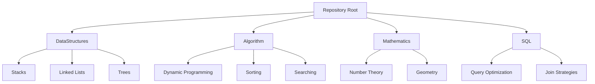

### 主要な問題カテゴリとコードエンティティ

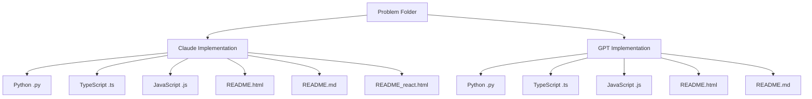

**主要問題カテゴリの例：**

- **スタックベース**: `largestRectangleArea()`, `simplifyPath()`
- **動的計画法**: `numDecodings()`, `minPathSum()`, `uniquePathsWithObstacles()`
- **ツーポインタ**: `partition()`, `removeDuplicates()`
- **分割統治**: `generateTrees()`, `isScramble()`
- **有限状態機械**: `isNumber()`

---

## 多言語実装フレームワーク

リポジトリは一貫したクロスランゲージアプローチを実装しており、各アルゴリズムは統一されたロジックを維持しながら、言語固有の最適化を活用しています。各問題フォルダには、それぞれのランタイムに最適化された同一のアルゴリズムアプローチを示す並列実装が含まれています。

### 多言語実装パターン（例：Decode Ways）

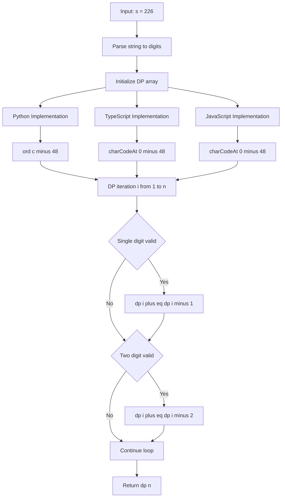

### 言語固有の最適化戦略

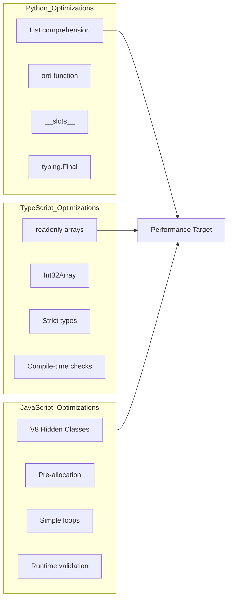

### 言語固有の実装詳細

| 言語 | クラス/関数パターン | 型システム | 主要な最適化 |
|------|---------------------|------------|--------------|
| **Python** | `class Solution:` with `def methodName(self, ...)` | `typing.Final`, `List`, `Optional` | `ord() - 48`, リスト内包表記, `__slots__`, CPython バイトコード |
| **TypeScript** | `function functionName(...)` | `readonly number[]`, 厳密な型 | `charCodeAt() - 48`, `Int32Array`, コンパイル時チェック |
| **JavaScript** | `function functionName(...)` または `var name = function(...)` | 動的型、実行時検証 | V8 Hidden Classes, 事前割り当て, シンプルなループ |

---

## アルゴリズムカテゴリと複雑性解析

リポジトリは計算複雑性別に実装を整理しており、線形時間最適解（最も一般的）、多項式アルゴリズム、メモ化による慎重に最適化された指数問題をカバーしています。

### 複雑性クラス別の問題分布

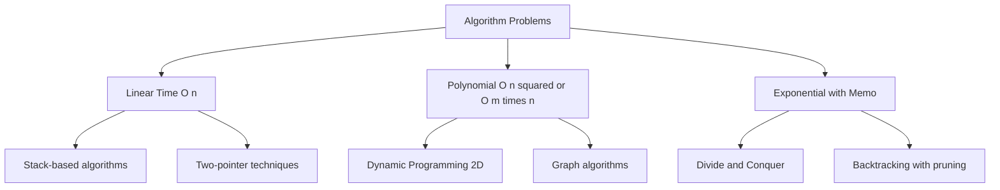

### 横断的アルゴリズムパターン

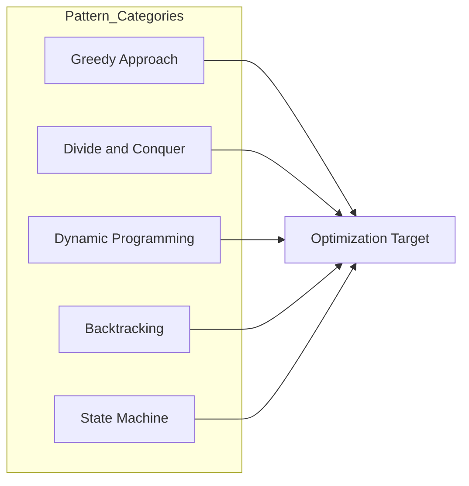

### カテゴリ別アルゴリズムカバレッジ

| パターン | 代表的な問題 | 時間計算量 | 空間最適化 | 言語 |
|---------|-------------|------------|------------|------|
| **スタックベース** | `largestRectangleArea()`, `simplifyPath()` | O(n) | O(n) スタック | Python, TypeScript, JavaScript |
| **動的計画法** | `numDecodings()`, `minPathSum()`, `uniquePathsWithObstacles()` | O(n) ～ O(m×n) | O(1) ローリング または O(n) 1D配列 | Python, TypeScript, JavaScript |
| **ツーポインタ** | `partition()`, `removeDuplicates()` | O(n) | O(1) in-place | Python, TypeScript, JavaScript |
| **分割統治** | `generateTrees()`, `isScramble()` | O(Catalan) | O(n) メモ | Python, TypeScript, JavaScript |
| **有限状態機械** | `isNumber()` | O(n) | O(1) | Python, TypeScript, JavaScript |

---

## 教育システムアーキテクチャ

リポジトリは3層の教育フレームワークを実装しています：静的マークダウンドキュメント、インタラクティブHTML デモンストレーション、React ベースの可視化。各問題には、品質管理基準によって保証された包括的なドキュメントが含まれています。

### 3層教育アーキテクチャ

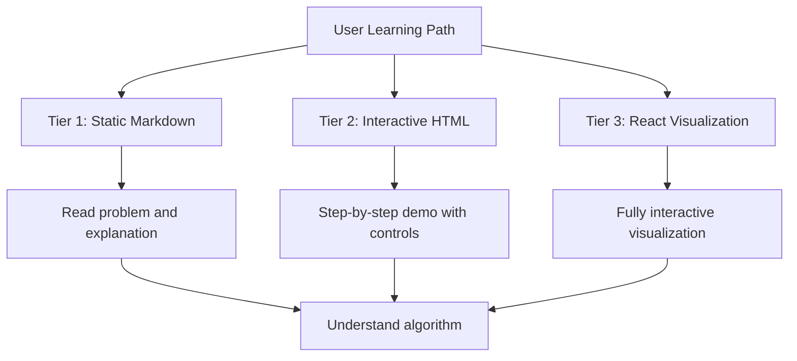

### インタラクティブな可視化コンポーネント（例：Decode Ways）

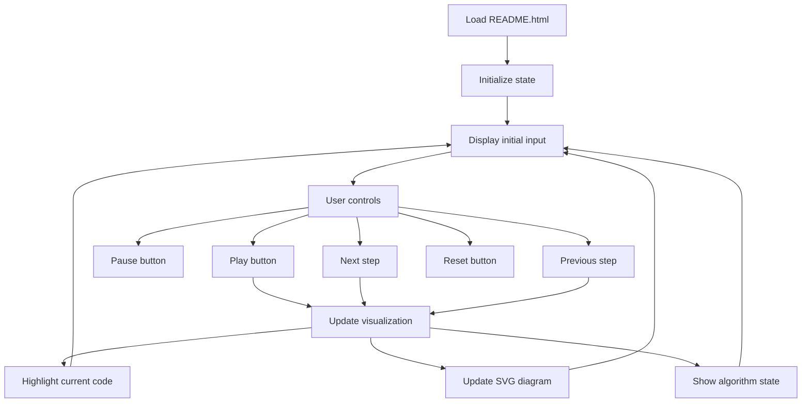

### ドキュメント標準と品質管理

リポジトリは `.markdownlint.json` 設定を通じて一貫したドキュメント品質を保証しています：

**品質管理ルール：**
- **行の長さ制御**: MD013 ルールで `line_length: 100`（コードブロックとテーブルを除く）
- **許可される HTML 要素**: MD033 は `h1`, `h2`, `details`, `summary`, `p`, `i`, `footer`, `div` を許可
- **5段階のドキュメント構造**:
  1. **問題の説明**（制約、例、入出力）
  2. **アルゴリズムの説明**（直感、ステップバイステップ、図解）
  3. **複雑性解析**（時間、空間、トレードオフ）
  4. **実装の詳細**（言語固有の最適化、エッジケース）
  5. **インタラクティブデモ**（実行可能なステップ、可視化、コードハイライト）

### インタラクティブデモンストレーション機能

各問題には、実践的な学習のためのインタラクティブコンポーネントが含まれています：

- **ステップバイステップ実行**: 各ステップでアルゴリズムの状態を示す SVG ベースの可視化
- **コントロールボタン**: 再生/一時停止、前へ、次へ、リセットで実行フローを探索
- **リアルタイムコードハイライト**: Prism.js を使用した行番号とコピー機能
- **パフォーマンス測定**: 実行解析のための `performance.now()` タイミング内蔵
- **レスポンシブデザイン**: モバイルファーストアプローチの Tailwind CSS

---

## コード構成とファイル構造

リポジトリは一貫したデュアル実装パターンに従い、各問題には Claude と GPT の両方のバリアントがあり、補完的な視点と教育アプローチを提供します。

### 問題フォルダ構造パターン

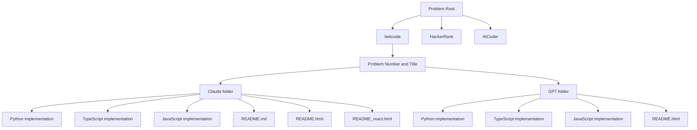

### コードファイルアーキテクチャ（3層パターン）

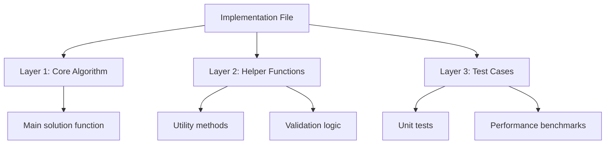

### 実装戦略：競技プログラミング vs プロダクション

リポジトリは異なるユースケースのためのデュアルバージョンを提供します：

**競技プログラミング版:**
- 最小限の検証（問題の制約を信頼）
- 最大実行速度
- 直接的なアルゴリズム実装
- 例: スタック問題の `solve_competitive()`

**プロダクション版:**
- 包括的な入力検証
- 型安全性の強化
- エラーハンドリングとエッジケース
- 例: 検証レイヤー付きの `solve_production()`

---

## 依存関係とシステム要件

リポジトリは最小限の外部依存関係を維持しながら、包括的なアルゴリズムカバレッジを提供します：

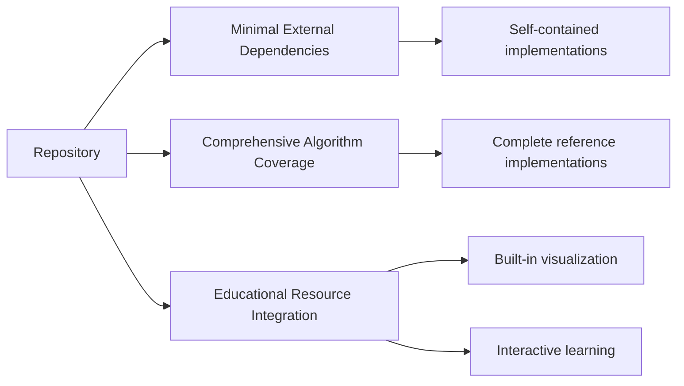

**主要な特徴：**
- **最小限の外部依存関係**: 重いフレームワークなしの自己完結型実装
- **包括的なアルゴリズムカバレッジ**: 複数ドメインにわたる完全な参照実装
- **教育リソース統合**: 組み込みの可視化とインタラクティブな学習コンポーネント

---

## まとめ

このアーキテクチャにより、リポジトリは複数の目的を果たすことができます：

1. **アルゴリズム学習**: 包括的な参照実装による学習
2. **競技プログラミング準備**: 最適化されたソリューション
3. **技術面接準備**: 実装パターンとベストプラクティス
4. **パフォーマンス最適化**: 言語固有のテクニック
5. **教育的価値**: インタラクティブな学習体験
6. **多言語一貫性**: 統一された API と実装ロジック

このリポジトリは、初心者から上級者まで、あらゆるレベルのプログラマーにとって価値のある学習リソースとなっています。

**⭐ このプロジェクトが役立ちましたら、ぜひスターを付けてください！**

