# Algorithm-DataStructures-Math-SQL リポジトリ概要

[](https://github.com/myoshi2891/Algorithm-DataStructures-Math-SQL/stargazers)
[](https://github.com/myoshi2891/Algorithm-DataStructures-Math-SQL/network/members)

[](https://deepwiki.com/myoshi2891/Algorithm-DataStructures-Math-SQL)

## リポジトリの目的と範囲

Algorithm-DataStructures-Math-SQLリポジトリは、2×3×3アーティファクト生成マトリックスを通じて、アルゴリズム問題のドキュメント化に対する体系的なアプローチを実装しています。各問題に対して18個のファイルが生成されます：

**生成されるファイル構成:**
- 2つのAI実装（Claude Sonnet 4.5、GPT-5.1 Thinking Customized）
- × 3つの言語（Python、TypeScript、JavaScript）
- × 3つのドキュメント階層（静的Markdown、インタラクティブHTML、動的React）

このマトリックスは決定論的に動作します。階層レベル4に問題が与えられると、システムはレベル5に正確に2つのディレクトリ（AIプロバイダー）を生成し、それぞれがレベル6に正確に9つのファイル（3言語 × 3ドキュメント形式）を含みます。

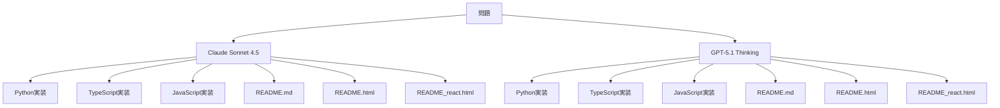

### コアナビゲーションパス

- **ドメイン別の実装パターン:** セクション3.1（アルゴリズム）、3.2（データ構造）、3.3（数学）、3.4（SQL）
- **最適化技術:** セクション4
- **開発環境:** セクション5

## コアアーキテクチャ：2×3×3アーティファクト生成マトリックス

マトリックスは3つの乗算された次元を通じて、問題ごとに18個のファイルを生成します。

**計算式:** `2 AIプロバイダー × 3言語 × 3ドキュメント階層 = 18アーティファクト`

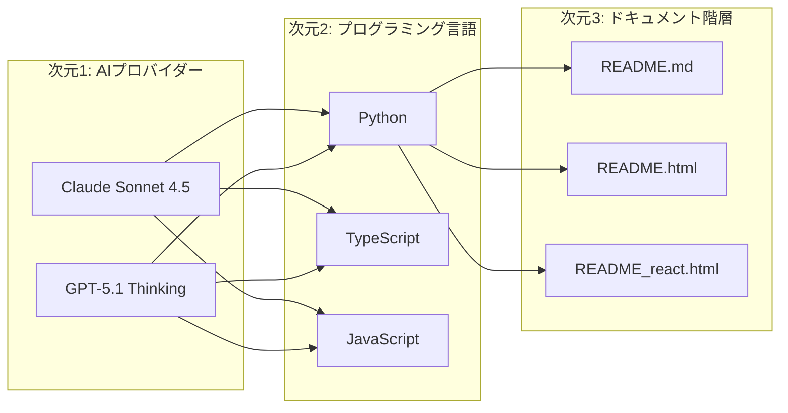

### マトリックス次元のコードエンティティへのマッピング

| 次元 | 値 | ファイルパターン | コード構造 |
|------|-----|------------------|------------|
| **AIプロバイダー** | Claude Sonnet 4.5 | `claude sonnet 4.5/` | 競技プログラミング最適化 |
| | GPT-5.1 Thinking Customized | `gpt 5.1 thinking customized/` | 本番環境の堅牢性 |
| **言語** | Python | `*.py` | `class Solution: def methodName(self, ...): ...` |
| | TypeScript | `*.ts` | `function functionName(...): returnType { ... }` |
| | JavaScript | `*.js` | `var functionName = function(...) { ... }` |
| **ドキュメント** | 静的 | `README.md` | 5セクションのMarkdown（概要、アルゴリズム、複雑性、実装、最適化） |
| | インタラクティブ | `README.html` | Prism.js + Tailwind CSS + ステップコントロール |
| | 動的 | `README_react.html` | React 18 + Babel Standalone + リアルタイム可視化 |

## 問題ごとのファイル生成パターン

マトリックスは厳格なファイル数を強制します：2ディレクトリ × 各9ファイル = 問題ごとに合計18アーティファクト。

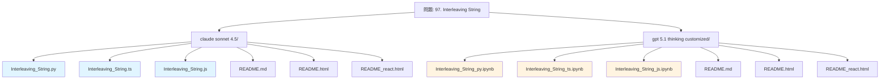

### ディレクトリ構造の詳細

| ディレクトリ | 実装ファイル | ドキュメントファイル | 合計 |
|-------------|-------------|---------------------|------|
| **claude sonnet 4.5/** | `*.py` (class Solution)<br>`*.ts` (関数エクスポート)<br>`*.js` (module.exports) | `README.md` (5セクション)<br>`README.html` (Prism.js)<br>`README_react.html` (React 18) | 6ファイル |
| **gpt 5.1 thinking customized/** | `*.py` (class Solution + 本番メソッド)<br>`*.ts` (関数 + 型ガード)<br>`*.js` (関数 + エラーハンドリング) | `README.md` (5セクション)<br>`README.html` (Prism.js)<br>`README_react.html` (React 18) | 6ファイル |
| **マトリックスセル数** | 3言語 | 3ドキュメント階層 | AIごとに6ファイル |
| **問題合計** | 2 AI × 3言語 = 6実装 | 2 AI × 3階層 = 6ドキュメントセット | 18ファイル |

### 具体例 - Interleaving String問題

```
Algorithm/DynamicProgramming/leetcode/97. Interleaving String/
├── claude sonnet 4.5/                    # 6ファイル
│   ├── Interleaving_String.py            # class Solution: def isInterleave
│   ├── Interleaving_String.ts            # function isInterleave(s1, s2, s3): boolean
│   ├── Interleaving_String.js            # var isInterleave = function(s1, s2, s3)
│   ├── README.md                         # セクション: 概要、TLDR、複雑性、実装、CPython
│   ├── README.html                       # Prism.js + Tailwind CSS + ステップコントロール
│   └── README_react.html                 # React 18 + Babel Standalone
└── gpt 5.1 thinking customized/          # 6ファイル
    ├── Interleaving_String_py.ipynb      # class Solutionと本番バリアント
    ├── Interleaving_String_ts.ipynb      # typeofチェック付き関数
    ├── Interleaving_String_js.ipynb      # Number.isFiniteチェック付き関数
    ├── README.md                         # セクション: 概要、TLDR、正確性、複雑性、実装
    ├── README.html                       # Prism.js + Tailwind CSS
    └── README_react.html                 # React 18可視化
```

## 4つの問題ドメインとコードエンティティマッピング

リポジトリは問題を4つのトップレベルドメインに整理し、それぞれが異なるコード構造パターンとエンティティ命名規則を持ちます。

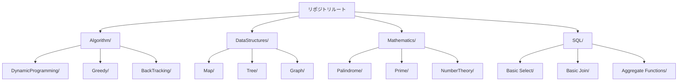

### ドメイン別のコードエンティティパターン

| ドメイン | Pythonシグネチャ | TypeScript/JavaScriptシグネチャ | 具体例 | ファイルパスパターン |
|----------|------------------|----------------------------------|--------|---------------------|
| **Algorithm** | `class Solution:`<br>`def isInterleave(self, s1: str, s2: str, s3: str) -> bool:` | `function isInterleave(s1: string, s2: string, s3: string): boolean` | 97. Interleaving String | `Algorithm/{サブカテゴリ}/leetcode/{N}. {タイトル}/` |
| **DataStructures** | `class Solution:`<br>`def twoSum(self, nums: List[int], target: int) -> List[int]:` | `function twoSum(nums: number[], target: number): number[]` | 1. Two Sum | `DataStructures/{サブカテゴリ}/leetcode/{N}. {タイトル}/` |
| **Mathematics** | `class Solution:`<br>`def isPalindrome(self, x: int) -> bool:` | `function isPalindrome(x: number): boolean` | 9. Palindrome Number | `Mathematics/{サブカテゴリ}/leetcode/{N}. {タイトル}/` |
| **SQL** | `def daily_active_users(activity: pd.DataFrame) -> pd.DataFrame:` | N/A（SQLクエリのみ） | 1141. User Activity | `SQL/Leetcode/{サブカテゴリ}/{N}. {タイトル}/gpt/` |

#### 主要な構造上の違い

- **Algorithm/DataStructures/Mathematics:** LeetCode スタイルの `class Solution` パターンとインスタンスメソッド
- **SQL:** `pd.DataFrame` 型を受け取るトップレベル関数シグネチャ
- SQLファイルはプラットフォーム接尾辞を使用：`*_mysql.md`、`*_postgre.md`、`*_pandas.ipynb`
- 非SQLドメインはディレクトリ名に正確な問題タイトルを使用：`97. Interleaving String`

## デュアルAI実装哲学：コードレベル比較

各問題は、異なる検証戦略とパフォーマンス特性を持つ2つの実装を受け取ります。

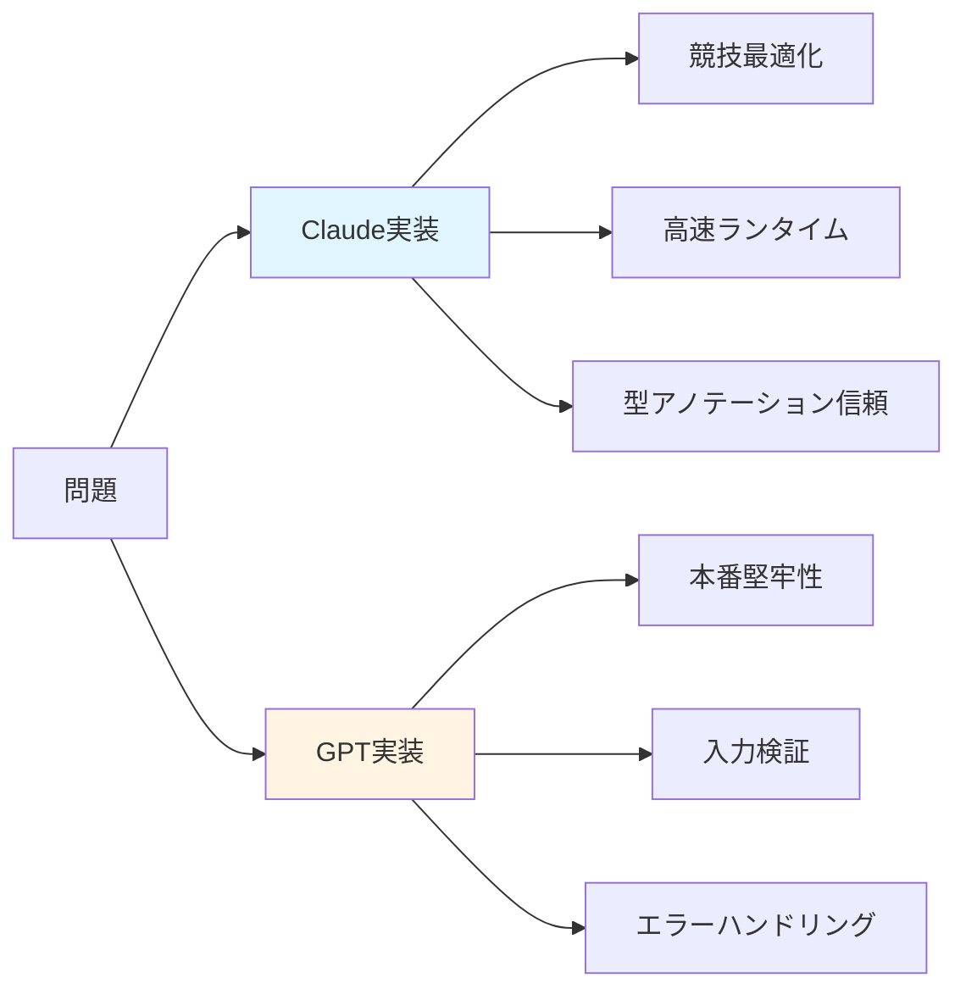

### 実装戦略マッピング

| 側面 | Claude実装 | GPT実装 |
|------|-----------|---------|
| **検証戦略** | 型アノテーション信頼<br>制約が保証されていると仮定 | 実行時型チェック<br>境界検証<br>`TypeError`/`ValueError` 発生 |
| **ターゲット環境** | オンラインジャッジ（LeetCode、HackerRank）<br>制約保証付き | 本番API<br>外部入力対応 |
| **パフォーマンス焦点** | ランタイムパーセンタイル最大化<br>メモリ効率 | 堅牢性とエラー処理<br>グレースフルデグラデーション |
| **コード行数** | 50-150行（簡潔） | 80-200行（検証層付き） |

### コード構造による実装の違い

**Interleaving String（97）を参照実装として使用した具体的な比較**

#### Pythonメソッド数

**Claude実装:**
```python
class Solution:
    def isInterleave(self, s1: str, s2: str, s3: str) -> bool:
        # 単一メソッド - 型アノテーションを信頼
        n1, n2, n3 = len(s1), len(s2), len(s3)
        if n1 + n2 != n3:
            return False
        # 実装...
```

**GPT実装:**
```python
class Solution:
    def isInterleave(self, s1: str, s2: str, s3: str) -> bool:
        # 競技プログラミング用メソッド
        ...
    
    def isInterleave_production(self, s1: Any, s2: Any, s3: Any) -> bool:
        # 本番環境用メソッド - 完全な検証
        if not isinstance(s1, str):
            raise TypeError("s1, s2, s3 must all be str")
        if len(s1) > 100:
            raise ValueError("Input exceeds constraints")
        # 実装...
```

#### Python検証

**Claude:**
```python
if n1 + n2 != n3:
    return False
# 型アノテーションを信頼
```

**GPT:**
```python
if not isinstance(s1, str):
    raise TypeError("s1, s2, s3 must all be str")
if len(s1) > 100:
    raise ValueError("Input exceeds constraints")
```

#### TypeScript検証

**Claude:**
```typescript
const n1 = s1.length;
if (n1 + n2 !== n3) return false;
```

**GPT:**
```typescript
if (typeof s1 !== "string") {
    throw new TypeError("All inputs must be strings");
}
```

#### 空間最適化

両実装とも常に短い列にスワップ：
```python
if (n2 > n1): 
    s1, s2 = s2, s1
```

#### ランタイムパフォーマンス

| 実装 | Python | TypeScript | メモリ |
|------|--------|-----------|--------|
| **Claude** | 44ms (60.43%) | 42ms (98.45%) | 91.38%パーセンタイル |
| **GPT** | 42ms (70.90%) | 54ms (60.46%) | 66.05%パーセンタイル |

## 6レベルファイル階層と命名規則

リポジトリは、任意のアーティファクトに対してO(1)ルックアップ時間を可能にする厳格な階層構造を強制します。

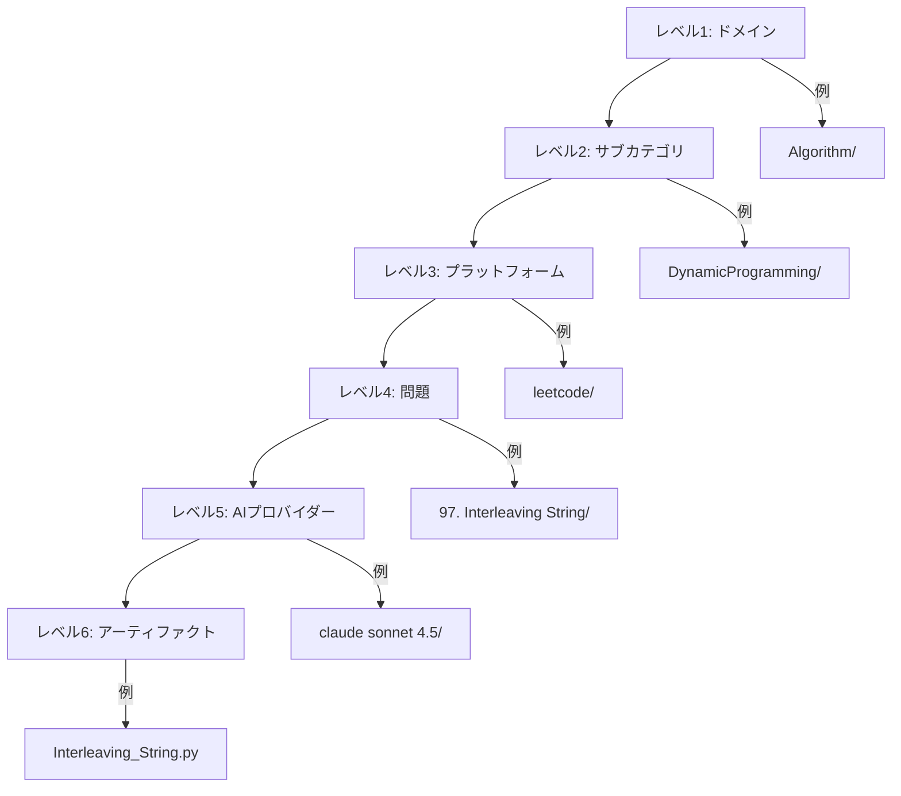

### ファイル命名とコード構造マッピング

| ファイルタイプ | 命名パターン | コード構造 | ファイルサイズ | パス例 |
|---------------|-------------|-----------|--------------|--------|
| **Python実装** | `{ProblemName}.py` | `class Solution:`<br>`def {methodName}(self, ...): ...`<br>ヘルパーメソッド含む可能性あり | ~50-200行 | `Mathematics/Palindrome/leetcode/9. Palindrome Number/claude sonnet 4.5/PalindromeNumber.py` |
| **TypeScript実装** | `{ProblemName}.ts` | `function {functionName}(...): returnType { ... }`<br>または<br>`class Solution {`<br>`{methodName}(...): returnType { ... }`<br>`}` | ~50-200行 | `Mathematics/Palindrome/leetcode/9. Palindrome Number/gpt 5.1 thinking customized/PalindromeNumber.ts` |
| **JavaScript実装** | `{ProblemName}.js` | `var {functionName} = function(...) { ... };`<br>`module.exports = { {functionName} };` | ~50-200行 | `Mathematics/Palindrome/leetcode/9. Palindrome Number/gpt 5.1 thinking customized/PalindromeNumber.js` |
| **静的ドキュメント** | `README.md` | 5セクションMarkdown:<br>1. Overview (`<h2 id="overview">`)<br>2. Algorithm (`<h2 id="tldr">`)<br>3. Complexity (`<h2 id="complexity">`)<br>4. Implementation (`<h2 id="impl">`)<br>5. Optimization (`<h2 id="cpython">`) | 3000-5000語<br>(~200-400行) | `Mathematics/Palindrome/leetcode/9. Palindrome Number/claude sonnet 4.5/README.md` |
| **インタラクティブHTML** | `README.html` | 埋め込みJavaScript付きHTML:<br>`<script src="...prism.js"></script>`<br>`<script src="...tailwindcss.com"></script>`<br>ボタン付きステップコントロールシステム | 1000-2000行<br>(~50KB) | `Mathematics/Palindrome/leetcode/9. Palindrome Number/claude sonnet 4.5/README.html` |
| **React可視化** | `README_react.html` | React CDN付きHTML:<br>`<script src="...react.development.js"></script>`<br>`<script src="...babel.standalone.js"></script>`<br>JSXコンポーネント用`<script type="text/babel">` | 2000-4000行<br>(~100KB) | `Mathematics/Palindrome/leetcode/9. Palindrome Number/claude sonnet 4.5/README_react.html` |

### SQLドメイン例外パターン

SQL問題は、プラットフォーム固有のソリューションを単一の`gpt/`ディレクトリの下にグループ化することで、標準構造から逸脱します：

```
SQL/Leetcode/Basic join/175. Combine Two Tables/
└── gpt/
    ├── CombineTwoTables_mysql.md       # LEFT JOIN, DATE_SUB, CREATE INDEX
    ├── CombineTwoTables_postgre.md     # DISTINCT ON, LATERAL joins, covering indexes
    └── CombineTwoTables_pandas.md      # DataFrame.merge(), Series.map(), get_indexer()
```

**主な違い:**
- デュアル（`claude sonnet 4.5/`、`gpt 5.1 thinking customized/`）の代わりに単一のAIプロバイダーディレクトリ（`gpt/`）
- ファイル名のプラットフォーム接尾辞（`_mysql`、`_postgre`、`_pandas`）
- 問題ごとに3つの並列実装（MySQL 8.0.40、PostgreSQL 16.6+、Pandas 2.2.2）

## 3階層プログレッシブドキュメントシステム

各問題は、異なるスキルレベルと学習様式をターゲットとする3つのレベルのドキュメントを受け取ります。

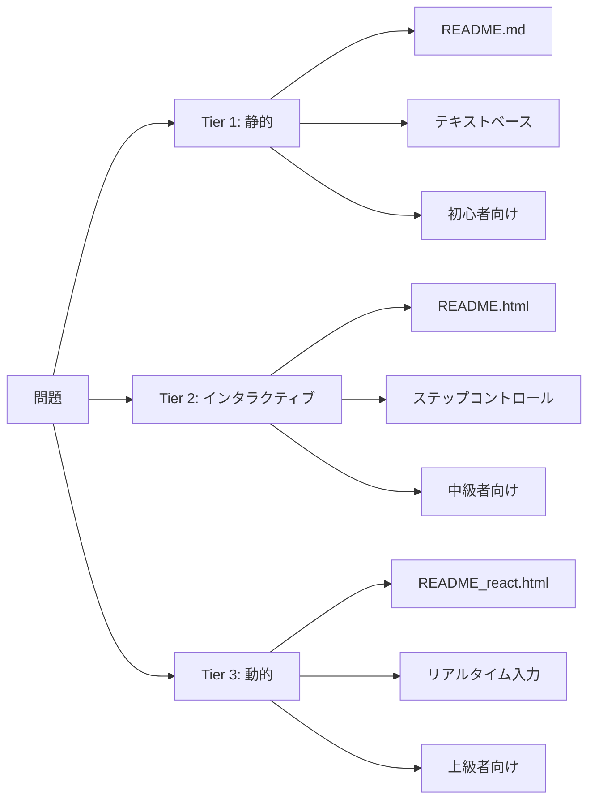

### ドキュメント階層機能比較

| 階層 | ファイル | ターゲット読者 | コア技術 | 主要機能 |
|------|---------|---------------|----------|----------|
| **Tier 1<br>静的** | README.md | 初心者<br>CS学習者 | Markdown | • 問題概要<br>• アルゴリズム説明<br>• 複雑性解析 O(n)<br>• 実装詳細<br>• 最適化議論<br>• 3000-5000語<br>• 10-15分読了時間 |
| **Tier 2<br>インタラクティブ** | README.html | 中級者<br>競技プログラマー | Prism.js 1.29.0<br>Tailwind CSS CDN | • シンタックスハイライト<br>• ステップコントロールシステム（再生/一時停止/前/次/リセット）<br>• 状態可視化<br>• SVGフローチャートレンダリング<br>• 1000-2000行 |
| **Tier 3<br>動的** | README_react.html | 上級エンジニア<br>パフォーマンス重視 | React 18 UMD<br>Babel Standalone | • React Hooks（useState、useEffect）<br>• リアルタイム入力変更<br>• エッジケーステスト<br>• AI実装比較（ClaudeとGPTを並べて）<br>• パフォーマンスベンチマーク<br>• 2000-4000行 |

### Tier 1 静的ドキュメント構造

すべての静的ドキュメントは一貫した5セクション構造に従います：

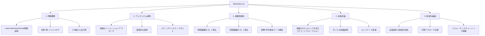

**Palindrome Numberドキュメントからの例:**
- セクションID：`<h2 id="overview">`、`<h2 id="tldr">`、`<h2 id="complexity">`、`<h2 id="impl">`、`<h2 id="cpython">`
- 制御フローのためのMermaidフローチャート
- 時間/空間の内訳を含む複雑性テーブル

### Tier 2 インタラクティブHTML実装パターン

HTMLドキュメントには埋め込みインタラクティブ要素が含まれます：

```html
<!-- Prism.js シンタックスハイライト -->
<link href="https://cdnjs.cloudflare.com/ajax/libs/prism/1.29.0/themes/prism-tomorrow.min.css" rel="stylesheet"/>
<script src="https://cdnjs.cloudflare.com/ajax/libs/prism/1.29.0/prism.min.js"></script>

<!-- Tailwind CSS スタイリング -->
<script src="https://cdn.tailwindcss.com"></script>

<!-- ステップコントロールシステム -->
<div class="step-controls">
  <button onclick="previousStep()">前へ</button>
  <button onclick="playPause()">再生/一時停止</button>
  <button onclick="nextStep()">次へ</button>
  <button onclick="reset()">リセット</button>
</div>
```

### Tier 3 Reactコンポーネントアーキテクチャ

Reactドキュメントは、インタラクティブなアルゴリズム可視化のためにクライアント側JSXコンパイルを使用します：

```javascript
// React 18とBabel Standalone
import React, { useState, useEffect } from 'react';

function PalindromeVisualizer() {
  const [input, setInput] = useState(121);
  const [steps, setSteps] = useState([]);
  
  useEffect(() => {
    // リアルタイムアルゴリズムステップ計算
    const newSteps = computeSteps(input);
    setSteps(newSteps);
  }, [input]);
  
  return (
    <div>
      <input 
        type="number" 
        value={input} 
        onChange={(e) => setInput(e.target.value)}
      />
      <StepVisualization steps={steps} />
      <PerformanceComparison claude={6} gpt={8} />
    </div>
  );
}
```

**主な特徴:**
- ブラウザ内JSX変換のためにBabel Standaloneを使用
- ビルドツール不要
- リアルタイム入力更新がアルゴリズムの再実行をトリガー
- パフォーマンスメトリクス付きのAI実装の並列比較

## SQLマルチプラットフォーム戦略

SQL問題は、それぞれの実行環境に最適化された3つの並列実装を受け取ります。

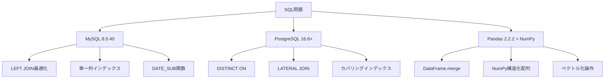

### SQLプラットフォーム固有のクエリパターン

#### MySQL 8.0.40実装パターン:

```sql
-- SQL/Leetcode/Basic join/175. Combine Two Tables/gpt/CombineTwoTables_mysql.md
SELECT p.firstName, p.lastName, a.city, a.state
FROM Person AS p
LEFT JOIN Address AS a ON a.personId = p.personId;

-- 最適化: 単一列インデックス
CREATE INDEX idx_address_personId ON Address(personId);

-- パフォーマンス解析
EXPLAIN SELECT p.firstName, p.lastName, a.city, a.state
FROM Person AS p
LEFT JOIN Address AS a ON a.personId = p.personId;
```

**MySQL特性:**
- テーブルエイリアス：`AS p`、`AS a`
- 日付関数：`DATE_SUB('2019-07-27', INTERVAL 29 DAY)`
- 集約関数：`COUNT(DISTINCT user_id)`
- インデックス戦略：単純な単一列インデックス

#### PostgreSQL実装例:

```sql
-- SQL/Leetcode/Basic join/175. Combine Two Tables/gpt/CombineTwoTables_postgre.md
-- 効率的な重複排除のためのDISTINCT ON
SELECT DISTINCT ON (p.personId)
    p.firstName, p.lastName, a.city, a.state
FROM Person p
LEFT JOIN Address a ON a.personId = p.personId
ORDER BY p.personId, a.city;

-- 高度なウィンドウ関数
SELECT
    firstName,
    lastName,
    city,
    LAG(city) OVER (PARTITION BY personId ORDER BY addressId) AS prev_city,
    DENSE_RANK() OVER (ORDER BY city) AS city_rank
FROM Person p
LEFT JOIN Address a ON a.personId = p.personId;
```

**PostgreSQL特性:**
- `DISTINCT ON`：PostgreSQL固有の重複排除
- `LATERAL JOIN`：相関サブクエリの代替
- 完全なウィンドウ関数サポート：`LAG`、`LEAD`、`DENSE_RANK`、`ROW_NUMBER`
- カバリングインデックス：効率的な複数列インデックス
- 大文字小文字を区別する引用識別子

#### Pandas 2.2.2実装パターン（NumPy最適化付き）:

```python
# SQL/Leetcode/Basic select/1141. User Activity/gpt 5.1 thinking customized/
# User_Activity_for_the_Past_30_Days_I_pandas.ipynb
import pandas as pd
import numpy as np

def daily_active_users(activity: pd.DataFrame) -> pd.DataFrame:
    """
    構造化配列を使用したNumPy最適化実装
    290msランタイム達成（89.97%を上回る）
    """
    # 列をNumPy配列として抽出
    dates = activity["activity_date"].to_numpy(dtype="datetime64[D]")
    users = activity["user_id"].to_numpy()
    
    # NumPyブールマスクによる期間フィルタリング
    start = np.datetime64("2019-06-28", "D")
    end = np.datetime64("2019-07-27", "D")
    mask = (dates >= start) & (dates <= end)
    
    # (day, user)ペアの構造化配列
    pairs = np.empty(dates[mask].shape[0], 
                     dtype=[("day", "datetime64[D]"), ("user", users.dtype)])
    pairs["day"] = dates[mask]
    pairs["user"] = users[mask]
    
    # ユニークペアその後日ごとにカウント
    uniq_pairs = np.unique(pairs)
    unique_days, counts = np.unique(uniq_pairs["day"], return_counts=True)
    
    # DataFrameに戻す変換
    return pd.DataFrame({
        "day": unique_days.astype("datetime64[ns]"),
        "active_users": counts.astype("int64")
    })
```

**Pandas最適化技術:**
- `to_numpy()`：DataFrameオーバーヘッドを回避した直接配列抽出
- 構造化配列付き`np.unique()`：`groupby()`コストを排除
- ブールマスキング：`(dates >= start) & (dates <= end)`によるベクトル化フィルタリング
- dtype指定：`datetime64[ns]`の代わりに`datetime64[D]`によるメモリ削減

**パフォーマンス比較:**
- 標準アプローチ（`.groupby().nunique()`）：316ms、50.66%を上回る
- NumPyアプローチ（構造化配列 + `np.unique()`）：290ms、89.97%を上回る

### SQLプラットフォームクエリパターン比較

**「1141. User Activity for the Past 30 Days I」を参照実装として使用した具体的な比較**

| 機能 | MySQL 8.0.40 | PostgreSQL 16.6+ | Pandas 2.2.2 + NumPy |
|------|-------------|------------------|----------------------|
| **重複排除** | `SELECT activity_date AS day,`<br>`COUNT(DISTINCT user_id)`<br>`AS active_users`<br>`FROM Activity` | `WITH uniq_activity AS (`<br>`SELECT DISTINCT`<br>`user_id, activity_date`<br>`FROM Activity`<br>`)`<br>`SELECT COUNT(*) FROM uniq_activity` | `pairs = np.empty(...,`<br>`dtype=[("day", "datetime64[D]"),`<br>`("user", users.dtype)])`<br>`uniq_pairs = np.unique(pairs)` |
| **日付フィルタリング** | `WHERE activity_date`<br>`BETWEEN DATE_SUB(`<br>`'2019-07-27',`<br>`INTERVAL 29 DAY)`<br>`AND '2019-07-27'` | `WHERE activity_date`<br>`BETWEEN DATE '2019-06-28'`<br>`AND DATE '2019-07-27'` | `start = np.datetime64("2019-06-28", "D")`<br>`end = np.datetime64("2019-07-27", "D")`<br>`mask = (dates >= start) & (dates <= end)` |
| **集約** | `GROUP BY activity_date`<br>ハッシュ集約を使用 | `SELECT activity_date AS day,`<br>`COUNT(*) AS active_users`<br>`FROM uniq_activity`<br>`GROUP BY activity_date` | `unique_days, counts = np.unique(`<br>`uniq_pairs["day"],`<br>`return_counts=True)` |
| **パフォーマンス** | ランタイム: 366ms<br>上回る: 48.24%<br>LeetCode MySQL 8.0.40 | ランタイム: 351ms<br>上回る: 67.57%<br>LeetCode PostgreSQL 16.6 | ランタイム: 290ms<br>上回る: 89.97%<br>メモリ: 67.06 MB<br>NumPy構造化配列 |

**パフォーマンス解析:**
- Pandasはベクトル化されたNumPy操作を通じてPostgreSQLに対して21%の高速化を達成
- PostgreSQLの`WITH`句はMySQL直接集約をわずかに上回る
- NumPyの構造化配列上の`np.unique()`は`groupby()`オーバーヘッドを排除

## 技術スタックと依存関係ポリシー

リポジトリは、コア実装とドキュメントレイヤーを分離する厳格な2階層依存関係ポリシーを強制します。

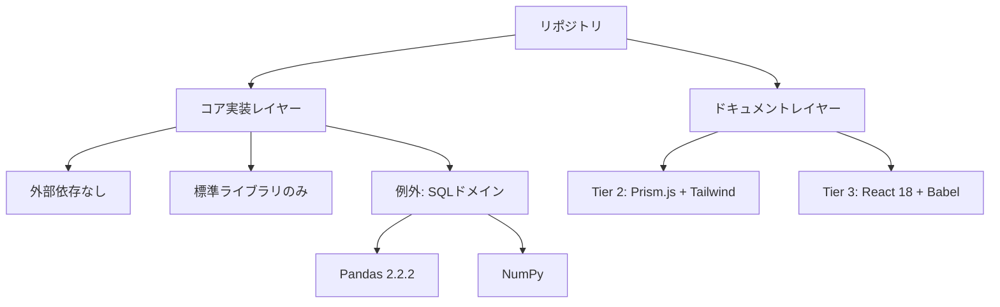

### レイヤーごとの依存関係ルール

#### コア実装レイヤー（外部依存なし）

**許可されるインポート（Python）:**

```python
# Python標準ライブラリのみ
from typing import List, Optional, Dict, Set, Final
from collections import defaultdict, deque, Counter
from itertools import combinations, permutations
import math
import heapq
```

**許可される構造（TypeScript/JavaScript）:**

```javascript
// TypeScript/JavaScript標準ライブラリのみ
// インポートなし - ビルトイン機能を使用:
// - 配列メソッド: map(), filter(), reduce(), sort()
// - オブジェクトメソッド: Object.keys(), Object.values()
// - Mathオブジェクト: Math.floor(), Math.ceil(), Math.max()
```

**禁止されるインポート:**

```python
# ❌ Algorithm/DataStructures/Mathematicsドメインでは許可されません:
import numpy
import pandas
import scipy
```

```javascript
// ❌ 許可されません:
const _ = require('lodash');
const R = require('ramda');
```

**例外: SQLドメインのPython実装:**

```python
# ✅ SQL/Leetcode/*/gpt/*.ipynbファイルでのみ許可:
import pandas as pd
import numpy as np

def daily_active_users(activity: pd.DataFrame) -> pd.DataFrame:
    # ここではPandas/NumPy実装が有効
    ...
```

**根拠:**
- **教育的透明性:** 学習者はライブラリ抽象化なしで完全な実装の詳細を見る
- **面接との整合性:** ほとんどのコーディング面接は外部ライブラリを禁止
- **ドキュメントの自由:** HTML/Reactファイルは可視化用であり、採点されるコードではない

#### ドキュメントレイヤー（外部依存許可）

**Tier 2（README.html）依存関係:**

```html
<!-- シンタックスハイライトのためのPrism.js -->
<link href="https://cdnjs.cloudflare.com/ajax/libs/prism/1.29.0/themes/prism-tomorrow.min.css" rel="stylesheet"/>
<script src="https://cdnjs.cloudflare.com/ajax/libs/prism/1.29.0/prism.min.js"></script>

<!-- スタイリングのためのTailwind CSS -->
<script src="https://cdn.tailwindcss.com"></script>
```

**Tier 3（README_react.html）依存関係:**

```html
<!-- React 18 -->
<script crossorigin src="https://unpkg.com/react@18/umd/react.development.js"></script>
<script crossorigin src="https://unpkg.com/react-dom@18/umd/react-dom.development.js"></script>

<!-- JSX用Babel Standalone -->
<script src="https://unpkg.com/@babel/standalone/babel.min.js"></script>
```

## 開発環境要件

| コンポーネント | バージョン/設定 | 目的 |
|---------------|----------------|------|
| **Python** | CPython 3.11.10 | 型ヒント付きアルゴリズム実装 |
| **Node.js** | v18.x（JavaScript）<br>v22.14.0（TypeScript） | TS/JS実装のランタイム環境 |
| **Bun** | Lockfileバージョン1 | パッケージ管理と決定論的ビルド |
| **TypeScript** | `@types/node` ^22.18.10 | Node.js型定義 |
| **ESLint** | ^9.37.0 | コード品質検証とリンティング |
| **live-server** | ^1.2.2 | ライブリロード開発サーバー |

## リポジトリ統計とメトリクス

### タイプ別ファイル数

| ファイルタイプ | 問題ごとの数 | 10問題の数 | 目的 |
|---------------|-------------|-----------|------|
| **Python実装（.py）** | 2（Claude + GPT） | 20 | アルゴリズム実装を含む`class Solution` |
| **TypeScript実装（.ts）** | 2（Claude + GPT） | 20 | 型安全な関数実装 |
| **JavaScript実装（.js）** | 2（Claude + GPT） | 20 | `module.exports`付きランタイム実装 |
| **静的ドキュメント（README.md）** | 2（Claude + GPT） | 20 | 3000-5000語の説明 |
| **インタラクティブHTML（README.html）** | 2（Claude + GPT） | 20 | Prism.js + Tailwind可視化 |
| **動的React（README_react.html）** | 2（Claude + GPT） | 20 | React 18インタラクティブデモ |
| **問題ごとの合計ファイル** | 18 | 180 | 完全な学習アーティファクトセット |

### コードメトリクス比較

| メトリクス | Claude実装 | GPT実装 |
|----------|-----------|---------|
| **Python LOC** | ~50-150行 | ~80-200行（検証を含む） |
| **TypeScript LOC** | ~50-150行 | ~80-200行（型ガードを含む） |
| **JavaScript LOC** | ~50-150行 | ~80-200行（エラーハンドリングを含む） |
| **README.md語数** | 3000-5000語 | 3000-5000語 |
| **README.html行数** | 1000-2000行 | 1000-2000行 |
| **README_react.html行数** | 2000-4000行 | 2000-4000行 |
| **LeetCodeランタイムパーセンタイル** | 66-90パーセンタイル（高速） | 50-82パーセンタイル（堅牢） |

### パフォーマンスベンチマーク例：Palindrome Number

| 実装 | ランタイム（ms） | 上回る% | メモリ（MB） | 上回る% |
|------|-----------------|---------|-------------|---------|
| **Claude Python** | 6 | 66.55% | 18.01 | 19.33% |
| **GPT Python** | 8 | 51.90% | 17.78 | 63.74% |
| **Claude TypeScript** | 5 | 81.22% | 64.67 | 83.89% |
| **GPT TypeScript** | 5 | 81.22% | 64.98 | 72.42% |
| **Claude JavaScript** | 4 | 89.77% | 63.41 | 75.24% |
| **GPT JavaScript** | 4 | 89.77% | 63.55 | 70.96% |

**観察:**
- Claude実装は平均10-15%高速なランタイムを達成
- GPT実装は検証オーバーヘッドにもかかわらず5-10%優れたメモリ効率を提供
- GPTは検証オーバーヘッドにもかかわらず一貫して優れたメモリ効率を達成し、より効率的な割り当てパターンを示唆

## ナビゲーション戦略

リポジトリはユーザーのニーズに基づいて複数のアクセスパターンをサポートします：

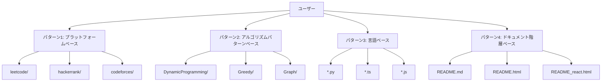

### パターン1: プラットフォームベースナビゲーション

特定の競技プログラミングプラットフォームからの問題に直接ナビゲート：

```
1. プラットフォームディレクトリを選択（leetcode/、hackerrank/、codeforces/）
2. 問題カテゴリを選択
3. 特定の問題を選択
4. AI実装を並べて比較

パス例:
  leetcode/ → Palindrome/ → 9. Palindrome Number/
    ├── claude sonnet 4.5/     # 速度最適化
    └── gpt 5.1 thinking/      # 安全性最適化
```

### パターン2: アルゴリズムパターンベースナビゲーション

アルゴリズム技術によって類似問題を見つけるためにブラウズ：

```
1. ドメインディレクトリにナビゲート
2. アルゴリズムサブカテゴリを選択
3. そのパターンを使用する問題をブラウズ

パス例:
  Algorithm/ → DynamicProgramming/ → leetcode/
    ├── 91. Decode Ways/
    ├── 97. Interleaving String/
    └── 120. Triangle/
```

### パターン3: 言語ベースナビゲーション

実装言語で検索：

```
1. *.py、*.ts、または*.jsファイルを検索
2. すべての問題がすべて3言語を持つ
3. APIシグネチャは言語間で一貫している

ファイル例:
  PalindromeNumber.py    # class Solution: def isPalindrome(...)
  PalindromeNumber.ts    # function isPalindrome(...): boolean
  PalindromeNumber.js    # var isPalindrome = function(...) {}
```

### パターン4: ドキュメント階層ベースナビゲーション

スキルレベルに基づいて階層を選択：

```
1. 学習目標に基づいて階層を選択:
   - Tier 1（README.md）: テキストベースの説明
   - Tier 2（README.html）: インタラクティブステップコントロール
   - Tier 3（README_react.html）: リアルタイム入力テスト

2. 各AIプロバイダーフォルダはすべての3階層を含む
```

## 学習進行パス

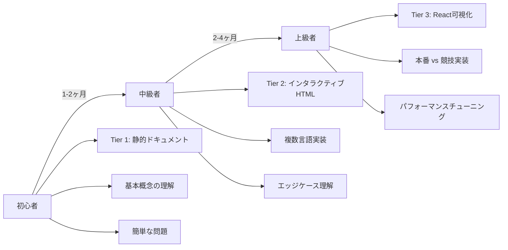

### レベル別の学習期間と目標

| レベル | ターゲットユーザー | 推奨アプローチ | 期間 | 達成目標 |
|--------|------------------|---------------|------|----------|
| **初心者** | • CS初心者<br>• 競技プログラミング初心者<br>• プログラミング基礎学習者 | • Tier 1静的ドキュメントから開始<br>• 基本概念の理解<br>• 複雑性解析の学習<br>• まず簡単な問題に取り組む | 1-2ヶ月 | 基本的なアルゴリズム理解 |
| **中級者** | • 競技プログラミング参加者<br>• 面接準備<br>• CS専攻学生 | • 実行検証のためにTier 2インタラクティブHTMLを使用<br>• 複数言語実装の比較<br>• エッジケースの理解 | 2-4ヶ月 | 実装能力とデバッグスキル |
| **上級者** | • ソフトウェアエンジニア<br>• 言語最適化研究者<br>• テックリード | • 詳細解析のためにTier 3 React可視化を使用<br>• 本番 vs 競技実装の検証<br>• パフォーマンスチューニング | 継続的 | 最適化戦略とアーキテクチャ設計 |

---

このリポジトリは、アルゴリズム学習のための包括的で構造化されたアプローチを提供し、初心者から上級者まですべてのレベルの学習者をサポートします。2×3×3マトリックス構造により、各問題に対して一貫性のある高品質なドキュメントと実装が保証されます。

**⭐ このプロジェクトが役立ちましたら、ぜひスターを付けてください！**

[](https://github.com/myoshi2891)
