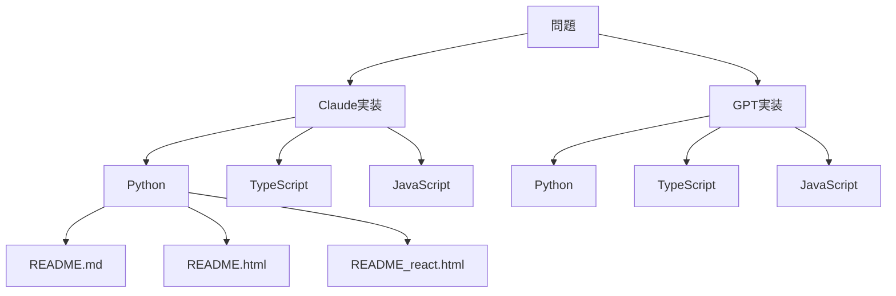
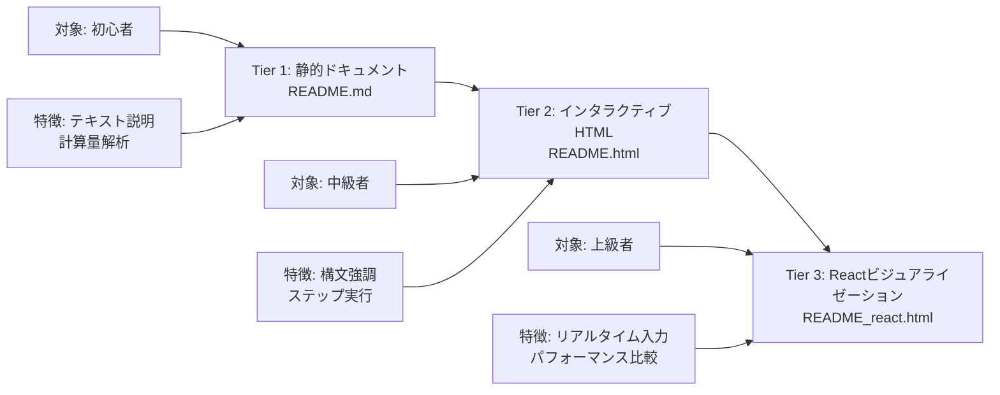
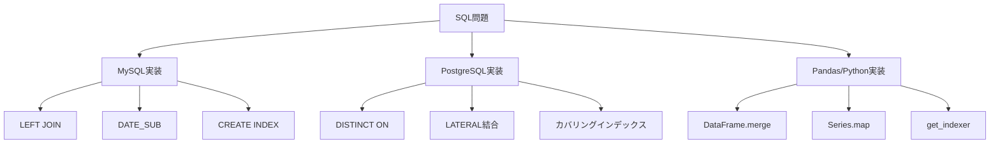

# リポジトリ概要

[](https://github.com/myoshi2891/Algorithm-DataStructures-Math-SQL/stargazers)
[](https://github.com/myoshi2891/Algorithm-DataStructures-Math-SQL/network/members)

[](https://deepwiki.com/myoshi2891/Algorithm-DataStructures-Math-SQL)

## 目的と範囲

このドキュメントは、Algorithm-DataStructures-Math-SQLリポジトリの構造、実装哲学、および組織パターンの全体像を提供します。4つのコア問題領域（アルゴリズム、データ構造、数学、SQL）、デュアルAI実装アプローチ（Claude vs GPT）、マルチ言語サポート（Python、TypeScript、JavaScript）、そして3段階の段階的学習システムをカバーしています。

### 関連ドキュメント

特定のサブシステムの詳細な説明については、以下を参照してください：

- **教育インフラとドキュメント標準**: Educational Infrastructureを参照
- **アルゴリズム固有の実装と最適化**: Algorithm Implementationsを参照
- **データ構造の実装**: Data Structure Implementationsを参照
- **数学的問題の解法**: Mathematical Solutionsを参照
- **SQLソリューションとデータベース固有の最適化**: SQL Solutionsを参照
- **パフォーマンス最適化戦略**: Performance Optimization Strategiesを参照

---

## リポジトリ構造とコアドメイン

リポジトリは、問題領域、競技プログラミングプラットフォーム、AI実装プロバイダーによって階層的に組織されています。トップレベルのディレクトリ構造には、LeetCode、HackerRank、AtCoderなどのプラットフォームからの異なる問題カテゴリに対応する4つのコアドメインが含まれています。

### ドメイン組織階層

```
Algorithm-DataStructures-Math-SQL/
├── Algorithm/
│   ├── BinarySearch/
│   │   └── leetcode/
│   │       └── 4. Median of Two Sorted Arrays/
│   │           ├── Claude/
│   │           │   ├── Median_of_Two_Sorted_Arrays.py
│   │           │   ├── Median_of_Two_Sorted_Arrays.ts
│   │           │   ├── Median_of_Two_Sorted_Arrays.js
│   │           │   ├── README.md
│   │           │   ├── README.html
│   │           │   └── README_react.html
│   │           └── GPT/
│   │               ├── Median_of_Two_Sorted_Arrays.py
│   │               ├── Median_of_Two_Sorted_Arrays.ts
│   │               ├── Median_of_Two_Sorted_Arrays.js
│   │               ├── README.md
│   │               ├── README.html
│   │               └── README_react.html
│   ├── DynamicProgramming/
│   └── TwoPointer/
├── DataStructures/
│   ├── LinkedList/
│   └── Trees/
├── Mathematics/
│   ├── FSM/
│   └── Geometry/
└── SQL/
    ├── Leetcode/
    └── HackerRank/
```

### 問題ドメイン分類

| ドメイン | 代表的なコードエンティティ | コアパターン | 主要ディレクトリ |
|---------|------------------------|------------|---------------|
| **Algorithm** | `Solution.findMedianSortedArrays()`, `numDecodings()`, `minPathSum()` | 二分探索、動的計画法、二ポインタ | `Algorithm/BinarySearch/`, `Algorithm/DynamicProgramming/` |
| **DataStructures** | `Solution.addTwoNumbers()`, `ListNode`, `DoublyLinkedList` | インプレース操作、ポインタ演算 | `DataStructures/LinkedList/`, `DataStructures/Trees/` |
| **Mathematics** | `isNumber()`, `reflectPoint()`, `gameWithCells()` | 有限状態機械、幾何変換 | `Mathematics/FSM/`, `Mathematics/Geometry/` |
| **SQL** | `CombineTwoTables.sql`, `RisingTemperature.sql`, `combine_two_tables()` (pandas) | JOINパターン、ウィンドウ関数 | `SQL/Leetcode/`, `SQL/HackerRank/` |

---

## デュアルAI実装マトリックス（2×3×3アーキテクチャ）

各アルゴリズム問題は、**2×3×3マトリックスアプローチ**を使用して実装されています：

```
2 AIプロバイダー × 3 プログラミング言語 × 3 ドキュメント層 = 最大18個の異なる成果物
```

これにより、学習者は異なる次元での実装スタイルを比較できます。

### 実装マトリックス構造



### AI実装哲学の比較

| 側面 | Claude実装 | GPT実装 |
|------|-----------|---------|
| **Pythonメソッドシグネチャ** | `findMedianSortedArrays(self, nums1: List[int], nums2: List[int]) -> float` | `_median_binary_partition(self, nums1: List[int], nums2: List[int]) -> float` |
| **センチネル値** | 整数センチネル: `NEG = -10_000_007`, `POS = +10_000_007` | 浮動小数点センチネル: `float("inf")`, `-float("inf")` |
| **TypeScriptシグネチャ** | `function findMedianSortedArrays(nums1: number[], nums2: number[]): number` | `function findMedianSortedArrays(nums1: readonly number[], nums2: readonly number[]): number` |
| **最適化の焦点** | 整数センチネルによる速度最適化でfloatキャストを排除 | TypeError/RangeErrorによる包括的な入力検証 |
| **ドキュメントスタイル** | 最適化セクションを含む計算量解析を優先 | ビジネスコンテキストを含むアルゴリズム比較表 |
| **検証戦略** | 入力制約を信頼、最小限の検証 | カスタム例外による広範なランタイム検証 |

### コードエンティティマッピング：言語固有の実装

```python
# Claude実装 - Python
class Solution:
    def findMedianSortedArrays(self, nums1: List[int], nums2: List[int]) -> float:
        NEG, POS = -10_000_007, +10_000_007
        # 整数センチネルによる高速化
```

```typescript
// GPT実装 - TypeScript
function findMedianSortedArrays(
    nums1: readonly number[], 
    nums2: readonly number[]
): number {
    validateNumberArray(nums1);  // 包括的な検証
    validateNumberArray(nums2);
}
```

```javascript
// GPT実装 - JavaScript
function findMedianSortedArrays(nums1, nums2) {
    if (!Array.isArray(nums1) || !Array.isArray(nums2)) {
        throw new TypeError('両方の入力は配列である必要があります');
    }
}
```

---

## ファイル組織と命名規則

リポジトリは一貫した階層パターンに従っています：**ドメイン → トピック → プラットフォーム → 問題 → AIプロバイダー → 成果物**

### 標準ファイル命名パターン

| ファイルタイプ | 命名パターン | 目的 | 例 |
|-------------|------------|------|-----|
| **Python実装** | `{ProblemName}.py` または `{problem_name}.py` | `class Solution`を含むコア実装 | `Median_of_Two_Sorted_Arrays.py` |
| **TypeScript実装** | `{ProblemName}.ts` | 厳密なチェックを伴う型安全な実装 | `Median_of_Two_Sorted_Arrays.ts` |
| **JavaScript実装** | `{ProblemName}.js` | ランタイム検証実装 | `Median_of_Two_Sorted_Arrays.js` |
| **静的ドキュメント** | `README.md` | 5段階のドキュメント構造 | セクションごとに100行未満 |
| **インタラクティブHTML** | `README.html` | Prism.js構文強調、Tailwind CSS | 1000-2000行 |
| **Reactビジュアライゼーション** | `README_react.html` | React 18 + Babel Standalone、インタラクティブデモ | カスタマイズ可能な入力 |

### SQL問題の組織パターン

SQL問題は若干異なる構造に従い、プラットフォーム固有のソリューションファイルが単一の`gpt/`ディレクトリの下にグループ化されています：

```
SQL/Leetcode/Basic join/175. Combine Two Tables/
└── gpt/
    ├── CombineTwoTables_mysql.md
    ├── CombineTwoTables_postgre.md
    └── CombineTwoTables_pandas.md
```

各ファイルには以下が含まれます：

- **CombineTwoTables_mysql.md**: LEFT JOIN、DATE_SUB、インデックス最適化を使用したMySQL固有のソリューション
- **CombineTwoTables_postgre.md**: DISTINCT ON、LATERAL結合、カバリングインデックスを使用したPostgreSQLソリューション
- **CombineTwoTables_pandas.md**: `merge(how="left")`、`Series.map`、`get_indexer`を使用したPandas DataFrame操作

---

## 3段階の段階的学習システム

リポジトリは、静的ドキュメントから完全にインタラクティブなビジュアライゼーションまで、足場を組んだ学習進行を実装しています。各層は異なるスキルレベルと学習目標をターゲットにしています。

### 学習層アーキテクチャ



### Tier 1: 静的ドキュメント構造

静的`README.md`ファイルは、一貫した5セクション構造に従います：

1. **問題概要**: LeetCode問題の説明、制約、入出力例
2. **アルゴリズム説明**: 詳細なソリューションアプローチと戦略
3. **計算量解析**: 正当化を伴う時間・空間計算量
4. **実装詳細**: 重要なロジックを強調したコアコードウォークスルー
5. **最適化の議論**: 言語固有の最適化技術とトレードオフ

### Tier 2: インタラクティブHTML機能

`README.html`ファイルは、インタラクティブなビジュアライゼーションコントロールを組み込んでいます：

- **Prism.js統合**: Python、TypeScript、JavaScriptの構文強調
- **Tailwind CSS**: グラデーションヘッダーとカードレイアウトを使用したモダンなレスポンシブスタイリング
- **ステップコントロールシステム**: アルゴリズム実行のための再生/一時停止/前へ/次へ/リセットボタン
- **状態ビジュアライゼーション**: アルゴリズム実行中の変数値のリアルタイム表示
- **フローチャートレンダリング**: インタラクティブな強調表示を伴うSVGベースのアルゴリズムフローチャート

### Tier 3: Reactビジュアライゼーション機能

`README_react.html`ファイルは、最も高度なインタラクティブ機能を提供します：

- **React 18関数コンポーネント**: 状態管理のためのモダンなReactフック
- **Babel Standalone**: ビルドツールなしのブラウザベースJSX変換
- **リアルタイム入力変更**: ユーザーはテスト入力を変更し、即座に結果を確認できる
- **エッジケーステスト**: ワンクリックテストを備えた事前設定されたエッジケース
- **AI実装比較**: ClaudeとGPTアプローチの並列比較
- **パフォーマンスベンチマーク**: 最適化検証のためのオプションのタイミング測定

---

## 技術スタックと外部依存関係

リポジトリは、ビジュアライゼーションとドキュメンテーションのためのモダンなウェブ技術を活用しながら、最小限の外部依存関係を維持しています。

### コア開発環境

| コンポーネント | バージョン/設定 | 目的 |
|-------------|---------------|------|
| **Python** | CPython 3.11.10 | 型ヒントを使用したアルゴリズム実装 |
| **Node.js** | v18.x (JavaScript), v22.14.0 (TypeScript) | TS/JS実装のランタイム |
| **Bun** | Lockfileバージョン1 | パッケージ管理と決定的ビルド |
| **TypeScript** | @types/node ^22.18.10 | Node.js型定義 |
| **ESLint** | ^9.37.0 | コード品質検証 |
| **live-server** | ^1.2.2 | ライブリロード開発サーバー |

### 外部ライブラリポリシー

リポジトリは、コアアルゴリズム実装に対して厳格な**「外部依存関係ゼロ」ポリシー**に従います：

**許可されるもの:**
- Python標準ライブラリ: `typing`, `collections`, `itertools`, `math`
- TypeScript/JavaScript標準ライブラリ: 組み込みオブジェクト、配列メソッド

**禁止されるもの:**
- サードパーティアルゴリズムライブラリ: `numpy`, `lodash`, `underscore`
- 理由: 教育的透明性、面接環境との整合性

**ドキュメンテーション層の例外:**
- `README.html`: Prism.js（構文強調）、Tailwind CSS（スタイリング）
- `README_react.html`: React 18、Babel Standalone

### ドキュメント品質管理

リポジトリは、カスタム設定でmarkdownlintを使用します：

- **MD013ルール**: `line_length: 100`（コードブロックとテーブルを除外）
- **MD033ルール**: 特定のHTMLタグを許可（h1, h2, details, summary, p, i, footer, div）
- **目的**: すべての静的ドキュメントファイル間の一貫性を確保

---

## 競技プログラミング vs プロダクションコードの哲学

リポジトリは、同じアルゴリズムに対して2つの異なるコーディング哲学を明示的に実装し、生の速度とプロダクションの堅牢性の間のトレードオフを示しています。

### 実装戦略の比較

| 側面 | 競技プログラミングトラック | プロダクション開発トラック |
|------|----------------------|---------------------|
| **入力検証** | スキップ（制約を信頼） | 包括的（TypeError、RangeError例外） |
| **センチネル値** | 整数: `NEG = -10_000_007`, `POS = +10_000_007` | 浮動小数点: `float('inf')`, `±Infinity` |
| **型チェック** | 最小限（型ヒントのみ） | ランタイムチェック: `Number.isFinite()`, `Array.isArray()` |
| **エラーメッセージ** | なしまたは汎用的 | 詳細で説明的 |
| **エッジケース処理** | アルゴリズム内で暗黙的 | 早期リターンによる明示的検証 |
| **コード例エンティティ** | `Solution.findMedianSortedArrays()`（Claude実装） | `validateNumberArray()`, `isNonDecreasing()`を使用した`findMedianSortedArrays()`（GPT実装） |

### 最適化のトレードオフ: Claude vs GPTアプローチ

**Claude実装（競技フォーカス）:**
- ホットパスでfloat変換を回避するために整数センチネル（-10_000_007, +10_000_007）を使用
- ビットシフト演算子: 除算に`(lo + hi) >> 1`、パリティチェックに`(total & 1) == 1`
- max()/min()関数呼び出しの代わりに直接条件式
- 分岐評価を減らすために事前計算された`total_is_odd`フラグ

**GPT実装（プロダクションフォーカス）:**
- カスタムヘルパー関数による包括的な入力検証
- 明示的な型チェック: `validateNumberArray()`, `isNonDecreasing()`
- コンテキストを含む詳細なエラーメッセージ
- 不変性保証のためのTypeScript `readonly`パラメータ

---

## SQLマルチプラットフォーム実装戦略

SQL問題は、MySQL、PostgreSQL、Pandas/Python用のプラットフォーム固有の最適化を使用したクロスプラットフォーム互換性を示しています。

### プラットフォーム固有の機能と最適化パターン



### プラットフォーム別SQLクエリパターン

**MySQL固有パターン:**
```sql
SELECT p.firstName, p.lastName, a.city, a.state
FROM Person AS p
LEFT JOIN Address AS a ON a.personId = p.personId;

-- 最適化
CREATE INDEX idx_address_personId ON Address(personId);
```

**PostgreSQL固有パターン:**
```sql
-- 重複除去のためのDISTINCT ON
SELECT DISTINCT ON (p.personId) 
    p.firstName, p.lastName, a.city, a.state
FROM Person p
LEFT JOIN Address a ON a.personId = p.personId;

-- 大文字小文字を区別しない識別子: "firstName" vs firstname
-- 高度なウィンドウ関数: LAG, DENSE_RANK
```

**Pandas固有パターン:**
```python
def combine_two_tables(person: pd.DataFrame, address: pd.DataFrame) -> pd.DataFrame:
    out = person.merge(
        address[["personId", "city", "state"]], 
        on="personId", 
        how="left"
    )
    return out[["firstName", "lastName", "city", "state"]]

# 最適化: メモリオーバーヘッドを削減するために
# 1:1ルックアップにはmergeの代わりにSeries.mapを使用
```

---

## 対象ユーザーとユースケース

リポジトリは、異なる学習目標とスキルレベルを持つ複数のユーザーセグメントにサービスを提供します。

### 主要ユースケースマトリックス

| ユースケース | 対象ユーザー | 利用される主要機能 |
|------------|------------|----------------|
| **アルゴリズム学習** | CS学生、独学者 | 包括的リファレンス、計算量解析、ステップバイステップビジュアライゼーション |
| **競技プログラミング準備** | LeetCode/HackerRank参加者 | 最適化されたソリューション、最小限の検証、プラットフォーム固有のアプローチ |
| **技術面接準備** | 求職者 | 実装パターン、ベストプラクティス、複数のソリューションアプローチ |
| **パフォーマンス最適化研究** | ソフトウェアエンジニア、研究者 | 言語固有のテクニック、並列実装比較 |
| **教育指導** | 講師、チューター | 3段階学習システム、段階的複雑性、視覚補助 |
| **多言語一貫性研究** | ポリグロット開発者 | Python/TypeScript/JavaScript間の統一API |

### スキルレベル進行

| レベル | 対象ユーザー | 推奨アプローチ |
|-------|------------|--------------|
| **初心者** | CS初心者、競技プログラミング初心者 | Tier 1静的ドキュメントから始め、基本概念を理解 |
| **中級** | 競技プログラミング参加者、面接準備者 | 実行検証のためにTier 2インタラクティブHTMLを使用、多言語実装を比較 |
| **上級** | ソフトウェアエンジニア、言語最適化研究者 | 詳細な分析のためにTier 3 Reactビジュアライゼーションを活用、プロダクション vs 競技実装を検証 |

---

## まとめ

このリポジトリは、**教育的透明性**、**多言語サポート**、**段階的学習進行**を組み合わせた包括的なアルゴリズム学習プラットフォームです。2つの異なるAI実装哲学（ClaudeとGPT）を比較することで、学習者は競技プログラミングとプロダクションコードの間のトレードオフを理解できます。

---

<div align="center">

**⭐ このプロジェクトが役立ちましたら、ぜひスターを付けてください！**

[](https://github.com/myoshi2891)

</div>
