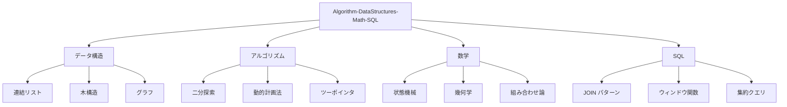
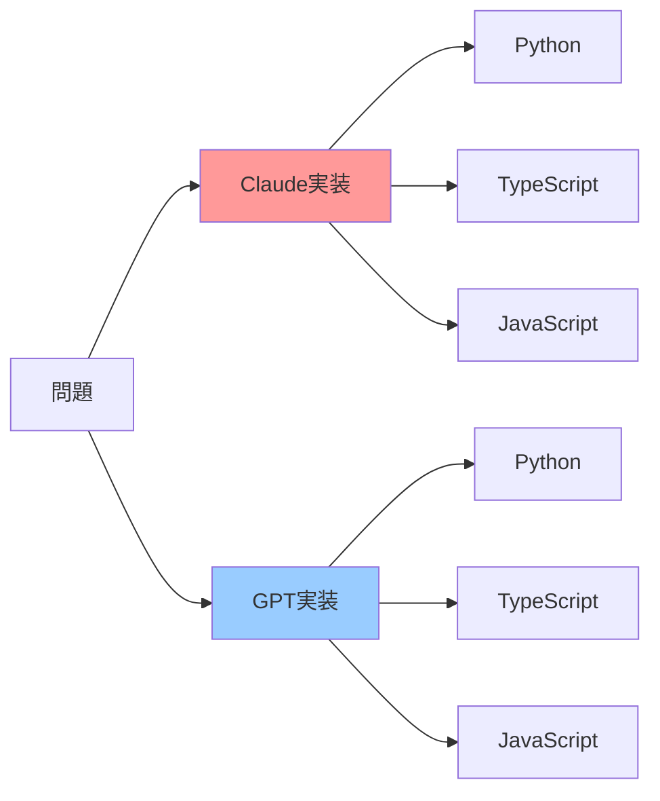
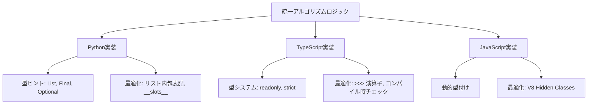
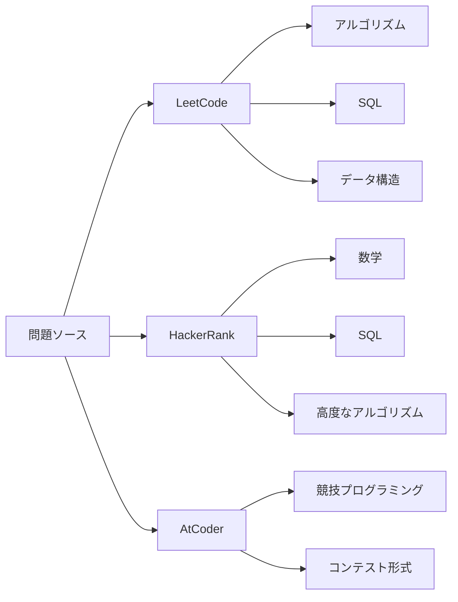
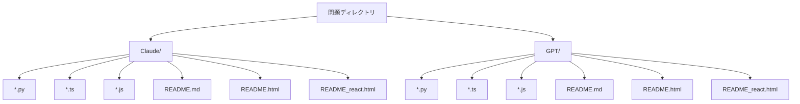
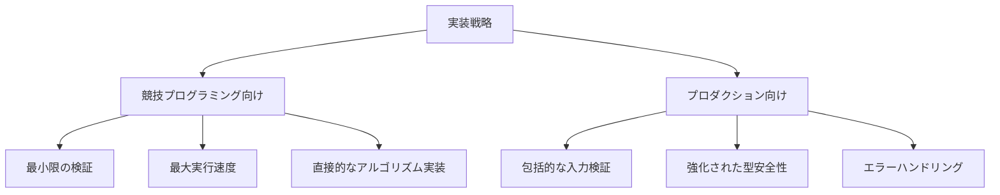
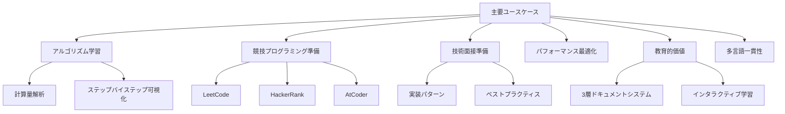
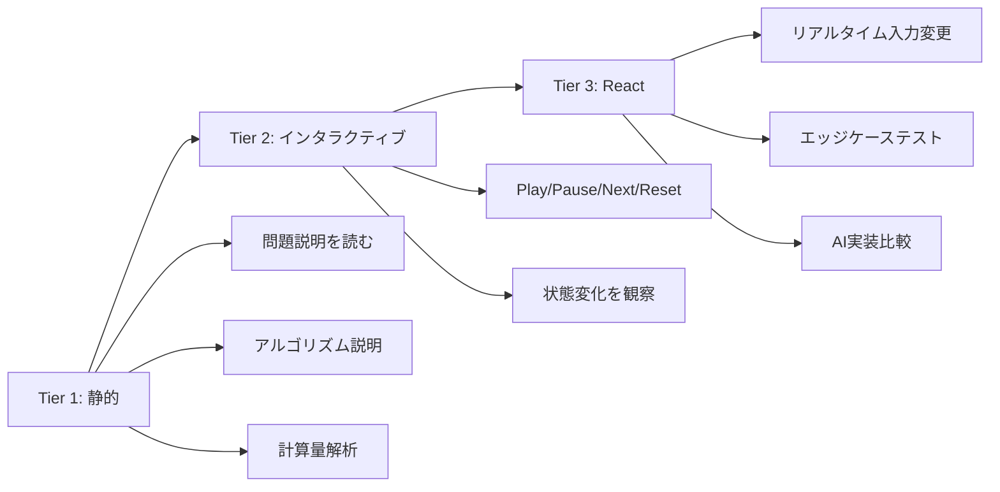

# リポジトリ概要

[](https://github.com/myoshi2891/Algorithm-DataStructures-Math-SQL/stargazers)
[](https://github.com/myoshi2891/Algorithm-DataStructures-Math-SQL/network/members)

[](https://deepwiki.com/myoshi2891/Algorithm-DataStructures-Math-SQL)

## 📋 目的と範囲

本ドキュメントは、**Algorithm-DataStructures-Math-SQL**リポジトリの包括的な概要を提供します。このリポジトリは、アルゴリズム実装、インタラクティブな可視化、包括的なドキュメントを特徴とする多言語教育プラットフォームです。競技プログラミング(LeetCode、HackerRank、AtCoder)、技術面接、コンピュータサイエンス教育に最適化されたリファレンス実装コレクションとして機能します。

本リポジトリは4つのコア問題領域にわたるソリューションを実装しています:**データ構造**、**アルゴリズム**、**数学**、**SQL**。各問題には、複数言語の実装(Python、TypeScript、JavaScript)、インタラクティブなHTMLデモンストレーション、詳細なMarkdownドキュメントが含まれています。

---

## 🎯 コア問題領域

リポジトリは、ソリューションを4つの主要ドメインに整理しており、それぞれに複数の問題カテゴリと実装が含まれています。

### ドメイン分布



| ドメイン         | 代表的な関数/クラス                                                   | 主要パターン                   | ファイル配置                                               |
| ---------------- | --------------------------------------------------------------------- | ------------------------------ | ---------------------------------------------------------- |
| **データ構造**   | `Solution.addTwoNumbers()`, `ListNode`, `DoublyLinkedList`            | インプレース操作、ポインタ演算 | `DataStructures/LinkedList/`, `DataStructures/Trees/`      |
| **アルゴリズム** | `Solution.findMedianSortedArrays()`, `numDecodings()`, `minPathSum()` | 二分探索、DP、ツーポインタ     | `Algorithm/BinarySearch/`, `Algorithm/DynamicProgramming/` |
| **数学**         | `isNumber()`, `reflectPoint()`, `gameWithCells()`                     | 状態機械、幾何変換             | `Mathematics/FSM/`, `Mathematics/Geometry/`                |
| **SQL**          | `CombineTwoTables.sql`, `RisingTemperature.sql`                       | JOINパターン、ウィンドウ関数   | `SQL/Leetcode/`, `SQL/HackerRank/`                         |

---

## 🤖 デュアルAI実装戦略

各問題は、**Claude**と**GPT**の両方のAIモデルから並行実装を受け取り、補完的なソリューションアプローチとコーディングスタイルを提供します。この戦略により、問題ごとに**2×3実装マトリックス**(2つのAIバリアント × 3つの言語)が作成されます。



### 実装比較

| 側面                     | Claude バリアント                                                           | GPT バリアント                                                                                |
| ------------------------ | --------------------------------------------------------------------------- | --------------------------------------------------------------------------------------------- |
| **Pythonクラスメソッド** | `findMedianSortedArrays(self, nums1: List[int], nums2: List[int]) -> float` | `_median_binary_partition(self, nums1: List[int], nums2: List[int]) -> float`                 |
| **センチネル値**         | `NEG: Final[int] = -10_000_007`, `POS: Final[int] = +10_000_007`            | `INF: Final[float] = float("inf")`                                                            |
| **TypeScriptシグネチャ** | `function findMedianSortedArrays(nums1: number[], nums2: number[]): number` | `function findMedianSortedArrays(nums1: readonly number[], nums2: readonly number[]): number` |
| **最適化フォーカス**     | 整数センチネルによるfloatキャストの排除                                     | TypeError/RangeErrorによる包括的な入力検証                                                    |
| **ドキュメントスタイル** | 計算量優先 + 最適化セクション                                               | アルゴリズム比較表 + ビジネスコンテキスト                                                     |

---

## 💻 多言語実装フレームワーク

すべてのアルゴリズムは、統一されたアルゴリズムロジックを維持しながら、言語固有の最適化を伴って**Python、TypeScript、JavaScript**にわたって実装されています。



### 言語固有の実装詳細

| 言語           | クラス/関数パターン                                        | 型システム                                      | 主要な最適化                                                           | サンプルファイル                 |
| -------------- | ---------------------------------------------------------- | ----------------------------------------------- | ---------------------------------------------------------------------- | -------------------------------- |
| **Python**     | `class Solution:` with `def methodName(self, ...)`         | `typing.Final`, `List[int]`, `Optional[T]`      | `ord() - 48`, リスト内包表記, `__slots__`, ビットシフト `>> 1`         | `Median_of_Two_Sorted_Arrays.py` |
| **TypeScript** | `function functionName(...)` or `export function`          | `readonly number[]`, strict types, `Int32Array` | `charCodeAt(0) - 48`, `>>> 1` (ゼロ埋め右シフト), コンパイル時チェック | `Median_of_Two_Sorted_Arrays.ts` |
| **JavaScript** | `function functionName(...)` or `var name = function(...)` | 動的型付け, ランタイム検証                      | V8 Hidden Classes, `>> 1`, `Number.isFinite()`, シンプルなループ       | `Median_of_Two_Sorted_Arrays.js` |

### 言語別ビットシフト演算子

```javascript
// Python
mid = (left + right) >> 1  # 算術右シフト

// TypeScript/JavaScript (符号あり)
const mid = (left + right) >> 1;  // 算術右シフト

// TypeScript/JavaScript (符号なし)
const mid = (left + right) >>> 1;  // ゼロ埋め右シフト
```

---

## 🏆 問題ソースプラットフォーム

問題は3つの競技プログラミングプラットフォームからソースされ、それぞれ特定のフォーマットと制約規則があります。



### プラットフォーム固有の特性

| プラットフォーム | 問題タイプ                    | 命名規則                    | 制約フォーマット                                 | ディレクトリ構造                               |
| ---------------- | ----------------------------- | --------------------------- | ------------------------------------------------ | ---------------------------------------------- |
| **LeetCode**     | アルゴリズム、SQL、データ構造 | `{番号}. {タイトル}`        | `0 <= m, n <= 1000`, `-10^6 <= nums[i] <= 10^6`  | `Algorithm/*/leetcode/`, `SQL/Leetcode/`       |
| **HackerRank**   | 数学、SQL、高度なアルゴリズム | `{カテゴリ}/{問題タイトル}` | ポイントベースの難易度、カスタム入力フォーマット | `Mathematics/*/HackerRank/`, `SQL/HackerRank/` |
| **AtCoder**      | 競技プログラミング            | コンテストベースの命名      | 日本語+英語ドキュメント                          | `Algorithm/*/AtCoder/` (存在する場合)          |

---

## 📁 ファイル組織パターン

各問題は、標準化されたファイル命名とコンテンツ構成を持つ一貫したデュアルフォルダ構造に従います。



### ファイル命名規則

| ファイルタイプ           | 命名パターン                              | 目的                                              | 例                                    |
| ------------------------ | ----------------------------------------- | ------------------------------------------------- | ------------------------------------- |
| **Python実装**           | `{ProblemName}.py` or `{problem_name}.py` | `class Solution`を含むコアアルゴリズム実装        | `Median_of_Two_Sorted_Arrays.py`      |
| **TypeScript実装**       | `{ProblemName}.ts`                        | 厳密なチェックを伴う型安全な実装                  | `Median_of_Two_Sorted_Arrays.ts`      |
| **JavaScript実装**       | `{ProblemName}.js`                        | ランタイム検証を伴う実装                          | `Median_of_Two_Sorted_Arrays.js`      |
| **静的ドキュメント**     | `README.md`                               | 5段階ドキュメント構造                             | `README.md` (セクションごと最大100行) |
| **インタラクティブHTML** | `README.html`                             | Prism.jsシンタックスハイライト、Tailwind CSS      | `README.html` (1000-2000行)           |
| **React可視化**          | `README_react.html`                       | React 18 + Babel standalone、インタラクティブデモ | `README_react.html`                   |

### SQL問題構造

```
SQL/
├── Leetcode/
│   └── Basic join/
│       └── 175. Combine Two Tables/
│           ├── gpt/
│           │   ├── CombineTwoTables_mysql.sql
│           │   ├── CombineTwoTables_pandas.py
│           │   └── CombineTwoTables_mysql.md
│           └── claude/
│               └── (同様の構造)
```

---

## ⚡ 実装戦略: 競技向け vs プロダクション向け

リポジトリは、異なるユースケースに最適化された2つの実装バリアントを提供します。



### 競技プログラミングバリアント

**特性:**

- 最小限の検証(問題制約を信頼)
- 最大実行速度
- 直接的なアルゴリズム実装

**例:**

```python
# 整数センチネルの使用 (float キャストを排除)
NEG: Final[int] = -10_000_007
POS: Final[int] = +10_000_007
```

**最適化テクニック:**

- ビットシフト `>> 1`
- 事前計算されたパリティチェック `(total & 1) == 1`
- ローカル変数バインディング

### プロダクションバリアント

**特性:**

- 包括的な入力検証
- 強化された型安全性
- エラーハンドリングとエッジケース処理

**検証関数:**

```python
# Python
def _validate_non_decreasing(arr: List[int]) -> bool:
    ...

# TypeScript
function validateNumberArray(arr: readonly number[]): void {
    ...
}

# JavaScript
function validateArray(arr) { ... }
function isNonDecreasing(arr) { ... }
```

### 最適化比較表

| 最適化項目           | 競技バージョン                               | プロダクションバージョン                          |
| -------------------- | -------------------------------------------- | ------------------------------------------------- |
| **入力検証**         | スキップ(制約を信頼)                         | TypeError、RangeErrorで違反を検出                 |
| **センチネル値**     | 整数センチネル: `-10_000_007`, `+10_000_007` | `float('inf')` または `±Infinity`                 |
| **型チェック**       | 最小限(型ヒントのみ)                         | ランタイム `Number.isFinite()`, `Array.isArray()` |
| **エラーメッセージ** | なし、または一般的                           | 具体的なエラータイプと説明的メッセージ            |
| **エッジケース処理** | アルゴリズムを通じて暗黙的                   | 早期リターンを伴う明示的な検証                    |

---

## 🛠️ システム要件と依存関係

リポジトリは、包括的なアルゴリズムカバレッジを提供しながら、外部依存関係を最小限に抑えています。

### 開発環境構成

| コンポーネント  | バージョン/設定                           | 目的                           |
| --------------- | ----------------------------------------- | ------------------------------ |
| **Python**      | CPython 3.11.10                           | 型ヒント付きアルゴリズム実装   |
| **Node.js**     | v18.x (JavaScript), v22.14.0 (TypeScript) | TS/JS実装のランタイム          |
| **Bun**         | Lockfile version 1                        | パッケージ管理と決定論的ビルド |
| **TypeScript**  | @types/node ^22.18.10                     | Node.js型定義                  |
| **ESLint**      | ^9.37.0                                   | コード品質検証                 |
| **live-server** | ^1.2.2                                    | ライブリロード付き開発サーバー |

### Markdownlint設定詳細

```yaml
MD013: # 行長
    line_length: 100
    excludes: [code_blocks, tables]

MD033: # HTML許可タグ
    allowed_elements: [h1, h2, details, summary, p, i, footer, div]
```

### 外部ライブラリポリシー

- **アルゴリズム/数学実装:** 外部ライブラリなし(自己完結型)
- **SQL実装:** ネイティブSQL方言構文(MySQL、PostgreSQL)とPython pandas
- **インタラクティブ可視化:** CDNベースのライブラリのみ(Prism.js、Tailwind CSS、React 18、Babel Standalone)

---

## 🎓 リポジトリの目的とユースケース

リポジトリは、そのアーキテクチャを通じて複数の補完的な目的を果たします。



### 主要ユースケース

1. **アルゴリズム学習:** 計算量解析とステップバイステップ可視化を伴う包括的なリファレンス実装
2. **競技プログラミング準備:** LeetCode、HackerRank、AtCoder向けの最小限の検証を伴う最適化されたソリューション
3. **技術面接準備:** 実装パターン、ベストプラクティス、複数のソリューションアプローチ
4. **パフォーマンス最適化:** 並行実装を通じて実証される言語固有のテクニック
5. **教育的価値:** 3層ドキュメントシステムを伴うインタラクティブな学習体験
6. **多言語一貫性:** Python、TypeScript、JavaScript間の統一されたAPIと実装ロジック

### 対象オーディエンスレベル

| レベル       | 対象者                     | 推奨リソース                         |
| ------------ | -------------------------- | ------------------------------------ |
| **初心者**   | プログラミング基礎を学習中 | 静的README.md + インタラクティブHTML |
| **中級者**   | アルゴリズム概念を理解済み | React可視化 + 複数言語比較           |
| **上級者**   | 最適化テクニックを探求     | 競技バリアント + パフォーマンス分析  |
| **面接準備** | FAANG準備中                | 全実装 + AI比較                      |

### 学習パスウェイ



**Tier 1 (静的):** 問題説明、アルゴリズム説明、計算量解析を読む

**Tier 2 (インタラクティブ):** コントロール(Play/Pause/Next/Reset)でステップバイステップ実行、状態変化を観察

**Tier 3 (React):** リアルタイムで入力を変更、エッジケースをテスト、AI実装を比較

---

## 📊 ドキュメント構造

各問題は3層のドキュメントシステムを持ちます:

1. **README.md** (静的): Markdown形式の詳細な説明
2. **README.html** (インタラクティブ): Prism.jsとTailwind CSSによる構文ハイライト
3. **README_react.html** (React): React 18による動的可視化

この多層アプローチにより、初心者から上級者まで、すべての学習スタイルに対応します。

---

<div align="center">

**⭐ このプロジェクトが役立ちましたら、ぜひスターを付けてください！**

[](https://github.com/myoshi2891)

</div>
