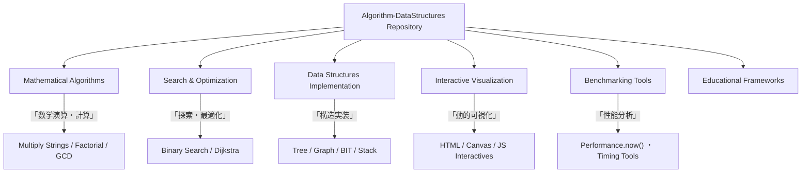
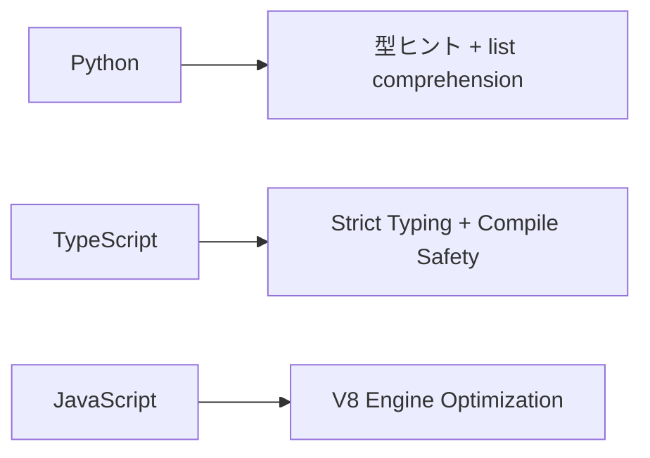
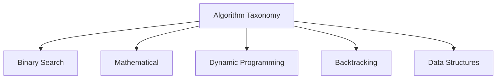
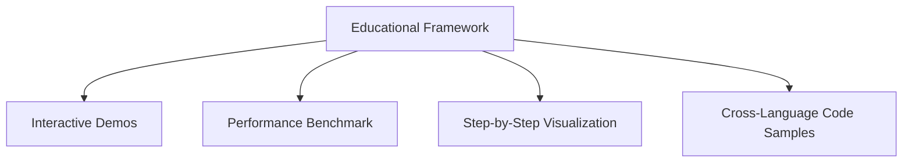
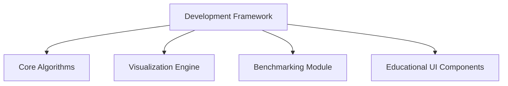

# 📘 Algorithm-DataStructures リポジトリ概要

## 🔍 概要（Overview）

本ドキュメントは **Algorithm-DataStructures** リポジトリの包括的な概要を示します。
このリポジトリは、**アルゴリズム実装・インタラクティブ可視化・性能ベンチマーク**を統合した多言語教育プラットフォームです。
競技プログラミング、技術面接、コンピュータサイエンス教育向けの **最適化されたリファレンス実装集** として機能します。

---

## 🎯 目的と範囲（Purpose and Scope）

- 主要アルゴリズムカテゴリの包括的実装
- 各言語（Python / TypeScript / JavaScript）における統一的ロジック
- 教育・可視化・パフォーマンス評価の統合フレームワーク
- 学習・面接・競技環境のすべてに対応

---

## 🏗️ リポジトリアーキテクチャ

---

## 🌐 多言語実装フレームワーク

各アルゴリズムは **共通ロジック** を維持しながら、各言語の特性を活かして最適化されています。

| 言語           | 主な構成              | 型システム                | 最適化手法                      |
| -------------- | --------------------- | ------------------------- | ------------------------------- |
| **Python**     | `class Solution`      | `typing.List` / 型ヒント  | `ord() - 48` / リスト内包表記   |
| **TypeScript** | `function multiply()` | 厳格な型定義 (`number[]`) | コンパイル時型安全性            |
| **JavaScript** | `var multiply`        | 動的型付け                | `charCodeAt() - 48` / V8 最適化 |

---

## ⚙️ アルゴリズム分類と計算量

リポジトリは、**計算量と応用領域** に基づいてアルゴリズムを体系化しています。

| カテゴリ                | 代表関数                                 | 時間計算量  | 空間計算量 | 対応言語       |
| ----------------------- | ---------------------------------------- | ----------- | ---------- | -------------- |
| **Binary Search**       | `search()` / `findMedianSortedArrays()`  | O(log n)    | O(1)       | Python, TS, JS |
| **Mathematical**        | `Solution.multiply()` / `multiply()`     | O(m×n)      | O(m+n)     | Python, TS, JS |
| **Dynamic Programming** | `countWays()` / `count_ways()`           | O(n)〜O(n²) | O(n)       | Python, TS, JS |
| **Backtracking**        | `combinationSum()` / `backtrack()`       | O(2^n)      | O(log n)   | TS, JS         |
| **Data Structures**     | `BinaryIndexedTree.update()` / `query()` | O(log n)    | O(n)       | Python         |

---

## 🧩 教育システムアーキテクチャ

リポジトリは教育的価値を高めるために、**可視化・パフォーマンス測定・実行体験**を統合しています。

### 🎮 インタラクティブ機能

**リアルタイム実行:** `demoMultiply()` で入力値を即テスト

- **性能計測:** `performance.now()` による時間分析
- **逐次可視化:** 各ステップを動的追跡
- **多言語例:** 同一アルゴリズムを Python/TS/JS で比較可能

---

## 🧱 開発フレームワーク構造

---

## ⚡ プラットフォーム別最適化

| 環境                 | 最適化内容                                              |
| ------------------ | -------------------------------------------------- |
| **AtCoder**        | `FastIO` クラス (`nextLine()`, `nextInt()`) による高速入力処理 |
| **LeetCode**       | `class Solution` パターンを統一利用、制約条件を考慮                 |
| **Benchmark Mode** | `benchmark_search_algorithms()` による多サイズ性能比較        |

---

## 🧮 依存関係とシステム要件

* **最小限の外部依存**：フレームワーク非依存・自己完結型
* **包括的アルゴリズムカバレッジ**：分野横断的な完全実装
* **教育リソース統合**：可視化と学習機能を標準搭載

---

## 🧭 まとめ

このリポジトリは以下の目的を統合的に満たします。

* 💡 **学習用途**：包括的なリファレンス実装
* 🧠 **面接対策**：設計パターンと最適化技法
* 🏁 **競技プログラミング**：高速化・メモリ効率重視
* 🔬 **性能最適化**：言語別チューニング戦略
* 🎓 **教育価値**：可視化による理解促進
* 🌍 **多言語一貫性**：統一API設計・ロジック共有

**⭐ このプロジェクトが役立ちましたら、ぜひスターを付けてください！**

