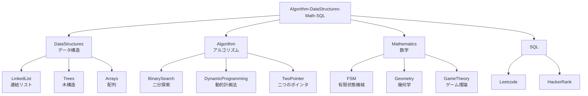
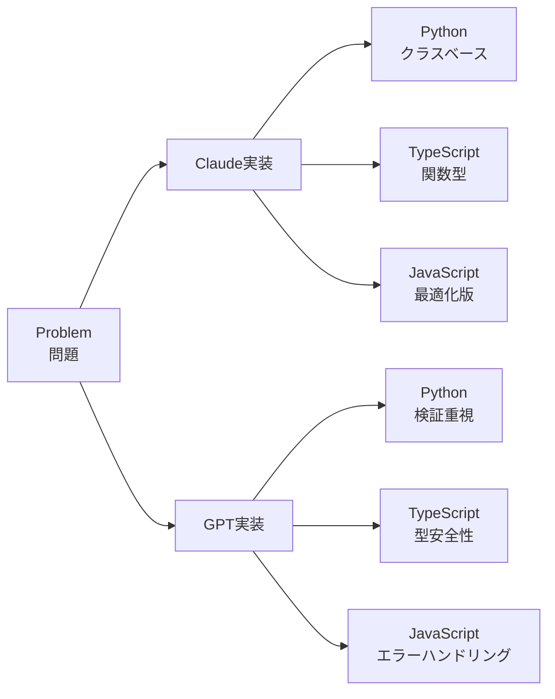
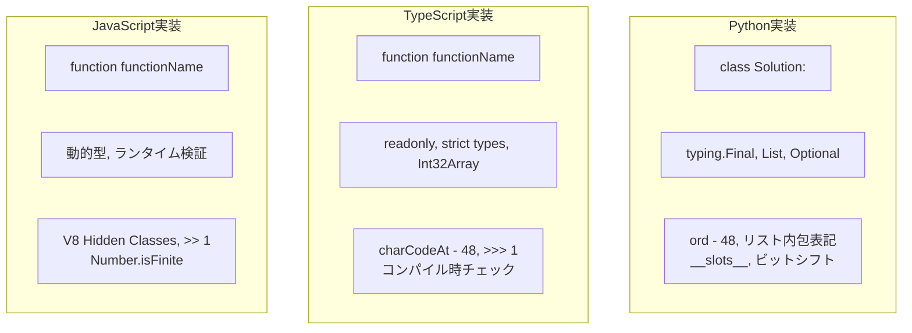
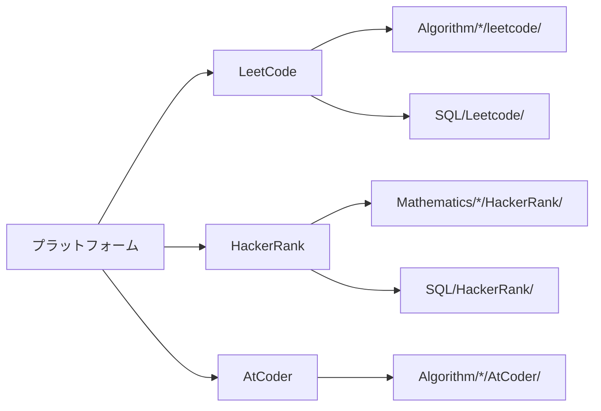
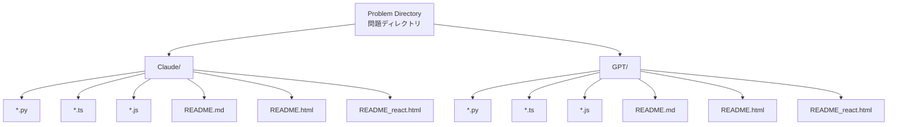
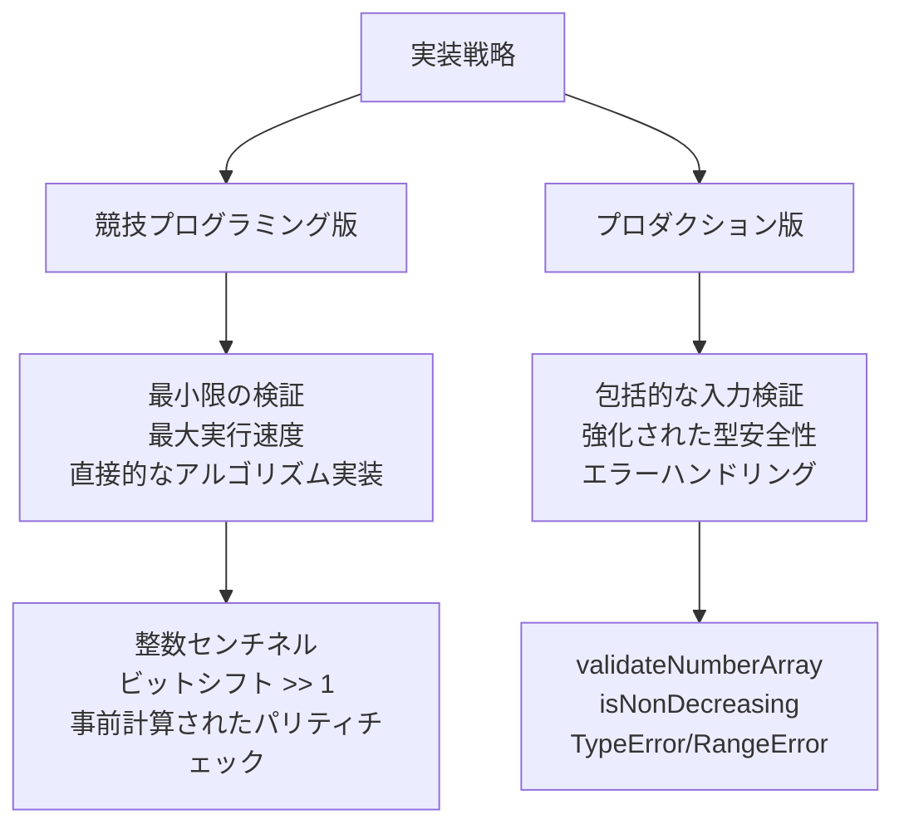
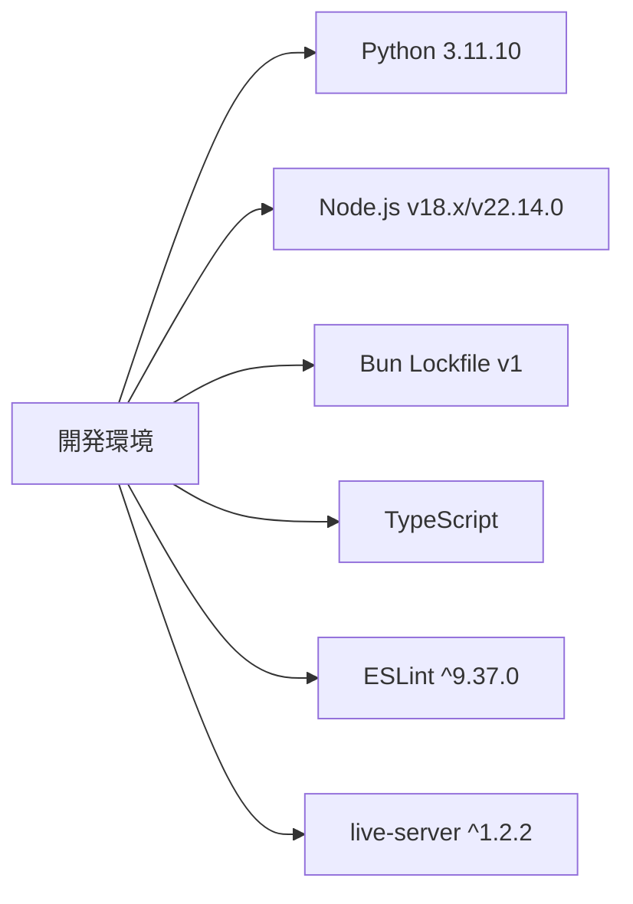
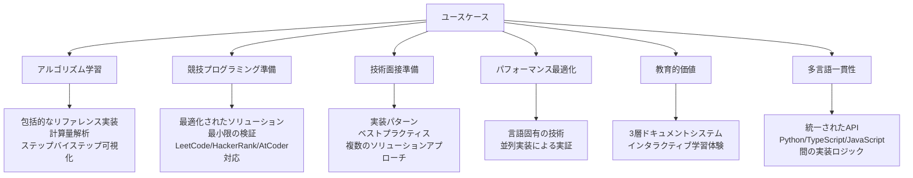
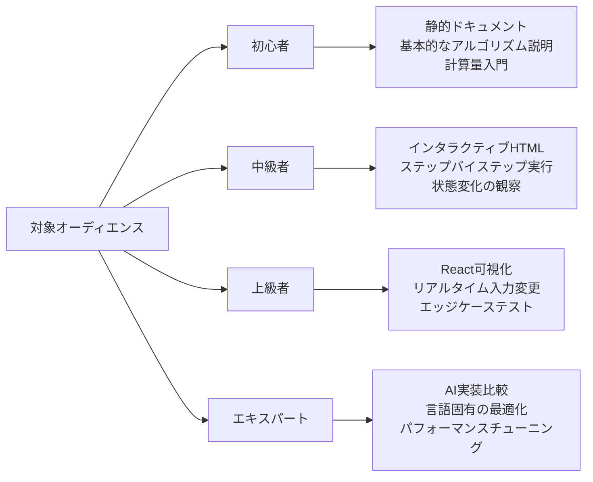

# Repository Overview: Algorithm-DataStructures-Math-SQL

[](https://github.com/myoshi2891/Algorithm-DataStructures-Math-SQL/stargazers)
[](https://github.com/myoshi2891/Algorithm-DataStructures-Math-SQL/network/members)

[](https://deepwiki.com/myoshi2891/Algorithm-DataStructures-Math-SQL)

## 目的と範囲

本リポジトリは、アルゴリズム実装、インタラクティブな可視化、包括的なドキュメントを特徴とする多言語教育プラットフォームです。競技プログラミング（LeetCode、HackerRank、AtCoder）、技術面接、コンピュータサイエンス教育に最適化されたリファレンス実装集として機能します。

本リポジトリは、**データ構造**、**アルゴリズム**、**数学**、**SQL**の4つのコア問題領域にわたるソリューションを実装しています。各問題には、多言語実装（Python、TypeScript、JavaScript）、インタラクティブなHTMLデモンストレーション、詳細なMarkdownドキュメントが含まれています。

---

## コア問題領域

リポジトリは4つの主要領域にソリューションを整理しています。

### 領域別分布



| 領域 | 代表的な関数/クラス | 主要パターン | ファイルの場所 |
|------|---------------------|--------------|----------------|
| **DataStructures** | `Solution.addTwoNumbers()`, `ListNode`, `DoublyLinkedList` | インプレース操作、ポインタ演算 | `DataStructures/LinkedList/`, `DataStructures/Trees/` |
| **Algorithm** | `Solution.findMedianSortedArrays()`, `numDecodings()`, `minPathSum()` | 二分探索、動的計画法、二つのポインタ | `Algorithm/BinarySearch/`, `Algorithm/DynamicProgramming/` |
| **Mathematics** | `isNumber()`, `reflectPoint()`, `gameWithCells()` | 状態機械、幾何変換 | `Mathematics/FSM/`, `Mathematics/Geometry/` |
| **SQL** | `CombineTwoTables.sql`, `RisingTemperature.sql` | JOINパターン、ウィンドウ関数 | `SQL/Leetcode/`, `SQL/HackerRank/` |

---

## デュアルAI実装戦略

各問題は、**Claude**と**GPT**の両方のAIモデルから並列実装を受け、補完的なソリューションアプローチとコーディングスタイルを提供します。これにより、問題ごとに2×3実装マトリックス（2つのAIバリアント × 3つの言語）が作成されます。



### 実装比較

| 側面 | Claude バリアント | GPT バリアント |
|------|-------------------|----------------|
| **Pythonクラスメソッド** | `findMedianSortedArrays(self, nums1: List[int], nums2: List[int]) -> float` | `_median_binary_partition(self, nums1: List[int], nums2: List[int]) -> float` |
| **センチネル値** | `NEG: Final[int] = -10_000_007`<br/>`POS: Final[int] = +10_000_007` | `INF: Final[float] = float("inf")` |
| **TypeScriptシグネチャ** | `function findMedianSortedArrays(nums1: number[], nums2: number[]): number` | `function findMedianSortedArrays(nums1: readonly number[], nums2: readonly number[]): number` |
| **最適化の焦点** | 整数センチネルによるfloatキャストの排除 | TypeError/RangeErrorによる包括的な入力検証 |
| **ドキュメントスタイル** | 計算量優先＋最適化セクション | アルゴリズム比較表＋ビジネスコンテキスト |

---

## 多言語実装フレームワーク

すべてのアルゴリズムは、統一されたアルゴリズムロジックを維持しながら、言語固有の最適化を伴うPython、TypeScript、JavaScriptで実装されています。



### 言語別実装詳細

| 言語 | クラス/関数パターン | 型システム | 主要な最適化 |
|------|---------------------|------------|--------------|
| **Python** | `class Solution:` with `def methodName(self, ...)` | `typing.Final`, `List[int]`, `Optional[T]` | `ord() - 48`, リスト内包表記, `__slots__`, ビットシフト `>> 1` |
| **TypeScript** | `function functionName(...)` or `export function` | `readonly number[]`, strict types, `Int32Array` | `charCodeAt(0) - 48`, `>>> 1` (ゼロフィルシフト), コンパイル時チェック |
| **JavaScript** | `function functionName(...)` or `var name = function(...)` | 動的型、ランタイム検証 | V8 Hidden Classes, `>> 1`, `Number.isFinite()`, シンプルなループ |

### 言語別ビットシフト演算子

| 演算 | Python | TypeScript | JavaScript | 目的 |
|------|--------|------------|------------|------|
| **算術右シフト** | `x >> 1` | `x >> 1` | `x >> 1` | 2で除算（符号保持） |
| **ゼロフィル右シフト** | 利用不可 | `x >>> 1` | `x >>> 1` | 2で除算（符号なし） |

---

## 問題ソースプラットフォーム

問題は3つの競技プログラミングプラットフォームから取得され、それぞれ特定のフォーマットと制約の規約があります。



### プラットフォーム別特性

| プラットフォーム | 問題タイプ | 命名規則 | 制約フォーマット | ディレクトリ構造 |
|------------------|------------|----------|------------------|------------------|
| **LeetCode** | アルゴリズム、SQL、データ構造 | `{番号}. {タイトル}` | `0 <= m, n <= 1000`, `-10^6 <= nums[i] <= 10^6` | `Algorithm/*/leetcode/`, `SQL/Leetcode/` |
| **HackerRank** | 数学、SQL、高度なアルゴリズム | `{カテゴリ}/{問題タイトル}` | ポイントベースの難易度、カスタム入力フォーマット | `Mathematics/*/HackerRank/`, `SQL/HackerRank/` |
| **AtCoder** | 競技プログラミング | コンテストベースの命名 | 日本語＋英語ドキュメント | `Algorithm/*/AtCoder/` (存在する場合) |

---

## ファイル構成パターン

各問題は、標準化されたファイル命名とコンテンツ構成を持つ一貫したデュアルフォルダ構造に従います。



### ファイル命名規則

| ファイルタイプ | 命名パターン | 目的 | 例 |
|----------------|--------------|------|-----|
| **Python実装** | `{ProblemName}.py` または `{problem_name}.py` | `class Solution`を含むコアアルゴリズム実装 | `Median_of_Two_Sorted_Arrays.py` |
| **TypeScript実装** | `{ProblemName}.ts` | 厳密なチェックを伴う型安全な実装 | `Median_of_Two_Sorted_Arrays.ts` |
| **JavaScript実装** | `{ProblemName}.js` | ランタイム検証済み実装 | `Median_of_Two_Sorted_Arrays.js` |
| **静的ドキュメント** | `README.md` | 5段階のドキュメント構造 | `README.md` (セクションごと最大100行) |
| **インタラクティブHTML** | `README.html` | Prism.jsシンタックスハイライト、Tailwind CSS | `README.html` (1000-2000行) |
| **React可視化** | `README_react.html` | React 18 + Babel standalone、インタラクティブデモ | `README_react.html` |

### SQL問題構造

```
SQL/
├── Leetcode/
│   ├── Basic join/
│   │   └── 175. Combine Two Tables/
│   │       ├── gpt/
│   │       │   ├── CombineTwoTables_mysql.sql
│   │       │   ├── CombineTwoTables_pandas.py
│   │       │   └── CombineTwoTables_mysql.md
```

---

## 実装戦略: 競技プログラミング vs プロダクション

リポジトリは、異なるユースケースに最適化されたデュアル実装バリアントを提供します。



### 競技プログラミングバリアント

**特徴:**
- 最小限の検証（問題の制約を信頼）
- 最大実行速度
- 直接的なアルゴリズム実装

**例:** 整数センチネル（`NEG = -10_000_007`）を使用し、ホットパスでfloatキャストを排除

**最適化技術:**
- ビットシフト `>> 1`
- 事前計算されたパリティチェック `(total & 1) == 1`
- ローカル変数バインディング

### プロダクションバリアント

**特徴:**
- 包括的な入力検証
- 強化された型安全性
- エラーハンドリングとエッジケース

**検証関数:**
- **Python:** `_validate_non_decreasing(arr: List[int]) -> bool`
- **TypeScript:** `validateNumberArray(arr: readonly number[]): void`
- **JavaScript:** `function validateArray(arr)` および `function isNonDecreasing(arr)`

### 最適化比較

| 最適化 | 競技プログラミング版 | プロダクション版 |
|--------|----------------------|------------------|
| **入力検証** | スキップ（制約を信頼） | 違反時にTypeError、RangeError |
| **センチネル値** | 整数センチネル: `-10_000_007`, `+10_000_007` | `float('inf')` または `±Infinity` |
| **型チェック** | 最小限（型ヒントのみ） | ランタイム `Number.isFinite()`, `Array.isArray()` |
| **エラーメッセージ** | なしまたは汎用的 | 説明的なメッセージを持つ特定のエラータイプ |
| **エッジケース処理** | アルゴリズムを通じて暗黙的 | 早期リターンを伴う明示的な検証 |

---

## システム要件と依存関係

リポジトリは、包括的なアルゴリズムカバレッジを提供しながら、外部依存関係を最小限に抑えています。

### 開発環境構成



| コンポーネント | バージョン/構成 | 目的 |
|----------------|-----------------|------|
| **Python** | CPython 3.11.10 | 型ヒント付きアルゴリズム実装 |
| **Node.js** | v18.x (JavaScript), v22.14.0 (TypeScript) | TS/JS実装のランタイム |
| **Bun** | Lockfile version 1 | パッケージ管理と決定論的ビルド |
| **TypeScript** | @types/node ^22.18.10 | Node.jsの型定義 |
| **ESLint** | ^9.37.0 | コード品質検証 |
| **live-server** | ^1.2.2 | ライブリロード付き開発サーバー |

### Markdownlint設定詳細

- **MD013ルール:** `line_length: 100`（コードブロックとテーブルを除外）
- **MD033ルール:** `h1, h2, details, summary, p, i, footer, div` HTMLタグを許可
- **目的:** すべての静的ドキュメントファイル間の一貫性を保証

### 外部ライブラリポリシー

- **アルゴリズム/数学実装:** 外部ライブラリなし（自己完結型）
- **SQL実装:** ネイティブSQL方言構文（MySQL、PostgreSQL）およびPython pandas
- **インタラクティブ可視化:** CDNベースのライブラリのみ（Prism.js、Tailwind CSS、React 18、Babel Standalone）

---

## リポジトリの目的とユースケース

リポジトリは、そのアーキテクチャを通じて複数の補完的な目的を果たします。



### 主要ユースケース

1. **アルゴリズム学習:** 計算量解析とステップバイステップ可視化を含む包括的なリファレンス実装
2. **競技プログラミング準備:** LeetCode、HackerRank、AtCoder向けの最小限の検証を伴う最適化されたソリューション
3. **技術面接準備:** 実装パターン、ベストプラクティス、複数のソリューションアプローチ
4. **パフォーマンス最適化:** 並列実装を通じて実証される言語固有の技術
5. **教育的価値:** 3層ドキュメントシステムによるインタラクティブな学習体験
6. **多言語一貫性:** Python、TypeScript、JavaScript間の統一されたAPIと実装ロジック

### 対象オーディエンスレベル



### 学習パスウェイ

**Tier 1（静的）:**
- 問題説明を読む
- アルゴリズム説明を理解する
- 計算量解析を学ぶ

**Tier 2（インタラクティブ）:**
- コントロール（Play/Pause/Next/Reset）でステップバイステップ実行
- 状態変化を観察

**Tier 3（React）:**
- リアルタイムで入力を変更
- エッジケースをテスト
- AI実装を比較

---

## まとめ

本リポジトリは、教育、競技プログラミング、技術面接準備のための包括的なプラットフォームを提供します。デュアルAI実装戦略、多言語サポート、3層ドキュメントシステムにより、初心者からエキスパートまで、あらゆるレベルの学習者に対応しています。


<div align="center">

**⭐ このプロジェクトが役立ちましたら、ぜひスターを付けてください！**

[](https://github.com/myoshi2891)

</div>
