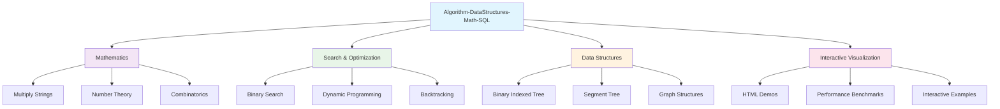
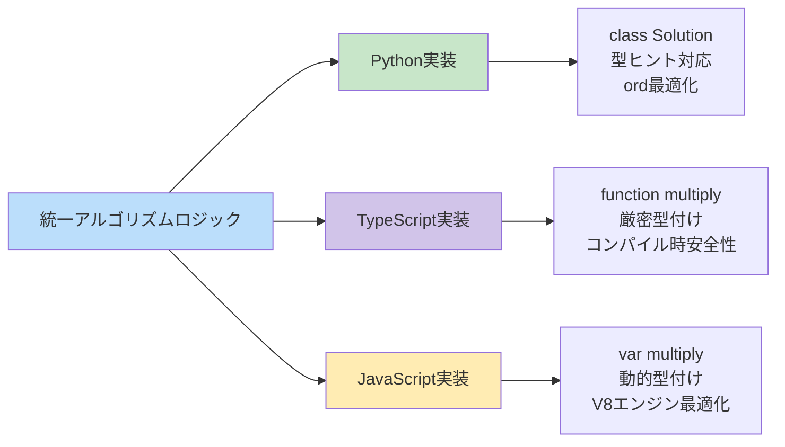
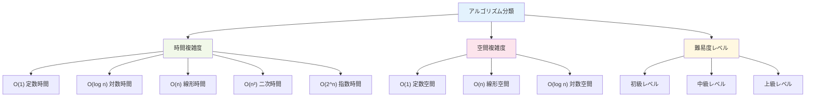
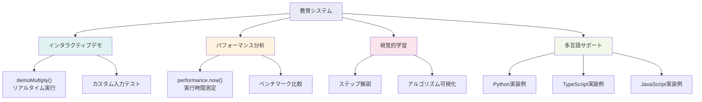
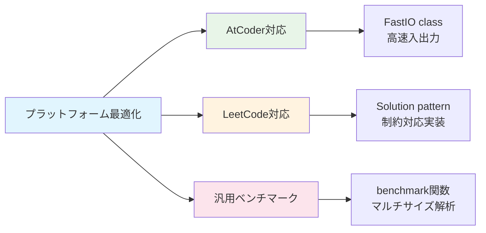
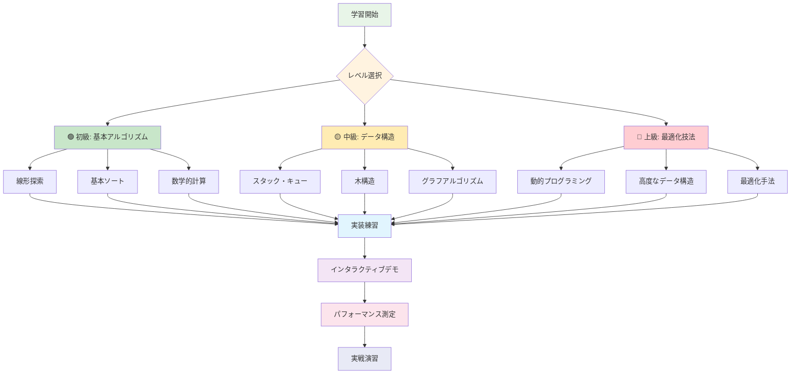
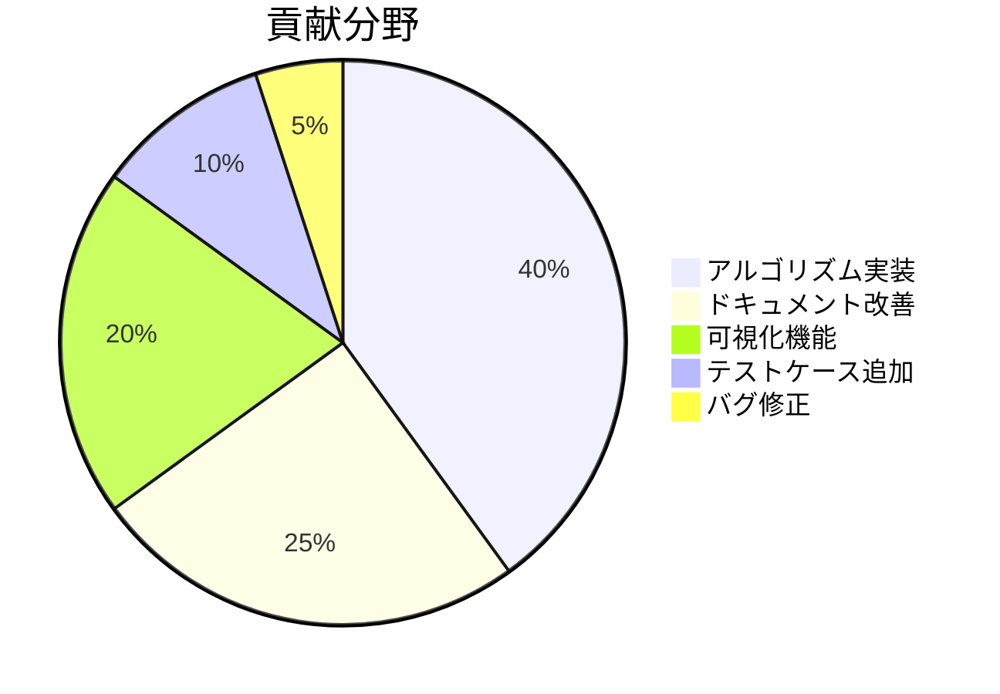

# Algorithm-DataStructures-Math-SQL 🚀

[](https://github.com/myoshi2891/Algorithm-DataStructures-Math-SQL/stargazers)
[](https://github.com/myoshi2891/Algorithm-DataStructures-Math-SQL/network/members)
[](#)
[](https://deepwiki.com/myoshi2891/Algorithm-DataStructures-Math-SQL)

> 競技プログラミング、技術面接、コンピュータサイエンス教育に最適化された多言語アルゴリズム実装・可視化プラットフォーム

## 📋 目次

- [プロジェクト概要](#-プロジェクト概要)
- [リポジトリアーキテクチャ](#-リポジトリアーキテクチャ)
- [多言語実装戦略](#-多言語実装戦略)
- [アルゴリズムカテゴリ](#-アルゴリズムカテゴリ)
- [教育システム](#-教育システム)
- [プラットフォーム最適化](#-プラットフォーム最適化)
- [使用方法](#-使用方法)
- [貢献方法](#-貢献方法)

## 🎯 プロジェクト概要

このリポジトリは、アルゴリズム実装、インタラクティブな可視化、パフォーマンスベンチマークツールを特徴とする包括的な教育プラットフォームです。

### 🎨 リポジトリアーキテクチャ



### 🌐 多言語実装戦略



#### 言語固有実装詳細

|       言語        |      クラス/関数      |        型システム         | 最適化戦略                         |
| :---------------: | :-------------------: | :-----------------------: | :--------------------------------- |
|   🐍 **Python**   |   `class Solution`    | `typing.List`, type hints | `ord() - 48`, リスト内包表記       |
| 📘 **TypeScript** | `function multiply()` | 厳密な型付け, `number[]`  | `Number()`変換, コンパイル時安全性 |
| 🟨 **JavaScript** |    `var multiply`     |        動的型付け         | `charCodeAt() - 48`, V8 最適化     |

## 🧮 アルゴリズムカテゴリ

### 📊 アルゴリズム複雑度分類



### 🚀 包括的アルゴリズムカバレッジ

|   アルゴリズムカテゴリ    | 主要関数                                |   時間複雑度   | 空間複雑度 | 対応言語                       |
| :-----------------------: | :-------------------------------------- | :------------: | :--------: | :----------------------------- |
|      🔍 **二分探索**      | `search()`, `findMedianSortedArrays()`  |   `O(log n)`   |   `O(1)`   | Python, TypeScript, JavaScript |
| 🧮 **数学的アルゴリズム** | `Solution.multiply()`, `multiply()`     |   `O(m × n)`   | `O(m + n)` | Python, TypeScript, JavaScript |
| 🏗️ **動的プログラミング** | `countWays()`, `count_ways()`           | `O(n) ~ O(n²)` |   `O(n)`   | Python, TypeScript, JavaScript |
| 🔄 **バックトラッキング** | `combinationSum()`, `backtrack()`       |    `O(2^n)`    | `O(log n)` | TypeScript, JavaScript         |
|     🗂️ **データ構造**     | `BinaryIndexedTree.update()`, `query()` |   `O(log n)`   |   `O(n)`   | Python                         |

## 🎓 教育システム

### 📚 教育フレームワークコンポーネント



### 🛠️ インタラクティブデモンストレーション機能

- **📊 リアルタイムアルゴリズム実行**: `demoMultiply()`関数によるカスタム入力での即座のテスト
- **⏱️ パフォーマンス測定**: 組み込み`performance.now()`タイミングによる実行解析
- **👁️ 視覚的プロセス追跡**: アルゴリズム実行のステップバイステップ分解
- **🌍 多言語コード例**: Python、TypeScript、JavaScript での一貫した実装

## ⚡ プラットフォーム最適化

### 🏆 競技プログラミング環境対応



#### 主要最適化機能

|  プラットフォーム   | 最適化機能                      | 実装詳細                                            |
| :-----------------: | :------------------------------ | :-------------------------------------------------- |
|   🟦 **AtCoder**    | `FastIO`クラス                  | `nextLine()`, `nextInt()`メソッドによる高速入力処理 |
|   🟩 **LeetCode**   | `class Solution`パターン        | 制約を考慮した標準化された実装パターン              |
| 📊 **ベンチマーク** | `benchmark_search_algorithms()` | マルチサイズパフォーマンス解析機能                  |

## 🚀 使用方法

### 📥 クイックスタート

```bash
# リポジトリのクローン
git clone https://github.com/myoshi2891/Algorithm-DataStructures-Math-SQL.git

# ディレクトリに移動
cd Algorithm-DataStructures-Math-SQL

# Python実装の実行例
cd Mathematics/Multiply\ Strings/leetcode/43.\ Multiply\ Strings/Claude/
python Multiply-Strings.py

# TypeScript実装のコンパイル・実行
tsc Multiply-Strings.ts
node Multiply-Strings.js

# インタラクティブデモの起動
open README.html
```

### 🎯 学習パス



## 🎯 システム要件と特徴

### 📦 依存関係

- **✅ 最小限の外部依存関係**: 重いフレームワークなしの自己完結型実装
- **🎯 包括的アルゴリズムカバレッジ**: 複数のドメインにわたる完全な参照実装
- **📚 教育リソース統合**: 組み込み可視化とインタラクティブ学習コンポーネント

### 🌟 主要用途

|             用途              | 説明                                 | 対象者             |
| :---------------------------: | :----------------------------------- | :----------------- |
|    📖 **アルゴリズム学習**    | 包括的な参照実装による体系的学習     | 学生、初学者       |
| 🏆 **競技プログラミング準備** | 最適化されたソリューションと高速 I/O | 競技プログラマー   |
|      💼 **技術面接準備**      | 実装パターンとベストプラクティス     | 就職活動者、転職者 |
|  ⚡ **パフォーマンス最適化**  | 言語固有の最適化技術                 | 開発者、エンジニア |
|       🎓 **教育的価値**       | インタラクティブな学習体験           | 教育者、講師       |
|      🌐 **多言語一貫性**      | 統一された API と実装ロジック        | 多言語開発者       |

### 📊 統計



<div align="center">

**⭐ このプロジェクトが役立ちましたら、ぜひスターを付けてください！**

[](https://github.com/myoshi2891)

</div>
