# アルゴリズム・データ構造総合ガイド

## 概要

このリポジトリは、競技プログラミングと技術面接の準備のために設計された包括的なアルゴリズムソリューションとデータ構造実装のコレクションを提供します。このコードベースは、正確性とパフォーマンス効率の両方を重視した、複数のプログラミング言語での最適化された実装による基本的なコンピュータサイエンスアルゴリズムをカバーしています。

## リポジトリアーキテクチャ

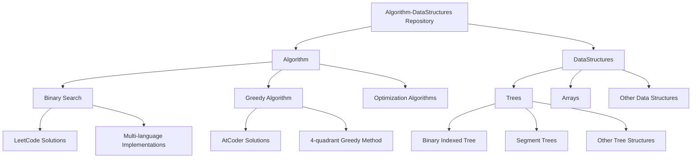

## コアアルゴリズムカテゴリ

### 1. 二分探索実装

#### アーキテクチャ図
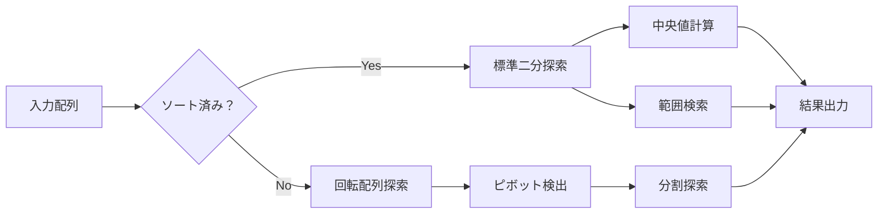

#### 主要実装
- **ソート済み配列の中央値**: `O(log(min(m,n)))` の時間複雑度
- **回転配列での探索**: `O(log n)` の効率的な探索
- **範囲検索**: 要素の最初と最後の位置を特定

#### コード例（TypeScript）
```typescript
function findMedianSortedArrays(nums1: number[], nums2: number[]): number {
    // 二分探索による効率的な中央値計算
    // 時間複雑度: O(log(min(m,n)))
    // 空間複雑度: O(1)
}
```

### 2. グリーディアルゴリズム

#### 4象限グリーディ手法の概念図
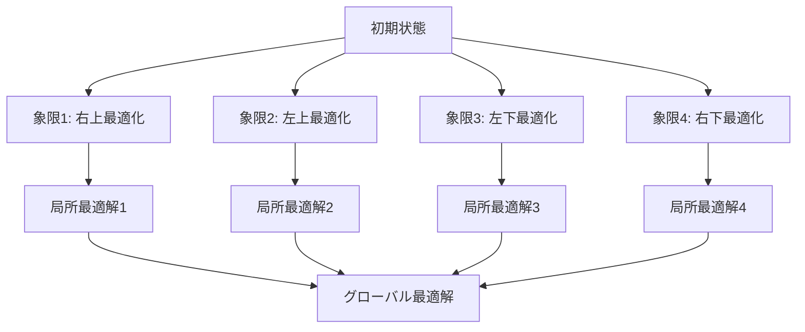

#### AtCoder B42問題の解法戦略
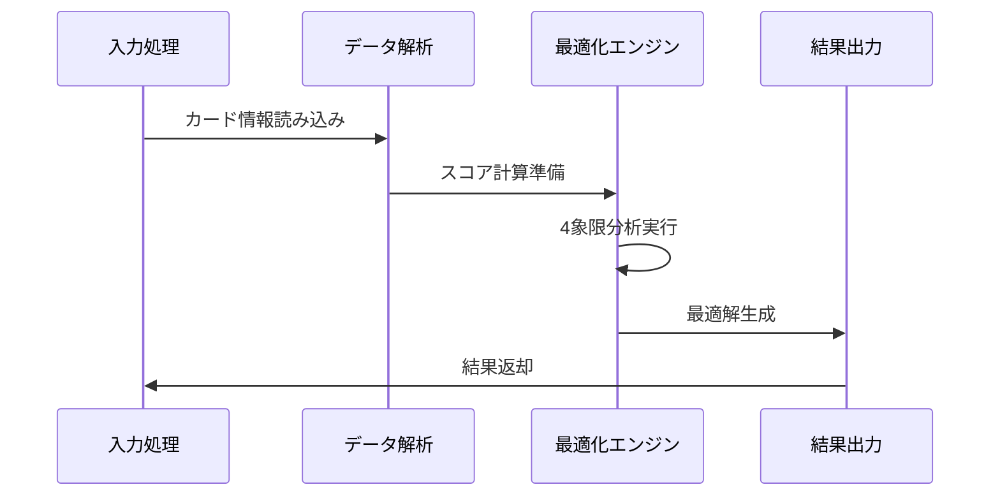

## データ構造システム

### Binary Indexed Tree (BIT) アーキテクチャ

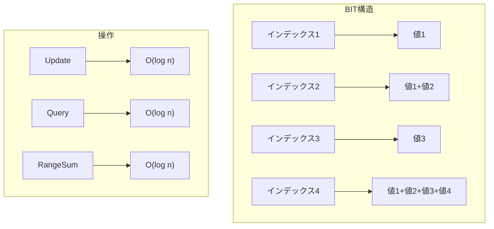

#### BITの主要機能
- **更新操作**: `update(index, delta)` - O(log n)
- **範囲クエリ**: `query(left, right)` - O(log n)
- **構築**: `construct_bit(array)` - O(n log n)

### セグメントツリー vs BIT 比較

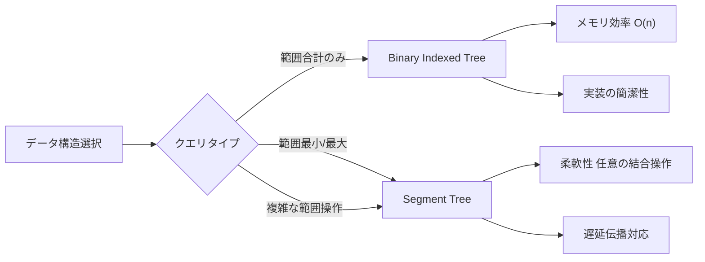

## 多言語実装戦略

### 言語別最適化マトリックス

| 言語 | 主要用途 | キー最適化 | 例関数 |
|------|----------|------------|--------|
| **TypeScript** | 型安全実装 | 厳密型付け、コンパイル時チェック | `findMedianSortedArrays()`, `search()` |
| **JavaScript** | 実行時パフォーマンス | V8最適化、最小オーバーヘッド | `searchJs()`, `solve()` |
| **Python** | 高速プロトタイピング | 型ヒント、包括的テスト | `solve_card_score_optimized()` |
| **Go** | システムレベル性能 | メモリ効率、並行処理 | `maxScore()`, `readInput()` |
| **PHP** | Web統合 | 組み込み関数、文字列処理 | レガシーサポート実装 |

### パフォーマンス比較チャート

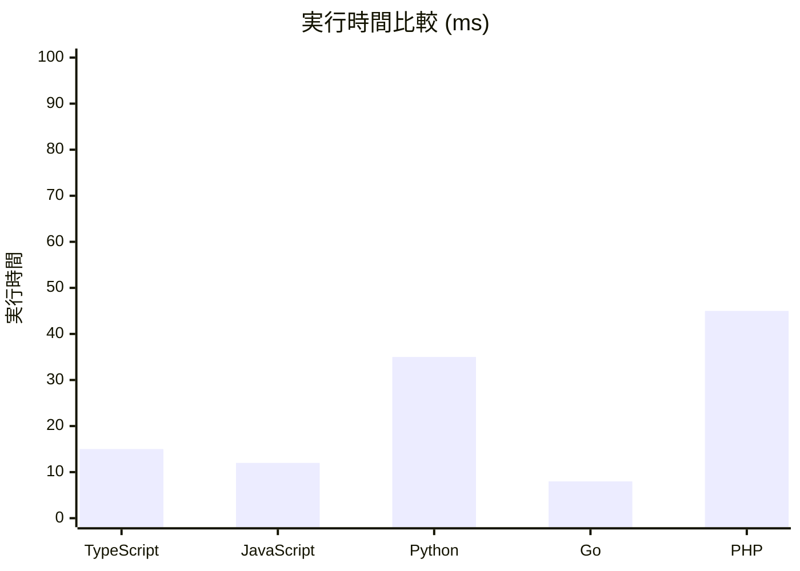

## パフォーマンス分析フレームワーク

### ベンチマーク測定システム

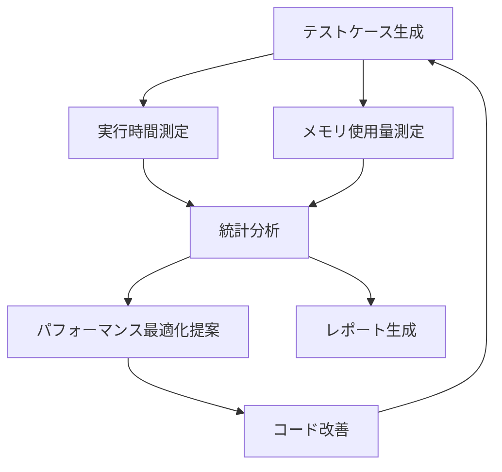

#### 測定メトリクス
- **時間複雑度**: 実際の実行時間vs理論値
- **空間複雑度**: メモリ使用パターン分析
- **スケーラビリティ**: 入力サイズ増加に対する性能変化

## 競技プログラミング統合

### プラットフォーム別最適化

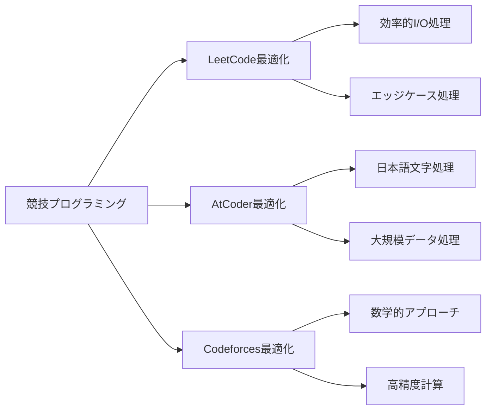

### I/O最適化テンプレート

```typescript
// 高速入力処理テンプレート
class FastIO {
    private input: string[];
    private index: number = 0;
    
    constructor(input: string) {
        this.input = input.trim().split(/\s+/);
    }
    
    nextInt(): number {
        return parseInt(this.input[this.index++]);
    }
    
    nextString(): string {
        return this.input[this.index++];
    }
}
```

## 教育ドキュメンテーションシステム

### 学習パス可視化

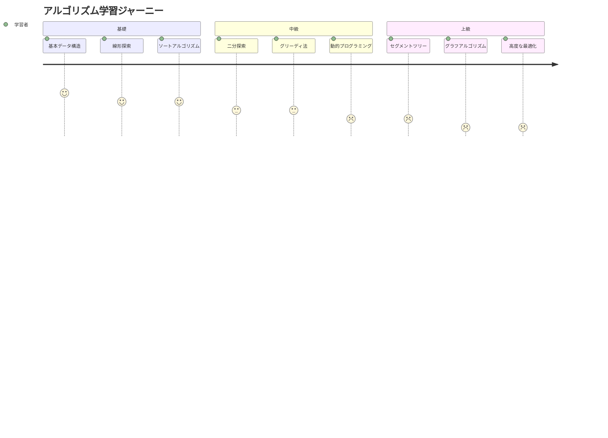

### インタラクティブ可視化

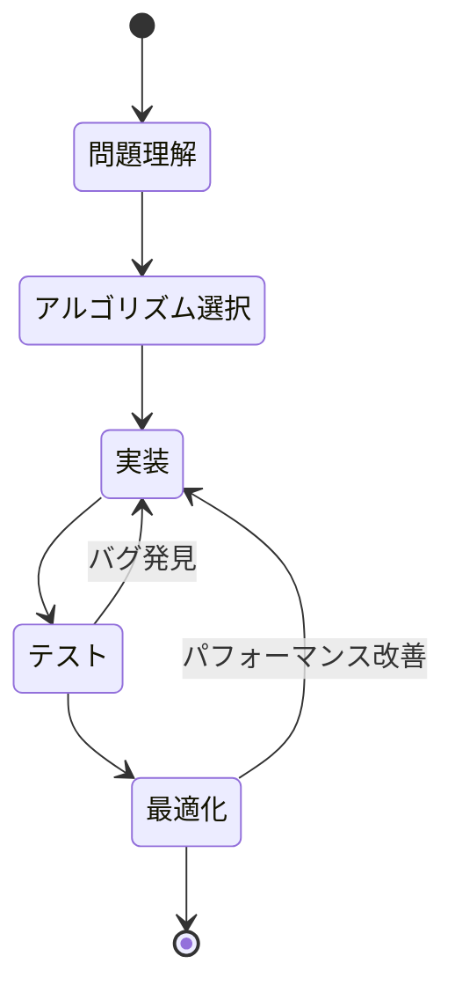

## リポジトリ構造詳細

### ディレクトリ階層

```
Algorithm-DataStructures/
├── Algorithm/
│   ├── BinarySearch/
│   │   ├── leetcode/
│   │   │   ├── 4. Median of Two Sorted Arrays/
│   │   │   ├── 33. Search in Rotated Sorted Array/
│   │   │   └── 34. Find First and Last Position/
│   │   └── README.md
│   ├── greedy algorithm/
│   │   └── atcoder/
│   │       └── 4-quadrant greedy method/
│   └── Optimization Algorithms/
├── DataStructures/
│   ├── Trees/
│   │   ├── BinaryIndexedTree/
│   │   ├── SegmentTrees/
│   │   └── Other/
│   └── Arrays/
└── README.md
```

## まとめ

このリポジトリは、アルゴリズムテクニックの参照実装と競技プログラミング及び技術面接のための包括的な学習リソースの両方として機能し、パフォーマンス最適化と言語間移植性に重点を置いています。

### 主な特徴
- ✅ **多言語サポート**: TypeScript, JavaScript, Python, Go, PHP
- ✅ **詳細な複雑度分析**: 時間・空間複雑度の理論と実測値
- ✅ **競技プログラミング対応**: 主要プラットフォーム最適化
- ✅ **教育的価値**: ステップバイステップの解説
- ✅ **パフォーマンス重視**: ベンチマークとプロファイリング

このガイドを通じて、効率的なアルゴリズム実装とデータ構造の活用方法を習得し、競技プログラミングでの成功と技術面接での優れた表現を目指すことができます。
