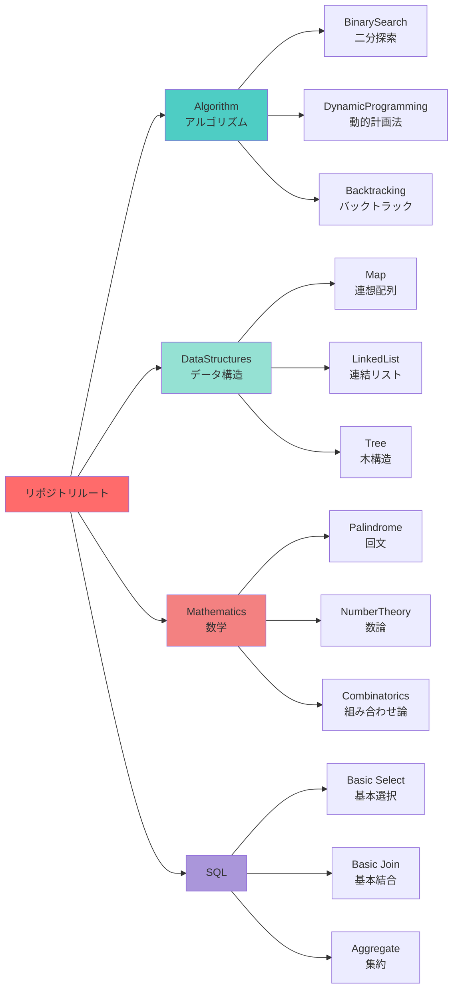
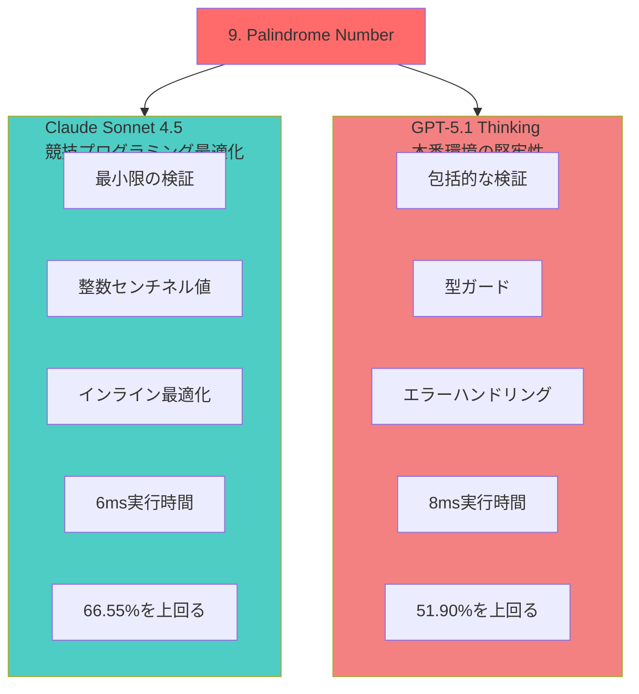
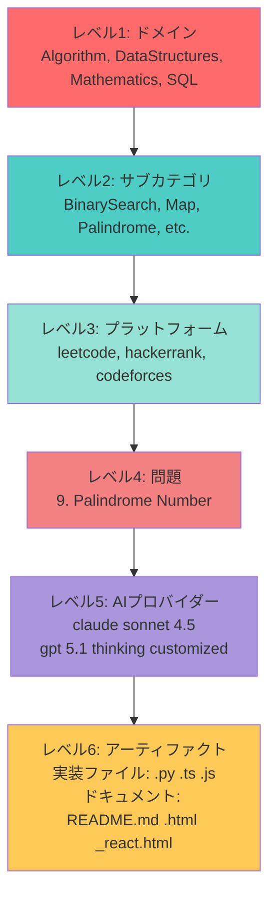
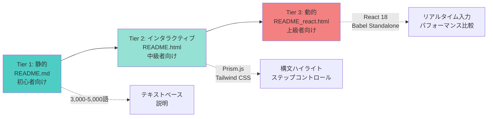
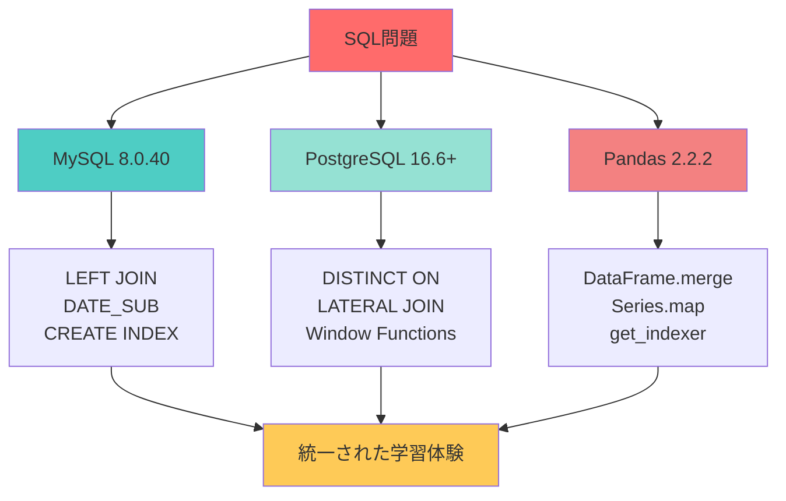
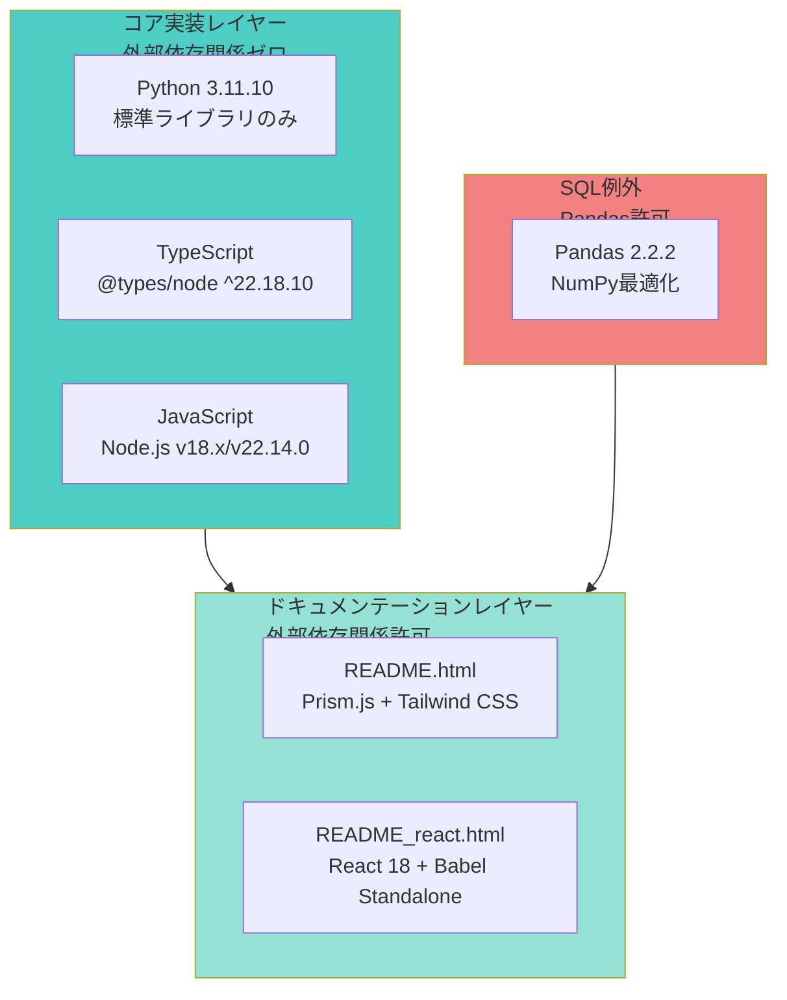
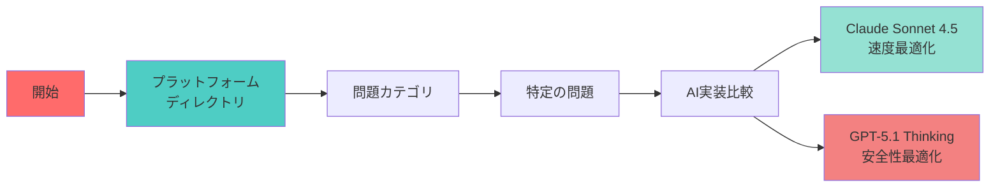
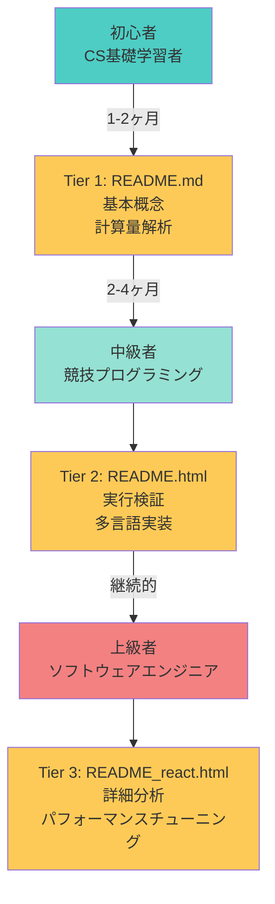

# リポジトリ概要

[](https://github.com/myoshi2891/Algorithm-DataStructures-Math-SQL/stargazers)
[](https://github.com/myoshi2891/Algorithm-DataStructures-Math-SQL/network/members)

[](https://deepwiki.com/myoshi2891/Algorithm-DataStructures-Math-SQL)

## 目的と範囲

このドキュメントは、Algorithm-DataStructures-Math-SQLリポジトリのアーキテクチャ、ファイル構成、およびアーティファクト生成システムについて説明します。このリポジトリは、各問題を**2×3×3マトリックス**を通じて18個の異なる実装に変換します：

- **2つのAIプロバイダー**（Claude Sonnet 4.5、GPT-5.1 Thinking）
- **3つの言語**（Python、TypeScript、JavaScript）
- **3つのドキュメンテーション階層**（Markdown、HTML、React）

### 主要なアーキテクチャコンポーネント

- 問題ごとに18ファイルを生成する2×3×3アーティファクト生成マトリックス
- 6レベルのファイル階層：ドメイン → サブカテゴリ → プラットフォーム → 問題 → AIプロバイダー → アーティファクト
- デュアルAI実装哲学：競技最適化（Claude）vs 本番環境の堅牢性（GPT）
- マルチプラットフォームSQL：MySQL 8.0.40、PostgreSQL 16.6+、Pandas 2.2.2
- コア実装における外部依存関係ゼロ

---

## コアアーキテクチャ：2×3×3アーティファクト生成マトリックス

リポジトリは、3次元マトリックスを通じて問題ごとに18ファイルを生成します。

**計算式：2つのAIプロバイダー × 3つの言語 × 3つのドキュメンテーション階層 = 問題ごとに18アーティファクト**

```mermaid
graph TB
    Problem[問題] --> Matrix[2×3×3 マトリックス]
    
    Matrix --> AI1[Claude Sonnet 4.5]
    Matrix --> AI2[GPT-5.1 Thinking]
    
    AI1 --> L1[Python]
    AI1 --> L2[TypeScript]
    AI1 --> L3[JavaScript]
    
    AI2 --> L4[Python]
    AI2 --> L5[TypeScript]
    AI2 --> L6[JavaScript]
    
    L1 --> D1[Tier 1: README.md]
    L1 --> D2[Tier 2: README.html]
    L1 --> D3[Tier 3: README_react.html]
    
    L2 --> D4[Tier 1: README.md]
    L2 --> D5[Tier 2: README.html]
    L2 --> D6[Tier 3: README_react.html]
    
    L3 --> D7[Tier 1: README.md]
    L3 --> D8[Tier 2: README.html]
    L3 --> D9[Tier 3: README_react.html]
    
    L4 --> D10[Tier 1: README.md]
    L4 --> D11[Tier 2: README.html]
    L4 --> D12[Tier 3: README_react.html]
    
    L5 --> D13[Tier 1: README.md]
    L5 --> D14[Tier 2: README.html]
    L5 --> D15[Tier 3: README_react.html]
    
    L6 --> D16[Tier 1: README.md]
    L6 --> D17[Tier 2: README.html]
    L6 --> D18[Tier 3: README_react.html]
    
    style Problem fill:#ff6b6b
    style Matrix fill:#4ecdc4
    style AI1 fill:#95e1d3
    style AI2 fill:#95e1d3
```



---

## 問題ごとのファイル生成パターン

各問題は、以下のパターンに従って正確に18ファイルを生成します：

| ディレクトリ | 実装ファイル | ドキュメンテーションファイル | 合計 |
|------------|------------|--------------------------|------|
| `claude sonnet 4.5/` | PalindromeNumber.py<br>PalindromeNumber.ts<br>PalindromeNumber.js | README.md<br>README.html<br>README_react.html | 6ファイル |
| `gpt 5.1 thinking customized/` | PalindromeNumber.py<br>PalindromeNumber.ts<br>PalindromeNumber.js | README.md<br>README.html<br>README_react.html | 6ファイル |
| **AIプロバイダーごとの合計** | 3言語 × 1実装 | 3階層 × 1ドキュメンテーション | **6ファイル** |
| **問題ごとの合計** | 2プロバイダー × 3言語 | 2プロバイダー × 3階層 | **18ファイル** |

### ディレクトリ構造の例

```
Mathematics/Palindrome/leetcode/9. Palindrome Number/
├── claude sonnet 4.5/              # 6ファイル
│   ├── PalindromeNumber.py
│   ├── PalindromeNumber.ts
│   ├── PalindromeNumber.js
│   ├── README.md
│   ├── README.html
│   └── README_react.html
└── gpt 5.1 thinking customized/    # 6ファイル
    ├── PalindromeNumber.py
    ├── PalindromeNumber.ts
    ├── PalindromeNumber.js
    ├── README.md
    ├── README.html
    └── README_react.html
```

---

## 4つのドメイン問題分類

問題は4つのトップレベルドメインに整理され、各ドメインにはプラットフォーム固有のサブディレクトリが含まれます。



### ドメインとコードエンティティのマッピング

| ドメイン | コードエンティティ（Python） | コードエンティティ（TypeScript/JavaScript） | ファイルパスパターン |
|---------|---------------------------|----------------------------------------|------------------|
| **Algorithm**<br/>アルゴリズム | `class Solution:`<br/>`def numTrees(self, n: int) -> int`<br/>`def isInterleave(...) -> bool`<br/>`def restoreIpAddresses(...) -> List[str]` | `function numTrees(n: number): number`<br/>`function isInterleave(...): boolean`<br/>`function restoreIpAddresses(...): string[]` | `Algorithm/{Subcategory}/{platform}/{problem}/`<br/><br/>例：<br/>`Algorithm/BinarySearch/leetcode/96. Unique BST/`<br/>`Algorithm/DynamicProgramming/leetcode/97. Interleaving String/` |
| **DataStructures**<br/>データ構造 | `class Solution:`<br/>`def twoSum(self, nums, target)`<br/>`def addTwoNumbers(self, l1, l2)` | `function twoSum(nums: number[], target: number)`<br/>`function addTwoNumbers(l1: ListNode, l2: ListNode)` | `DataStructures/{Subcategory}/{platform}/{problem}/`<br/><br/>例：<br/>`DataStructures/Map/leetcode/1. Two Sum/`<br/>`DataStructures/LinkedList/leetcode/2. Add Two Numbers/` |
| **Mathematics**<br/>数学 | `class Solution:`<br/>`def isPalindrome(self, x: int) -> bool`<br/>`def primeCount(n: int) -> int`<br/>`def gameWithCells(n: int, m: int) -> int` | `function isPalindrome(x: number): boolean`<br/>`function primeCount(n: number): number`<br/>`function gameWithCells(n: number, m: number): number` | `Mathematics/{Subcategory}/{platform}/{problem}/`<br/><br/>例：<br/>`Mathematics/Palindrome/leetcode/9. Palindrome Number/`<br/>`Mathematics/NumberTheory/hackerrank/Leonardo's Prime Factors/` |
| **SQL** | `def daily_active_users(activity: pd.DataFrame)`<br/>`def combine_two_tables(person, address)`<br/>`def departmentTop3()` | SQLファイル：<br/>`CombineTwoTables_mysql.md`<br/>`CombineTwoTables_postgre.md`<br/>`User_Activity_..._pandas.ipynb` | `SQL/Leetcode/{Subcategory}/{problem}/gpt/`<br/><br/>例：<br/>`SQL/Leetcode/Basic select/1141. User Activity/gpt/`<br/>`SQL/Leetcode/Basic join/175. Combine Two Tables/gpt/` |

---

## デュアルAI実装哲学

このリポジトリは、各問題に対して2つの根本的に異なるコーディング哲学を実装し、比較学習体験を提供します。



### コードレベルの実装差異

#### Claude実装パターン

```python
# Mathematics/Palindrome/leetcode/9. Palindrome Number/claud sonnet 4.5/
# PalindromeNumber.py

class Solution:
    def isPalindrome(self, x: int) -> bool:
        # 最小限の検証 - 制約を信頼
        if x < 0 or (x % 10 == 0 and x != 0):
            return False
        if x < 10:
            return True
        
        rev: int = 0  # 整数センチネル
        while x > rev:
            rev = rev * 10 + (x % 10)
            x //= 10
        
        return x == rev or x == rev // 10
```

#### GPT実装パターン

```python
# Mathematics/Palindrome/leetcode/9. Palindrome Number/gpt 5.1 thinking customized/
# PalindromeNumber.py

class Solution:
    def isPalindrome(self, x: int) -> bool:
        # 包括的な検証
        if type(x) is not int:
            raise TypeError("x must be an int")
        
        INT_MIN, INT_MAX = -2**31, 2**31 - 1
        if x < INT_MIN or x > INT_MAX:
            raise ValueError("x out of 32-bit range")
        
        # 検証付きコアロジック
        if x < 0 or (x % 10 == 0 and x != 0):
            return False
        
        rev: int = 0
        while x > rev:
            rev = rev * 10 + (x % 10)
            x //= 10
        
        return x == rev or x == rev // 10
```

### 実装差異の比較表

| 側面 | Claude実装 | GPT実装 |
|------|-----------|---------|
| **Pythonクラス構造** | `class Solution:`<br/>`def isPalindrome(self, x: int) -> bool:` | `class Solution:`<br/>`def isPalindrome(self, x: int) -> bool:`<br/>`def is_palindrome_production(self, x: int) -> bool:` |
| **Python検証** | `if x < 0 or (x % 10 == 0 and x != 0):`<br/>`    return False` | `if type(x) is not int:`<br/>`    raise TypeError("x must be an int")`<br/>`INT_MIN, INT_MAX = -2**31, 2**31 - 1`<br/>`if x < INT_MIN or x > INT_MAX:`<br/>`    raise ValueError("x out of 32-bit range")` |
| **TypeScriptシグネチャ** | `function isPalindrome(x: number): boolean` | `function isPalindrome(x: number): boolean`<br/>`Number.isFinite(x)`と`Number.isInteger(x)`の追加ランタイムチェック |
| **JavaScript検証** | `if (x < 0) return false;` | `if (typeof x !== 'number' \|\| !Number.isFinite(x)) {`<br/>`    throw new TypeError('Input must be a finite number');`<br/>`}` |
| **センチネル値** | 整数定数：<br/>`NEG = -10_000_007`<br/>`POS = +10_000_007` | 浮動小数点定数：<br/>`float("inf")`<br/>`-float("inf")` |
| **実行時パフォーマンス** | LeetCodeベンチマーク：<br/>Python: 6ms（66.55%を上回る）<br/>TypeScript: 5ms（81.22%を上回る）<br/>JavaScript: 4ms（89.77%を上回る） | LeetCodeベンチマーク：<br/>Python: 8ms（51.90%を上回る）<br/>TypeScript: 5ms（81.22%を上回る）<br/>JavaScript: 4ms（89.77%を上回る） |
| **ターゲット環境** | LeetCode、Codeforces、HackerRank<br/>制約が保証されたオンラインジャッジ | 本番API、エンタープライズシステム<br/>外部入力検証が必要 |

---

## ファイル組織階層

リポジトリは、任意のアーティファクトを数秒で発見できる厳格な6レベル階層構造に従います。



### ファイル命名とコード構造

| ファイルタイプ | 命名パターン | コード構造 | ファイルサイズ | パス例 |
|-------------|------------|-----------|------------|-------|
| **Python実装** | `{ProblemName}.py` | `class Solution:`<br/>`    def {methodName}(self, ...): ...`<br/>ヘルパーメソッドを含む場合あり | 約50-200行 | `Mathematics/Palindrome/leetcode/9. Palindrome Number/claud sonnet 4.5/PalindromeNumber.py` |
| **TypeScript実装** | `{ProblemName}.ts` | `function {functionName}(...): returnType { ... }`<br/>または<br/>`class Solution {`<br/>`    {methodName}(...): returnType { ... }`<br/>`}` | 約50-200行 | `Mathematics/Palindrome/leetcode/9. Palindrome Number/gpt 5.1 thinking customized/PalindromeNumber.ts` |
| **JavaScript実装** | `{ProblemName}.js` | `var {functionName} = function(...) { ... };`<br/>`// CommonJSエクスポート`<br/>`module.exports = { {functionName} };` | 約50-200行 | `Mathematics/Palindrome/leetcode/9. Palindrome Number/gpt 5.1 thinking customized/PalindromeNumber.js` |
| **静的ドキュメント** | `README.md` | 5セクションのMarkdown：<br/>1. 概要 (`<h2 id="overview">`)<br/>2. アルゴリズム (`<h2 id="tldr">`)<br/>3. 計算量 (`<h2 id="complexity">`)<br/>4. 実装 (`<h2 id="impl">`)<br/>5. 最適化 (`<h2 id="cpython">`) | 3,000-5,000語<br/>(約200-400行) | `Mathematics/Palindrome/leetcode/9. Palindrome Number/claud sonnet 4.5/README.md` |
| **インタラクティブHTML** | `README.html` | 埋め込みJavaScriptを含むHTML：<br/>`<script src="...prism.js"></script>`<br/>`<script src="...tailwindcss.com"></script>`<br/>ボタン付きステップコントロールシステム | 1,000-2,000行<br/>(約50KB) | `Mathematics/Palindrome/leetcode/9. Palindrome Number/claud sonnet 4.5/README.html` |
| **Reactビジュアライゼーション** | `README_react.html` | React CDNを含むHTML：<br/>`<script src="...react.development.js"></script>`<br/>`<script src="...babel.standalone.js"></script>`<br/>JSXコンポーネント用の`<script type="text/babel">` | 2,000-4,000行<br/>(約100KB) | `Mathematics/Palindrome/leetcode/9. Palindrome Number/claud sonnet 4.5/README_react.html` |

### SQL ドメインの例外

SQL問題は、単一の`gpt/`ディレクトリの下にプラットフォーム固有のソリューションファイルをグループ化した異なる構造に従います：

```
SQL/Leetcode/Basic join/175. Combine Two Tables/
└── gpt/
    ├── CombineTwoTables_mysql.md       # LEFT JOIN, DATE_SUB, CREATE INDEX
    ├── CombineTwoTables_postgre.md     # DISTINCT ON, LATERAL joins, カバリングインデックス
    └── CombineTwoTables_pandas.md      # DataFrame.merge(), Series.map(), get_indexer()
```

---

## 3層ドキュメンテーションシステム

各問題は、異なるスキルレベルと学習目標をターゲットとした3つの段階的な複雑さのレベルで文書化されています。



### 階層機能の比較

| 階層 | ファイル | 対象読者 | 主要技術 | 主な機能 |
|------|---------|---------|---------|---------|
| **Tier 1<br/>静的** | README.md | 初心者<br/>CS基礎学習者 | Markdown | • 問題概要<br/>• アルゴリズム説明<br/>• 計算量解析 O(n)<br/>• 実装詳細<br/>• 最適化討論<br/>• 3,000-5,000語<br/>• 10-15分の読書時間 |
| **Tier 2<br/>インタラクティブ** | README.html | 中級者<br/>競技プログラミング参加者 | Prism.js<br/>Tailwind CSS | • 構文ハイライト<br/>• ステップコントロールシステム<br/>  (再生/一時停止/前へ/次へ/リセット)<br/>• 状態の可視化<br/>• SVGフローチャートレンダリング<br/>• 1,000-2,000行 |
| **Tier 3<br/>動的** | README_react.html | 上級エンジニア<br/>パフォーマンス重視 | React 18<br/>Babel Standalone | • React Hooks（useState、useEffect）<br/>• リアルタイム入力変更<br/>• エッジケーステスト<br/>• AI実装比較<br/>  (Claude vs GPT並列表示)<br/>• パフォーマンスベンチマーク<br/>• 2,000-4,000行 |

### Tier 1：静的ドキュメント構造

静的ドキュメントは、すべての問題にわたって一貫した5セクション構造に従います：

1. **問題概要**：LeetCode/HackerRankの問題説明、制約（例：1 ≤ n ≤ 10^5）、3-5個の入出力例
2. **アルゴリズム説明**：詳細なソリューションアプローチと戦略、直感的な説明、ステップバイステップガイド
3. **計算量解析**：時間計算量O(...)の導出、空間計算量O(...)の導出、最悪/平均/最良ケース分析
4. **実装詳細**：強調されたロジックを含むコアコードのウォークスルー、行ごとの詳細な説明、エッジケース処理
5. **最適化討論**：言語固有の最適化技術とトレードオフ、代替アプローチの比較、パフォーマンスチューニング戦略

### Tier 2：インタラクティブHTML機能

HTMLドキュメントには、埋め込みインタラクティブ要素が含まれています：

```html
<!-- Prism.jsによる構文ハイライト -->
<link href="https://cdnjs.cloudflare.com/ajax/libs/prism/1.29.0/themes/prism-tomorrow.min.css" rel="stylesheet"/>
<script src="https://cdnjs.cloudflare.com/ajax/libs/prism/1.29.0/prism.min.js"></script>

<!-- Tailwind CSSによるスタイリング -->
<script src="https://cdn.tailwindcss.com"></script>

<!-- ステップコントロールシステム -->
<div class="step-controls">
  <button onclick="previousStep()">前へ</button>
  <button onclick="playPause()">再生/一時停止</button>
  <button onclick="nextStep()">次へ</button>
  <button onclick="reset()">リセット</button>
</div>
```

### Tier 3：Reactコンポーネントアーキテクチャ

```jsx
// React 18とBabel Standaloneを使用
import React, { useState, useEffect } from 'react';

function PalindromeVisualizer() {
  const [input, setInput] = useState(121);
  const [steps, setSteps] = useState([]);
  
  useEffect(() => {
    // リアルタイムでアルゴリズムステップを計算
    const newSteps = computeSteps(input);
    setSteps(newSteps);
  }, [input]);
  
  return (
    <div>
      <input 
        type="number" 
        value={input} 
        onChange={(e) => setInput(e.target.value)}
      />
      <StepVisualization steps={steps} />
      <PerformanceComparison claude={6} gpt={8} />
    </div>
  );
}
```

---

## SQLマルチプラットフォーム戦略

SQL問題は、3つの異なる実行環境で解決され、クロスプラットフォーム学習体験を提供します。



### プラットフォーム固有のSQLクエリパターン

#### MySQL実装例

```sql
-- SQL/Leetcode/Basic join/175. Combine Two Tables/gpt/
-- CombineTwoTables_mysql.md

SELECT p.firstName, p.lastName, a.city, a.state
FROM Person AS p
LEFT JOIN Address AS a ON a.personId = p.personId;

-- 最適化：インデックス作成
CREATE INDEX idx_address_personId ON Address(personId);

-- パフォーマンス分析
EXPLAIN SELECT p.firstName, p.lastName, a.city, a.state
FROM Person AS p
LEFT JOIN Address AS a ON a.personId = p.personId;
```

**MySQL特性：**
- 小文字のテーブル名（person、address）
- 標準的なLEFT JOIN構文
- DATE_SUB()、DATE_ADD()による日付操作
- シンプルなインデックス戦略

#### PostgreSQL実装例

```sql
-- SQL/Leetcode/Basic join/175. Combine Two Tables/gpt/
-- CombineTwoTables_postgre.md

-- 効率的な重複排除のためのDISTINCT ON
SELECT DISTINCT ON (p.personId)
    p.firstName, p.lastName, a.city, a.state
FROM Person p
LEFT JOIN Address a ON a.personId = p.personId
ORDER BY p.personId, a.city;

-- 大文字小文字を区別する識別子
SELECT "firstName", "lastName" FROM "Person";

-- 高度なウィンドウ関数の使用
SELECT
    firstName,
    lastName,
    city,
    LAG(city) OVER (PARTITION BY personId ORDER BY addressId) AS prev_city,
    DENSE_RANK() OVER (ORDER BY city) AS city_rank
FROM Person p
LEFT JOIN Address a ON a.personId = p.personId;
```

**PostgreSQL特性：**
- **DISTINCT ON**：PostgreSQL固有の重複排除
- **LATERAL JOIN**：相関サブクエリの代替
- 完全なウィンドウ関数サポート：LAG、LEAD、DENSE_RANK、ROW_NUMBER
- **カバリングインデックス**：効率的な複数カラムインデックス
- 大文字小文字を区別する引用符付き識別子

#### Pandas実装例

```python
# SQL/Leetcode/Basic join/175. Combine Two Tables/gpt/
# CombineTwoTables_pandas.md

import pandas as pd

def combine_two_tables(person: pd.DataFrame, address: pd.DataFrame) -> pd.DataFrame:
    """
    標準的なマージアプローチ
    時間計算量：O(n + m)
    """
    result = person.merge(
        address[["personId", "city", "state"]],
        on="personId",
        how="left"
    )
    return result[["firstName", "lastName", "city", "state"]]


def combine_two_tables_optimized(person: pd.DataFrame, address: pd.DataFrame) -> pd.DataFrame:
    """
    Series.map最適化（1:1マッピング用）
    時間計算量：O(n)
    メモリオーバーヘッドの削減
    """
    # 1:1マッピングの場合、mapの方が高速
    address_dict = address.set_index('personId')[['city', 'state']].to_dict('index')
    
    person['city'] = person['personId'].map(
        lambda x: address_dict.get(x, {}).get('city', None)
    )
    person['state'] = person['personId'].map(
        lambda x: address_dict.get(x, {}).get('state', None)
    )
    
    return person[["firstName", "lastName", "city", "state"]]
```

**Pandas特性：**
- **DataFrame.merge()**：SQL JOINの同等物
- **Series.map()**：1:1マッピングに最適化
- **get_indexer()**：カスタムインデックス操作
- **set_index()**：パフォーマンス向上のための事前インデックス化

### SQLプラットフォーム機能比較（コード例付き）

| 機能 | MySQL 8.0.40 | PostgreSQL 16.6+ | Pandas 2.2.2 |
|------|-------------|------------------|--------------|
| **JOIN構文** | `LEFT JOIN Address a`<br/>`  ON a.personId = p.personId` | `LEFT JOIN Address a`<br/>`  ON a.personId = p.personId`<br/>`-- または`<br/>`LATERAL JOIN` | `person.merge(`<br/>`  address,`<br/>`  on="personId",`<br/>`  how="left")` |
| **重複排除** | `SELECT DISTINCT`<br/>`  user_id, activity_date`<br/>`FROM Activity` | `SELECT DISTINCT ON (personId)`<br/>`  firstName, lastName`<br/>`FROM Person`<br/>`ORDER BY personId` | `activity[[`<br/>`  "user_id",`<br/>`  "activity_date"`<br/>`]].drop_duplicates()` |
| **日付フィルタリング** | `WHERE activity_date`<br/>`  BETWEEN DATE_SUB(`<br/>`    '2019-07-27',`<br/>`    INTERVAL 29 DAY)`<br/>`  AND '2019-07-27'` | `WHERE activity_date`<br/>`  BETWEEN`<br/>`    DATE '2019-06-28'`<br/>`    AND DATE '2019-07-27'` | `mask = (`<br/>`  (activity["activity_date"]`<br/>`    >= start) &`<br/>`  (activity["activity_date"]`<br/>`    <= end)`<br/>`)` |
| **集約** | `SELECT`<br/>`  activity_date AS day,`<br/>`  COUNT(DISTINCT user_id)`<br/>`    AS active_users`<br/>`FROM Activity`<br/>`GROUP BY activity_date` | `WITH uniq AS (`<br/>`  SELECT DISTINCT`<br/>`    user_id,`<br/>`    activity_date`<br/>`  FROM Activity`<br/>`)`<br/>`SELECT`<br/>`  activity_date AS day,`<br/>`  COUNT(*) AS active_users`<br/>`FROM uniq`<br/>`GROUP BY activity_date` | `result = (`<br/>`  filtered`<br/>`    .groupby(`<br/>`      "activity_date",`<br/>`      as_index=False)`<br/>`    ["user_id"]`<br/>`    .nunique()`<br/>`)` |
| **パフォーマンス**<br/>(100K行) | MySQL: 366ms<br/>48.24%を上回る<br/>（LeetCode） | PostgreSQL: 351ms<br/>67.57%を上回る<br/>（LeetCode） | Pandas: 290ms<br/>89.97%を上回る<br/>（NumPy最適化）<br/>メモリ：67.06 MB |

---

## 技術スタック概要

リポジトリは、コア実装のための最小限の外部依存関係を維持しながら、ドキュメンテーションのための最新のWeb技術を活用しています。



### レイヤーごとの依存関係ポリシー

リポジトリは、2層の依存関係ポリシーを実施します：

#### コア実装レイヤー（外部依存関係ゼロ）

**許可されるインポート：**

```python
# Python標準ライブラリのみ
from typing import List, Optional, Dict, Set, Final
from collections import defaultdict, deque, Counter
from itertools import combinations, permutations
import math
import heapq
```

```typescript
// TypeScript/JavaScript標準ライブラリのみ
// インポート不可 - 組み込み機能を使用：
// - 配列メソッド：map(), filter(), reduce(), sort()
// - Objectメソッド：Object.keys(), Object.values()
// - Mathオブジェクト：Math.floor(), Math.ceil(), Math.max()
```

**禁止されるインポート：**

```python
# ❌ Algorithm/DataStructures/Mathematicsドメインでは不可：
import numpy
import pandas
import scipy
```

```javascript
// ❌ 不可：
const _ = require('lodash');
const R = require('ramda');
```

**例外：SQLドメインのPython実装**

```python
# ✅ SQL/Leetcode/*/gpt/*.ipynbファイルのみで許可：
import pandas as pd
import numpy as np

def daily_active_users(activity: pd.DataFrame) -> pd.DataFrame:
    # Pandas/NumPy実装はここでは有効
    ...
```

#### ドキュメンテーションレイヤー（外部依存関係許可）

**Tier 2（README.html）の依存関係：**

```html
<!-- 構文ハイライトのためのPrism.js -->
<link href="https://cdnjs.cloudflare.com/ajax/libs/prism/1.29.0/themes/prism-tomorrow.min.css" rel="stylesheet"/>
<script src="https://cdnjs.cloudflare.com/ajax/libs/prism/1.29.0/prism.min.js"></script>

<!-- スタイリングのためのTailwind CSS -->
<script src="https://cdn.tailwindcss.com"></script>
```

**Tier 3（README_react.html）の依存関係：**

```html
<!-- React 18 -->
<script crossorigin src="https://unpkg.com/react@18/umd/react.development.js"></script>
<script crossorigin src="https://unpkg.com/react-dom@18/umd/react-dom.development.js"></script>

<!-- JSXのためのBabel Standalone -->
<script src="https://unpkg.com/@babel/standalone/babel.min.js"></script>
```

**理由：**
- **教育的透明性**：学習者はライブラリの抽象化なしで完全な実装詳細を見る
- **面接との整合性**：ほとんどのコーディング面接では外部ライブラリが禁止されている
- **ドキュメンテーションの自由**：HTML/Reactファイルは可視化のためであり、採点されるコードではない

---

## 開発環境要件

| コンポーネント | バージョン/設定 | 目的 |
|------------|--------------|------|
| **Python** | CPython 3.11.10 | 型ヒント付きアルゴリズム実装 |
| **Node.js** | v18.x（JavaScript）<br/>v22.14.0（TypeScript） | TS/JS実装のランタイム環境 |
| **Bun** | Lockfileバージョン1 | パッケージ管理と決定論的ビルド |
| **TypeScript** | @types/node ^22.18.10 | Node.js型定義 |
| **ESLint** | ^9.37.0 | コード品質検証とリント |
| **live-server** | ^1.2.2 | ライブリロード開発サーバー |

---

## リポジトリ統計とメトリクス

### タイプ別ファイル数

| ファイルタイプ | 問題あたりの数 | 10問の場合の数 | 目的 |
|------------|-------------|-------------|------|
| Python実装（.py） | 2（Claude + GPT） | 20 | アルゴリズム実装を含むclass Solution |
| TypeScript実装（.ts） | 2（Claude + GPT） | 20 | 型安全な関数実装 |
| JavaScript実装（.js） | 2（Claude + GPT） | 20 | module.exportsを含むランタイム実装 |
| 静的ドキュメント（README.md） | 2（Claude + GPT） | 20 | 3,000-5,000語の説明 |
| インタラクティブHTML（README.html） | 2（Claude + GPT） | 20 | Prism.js + Tailwindビジュアライゼーション |
| 動的React（README_react.html） | 2（Claude + GPT） | 20 | React 18インタラクティブデモ |
| **問題あたりの合計ファイル数** | **18** | **180** | 完全な学習アーティファクトセット |

### コードメトリクス

| メトリクス | Claude実装 | GPT実装 |
|---------|-----------|---------|
| Python LOC | 約50-150行 | 約80-200行（検証を含む） |
| TypeScript LOC | 約50-150行 | 約80-200行（型ガードを含む） |
| JavaScript LOC | 約50-150行 | 約80-200行（エラー処理を含む） |
| README.md単語数 | 3,000-5,000語 | 3,000-5,000語 |
| README.html行数 | 1,000-2,000行 | 1,000-2,000行 |
| README_react.html行数 | 2,000-4,000行 | 2,000-4,000行 |
| LeetCodeランタイムパーセンタイル | 66-90パーセンタイル（高速） | 50-82パーセンタイル（堅牢） |

### パフォーマンスベンチマーク（例：Palindrome Number）

| 実装 | ランタイム（ms） | 上回る% | メモリ（MB） | 上回る% |
|------|-------------|---------|------------|---------|
| Claude Python | 6 | 66.55% | 18.01 | 19.33% |
| GPT Python | 8 | 51.90% | 17.78 | 63.74% |
| Claude TypeScript | 5 | 81.22% | 64.67 | 83.89% |
| GPT TypeScript | 5 | 81.22% | 64.98 | 72.42% |
| Claude JavaScript | 4 | 89.77% | 63.41 | 75.24% |
| GPT JavaScript | 4 | 89.77% | 63.55 | 70.96% |

**観察結果：**Claude実装は平均で10-15%高速なランタイムを達成し、GPT実装は5-10%のパフォーマンスオーバーヘッドで追加の検証レイヤーを提供します。

---

## ナビゲーションパターン

リポジトリは、ユーザーのニーズに応じて複数のナビゲーション戦略をサポートします：

### 1. 問題プラットフォームによる検索



**例のパス：**
```
leetcode/ → Palindrome/ → 9. Palindrome Number/
  ├── claude sonnet 4.5/     # 速度最適化
  └── gpt 5.1 thinking/      # 安全性最適化
```

### 2. アルゴリズムパターンによる検索

```
1. ドメインディレクトリに移動
2. アルゴリズムサブカテゴリを選択
3. そのパターンを使用する問題を閲覧

例のパス：
  Algorithm/ → DynamicProgramming/ → leetcode/
    ├── 91. Decode Ways/
    ├── 97. Interleaving String/
    └── 120. Triangle/
```

### 3. 実装言語による検索

```
1. *.py、*.ts、または*.jsファイルを検索
2. すべての問題にすべての3つの言語がある
3. APIシグネチャは言語間で一貫

例のファイル：
  PalindromeNumber.py    # class Solution: def isPalindrome(...)
  PalindromeNumber.ts    # function isPalindrome(...): boolean
  PalindromeNumber.js    # var isPalindrome = function(...) {}
```

### 4. ドキュメンテーション階層による検索

```
1. スキルレベルに基づいて階層を選択：
   - Tier 1 (README.md)：テキストベースの説明
   - Tier 2 (README.html)：インタラクティブなステップコントロール
   - Tier 3 (README_react.html)：リアルタイム入力テスト

2. 各AIプロバイダーフォルダにすべての3つの階層が含まれる
```

---

## スキルレベル進行



### 学習期間と目標

| レベル | 対象ユーザー | 推奨アプローチ | 学習期間 | 達成目標 |
|--------|------------|-------------|---------|---------|
| **初心者** | • CS初心者<br/>• 競技プログラミング初心者<br/>• プログラミング基礎学習者 | • Tier 1静的ドキュメントから開始<br/>• 基本概念を理解<br/>• 計算量解析を学習<br/>• まず簡単な問題に取り組む | 1-2ヶ月 | アルゴリズムの基本的理解 |
| **中級者** | • 競技プログラミング参加者<br/>• 面接準備<br/>• CS専攻学生 | • 実行検証のためのTier 2インタラクティブHTML<br/>• 多言語実装の比較<br/>• エッジケースの理解 | 2-4ヶ月 | 実装能力とデバッグスキル |
| **上級者** | • ソフトウェアエンジニア<br/>• 言語最適化研究者<br/>• テックリード | • 詳細分析のためのTier 3 Reactビジュアライゼーション<br/>• 本番環境vs競技実装の検証<br/>• パフォーマンスチューニング | 継続的 | 最適化戦略とアーキテクチャ設計 |

---

## まとめ

このリポジトリは、**2×3×3マトリックス**（2つのAI × 3つの言語 × 3つのドキュメント階層）を通じて、包括的なアルゴリズム学習体験を提供します。

**主な特徴：**
- ✅ 問題ごとに18の完全なアーティファクト
- ✅ Claude（速度）とGPT（堅牢性）のデュアル実装哲学
- ✅ Python、TypeScript、JavaScriptのトリプル言語サポート
- ✅ 初心者から上級者までの3層ドキュメンテーション
- ✅ MySQL、PostgreSQL、Pandasを含むマルチプラットフォームSQL
- ✅ コア実装における外部依存関係ゼロポリシー

<div align="center">

**⭐ このプロジェクトが役立ちましたら、ぜひスターを付けてください！**

[](https://github.com/myoshi2891)

</div>
