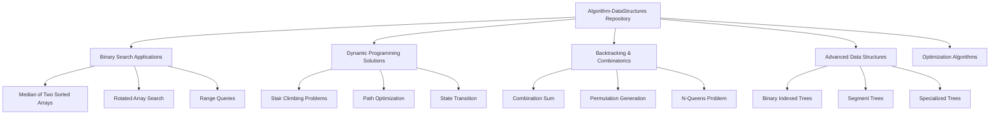
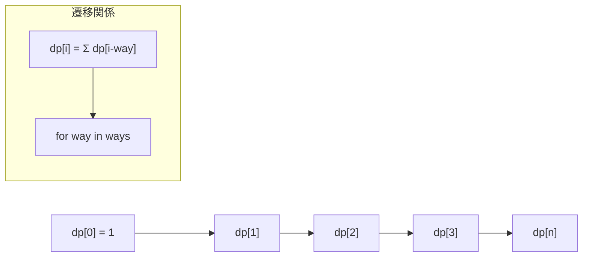
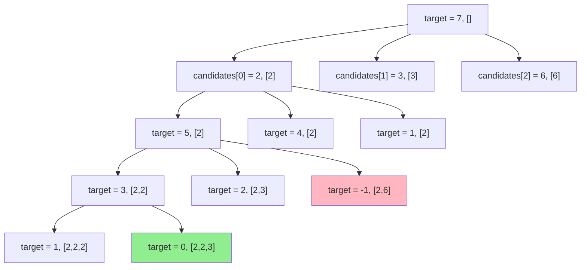
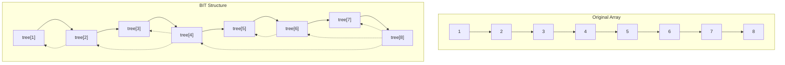
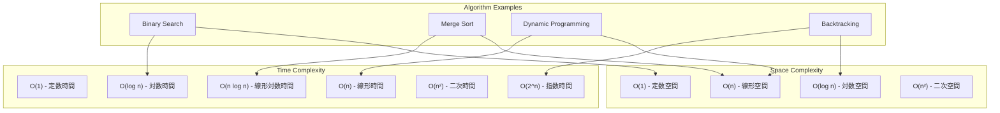
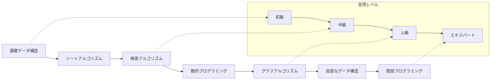

# アルゴリズム・データ構造総合ドキュメント

## 概要

このリポジトリは、競技プログラミングや技術面接の準備に向けた包括的なアルゴリズムソリューションとデータ構造実装のコレクションを提供します。基礎的なコンピュータサイエンスのアルゴリズムを複数のプログラミング言語で最適化された実装として提供し、正確性とパフォーマンス効率の両方を重視しています。

## リポジトリアーキテクチャ



## 主要アルゴリズムカテゴリ

### 1. 二分探索アプリケーション

二分探索アプリケーションは、複雑な検索シナリオのための高度なテクニックを特徴とする最優先システムです。

#### 実装例：回転配列での検索

```typescript
function search(nums: number[], target: number): number {
    let left = 0;
    let right = nums.length - 1;
    
    while (left <= right) {
        const mid = Math.floor((left + right) / 2);
        
        if (nums[mid] === target) {
            return mid;
        }
        
        // 左半分が順序付けられているかチェック
        if (nums[left] <= nums[mid]) {
            if (target >= nums[left] && target < nums[mid]) {
                right = mid - 1;
            } else {
                left = mid + 1;
            }
        } else {
            if (target > nums[mid] && target <= nums[right]) {
                left = mid + 1;
            } else {
                right = mid - 1;
            }
        }
    }
    
    return -1;
}
```

#### 複雑度分析
- **時間複雑度**: O(log n)
- **空間複雑度**: O(1)

### 2. 動的プログラミング

動的プログラミングは最適化問題を解決するための重要な手法です。

#### 階段登り問題の例

```python
def count_ways(n: int, ways: list[int]) -> int:
    """
    n段の階段を登る方法の数を計算
    ways: 一度に登れるステップ数のリスト
    """
    if n == 0:
        return 1
    if n < 0:
        return 0
    
    dp = [0] * (n + 1)
    dp[0] = 1
    
    for i in range(1, n + 1):
        for way in ways:
            if i >= way:
                dp[i] += dp[i - way]
    
    return dp[n]
```

#### 状態遷移図



### 3. バックトラッキングと組み合わせ生成

バックトラッキングは制約満足問題を解決するための体系的な手法です。

#### 組み合わせ和問題

```typescript
function combinationSum(candidates: number[], target: number): number[][] {
    const result: number[][] = [];
    
    function backtrack(start: number, currentCombination: number[], remainingTarget: number) {
        if (remainingTarget === 0) {
            result.push([...currentCombination]);
            return;
        }
        
        if (remainingTarget < 0) {
            return;
        }
        
        for (let i = start; i < candidates.length; i++) {
            currentCombination.push(candidates[i]);
            backtrack(i, currentCombination, remainingTarget - candidates[i]);
            currentCombination.pop(); // バックトラック
        }
    }
    
    backtrack(0, [], target);
    return result;
}
```

#### バックトラッキング探索木



### 4. 高度なデータ構造

#### Binary Indexed Tree (Fenwick Tree)

```python
class BinaryIndexedTree:
    def __init__(self, n: int):
        self.n = n
        self.tree = [0] * (n + 1)
    
    def update(self, idx: int, delta: int):
        """インデックスidxの値にdeltaを加算"""
        while idx <= self.n:
            self.tree[idx] += delta
            idx += idx & (-idx)  # 最下位ビットを加算
    
    def query(self, idx: int) -> int:
        """インデックス1からidxまでの累積和を取得"""
        result = 0
        while idx > 0:
            result += self.tree[idx]
            idx -= idx & (-idx)  # 最下位ビットを減算
        return result
    
    def range_query(self, left: int, right: int) -> int:
        """区間[left, right]の和を取得"""
        return self.query(right) - self.query(left - 1)
```

#### BITの構造図



## 多言語実装戦略

### 言語別最適化表

| 言語 | 主要用途 | 主要最適化 | 例関数 |
|------|----------|------------|--------|
| TypeScript | 型安全な実装 | 厳密な型付け、コンパイル時チェック | `findMedianSortedArrays()`, `combinationSumClaude()` |
| JavaScript | ランタイムパフォーマンス | V8最適化、最小オーバーヘッド | `searchJs()`, `countWays()`, `solve()` |
| Python | アルゴリズム解析 | 型ヒント、包括的テスト | `countStairClimbingWays()`, `count_ways()` |
| Go | システムレベルパフォーマンス | メモリ効率、並行性 | 専門的数学アルゴリズム |
| PHP | レガシープラットフォーム対応 | 組み込み関数、文字列処理 | 限定的な特殊実装 |

## パフォーマンス解析フレームワーク

### 複雑度解析表



### ベンチマーク結果例

```python
# パフォーマンステスト例
def benchmark_search_algorithms():
    """検索アルゴリズムのベンチマーク"""
    import time
    import random
    
    # テストデータ生成
    sizes = [1000, 10000, 100000, 1000000]
    results = {}
    
    for size in sizes:
        arr = sorted(random.sample(range(size * 2), size))
        target = random.choice(arr)
        
        # 二分探索のテスト
        start_time = time.time()
        binary_search_result = binary_search(arr, target)
        binary_search_time = time.time() - start_time
        
        # 線形探索のテスト
        start_time = time.time()
        linear_search_result = linear_search(arr, target)
        linear_search_time = time.time() - start_time
        
        results[size] = {
            'binary_search': binary_search_time,
            'linear_search': linear_search_time,
            'speedup': linear_search_time / binary_search_time
        }
    
    return results
```

## 競技プログラミング統合

### プラットフォーム別最適化

#### AtCoder最適化例

```typescript
// AtCoder B42問題の解答例
function solve(): void {
    const input = require('fs').readFileSync('/dev/stdin', 'utf8').trim().split('\n');
    const [N, M] = input[0].split(' ').map(Number);
    const points: [number, number][] = [];
    
    for (let i = 1; i <= N; i++) {
        const [x, y] = input[i].split(' ').map(Number);
        points.push([x, y]);
    }
    
    // 4象限グリーディ手法の実装
    const quadrants = [[], [], [], []];
    
    for (const [x, y] of points) {
        if (x >= 0 && y >= 0) quadrants[0].push([x, y]);
        else if (x < 0 && y >= 0) quadrants[1].push([x, y]);
        else if (x < 0 && y < 0) quadrants[2].push([x, y]);
        else quadrants[3].push([x, y]);
    }
    
    let maxScore = 0;
    // 各象限での最適解を計算
    for (let i = 0; i < 4; i++) {
        const score = calculateQuadrantScore(quadrants[i], M);
        maxScore = Math.max(maxScore, score);
    }
    
    console.log(maxScore);
}
```

### 入出力最適化

```javascript
// 高速入出力テンプレート
class FastIO {
    constructor() {
        this.input = require('fs').readFileSync('/dev/stdin', 'utf8').split('\n');
        this.lineIndex = 0;
        this.output = [];
    }
    
    nextLine() {
        return this.input[this.lineIndex++];
    }
    
    nextInt() {
        return parseInt(this.nextLine());
    }
    
    nextInts() {
        return this.nextLine().split(' ').map(Number);
    }
    
    println(value) {
        this.output.push(value.toString());
    }
    
    flush() {
        console.log(this.output.join('\n'));
    }
}
```

## 教育用ドキュメントシステム

### インタラクティブ可視化

各アルゴリズムには以下の教育リソースが含まれています：

1. **ステップバイステップ説明**
   - アルゴリズムの各段階の詳細な説明
   - 視覚的な図解とフローチャート

2. **複雑度解析**
   - 時間・空間複雑度の数学的証明
   - 実際のパフォーマンス測定結果

3. **実装パターン**
   - 複数言語での実装例
   - 最適化テクニックの説明

4. **練習問題**
   - 段階的な難易度設定
   - 解答例とディスカッション

### 学習パス図



## まとめ

このリポジトリは、アルゴリズム技術の参照実装として、また競技プログラミングと技術面接のための包括的な学習リソースとして機能します。パフォーマンス最適化と言語間ポータビリティに重点を置いています。

### 主な特徴

- ✅ 複数言語での実装
- ✅ 詳細な複雑度解析  
- ✅ 競技プログラミング対応
- ✅ インタラクティブな学習リソース
- ✅ パフォーマンスベンチマーク
- ✅ 実践的な問題解決例

---

*このドキュメントは継続的に更新され、新しいアルゴリズムと最適化技術が追加されます。*
