# Algorithm-DataStructures-Math-SQL — リポジトリ概要

[](https://github.com/myoshi2891/Algorithm-DataStructures-Math-SQL/stargazers)
[](https://github.com/myoshi2891/Algorithm-DataStructures-Math-SQL/network/members)

[](https://deepwiki.com/myoshi2891/Algorithm-DataStructures-Math-SQL)

> **関連ドキュメント**: [2×3×3 アーティファクト生成マトリクス](./2.1-the-233-artifact-generation-matrix) | [デュアル AI 実装哲学](./2.2-dual-ai-implementation-philosophy) | [3 層ドキュメントシステム](./2.3-three-tier-progressive-documentation-system) | [開発環境とツール](./3-development-environment-and-tooling)

このリポジトリは、**決定論的なマルチ言語・マルチ AI 問題解決ドキュメントシステム**を実装しています。LeetCode・HackerRank・AtCoder に掲載された各競技プログラミング問題に対し、**2×3×3 マトリクス乗算**（2 AI × 3 言語 × 3 ドキュメント層）によって正確に **18 個のアーティファクト**を生成します。

---

## 📋 目次

- [目的とスコープ](#目的とスコープ)
- [リポジトリ構造：2×3×3×6 アーキテクチャ](#リポジトリ構造2336-アーキテクチャ)
- [デュアル AI 実装哲学](#デュアル-ai-実装哲学コードレベルの差別化)
- [3 層プログレッシブドキュメントシステム](#3-層プログレッシブドキュメントシステム)
- [ビルドと公開インフラ](#ビルドと公開インフラ)
- [技術スタックと依存関係管理](#技術スタックと依存関係管理)
- [ナビゲーションとファイル検索](#ナビゲーションとファイル検索)
- [リポジトリのメトリクスと規模](#リポジトリのメトリクスと規模)
- [ファイル命名規則とコード構造](#ファイル命名規則とコード構造)
- [クイックスタートガイド](#クイックスタートガイド)

---

## 目的とスコープ

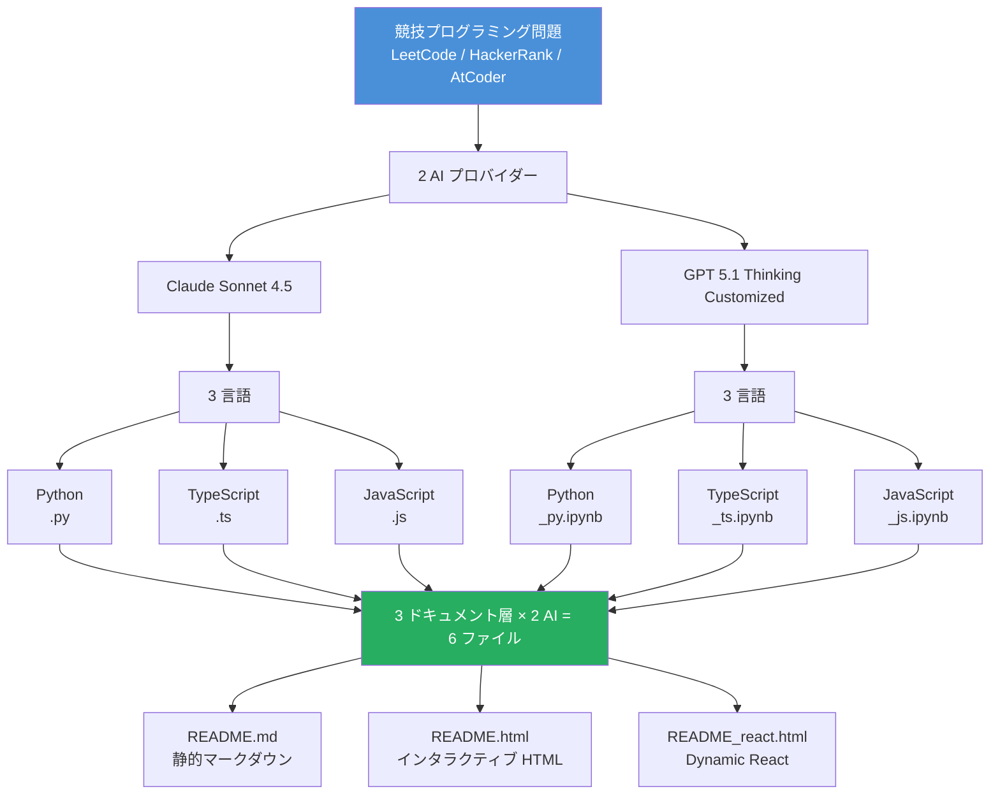

---

## リポジトリ構造：2×3×3×6 アーキテクチャ

### 決定論的アーティファクト生成マトリクス

問題ごとに 3 つの乗算次元を通じて、厳密な **18 ファイル生成パターン**を強制します。

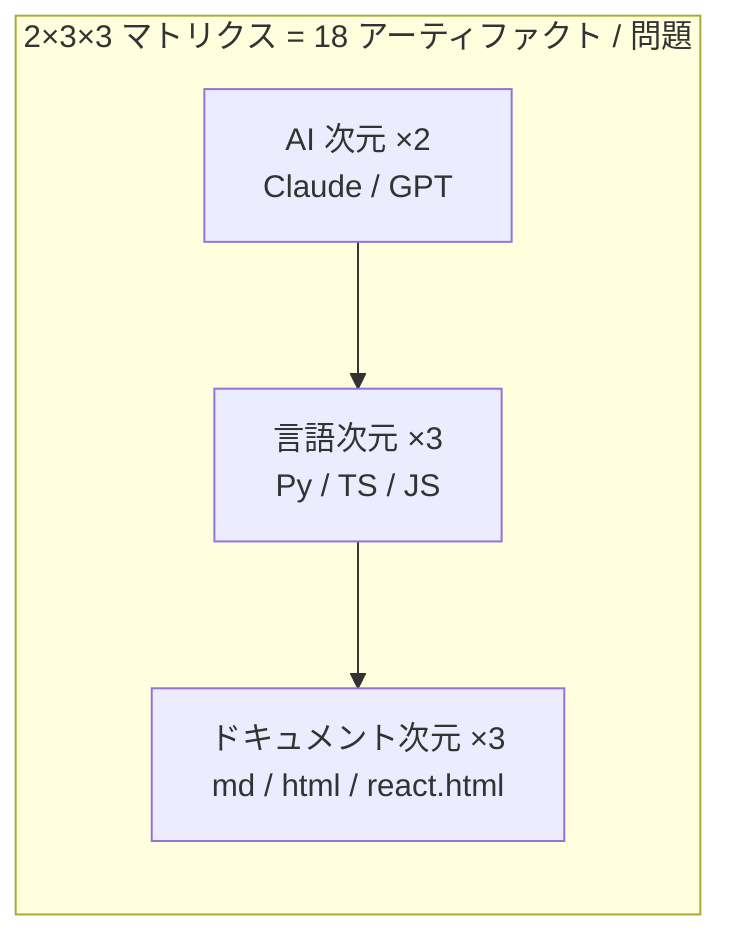

| 次元                | 数  | 例                                                   | コードパターン                        |
| ------------------- | --- | ---------------------------------------------------- | ------------------------------------- |
| **AI プロバイダー** | 2   | `claude sonnet 4.5/`、`gpt 5.1 thinking customized/` | レベル 5 のサブディレクトリ名         |
| **言語**            | 3   | `*.py`、`*.ts`、`*.js` + Jupyter バリアント          | ファイル拡張子 + Jupyter ノートブック |
| **ドキュメント**    | 3   | `README.md`、`README.html`、`README_react.html`      | 固定ファイル名パターン                |

---

### O(1) 参照のための 6 層ファイル階層

決定論的なパス構造により、検索なしに直接ファイルを特定できます。

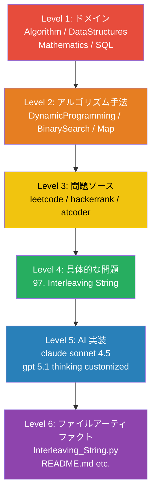

**パスパターン**:

```
{Domain}/{Subcategory}/{Platform}/{Problem}/{AI}/{Artifact}
```

**具体的なパス例**:

```
Algorithm/DynamicProgramming/leetcode/97. Interleaving String/Claude Sonnet 4.5/
├── Interleaving_String.py
├── Interleaving_String.ts
├── Interleaving_String.js
├── README.md
├── README.html
└── README_react.html
```

| レベル | 目的                     | 抽出方法   | 値の例                                              |
| ------ | ------------------------ | ---------- | --------------------------------------------------- |
| 1      | ドメイン分類             | `parts[0]` | `Algorithm`, `DataStructures`, `Mathematics`, `SQL` |
| 2      | アルゴリズム手法         | `parts[1]` | `DynamicProgramming`, `BinarySearch`, `Map`         |
| 3      | 問題ソース               | `parts[2]` | `leetcode`, `hackerrank`, `atcoder`                 |
| 4      | 具体的な問題             | `parts[3]` | `97. Interleaving String`                           |
| 5      | AI 実装                  | `parts[4]` | `claude sonnet 4.5`, `gpt 5.1 thinking customized`  |
| 6      | ファイルアーティファクト | ファイル名 | `Interleaving_String.py`, `README.md`               |

> **SQL ドメインの例外**: レベル 5 では単一の `gpt/` ディレクトリを使用し、レベル 6 でプラットフォーム固有のサフィックスを付与

```
SQL/Leetcode/Basic select/1141. User Activity/gpt/
├── User_Activity_*_mysql.ipynb     # MySQL 8.0.40
├── User_Activity_*_postgre.ipynb   # PostgreSQL 16.6+
└── User_Activity_*_pandas.ipynb    # Pandas 2.2.2
```

---

## デュアル AI 実装哲学：コードレベルの差別化

### 対照的な実装パターン

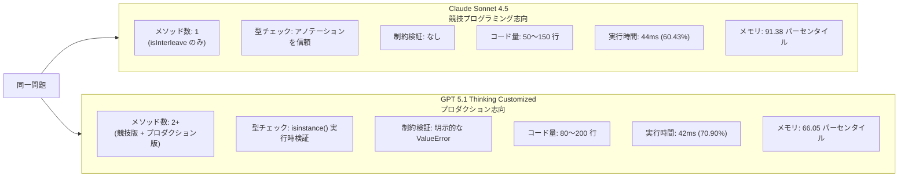

### コード比較

**Claude パターン**（シンプル・直接実装）:

```python
class Solution:
    def isInterleave(self, s1: str, s2: str, s3: str) -> bool:
        # 型アノテーションを信頼 — バリデーションなし
        n1, n2, n3 = len(s1), len(s2), len(s3)
        if n1 + n2 != n3:
            return False
        # 単一メソッド、直接実装
```

**GPT パターン**（バリデーション付き・プロダクション対応）:

```python
class Solution:
    def isInterleave(self, s1: str, s2: str, s3: str) -> bool:
        # 競技版（高速パス）
        ...

    def isInterleave_production(self, s1: Any, s2: Any, s3: Any) -> bool:
        # 実行時バリデーション
        if not isinstance(s1, str):
            raise TypeError("s1 must be str")
        if len(s1) > 100:
            raise ValueError("Exceeds constraint: len(s1) <= 100")
        # 検証付きプロダクション版
```

| 観点                   | Claude 実装          | GPT 実装                                        |
| ---------------------- | -------------------- | ----------------------------------------------- |
| **メソッド数**         | 1（`isInterleave`）  | 2+（`isInterleave`、`isInterleave_production`） |
| **型チェック**         | アノテーションを信頼 | `isinstance()` 実行時チェック                   |
| **制約バリデーション** | なし                 | 明示的な `if len(s1) > 100: raise ValueError`   |
| **コード長**           | 50〜150 行           | 80〜200 行                                      |
| **実行時間（Python）** | 44ms（60.43%）       | 42ms（70.90%）                                  |
| **メモリ（Python）**   | 91.38 パーセンタイル | 66.05 パーセンタイル                            |

---

## 3 層プログレッシブドキュメントシステム

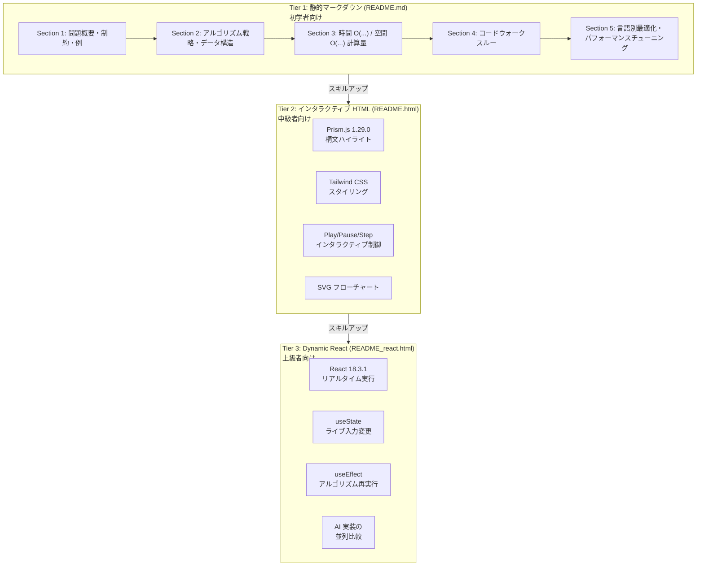

### Tier 1: 静的マークダウン（`README.md`）

**標準 5 セクション構成**:

| セクション ID | ヘッダー               | コンテンツの目的                             |
| ------------- | ---------------------- | -------------------------------------------- |
| 1             | `<h2 id="overview">`   | 問題文・制約・例                             |
| 2             | `<h2 id="tldr">`       | アルゴリズム戦略・データ構造・状態遷移       |
| 3             | `<h2 id="complexity">` | 時間 O(...)・空間 O(...)・導出               |
| 4             | `<h2 id="impl">`       | コードウォークスルー・行ごとの説明           |
| 5             | `<h2 id="cpython">`    | 言語固有の最適化・パフォーマンスチューニング |

### Tier 2: インタラクティブ HTML（`README.html`）

**技術スタック**:

- **構文ハイライト**: Prism.js 1.29.0（`/vendor/prismjs/prism.js`）
- **スタイリング**: Tailwind CSS（`/vendor/tailwindcss/script.js`）
- **インタラクティブ制御**: JavaScript 状態管理付きの Play/Pause/Step ボタン

**主な機能**:

- ステップバイステップのアルゴリズム可視化
- SVG フローチャートレンダリング
- 行番号付きコードブロックハイライト
- 外部 CDN 依存なし（すべてローカルにベンダリング）

### Tier 3: Dynamic React（`README_react.html`）

**技術スタック**:

- **React**: 18.3.1（`/vendor/react/react.development.js`）
- **React DOM**: 18.3.1（`/vendor/react-dom/react-dom.development.js`）
- **Babel Standalone**: 7.26.10（`/vendor/babel/babel.min.js`）

**React コンポーネントパターン**:

```jsx
<script type="text/babel">
    function AlgorithmDemo() {
        const [input, setInput] = React.useState("default");
        const [result, setResult] = React.useState(null);

        // リアルタイムアルゴリズム実行
        React.useEffect(() => {
            const output = runAlgorithm(input);
            setResult(output);
        }, [input]);

        return (
            <div>
                <input onChange={(e) => setInput(e.target.value)} />
                <ResultDisplay data={result} />
            </div>
        );
    }
</script>
```

**主な機能**:

- `useState` によるライブ入力変更
- `useEffect` によるリアルタイムアルゴリズム再実行
- AI 実装の並列比較
- インタラクティブな可視化コンポーネント

---

## ビルドと公開インフラ

### インデックス生成パイプライン

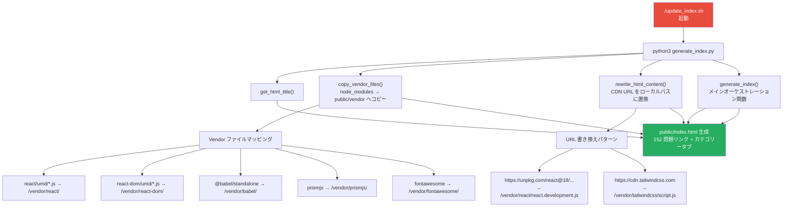

### `generate_index.py` の主要関数

| 関数                     | 行      | 目的                                   | コードエンティティ                      |
| ------------------------ | ------- | -------------------------------------- | --------------------------------------- |
| `get_html_title()`       | 11-17   | `<title>` タグを正規表現で抽出         | `re.search(r'<title>(.*?)</title>')`    |
| `copy_vendor_files()`    | 19-77   | node_modules を public/vendor にコピー | `shutil.copy2()`, `shutil.copytree()`   |
| `rewrite_html_content()` | 78-111  | CDN URL をローカルパスに置換           | 文字列置換マッピング                    |
| `generate_index()`       | 113-617 | メインオーケストレーション関数         | `os.walk()`, `defaultdict()`, HTML 生成 |

### CI/CD パイプライン


---

## 技術スタックと依存関係管理

### コアランタイム環境

| コンポーネント | バージョン           | 設定ファイル      | 目的                                 |
| -------------- | -------------------- | ----------------- | ------------------------------------ |
| **Python**     | CPython 3.12.11      | `.python-version` | アルゴリズム実装・ビルドスクリプト   |
| **Node.js**    | v22.14.0             | `package.json`    | TypeScript/JavaScript ランタイム     |
| **TypeScript** | 5.9.3                | `package.json`    | 型安全な実装                         |
| **Bun**        | 1.3.5（Lockfile v1） | `bun.lock`        | パッケージマネージャー（npm の代替） |

### フロントエンド依存関係（ベンダリング済み）

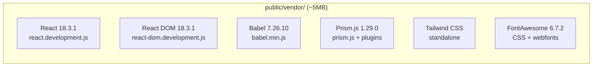

### SQL ドメインの依存関係（例外）

| ライブラリ     | バージョン | 設定                    | 目的                            |
| -------------- | ---------- | ----------------------- | ------------------------------- |
| **Pandas**     | 2.2.2      | `requirements.lock.txt` | SQL 問題の代替 DataFrame 操作   |
| **NumPy**      | 2.3.4      | `requirements.lock.txt` | Pandas ソリューションの数値演算 |
| **SQLAlchemy** | Latest     | `requirements.lock.txt` | データベース対話レイヤー        |

### コード品質ツール

| ツール           | バージョン | 設定                 | 目的                             |
| ---------------- | ---------- | -------------------- | -------------------------------- |
| **Prettier**     | 3.4.2      | `package.json`       | コードフォーマット（JS/TS）      |
| **ESLint**       | 9.18.0     | `package.json`       | リンティング（JS/TS）            |
| **Ruff**         | Latest     | Python config        | Python リンティング/フォーマット |
| **Markdownlint** | N/A        | `.markdownlint.json` | Markdown バリデーション          |

**Markdownlint 設定** (`.markdownlint.json`):

```json
{
    "MD013": {
        "line_length": 1000,
        "code_blocks": false
    },
    "MD033": {
        "allowed_elements": ["h1", "h2", "p", "i", "footer", "br", "div"]
    }
}
```

---

## ナビゲーションとファイル検索

### カテゴリーベースのナビゲーション

生成された `public/index.html` は、カテゴリーフィルタリング付きのタブインターフェースを実装しています。

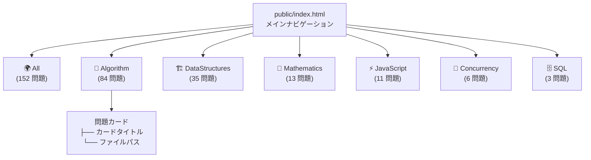

---

## リポジトリのメトリクスと規模

### 問題ドメイン分布

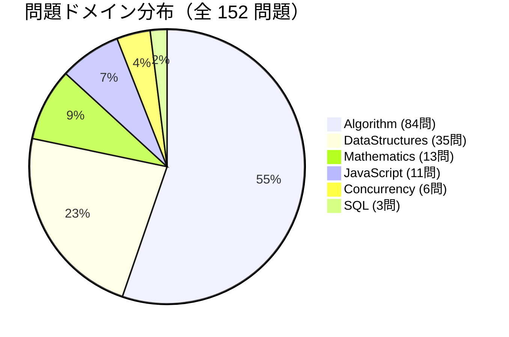

| ドメイン           | 問題数  | ファイル数（18×N） | 割合  |
| ------------------ | ------- | ------------------ | ----- |
| **Algorithm**      | 84      | 1,512              | 55.3% |
| **DataStructures** | 35      | 630                | 23.0% |
| **Mathematics**    | 13      | 234                | 8.6%  |
| **JavaScript**     | 11      | 198                | 7.2%  |
| **Concurrency**    | 6       | 108                | 3.9%  |
| **SQL**            | 3       | 54                 | 2.0%  |
| **合計**           | **152** | **2,736**          | 100%  |

### 問題ごとのファイルタイプ内訳

| ファイルタイプ        | 数     | 目的                             | 命名パターン         |
| --------------------- | ------ | -------------------------------- | -------------------- |
| Python 実装           | 2      | `class Solution`（アルゴリズム） | `*.py`、`*_py.ipynb` |
| TypeScript 実装       | 2      | 型安全な関数実装                 | `*.ts`、`*_ts.ipynb` |
| JavaScript 実装       | 2      | CommonJS `module.exports`        | `*.js`、`*_js.ipynb` |
| 静的ドキュメント      | 2      | 5 セクションの Markdown          | `README.md`          |
| インタラクティブ HTML | 2      | Prism.js + Tailwind              | `README.html`        |
| React 可視化          | 2      | React 18 + Babel                 | `README_react.html`  |
| **問題ごとの合計**    | **18** | 完全な学習アーティファクトセット | -                    |

### 生成サイト構造

```
public/
├── index.html                 # メインナビゲーション（152 リンク、カテゴリータブ）
├── vendor/                    # ベンダリング済み依存関係（合計 ~5MB）
│   ├── react/                 # React 18.3.1 UMD
│   ├── react-dom/             # React DOM 18.3.1
│   ├── babel/                 # Babel Standalone 7.26.10
│   ├── prismjs/               # Prism.js 1.29.0 + プラグイン
│   ├── tailwindcss/           # Tailwind CSS スタンドアロン
│   └── fontawesome/           # FontAwesome 6.7.2 + webfonts
├── Algorithm/                 # 84 問題 × 18 ファイル = 1,512 ファイル
├── DataStructures/            # 35 問題 × 18 ファイル = 630 ファイル
├── Mathematics/               # 13 問題 × 18 ファイル = 234 ファイル
├── JavaScript/                # 11 問題 × 18 ファイル = 198 ファイル
├── Concurrency/               # 6 問題 × 18 ファイル = 108 ファイル
└── SQL/                       # 3 問題 × 18 ファイル = 54 ファイル
```

---

## ファイル命名規則とコード構造

### 言語固有のパターン

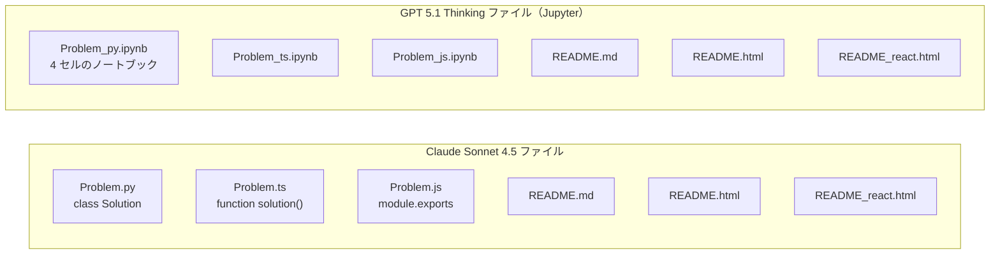

**Python**:

```python
class Solution:
    def isInterleave(self, s1: str, s2: str, s3: str) -> bool:
        """
        Docstring with Time/Space complexity
        """
        # Implementation
```

**TypeScript**:

```typescript
function isInterleave(s1: string, s2: string, s3: string): boolean {
    // 型安全な実装
}
```

**JavaScript**:

```javascript
var isInterleave = function (s1, s2, s3) {
    // Implementation
};
module.exports = { isInterleave };
```

### Jupyter ノートブックの構造

GPT 実装は以下のセル構造の Jupyter ノートブックを使用します：

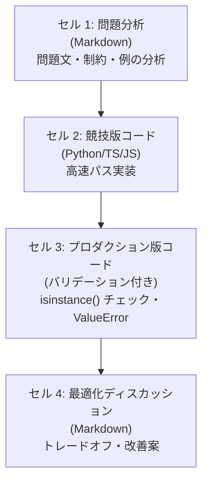

---

## クイックスタートガイド

### クローンとセットアップ

```bash
# 1. リポジトリをクローン
git clone https://github.com/myoshi2891/Algorithm-DataStructures-Math-SQL.git
cd Algorithm-DataStructures-Math-SQL

# 2. 依存関係をインストール（Bun を使用）
bun install

# 3. 公開サイトを生成
./update_index.sh

# 4. ローカルで配信
bun run serve
# http://127.0.0.1:8080 で開く
```

### 新しい問題の追加

新しい問題を追加する際は、2×3×3 マトリクス構造を必ず守ってください：

```
{Domain}/{Subcategory}/{Platform}/{Problem}/
├── claude sonnet 4.5/
│   ├── {Problem}.py
│   ├── {Problem}.ts
│   ├── {Problem}.js
│   ├── README.md
│   ├── README.html
│   └── README_react.html
└── gpt 5.1 thinking customized/
    ├── {Problem}_py.ipynb
    ├── {Problem}_ts.ipynb
    ├── {Problem}_js.ipynb
    ├── README.md
    ├── README.html
    └── README_react.html
```

ファイルを追加後、`./update_index.sh` を実行して `public/index.html` を再生成してください。

---

> このリポジトリは、自動ビルドプロセスと厳密なファイル組織パターンを持つ、マルチ言語アルゴリズムドキュメントのための**決定論的・スケーラブルなアーキテクチャ**を実装しており、O(1) ファイル参照と体系的な知識ナビゲーションを実現しています。

**⭐ このプロジェクトが役立ちましたら、ぜひスターを付けてください！**

[](https://github.com/myoshi2891)

> このリポジトリは、自動ビルドプロセスと厳密なファイル組織パターンを持つ、マルチ言語アルゴリズムドキュメントのための**決定論的・スケーラブルなアーキテクチャ**を実装しており、O(1) ファイル参照と体系的な知識ナビゲーションを実現しています。
