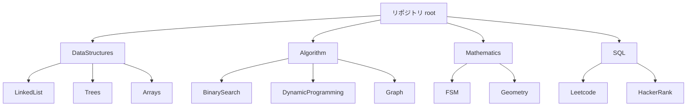
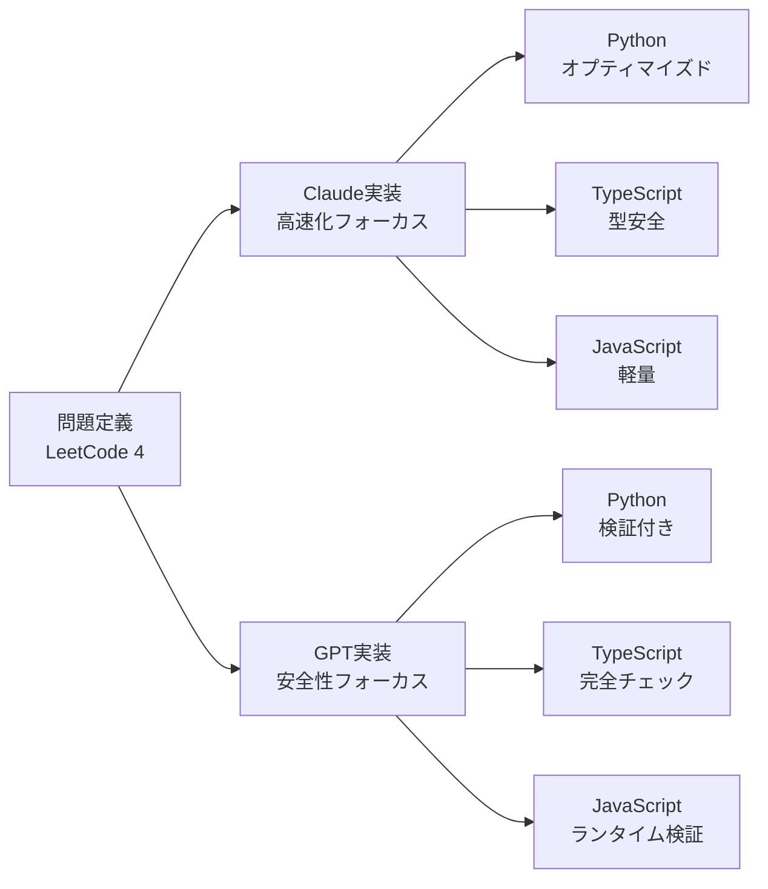
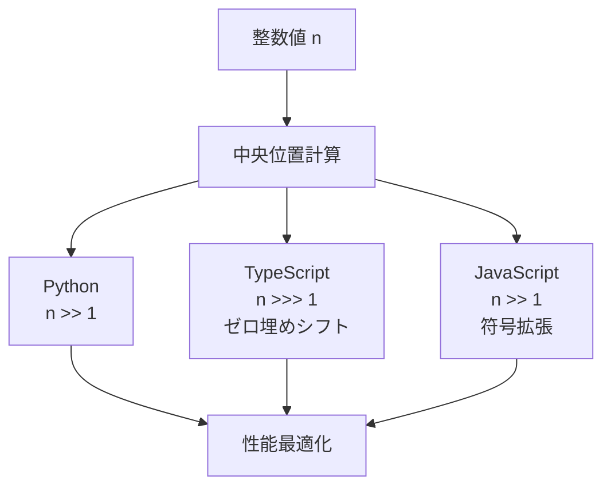
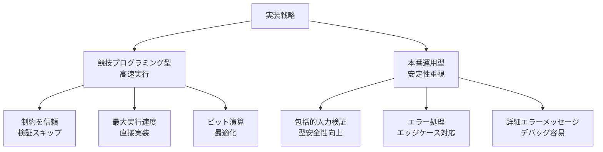
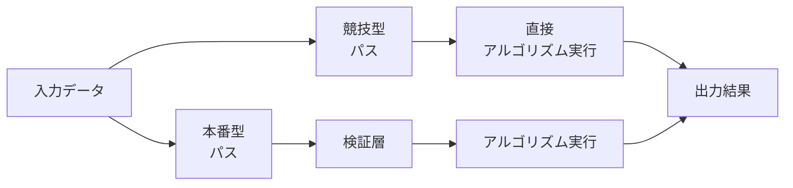
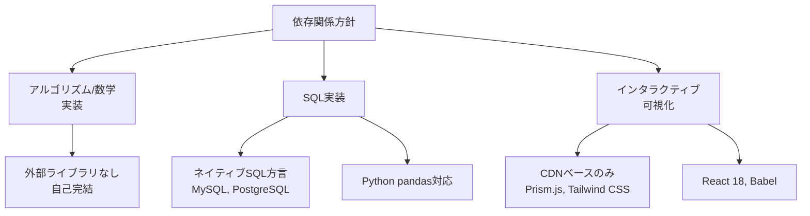
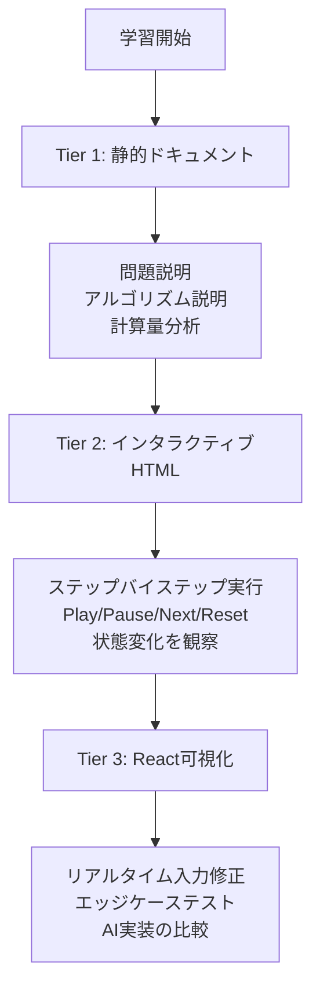
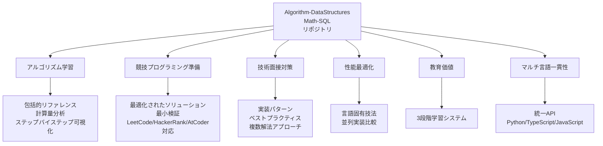
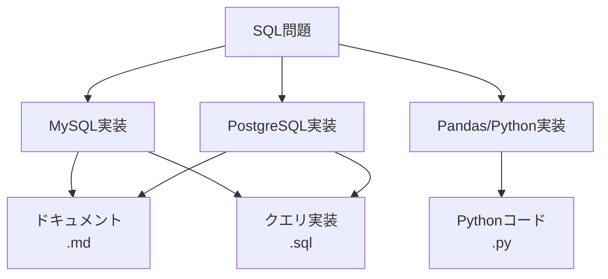
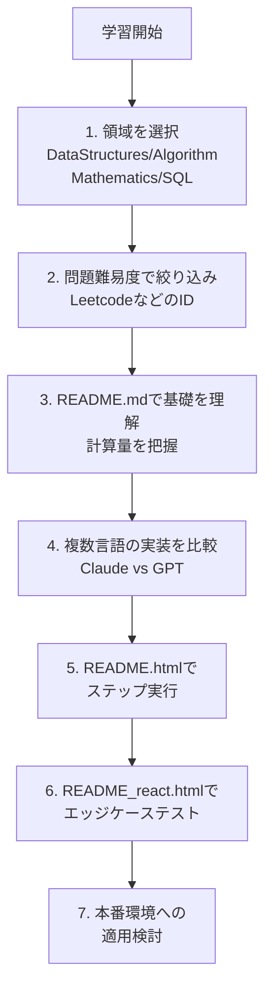

# Algorithm-DataStructures-Math-SQL リポジトリ完全ガイド

[](https://github.com/myoshi2891/Algorithm-DataStructures-Math-SQL/stargazers)
[](https://github.com/myoshi2891/Algorithm-DataStructures-Math-SQL/network/members)

[](https://deepwiki.com/myoshi2891/Algorithm-DataStructures-Math-SQL)

## 📋 リポジトリ概要

このリポジトリは、アルゴリズム、データ構造、数学、SQLの実装を集約した**マルチ言語教育プラットフォーム**です。競技プログラミング（LeetCode、HackerRank、AtCoder）、技術面接対策、コンピュータサイエンス教育向けに最適化されています。

### 主要な特徴

- **4つのコア領域**: データ構造、アルゴリズム、数学、SQL
- **マルチ言語対応**: Python、TypeScript、JavaScript
- **双AI実装戦略**: Claude と GPT の2つの実装アプローチ
- **3段階学習システム**: 静的ドキュメント → インタラクティブHTML → React可視化

---

## 🏗️ リポジトリアーキテクチャ



---

## 📊 コア問題領域の詳細

| 領域               | 代表的な関数/クラス                                                   | 主要パターン                       | ファイル場所                                               |
| ------------------ | --------------------------------------------------------------------- | ---------------------------------- | ---------------------------------------------------------- |
| **DataStructures** | `Solution.addTwoNumbers()`, `ListNode`, `DoublyLinkedList`            | インプレース操作、ポインタ演算     | `DataStructures/LinkedList/`, `DataStructures/Trees/`      |
| **Algorithm**      | `Solution.findMedianSortedArrays()`, `numDecodings()`, `minPathSum()` | 二分探索、動的計画法、二ポインタ法 | `Algorithm/BinarySearch/`, `Algorithm/DynamicProgramming/` |
| **Mathematics**    | `isNumber()`, `reflectPoint()`, `gameWithCells()`                     | 状態機械、幾何学的変換             | `Mathematics/FSM/`, `Mathematics/Geometry/`                |
| **SQL**            | `CombineTwoTables.sql`, `RisingTemperature.sql`                       | JOINパターン、ウィンドウ関数       | `SQL/Leetcode/`, `SQL/HackerRank/`                         |

---

## 🤖 双AI実装戦略

各問題に対してClaudeとGPTの2つの実装アプローチを提供し、相互補完的なコーディングスタイルを示します。これにより **2×3実装マトリックス**（2つのAI × 3言語）が形成されます。

### 実装比較表

| 側面                     | Claude実装                                                                  | GPT実装                                                                                       |
| ------------------------ | --------------------------------------------------------------------------- | --------------------------------------------------------------------------------------------- |
| **Pythonクラスメソッド** | `findMedianSortedArrays(self, nums1: List[int], nums2: List[int]) -> float` | `_median_binary_partition(self, nums1: List[int], nums2: List[int]) -> float`                 |
| **センチネル値**         | 整数センチネル: `-10_000_007`, `+10_000_007`                                | 浮動小数点: `float("inf")`                                                                    |
| **TypeScript署名**       | `function findMedianSortedArrays(nums1: number[], nums2: number[]): number` | `function findMedianSortedArrays(nums1: readonly number[], nums2: readonly number[]): number` |
| **最適化焦点**           | 整数センチネルでfloatキャストを排除                                         | 包括的な入力検証（TypeError/RangeError）                                                      |
| **ドキュメント形式**     | 計算量優先 + 最適化セクション                                               | アルゴリズム比較表 + ビジネスコンテキスト                                                     |



---

## 🌐 マルチ言語実装フレームワーク

すべてのアルゴリズムはPython、TypeScript、JavaScriptで実装され、言語固有の最適化を維持しながら統一されたアルゴリズムロジックを保持します。

### 言語別実装詳細

| 言語           | クラス/関数パターン                                        | 型システム                                  | 主要な最適化                                                          |
| -------------- | ---------------------------------------------------------- | ------------------------------------------- | --------------------------------------------------------------------- |
| **Python**     | `class Solution: def methodName(self, ...)`                | `typing.Final`, `List[int]`, `Optional[T]`  | `ord() - 48`, リスト内包表記、`__slots__`, ビット右シフト `>> 1`      |
| **TypeScript** | `function functionName(...)` or `export function`          | `readonly number[]`, 厳密な型, `Int32Array` | `charCodeAt(0) - 48`, `>>> 1`（ゼロ埋めシフト）, コンパイル時チェック |
| **JavaScript** | `function functionName(...)` or `var name = function(...)` | 動的型、ランタイム検証                      | V8隠し クラス, `>> 1`, `Number.isFinite()`, シンプルループ            |

### ビット右シフト演算子の比較



---

## 📁 ファイル組織パターン

各問題は**統一的なデュアルフォルダ構造**に従い、標準化されたファイル命名とコンテンツ組織を実装します。

### ファイル命名規則

| ファイル型           | 命名パターン                                  | 用途                                              | 例                               |
| -------------------- | --------------------------------------------- | ------------------------------------------------- | -------------------------------- |
| Python実装           | `{ProblemName}.py` または `{problem_name}.py` | クラスSolutionを含むコア実装                      | `Median_of_Two_Sorted_Arrays.py` |
| TypeScript実装       | `{ProblemName}.ts`                            | 型安全な実装と厳密なチェック                      | `Median_of_Two_Sorted_Arrays.ts` |
| JavaScript実装       | `{ProblemName}.js`                            | ランタイム検証を含む実装                          | `Median_of_Two_Sorted_Arrays.js` |
| 静的ドキュメント     | `README.md`                                   | 5段階ドキュメント構造                             | セクションごとに100行以下        |
| インタラクティブHTML | `README.html`                                 | Prism.js構文強調、Tailwind CSS                    | 1000～2000行                     |
| React可視化          | `README_react.html`                           | React 18 + Babel Standalone, インタラクティブデモ | カスタマイズ可能な入力           |

### ディレクトリ構造の例

```
Algorithm/BinarySearch/leetcode/4. Median of Two Sorted Arrays/
├── Claude/
│   ├── Median_of_Two_Sorted_Arrays.py
│   ├── Median_of_Two_Sorted_Arrays.ts
│   ├── Median_of_Two_Sorted_Arrays.js
│   ├── README.md
│   ├── README.html
│   └── README_react.html
└── GPT/
    ├── Median_of_Two_Sorted_Arrays.py
    ├── Median_of_Two_Sorted_Arrays.ts
    ├── Median_of_Two_Sorted_Arrays.js
    ├── README.md
    ├── README.html
    └── README_react.html
```

---

## ⚙️ 実装戦略: 競技プログラミング vs 本番運用

リポジトリは異なるユースケースに向けて最適化された2つの実装バリアントを提供します。



### 競技プログラミング型の特徴

- **入力検証**: スキップ（制約を信頼）
- **実行速度**: 最大化
- **実装スタイル**: 直接的なアルゴリズム実装

**例**: 整数センチネル（`NEG = -10_000_007`）を使用してhot pathでfloatキャストを排除

### 本番運用型の特徴

- **入力検証**: 包括的（TypeError、RangeError例外）
- **型安全性**: 強化
- **エラー処理**: 詳細なメッセージ付き

**例**: `validateNumberArray()` および `isNonDecreasing()` チェック

### 最適化比較表

| 最適化項目       | 競技型                             | 本番型                                            |
| ---------------- | ---------------------------------- | ------------------------------------------------- |
| 入力検証         | スキップ（制約を信頼）             | TypeError、RangeError検出                         |
| センチネル値     | 整数: `-10_000_007`, `+10_000_007` | `float('inf')` または `±Infinity`                 |
| 型チェック       | 最小限（型ヒントのみ）             | ランタイム `Number.isFinite()`, `Array.isArray()` |
| エラーメッセージ | なし or 汎用的                     | 詳細で説明的                                      |
| エッジケース処理 | アルゴリズムで暗黙的に処理         | 明示的な検証と早期リターン                        |



---

## 🔧 システム要件と依存関係

リポジトリは最小限の外部依存を維持しながら、包括的なアルゴリズムカバレッジを提供します。

### 開発環境設定

| コンポーネント  | バージョン/設定                             | 用途                           |
| --------------- | ------------------------------------------- | ------------------------------ |
| **Python**      | CPython 3.11.10                             | 型ヒント付きアルゴリズム実装   |
| **Node.js**     | v18.x（JavaScript）, v22.14.0（TypeScript） | TS/JS実装のランタイム          |
| **Bun**         | ロックファイルバージョン1                   | パッケージ管理と決定論的ビルド |
| **TypeScript**  | `@types/node ^22.18.10`                     | Node.js型定義                  |
| **ESLint**      | `^9.37.0`                                   | コード品質検証                 |
| **live-server** | `^1.2.2`                                    | ライブリロード開発サーバー     |

### 品質管理設定

**Markdownlint設定の詳細:**

- **MD013ルール**: `line_length: 100`（コードブロックとテーブルを除外）
- **MD033ルール**: h1, h2, details, summary, p, i, footer, div HTMLタグを許可
- **目的**: 全静的ドキュメントファイル間の一貫性確保

### 外部ライブラリポリシー



---

## 🎓 3段階学習システム



### 各層の詳細

#### **Tier 1: 静的ドキュメント（README.md）**

学習の基礎となる以下の5段階構造を提供します:

1. **問題概要**: LeetCodeの説明、制約条件、入出力例
2. **アルゴリズム説明**: 解法アプローチの詳細
3. **計算量分析**: 時間/空間計算量
4. **実装解説**: コードの重要部分
5. **最適化**: 言語別の最適化技法

#### **Tier 2: インタラクティブHTML（README.html）**

- **Prism.js** による構文強調
- **Tailwind CSS** for モダンなスタイリング
- ステップバイステップ実行コントローラー
- アルゴリズムの状態変化をリアルタイム表示

#### **Tier 3: React可視化（README_react.html）**

- **React 18** + **Babel Standalone** で動的インタラクション
- 入力値をリアルタイム修正可能
- エッジケースの即座テスト
- Claude と GPT 実装の比較実行

---

## 📌 リポジトリの目的とユースケース

### 主要なユースケース



### ターゲットオーディエンスレベル

| レベル   | 対象者                                   | 活用方法                                                 |
| -------- | ---------------------------------------- | -------------------------------------------------------- |
| **初級** | CS初学者、競技プログラミング未経験者     | Tier 1静的ドキュメントから開始、基本概念を理解           |
| **中級** | 競技プログラミング経験者、面接対策中     | Tier 2インタラクティブHTMLで動作確認、複数言語実装を比較 |
| **上級** | ソフトウェアエンジニア、言語最適化研究者 | Tier 3 React可視化で詳細解析、本番vs競技型実装を検証     |

---

## 🔍 SQL実装の特別な構成

SQLソリューションは以下の3つのバリアントで提供されます:



### SQL別の特徴

| SQL方言           | 特徴                   | 最適なケース                 |
| ----------------- | ---------------------- | ---------------------------- |
| **MySQL**         | LeetCode標準、広く利用 | LeetCode問題、基本的なJOIN   |
| **PostgreSQL**    | ウィンドウ関数が充実   | 複雑な分析クエリ             |
| **Pandas/Python** | データ処理の柔軟性     | 教育目的、複雑な変換ロジック |

---

## 💡 ベストプラクティスと推奨される学習フロー



---

このリポジトリは、単なるコード集ではなく、**体系的な学習プラットフォーム**として設計されています。各問題に対する多角的なアプローチにより、プログラマーは自身のレベルに応じた最適な学習パスを選択できます。

<div align="center">

**⭐ このプロジェクトが役立ちましたら、ぜひスターを付けてください！**

[](https://github.com/myoshi2891)

</div>
