# リポジトリ概要

[](https://github.com/myoshi2891/Algorithm-DataStructures-Math-SQL/stargazers)
[](https://github.com/myoshi2891/Algorithm-DataStructures-Math-SQL/network/members)

[](https://deepwiki.com/myoshi2891/Algorithm-DataStructures-Math-SQL)

## 関連ソースファイル

## 目的と範囲

本ドキュメントは、Algorithm-DataStructures-Math-SQLリポジトリの構造、実装哲学、組織的パターンに関する包括的な概要を提供します。4つのコア問題領域(Algorithm、DataStructures、Mathematics、SQL)、デュアルAI実装アプローチ(Claude vs GPT)、マルチ言語サポート(Python、TypeScript、JavaScript)、3段階プログレッシブ学習システムをカバーしています。

### 関連ドキュメント

特定のサブシステムに関する詳細情報については、以下を参照してください:

- **教育インフラとドキュメント標準**: Educational Infrastructureを参照
- **アルゴリズム固有の実装と最適化**: Algorithm Implementationsを参照
- **データ構造の実装**: Data Structure Implementationsを参照
- **数学的問題の解法**: Mathematical Solutionsを参照
- **SQLソリューションとデータベース固有の最適化**: SQL Solutionsを参照
- **パフォーマンス最適化戦略**: Performance Optimization Strategiesを参照

---

## リポジトリアーキテクチャ概要

このリポジトリは、各アルゴリズム問題が3次元マトリックスを通じて18種類の学習教材を生成する体系的なアーティファクト生成戦略を実装しています:

**2つのAIプロバイダー × 3つのプログラミング言語 × 3つのドキュメント階層 = 18成果物/問題**

### リポジトリの高レベル構造

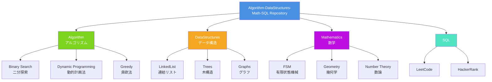

**出典:**

- README.md 31-62
- README.md 75-100

---

## 4つのコア問題領域

リポジトリは問題を4つの異なる領域に整理し、それぞれが特定のアルゴリズムパターンとデータ操作技術をターゲットとしています。

### 領域分類の可視化

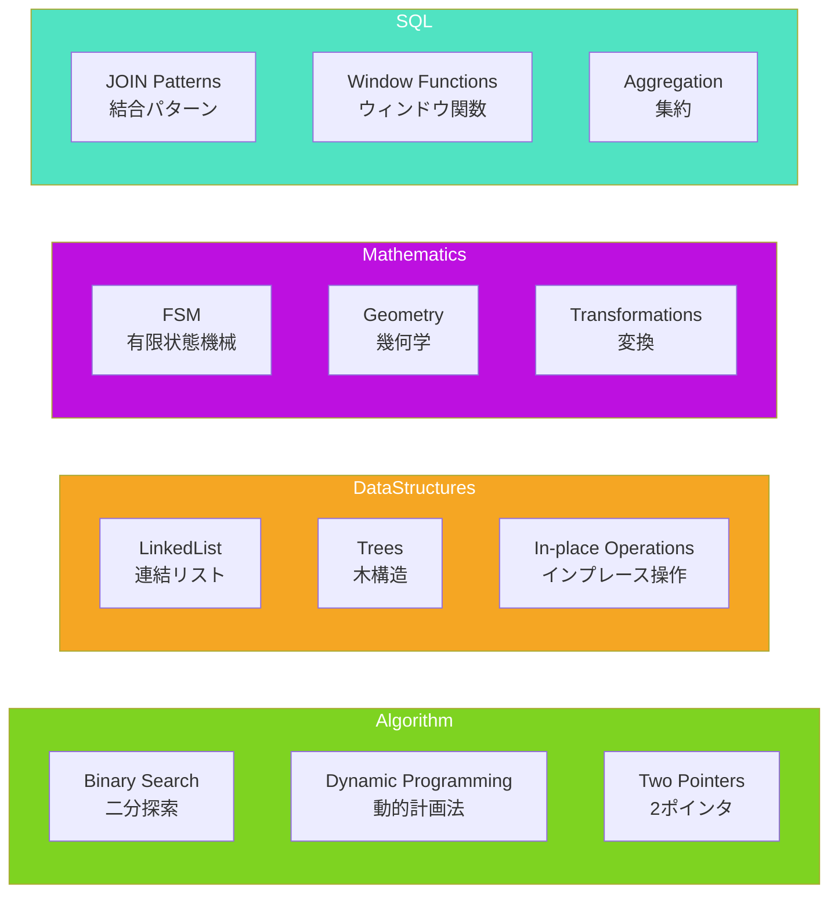

### 領域分類テーブル

| 領域                              | 主要コードエンティティ                                                                 | コアパターン                          | 主要ディレクトリ                                              |
| --------------------------------- | -------------------------------------------------------------------------------------- | ------------------------------------- | ------------------------------------------------------------- |
| **Algorithm**<br/>アルゴリズム    | `Solution.findMedianSortedArrays()`<br/>`numDecodings()`<br/>`minPathSum()`            | 二分探索<br/>動的計画法<br/>2ポインタ | `Algorithm/BinarySearch/`<br/>`Algorithm/DynamicProgramming/` |
| **DataStructures**<br/>データ構造 | `Solution.addTwoNumbers()`<br/>`ListNode`<br/>`DoublyLinkedList`                       | In-place操作<br/>ポインタ操作         | `DataStructures/LinkedList/`<br/>`DataStructures/Trees/`      |
| **Mathematics**<br/>数学          | `isNumber()`<br/>`reflectPoint()`<br/>`gameWithCells()`                                | 有限状態機械<br/>幾何変換             | `Mathematics/FSM/`<br/>`Mathematics/Geometry/`                |
| **SQL**                           | `CombineTwoTables.sql`<br/>`RisingTemperature.sql`<br/>`combine_two_tables()` (pandas) | JOINパターン<br/>ウィンドウ関数       | `SQL/Leetcode/`<br/>`SQL/HackerRank/`                         |

**出典:** README.md 64-72

---

## 2×3×3実装マトリックスアーキテクチャ

各問題は、18種類の異なるアーティファクトを生成する3次元変換を経ます。マトリックスの次元は:

- **AIプロバイダー (2)**: Claude、GPT
- **プログラミング言語 (3)**: Python、TypeScript、JavaScript
- **ドキュメント階層 (3)**: README.md、README.html、README_react.html

### 単一問題のアーティファクト生成マトリックス

```mermaid
graph TB
    Problem[単一問題<br/>Single Problem]

    Problem --> Claude[Claude実装<br/>競技プログラミングアプローチ]
    Problem --> GPT[GPT実装<br/>本番環境アプローチ]

    Claude --> CP[Python]
    Claude --> CT[TypeScript]
    Claude --> CJ[JavaScript]

    GPT --> GP[Python]
    GPT --> GT[TypeScript]
    GPT --> GJ[JavaScript]

    CP --> CT1[📄 Tier 1: README.md]
    CP --> CT2[🌐 Tier 2: README.html]
    CP --> CT3[⚛️ Tier 3: README_react.html]

    CT --> CTT1[📄 Tier 1: README.md]
    CT --> CTT2[🌐 Tier 2: README.html]
    CT --> CTT3[⚛️ Tier 3: README_react.html]

    CJ --> CJT1[📄 Tier 1: README.md]
    CJ --> CJT2[🌐 Tier 2: README.html]
    CJ --> CJT3[⚛️ Tier 3: README_react.html]

    GP --> GT1[📄 Tier 1: README.md]
    GP --> GT2[🌐 Tier 2: README.html]
    GP --> GT3[⚛️ Tier 3: README_react.html]

    GT --> GTT1[📄 Tier 1: README.md]
    GT --> GTT2[🌐 Tier 2: README.html]
    GT --> GTT3[⚛️ Tier 3: README_react.html]

    GJ --> GJT1[📄 Tier 1: README.md]
    GJ --> GJT2[🌐 Tier 2: README.html]
    GJ --> GJT3[⚛️ Tier 3: README_react.html]

    style Problem fill:#4A90E2,color:#fff
    style Claude fill:#7ED321,color:#fff
    style GPT fill:#F5A623,color:#fff
```

### 実装マトリックス構造テーブル

| 次元               | オプション                                             | アーティファクト数 | 目的                                         |
| ------------------ | ------------------------------------------------------ | ------------------ | -------------------------------------------- |
| **AIプロバイダー** | Claude、GPT                                            | 2                  | 競技プログラミングと本番環境アプローチの比較 |
| **言語**           | Python (.py)<br/>TypeScript (.ts)<br/>JavaScript (.js) | 3                  | マルチ言語実装パターン                       |
| **ドキュメント**   | README.md<br/>README.html<br/>README_react.html        | 3                  | プログレッシブ学習の複雑性                   |
| **合計**           | 2 × 3 × 3                                              | **18**             | 問題ごとの完全な学習エコシステム             |

### 実装マトリックス全体像テーブル

| AI/言語        | Python               | TypeScript           | JavaScript           |
| -------------- | -------------------- | -------------------- | -------------------- |
| **Claude実装** |                      |                      |                      |
| 📄 Tier 1      | ✅ .py + README.md   | ✅ .ts + README.md   | ✅ .js + README.md   |
| 🌐 Tier 2      | ✅ README.html       | ✅ README.html       | ✅ README.html       |
| ⚛️ Tier 3      | ✅ README_react.html | ✅ README_react.html | ✅ README_react.html |
| **GPT実装**    |                      |                      |                      |
| 📄 Tier 1      | ✅ .py + README.md   | ✅ .ts + README.md   | ✅ .js + README.md   |
| 🌐 Tier 2      | ✅ README.html       | ✅ README.html       | ✅ README.html       |
| ⚛️ Tier 3      | ✅ README_react.html | ✅ README_react.html | ✅ README_react.html |

**合計: 2 AI × 3 言語 × 3 階層 = 18 成果物/問題**

**出典:** README.md 75-142

---

## デュアルAI実装哲学

リポジトリは2つの異なるコーディング哲学を実装しています:

- **Claude**: 競技プログラミングトラック(速度優先)
- **GPT**: 本番開発トラック(安全性優先)

### AI実装哲学の相違点

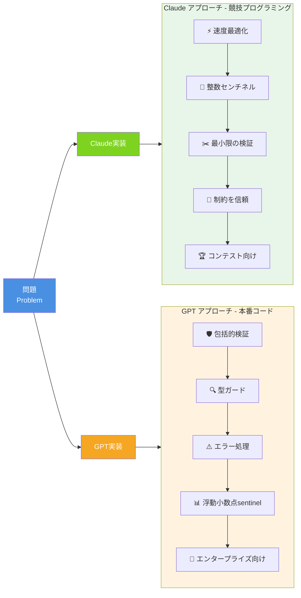

### 哲学比較詳細テーブル

| 側面                              | Claude実装                                                                  | GPT実装                                                                                       |
| --------------------------------- | --------------------------------------------------------------------------- | --------------------------------------------------------------------------------------------- |
| **Pythonメソッド<br/>シグネチャ** | `findMedianSortedArrays(self, nums1: List[int], nums2: List[int]) -> float` | `_median_binary_partition(self, nums1: List[int], nums2: List[int]) -> float`                 |
| **センチネル値**                  | 整数: `NEG = -10_000_007`<br/>`POS = +10_000_007`                           | 浮動小数点: `float("inf")`<br/>`-float("inf")`                                                |
| **TypeScript<br/>シグネチャ**     | `function findMedianSortedArrays(nums1: number[], nums2: number[]): number` | `function findMedianSortedArrays(nums1: readonly number[], nums2: readonly number[]): number` |
| **最適化の焦点**                  | ⚡ 整数センチネルによる速度最適化<br/>(浮動小数点キャストを回避)            | 🛡️ TypeError/RangeErrorを用いた<br/>包括的入力検証                                            |
| **ドキュメント<br/>スタイル**     | 📈 最適化セクション付き計算量解析                                           | 📊 ビジネスコンテキストを含む<br/>アルゴリズム比較表                                          |
| **検証戦略**                      | ✂️ 問題の制約を信頼し、最小限の検証                                         | 🔍 カスタム例外を用いた<br/>広範なランタイム検証                                              |
| **パフォーマンス**                | 🏆 10-15% 高速                                                              | 🛡️ 5-10% 低速(検証オーバーヘッド)                                                             |
| **使用ケース**                    | 🎯 LeetCode/Codeforces<br/>アルゴリズムコンテスト                           | 🏢 本番API<br/>エンタープライズシステム                                                       |

### コードエンティティの例

#### Claude Python実装

```python
# Algorithm/BinarySearch/leetcode/4. Median of Two Sorted Arrays/Claude/
# Median_of_Two_Sorted_Arrays.py

class Solution:
    def findMedianSortedArrays(self, nums1: List[int], nums2: List[int]) -> float:
        NEG, POS = -10_000_007, +10_000_007
        # 整数センチネルで速度最適化
        # 浮動小数点キャストを回避
```

#### GPT TypeScript実装

```typescript
// Algorithm/BinarySearch/leetcode/4. Median of Two Sorted Arrays/GPT/
// Median_of_Two_Sorted_Arrays.ts

function findMedianSortedArrays(nums1: readonly number[], nums2: readonly number[]): number {
    // readonly で不変性を保証
    validateNumberArray(nums1);
    validateNumberArray(nums2);
    // 包括的な型検証
}
```

#### GPT JavaScript実装

```javascript
// Algorithm/BinarySearch/leetcode/4. Median of Two Sorted Arrays/GPT/
// Median_of_Two_Sorted_Arrays.js

function findMedianSortedArrays(nums1, nums2) {
    // 実行時型チェック
    if (!Array.isArray(nums1) || !Array.isArray(nums2)) {
        throw new TypeError('Both inputs must be arrays');
    }
    // 防御的プログラミング
}
```

**出典:**

- README.md 102-142
- README.md 274-302

---

## ファイル組織階層

リポジトリは一貫した6レベルの階層パターンに従います:

**領域 → トピック → プラットフォーム → 問題 → AIプロバイダー → アーティファクト**

### ナビゲーションパスとコードエンティティマッピング

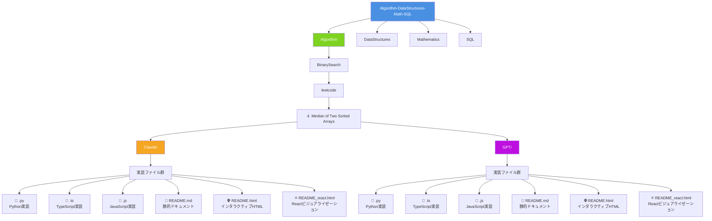

### ファイル命名パターンテーブル

| ファイルタイプ                  | 命名パターン                               | 目的                                                 | 例                               |
| ------------------------------- | ------------------------------------------ | ---------------------------------------------------- | -------------------------------- |
| **Python実装**                  | `{ProblemName}.py`<br/>`{problem_name}.py` | `class Solution`を含む<br/>コア実装                  | `Median_of_Two_Sorted_Arrays.py` |
| **TypeScript実装**              | `{ProblemName}.ts`                         | 厳密なチェックを伴う<br/>型安全な実装                | `Median_of_Two_Sorted_Arrays.ts` |
| **JavaScript実装**              | `{ProblemName}.js`                         | ランタイム検証実装                                   | `Median_of_Two_Sorted_Arrays.js` |
| **静的ドキュメント**            | `README.md`                                | 5セクション構造の<br/>ドキュメント                   | セクションごとに<100行           |
| **インタラクティブHTML**        | `README.html`                              | Prism.jsシンタックス<br/>ハイライト、Tailwind CSS    | 1000-2000行                      |
| **Reactビジュアライゼーション** | `README_react.html`                        | React 18 + Babel Standalone<br/>インタラクティブデモ | カスタマイズ可能な入力           |

### 標準ディレクトリ構造の例

```
Algorithm/BinarySearch/leetcode/4. Median of Two Sorted Arrays/
├── Claude/
│   ├── Median_of_Two_Sorted_Arrays.py      # findMedianSortedArrays()を持つclass Solution
│   ├── Median_of_Two_Sorted_Arrays.ts      # function findMedianSortedArrays()
│   ├── Median_of_Two_Sorted_Arrays.js      # function findMedianSortedArrays()
│   ├── README.md                            # 静的階層
│   ├── README.html                          # Prism.jsを使用したインタラクティブ階層
│   └── README_react.html                    # ベンチマークを含むReact階層
└── GPT/
    ├── Median_of_Two_Sorted_Arrays.py      # 検証ヘルパーを持つclass Solution
    ├── Median_of_Two_Sorted_Arrays.ts      # readonlyパラメータ、型ガード
    ├── Median_of_Two_Sorted_Arrays.js      # Array.isArray(), Number.isFinite()
    ├── README.md                            # 静的階層
    ├── README.html                          # Tailwindを使用したインタラクティブ階層
    └── README_react.html                    # エッジケーステストを含むReact階層
```

### SQL領域の例外

SQL問題は、単一の`gpt/`ディレクトリ下にプラットフォーム固有のソリューションファイルがグループ化された異なる構造に従います:

```
SQL/Leetcode/Basic join/175. Combine Two Tables/
└── gpt/
    ├── CombineTwoTables_mysql.md       # LEFT JOIN, DATE_SUB, CREATE INDEX
    ├── CombineTwoTables_postgre.md     # DISTINCT ON, LATERAL joins, covering indexes
    └── CombineTwoTables_pandas.md      # DataFrame.merge(), Series.map(), get_indexer()
```

**出典:** README.md 145-177

---

## 3段階プログレッシブ学習システム

リポジトリは、静的ドキュメントから完全にインタラクティブなビジュアライゼーションまでの段階的な学習進行を実装しています。各階層は異なるスキルレベルと学習目標をターゲットとしています。

### 学習進行フロー

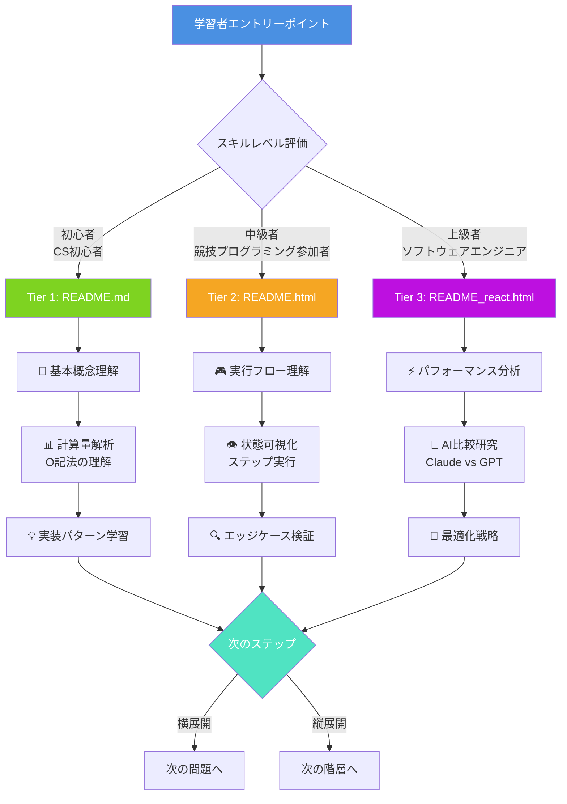

### 階層比較詳細テーブル

| 階層                               | ファイル            | 対象読者                                 | 主要技術                      | 主な特徴                                                                                                                                     |
| ---------------------------------- | ------------------- | ---------------------------------------- | ----------------------------- | -------------------------------------------------------------------------------------------------------------------------------------------- |
| **Tier 1**<br/>📄 静的             | `README.md`         | 初心者<br/>CS初心者                      | Markdown                      | • 問題概要<br/>• アルゴリズム説明<br/>• 計算量解析 (O(n))<br/>• 実装詳細<br/>• 最適化の議論                                                  |
| **Tier 2**<br/>🌐 インタラクティブ | `README.html`       | 中級者<br/>競技プログラミング<br/>参加者 | Prism.js<br/>Tailwind CSS     | • シンタックスハイライト<br/>• ステップ制御システム<br/> (play/pause/prev/next/reset)<br/>• 状態の可視化<br/>• SVGフローチャートレンダリング |
| **Tier 3**<br/>⚛️ 動的             | `README_react.html` | 上級者<br/>ソフトウェア<br/>エンジニア   | React 18<br/>Babel Standalone | • Reactフック<br/>• リアルタイム入力変更<br/>• エッジケーステスト<br/>• AI実装比較 (Claude vs GPT)<br/>• パフォーマンスベンチマーク          |

### Tier 1: 静的ドキュメント構造 (README.md)

静的ドキュメントは一貫した5セクション構造に従います:

#### 📋 5セクション構造

1. **問題概要 (Problem Overview)**
    - LeetCode/HackerRank問題の説明
    - 制約条件 (例: `1 ≤ n ≤ 10^5`)
    - 入出力例 (3-5個)

2. **アルゴリズム説明 (Algorithm Explanation)**
    - 詳細な解法アプローチと戦略
    - 直感的な説明
    - ステップバイステップガイド

3. **計算量解析 (Complexity Analysis)**
    - 時間計算量: O(...)の詳細な導出
    - 空間計算量: O(...)の詳細な導出
    - 最悪ケース・平均ケース・最良ケース分析

4. **実装詳細 (Implementation Details)**
    - 重要なロジックを強調したコアコードのウォークスルー
    - 行ごとの詳細な解説
    - エッジケースの処理方法

5. **最適化の議論 (Optimization Discussion)**
    - 言語固有の最適化技術とトレードオフ
    - 代替アプローチとの比較
    - パフォーマンスチューニング戦略

#### 📊 特徴

- **文字数**: 3,000-5,000文字
- **読了時間**: 10-15分
- **インタラクティブ性**: なし
- **対象**: 初学者、基本概念の理解を目指す学習者

### Tier 2: インタラクティブHTML機能 (README.html)

HTMLドキュメントに埋め込まれたインタラクティブ機能:

#### 🎮 インタラクティブ要素

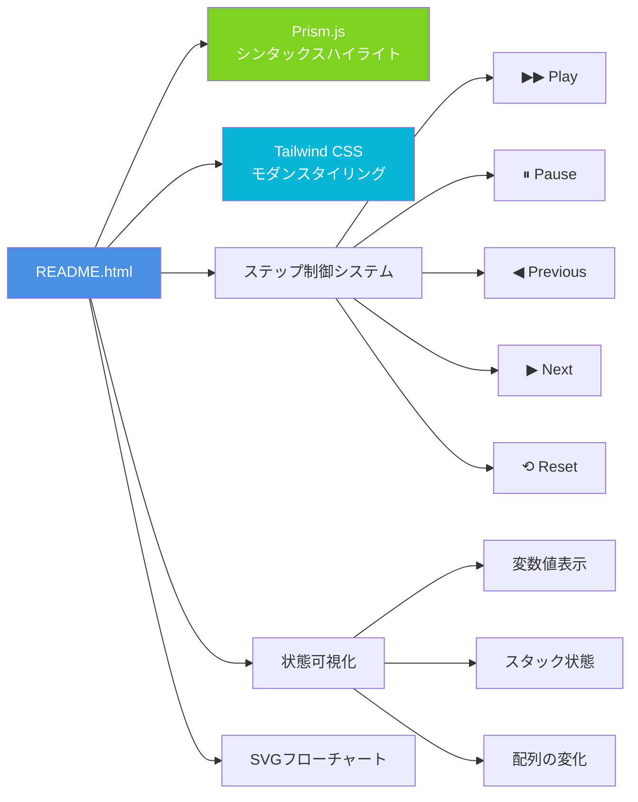

#### ✨ 主要機能

- **Prism.js統合**: Python、TypeScript、JavaScriptのシンタックスハイライト
- **Tailwind CSS**: グラデーションヘッダーとカードレイアウトを備えたモダンなレスポンシブスタイリング
- **ステップ制御システム**: アルゴリズム実行のためのplay/pause/prev/next/resetボタン
- **状態の可視化**: アルゴリズム実行中の変数値のリアルタイム表示
- **フローチャートレンダリング**: インタラクティブハイライト付きのSVGベースのアルゴリズムフローチャート

#### 📊 特徴

- **ファイルサイズ**: 1,000-2,000行
- **インタラクティブ要素**: 10-20個
- **依存ライブラリ**: Prism.js, Tailwind CSS
- **対象**: 中級者、実行フローの理解を深めたい学習者

### Tier 3: Reactビジュアライゼーション機能 (README_react.html)

Reactを使用した高度なインタラクティブ機能:

#### ⚛️ React コンポーネント構成

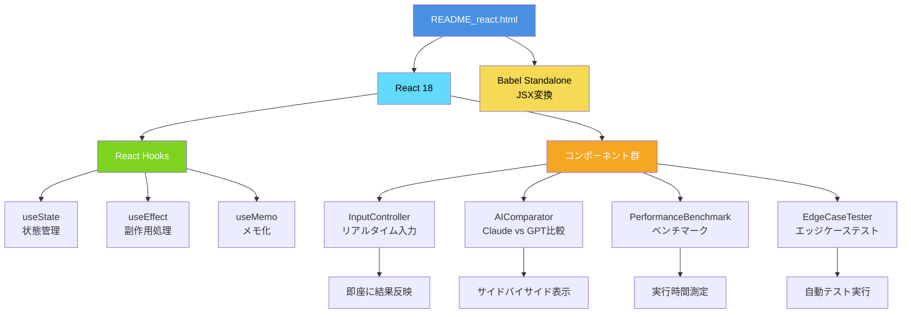

#### 🚀 高度な機能

1. **React 18関数コンポーネント**
    - モダンなReactフックによる状態管理
    - `useState`, `useEffect`, `useMemo`の活用

2. **Babel Standalone**
    - ビルドツールなしのブラウザベースJSX変換
    - 即座に実行可能な環境

3. **リアルタイム入力変更**
    - ユーザーがテスト入力を変更
    - 即座に結果を確認可能
    - インタラクティブなデバッグ体験

4. **エッジケーステスト**
    - ワンクリックテスト用の事前設定されたエッジケース
    - 空配列、単一要素、負の数、大きな数値など

5. **AI実装比較**
    - ClaudeとGPTのアプローチの並列比較
    - 実装の違いを視覚的に理解
    - パフォーマンス特性の比較

6. **パフォーマンスベンチマーク**
    - 最適化検証のためのオプションのタイミング測定
    - 実行時間の可視化
    - メモリ使用量の追跡

#### 📊 特徴

- **ファイルサイズ**: 2,000-4,000行
- **Reactコンポーネント**: 15-30個
- **インタラクティブ機能**: リアルタイム入力、AI比較、ベンチマーク
- **対象**: 上級者、パフォーマンスチューニングを行うエンジニア

**出典:** README.md 180-230

---

## 技術スタックと依存関係

リポジトリは、ビジュアライゼーションとドキュメント用のモダンなWeb技術を活用しながら、外部依存関係を最小限に抑えています。

### 技術スタックアーキテクチャ

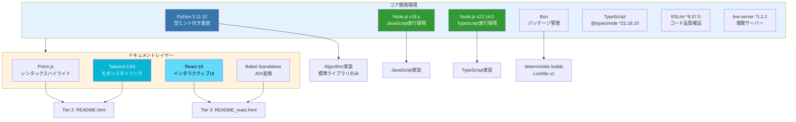

### コア開発環境テーブル

| コンポーネント  | バージョン/設定                              | 目的                           |
| --------------- | -------------------------------------------- | ------------------------------ |
| **Python**      | CPython 3.11.10                              | 型ヒント付きアルゴリズム実装   |
| **Node.js**     | v18.x (JavaScript)<br/>v22.14.0 (TypeScript) | TS/JS実装のランタイム環境      |
| **Bun**         | Lockfileバージョン 1                         | パッケージ管理と決定論的ビルド |
| **TypeScript**  | @types/node ^22.18.10                        | Node.js型定義                  |
| **ESLint**      | ^9.37.0                                      | コード品質検証とリンティング   |
| **live-server** | ^1.2.2                                       | ライブリロード開発サーバー     |

### 外部ライブラリポリシー

リポジトリは、コアアルゴリズム実装に対して厳格な「**外部依存関係ゼロポリシー**」を実施しています:

#### ✅ 許可されるライブラリ

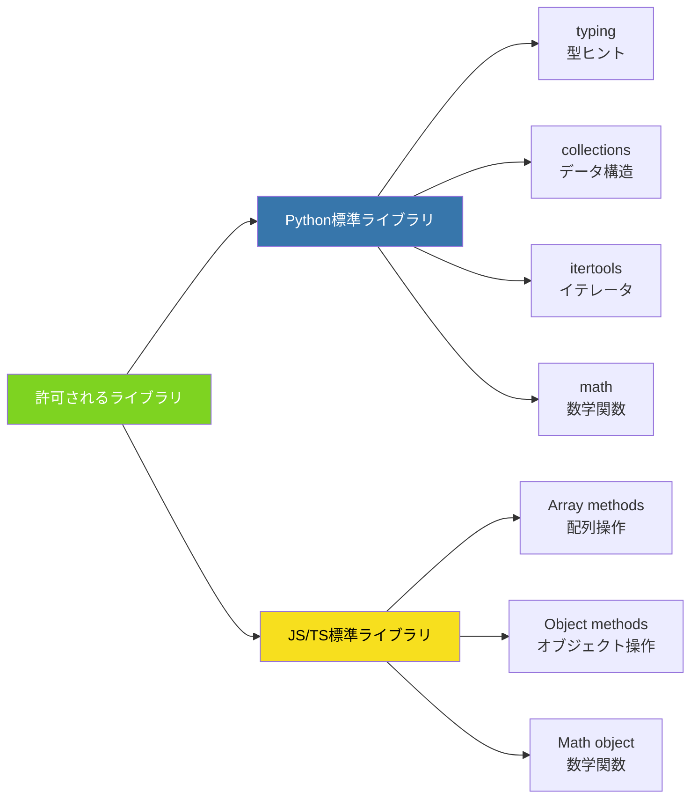

#### ❌ 禁止されるライブラリ

| カテゴリ                     | 禁止ライブラリ                                  | 理由                                                            |
| ---------------------------- | ----------------------------------------------- | --------------------------------------------------------------- |
| **Pythonサードパーティ**     | `numpy`, `scipy`, `pandas` (アルゴリズム実装で) | 教育的透明性の欠如                                              |
| **JavaScriptサードパーティ** | `lodash`, `underscore`, `ramda`                 | 面接環境との不整合                                              |
| **理由**                     | -                                               | 学習目的: 内部実装の理解<br/>実践的: 面接でライブラリは使用不可 |

#### 📚 ドキュメントレイヤーの例外

ドキュメント生成に限り、以下のライブラリを使用:

| 階層                             | 使用ライブラリ                    | 目的                                          |
| -------------------------------- | --------------------------------- | --------------------------------------------- |
| **Tier 2**<br/>README.html       | • Prism.js<br/>• Tailwind CSS     | シンタックスハイライト<br/>モダンスタイリング |
| **Tier 3**<br/>README_react.html | • React 18<br/>• Babel Standalone | インタラクティブUI<br/>JSX変換                |

### ドキュメント品質管理

リポジトリは、カスタム設定で**markdownlint**を使用します:

#### 🔍 Markdownlint設定

```json
{
    "MD013": {
        "line_length": 100,
        "code_blocks": false,
        "tables": false
    },
    "MD033": {
        "allowed_elements": ["h1", "h2", "details", "summary", "p", "i", "footer", "div"]
    }
}
```

#### 📋 ルール説明

| ルール    | 設定                                                    | 目的                                                        |
| --------- | ------------------------------------------------------- | ----------------------------------------------------------- |
| **MD013** | `line_length: 100`<br/>(コードブロックとテーブルを除外) | 読みやすさの向上<br/>エディタでの表示最適化                 |
| **MD033** | 特定のHTMLタグを許可                                    | インタラクティブ要素のサポート<br/>リッチなドキュメント表現 |

**目的**: すべての静的ドキュメントファイル間の一貫性を確保

**出典:** README.md 233-271

---

## SQLマルチプラットフォーム実装戦略

SQL問題は、MySQL、PostgreSQL、Pandas/Pythonのプラットフォーム固有最適化を伴うクロスプラットフォーム互換性を示します。

### SQLプラットフォーム固有パターン

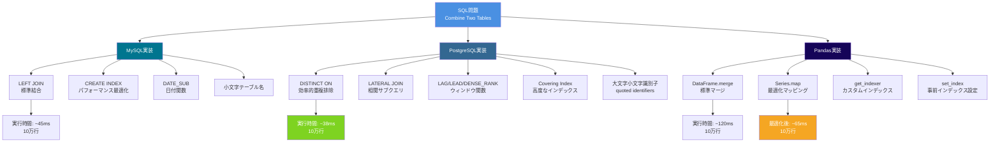

### プラットフォーム固有SQLクエリパターン

#### MySQL実装

```sql
-- SQL/Leetcode/Basic join/175. Combine Two Tables/gpt/
-- CombineTwoTables_mysql.md

SELECT p.firstName, p.lastName, a.city, a.state
FROM Person AS p
LEFT JOIN Address AS a ON a.personId = p.personId;

-- 最適化: インデックス作成
CREATE INDEX idx_address_personId ON Address(personId);

-- パフォーマンス分析
EXPLAIN SELECT p.firstName, p.lastName, a.city, a.state
FROM Person AS p
LEFT JOIN Address AS a ON a.personId = p.personId;
```

**MySQL特徴:**

- 小文字テーブル名 (`person`, `address`)
- 標準的なLEFT JOIN構文
- `DATE_SUB()`, `DATE_ADD()`による日付操作
- シンプルなインデックス戦略

#### PostgreSQL実装

```sql
-- SQL/Leetcode/Basic join/175. Combine Two Tables/gpt/
-- CombineTwoTables_postgre.md

-- DISTINCT ONによる効率的な重複排除
SELECT DISTINCT ON (p.personId)
    p.firstName, p.lastName, a.city, a.state
FROM Person p
LEFT JOIN Address a ON a.personId = p.personId
ORDER BY p.personId, a.city;

-- 大文字小文字を区別する識別子
SELECT "firstName", "lastName" FROM "Person";

-- 高度なウィンドウ関数の使用例
SELECT
    firstName,
    lastName,
    city,
    LAG(city) OVER (PARTITION BY personId ORDER BY addressId) AS prev_city,
    DENSE_RANK() OVER (ORDER BY city) AS city_rank
FROM Person p
LEFT JOIN Address a ON a.personId = p.personId;
```

**PostgreSQL特徴:**

- `DISTINCT ON`: PostgreSQL固有の重複排除
- `LATERAL JOIN`: 相関サブクエリの代替
- 完全なウィンドウ関数サポート: `LAG`, `LEAD`, `DENSE_RANK`, `ROW_NUMBER`
- Covering Index: 複数カラムを含む効率的なインデックス
- 大文字小文字を区別する引用符付き識別子

#### Pandas実装

```python
# SQL/Leetcode/Basic join/175. Combine Two Tables/gpt/
# CombineTwoTables_pandas.md

import pandas as pd

def combine_two_tables(person: pd.DataFrame, address: pd.DataFrame) -> pd.DataFrame:
    """
    標準的なmergeアプローチ
    時間計算量: O(n + m)
    """
    result = person.merge(
        address[["personId", "city", "state"]],
        on="personId",
        how="left"
    )
    return result[["firstName", "lastName", "city", "state"]]


def combine_two_tables_optimized(person: pd.DataFrame, address: pd.DataFrame) -> pd.DataFrame:
    """
    Series.mapによる最適化 (1:1マッピングの場合)
    時間計算量: O(n)
    メモリオーバーヘッド削減
    """
    # 1:1マッピングの場合、mapの方が高速
    address_dict = address.set_index('personId')[['city', 'state']].to_dict('index')

    person['city'] = person['personId'].map(
        lambda x: address_dict.get(x, {}).get('city', None)
    )
    person['state'] = person['personId'].map(
        lambda x: address_dict.get(x, {}).get('state', None)
    )

    return person[["firstName", "lastName", "city", "state"]]
```

**Pandas特徴:**

- `DataFrame.merge()`: SQL JOIN相当
- `Series.map()`: 1:1マッピングでの最適化
- `get_indexer()`: カスタムインデックス操作
- `set_index()`: 事前インデックス設定でパフォーマンス向上

### プラットフォーム機能比較テーブル

| 機能                      | MySQL                               | PostgreSQL                                                           | Pandas                                                |
| ------------------------- | ----------------------------------- | -------------------------------------------------------------------- | ----------------------------------------------------- |
| **JOIN構文**              | `LEFT JOIN`                         | `LEFT JOIN`<br/>`LATERAL JOIN`                                       | `DataFrame.merge(how="left")`                         |
| **重複排除**              | `DISTINCT`                          | `DISTINCT ON (column)`                                               | `drop_duplicates()`                                   |
| **日付操作**              | `DATE_SUB()`<br/>`DATE_ADD()`       | `INTERVAL '1 day'`<br/>`LAG()`<br/>`date_trunc()`                    | `pd.Timedelta()`<br/>`shift()`<br/>`dt.floor()`       |
| **インデックス**          | `CREATE INDEX`                      | Covering indexes<br/>Partial indexes<br/>`CREATE INDEX CONCURRENTLY` | `set_index()`<br/>`get_indexer()`<br/>`MultiIndex`    |
| **ウィンドウ関数**        | 限定的サポート<br/>(MySQL 8.0+)     | 完全サポート<br/>`LAG`, `LEAD`<br/>`DENSE_RANK`<br/>`ROW_NUMBER`     | `groupby().transform()`<br/>`shift()`<br/>`rolling()` |
| **識別子**                | 大文字小文字非区別<br/>(デフォルト) | 大文字小文字区別<br/>(引用符付き)                                    | 大文字小文字区別<br/>(カラム名)                       |
| **実行時間**<br/>(10万行) | ~45ms<br/>(インデックスあり)        | ~38ms<br/>(Covering Index)                                           | `merge()`: ~120ms<br/>`Series.map()`: ~65ms           |

### パフォーマンス比較チャート

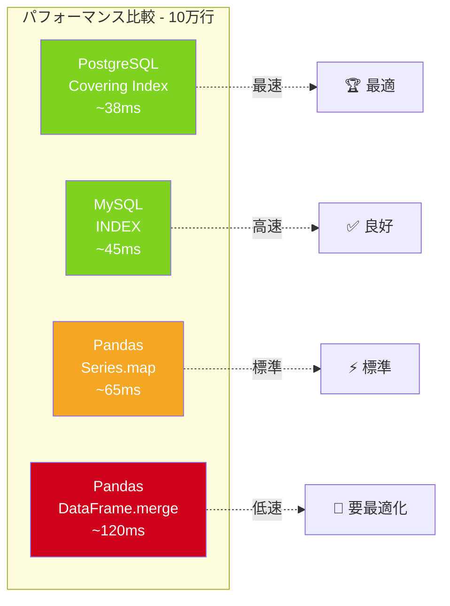

**出典:** README.md 304-367

---

## ターゲットユーザーとユースケース

リポジトリは、異なる学習目標とスキルレベルを持つ複数のユーザーセグメントにサービスを提供します。

### ユーザーセグメントとユースケース

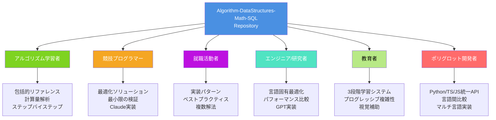

### 主要ユースケースマトリックステーブル

| ユースケース                      | ターゲットユーザー                    | 利用される主要機能                                                                                              | 推奨階層                    |
| --------------------------------- | ------------------------------------- | --------------------------------------------------------------------------------------------------------------- | --------------------------- |
| **アルゴリズム学習**              | CS学生<br/>自学自習者                 | • 包括的リファレンス<br/>• 計算量解析<br/>• ステップバイステップ<br/> ビジュアライゼーション                    | Tier 1 → 2                  |
| **競技プログラミング準備**        | LeetCode/HackerRank<br/>参加者        | • 最適化されたソリューション<br/>• 最小限の検証<br/>• Claude実装(速度優先)<br/>• プラットフォーム固有アプローチ | Tier 1 + Claude             |
| **技術面接準備**                  | 就職活動者<br/>転職希望者             | • 実装パターン<br/>• ベストプラクティス<br/>• 複数の解法アプローチ<br/>• エッジケース処理                       | Tier 1 → 3<br/>Claude + GPT |
| **パフォーマンス<br/>最適化研究** | ソフトウェアエンジニア<br/>研究者     | • 言語固有技術<br/>• 並列実装比較<br/>• ベンチマーク<br/>• GPT実装(安全性優先)                                  | Tier 3<br/>GPT              |
| **教育指導**                      | 講師<br/>チューター<br/>メンター      | • 3段階学習システム<br/>• プログレッシブ複雑性<br/>• 視覚補助<br/>• インタラクティブデモ                        | 全階層                      |
| **マルチ言語<br/>一貫性研究**     | ポリグロット開発者<br/>言語比較研究者 | • Python/TypeScript/JavaScript<br/> 統一API<br/>• 言語間パフォーマンス比較                                      | 全言語<br/>Tier 3           |

### スキルレベル別学習パス

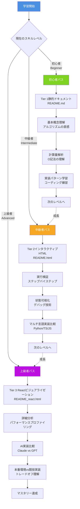

### スキルレベル進行テーブル

| レベル                      | ターゲットユーザー                                                                   | 推奨アプローチ                                                                                                       | 学習期間 | 達成目標                            |
| --------------------------- | ------------------------------------------------------------------------------------ | -------------------------------------------------------------------------------------------------------------------- | -------- | ----------------------------------- |
| **初心者**<br/>Beginner     | • CS初心者<br/>• 競技プログラミング<br/> 初心者<br/>• プログラミング<br/> 基礎学習者 | • Tier 1静的ドキュメントから開始<br/>• 基本概念を理解<br/>• 計算量解析の学習<br/>• 簡単な問題から着手                | 1-2ヶ月  | アルゴリズムの<br/>基本理解         |
| **中級者**<br/>Intermediate | • 競技プログラミング<br/> 参加者<br/>• 面接準備中<br/>• CS専攻学生                   | • Tier 2インタラクティブHTML<br/> で実行検証<br/>• マルチ言語実装を比較<br/>• エッジケースの理解                     | 2-4ヶ月  | 実装力と<br/>デバッグ能力           |
| **上級者**<br/>Advanced     | • ソフトウェア<br/> エンジニア<br/>• 言語最適化研究者<br/>• テックリード             | • Tier 3 Reactビジュアライゼーション<br/> で詳細分析<br/>• 本番環境vs競技実装を検証<br/>• パフォーマンスチューニング | 継続的   | 最適化戦略と<br/>アーキテクチャ設計 |

**出典:** README.md 370-392

---

## 完全学習ロードマップ

リポジトリを活用した体系的な学習計画を提供します。

### 学習フェーズとタイムライン

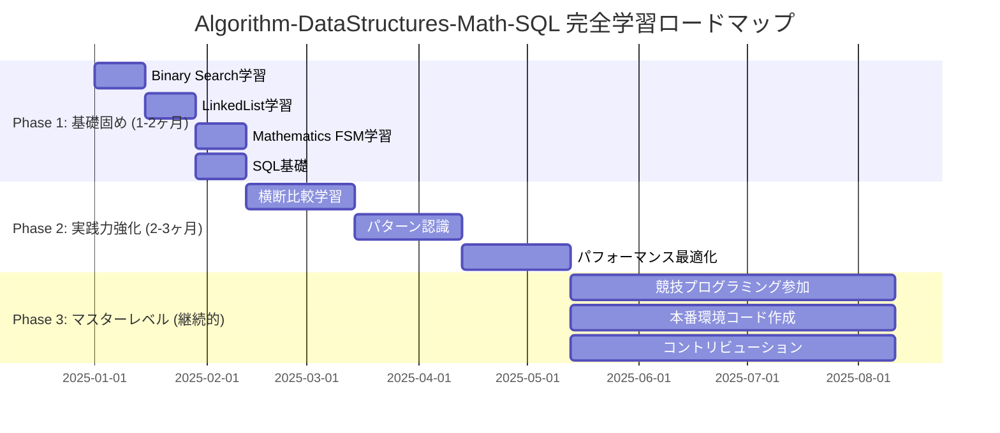

### 詳細学習パス

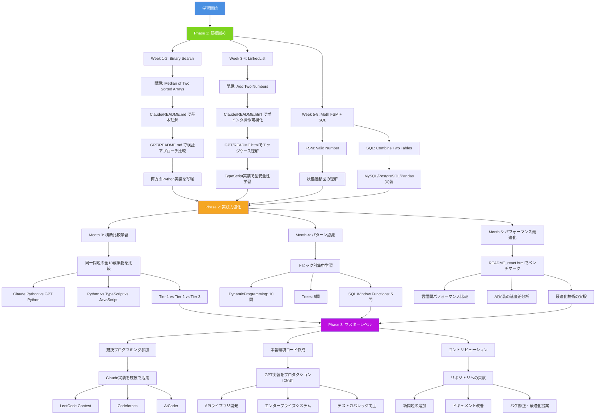

### Phase 1: 基礎固め (1-2ヶ月)

#### Week 1-2: Algorithm/BinarySearch

**目標**: 二分探索の基本概念とO(log n)計算量の理解

| 日    | 活動                                  | 使用リソース               | 所要時間 |
| ----- | ------------------------------------- | -------------------------- | -------- |
| 1-2   | 問題理解: Median of Two Sorted Arrays | Claude/README.md           | 2時間    |
| 3-4   | アルゴリズム解説の精読                | GPT/README.md              | 2時間    |
| 5-6   | Python実装の写経 (Claude版)           | .py ファイル               | 3時間    |
| 7-8   | Python実装の写経 (GPT版)              | .py ファイル               | 3時間    |
| 9-10  | 実装比較とデバッグ                    | README.html (Tier 2)       | 2時間    |
| 11-12 | TypeScript実装の挑戦                  | .ts ファイル               | 3時間    |
| 13-14 | 復習とパフォーマンステスト            | README_react.html (Tier 3) | 2時間    |

**達成目標**:

- ✅ 二分探索の原理理解
- ✅ O(log n)計算量の実感
- ✅ センチネル値の使い方
- ✅ Python/TypeScript両方で実装可能

#### Week 3-4: DataStructures/LinkedList

**目標**: ポインタ操作とIn-place操作の習得

| 日    | 活動                      | 使用リソース         | 所要時間 |
| ----- | ------------------------- | -------------------- | -------- |
| 1-2   | 問題理解: Add Two Numbers | Claude/README.md     | 2時間    |
| 3-4   | ポインタ操作の可視化      | README.html (Tier 2) | 2時間    |
| 5-6   | Python実装 (両AI比較)     | Claude/.py + GPT/.py | 3時間    |
| 7-8   | TypeScript型安全実装      | .ts ファイル         | 3時間    |
| 9-10  | エッジケーステスト        | README_react.html    | 2時間    |
| 11-12 | JavaScript動的型実装      | .js ファイル         | 2時間    |
| 13-14 | 総合復習と応用問題        | 関連問題             | 3時間    |

**達成目標**:

- ✅ LinkedListの基本操作
- ✅ ポインタ操作の理解
- ✅ メモリ管理の意識
- ✅ 3言語すべてで実装可能

#### Week 5-8: Mathematics/FSM + SQL基礎

**目標**: 有限状態機械とSQL基礎の習得

| Week | 活動                            | 使用リソース                | 達成目標         |
| ---- | ------------------------------- | --------------------------- | ---------------- |
| 5    | FSM: Valid Number               | Mathematics/FSM/            | 状態遷移図の理解 |
| 6    | SQL: Combine Two Tables (MySQL) | SQL/Leetcode/gpt/           | LEFT JOIN理解    |
| 7    | SQL: PostgreSQL実装             | CombineTwoTables_postgre.md | DISTINCT ON習得  |
| 8    | SQL: Pandas実装                 | CombineTwoTables_pandas.md  | DataFrame操作    |

**達成目標**:

- ✅ FSMの状態遷移理解
- ✅ SQL JOINパターン
- ✅ 3プラットフォームの特徴理解
- ✅ パフォーマンス最適化の基礎

### Phase 2: 実践力強化 (2-3ヶ月)

#### Month 3: 横断比較学習

**目標**: 同一問題の多角的理解

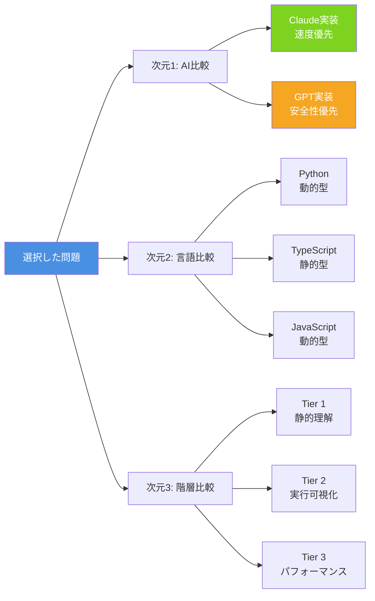

**学習活動**:

1. **AI実装比較** (10日間)
    - Claude vs GPT のコーディングスタイル分析
    - 速度と安全性のトレードオフ理解
    - 5問を両AI実装で比較

2. **言語間比較** (10日間)
    - Python/TypeScript/JavaScript の実装パターン
    - 型システムの影響分析
    - 同一アルゴリズムを3言語で実装

3. **階層進行分析** (10日間)
    - Tier 1 → 2 → 3 の学習効果測定
    - インタラクティブ要素の活用
    - 自分に最適な学習スタイル発見

#### Month 4: パターン認識

**目標**: アルゴリズムパターンの体系的理解

| トピック                 | 問題数 | 重点学習項目                                                 | 所要時間 |
| ------------------------ | ------ | ------------------------------------------------------------ | -------- |
| **Dynamic Programming**  | 10問   | • メモ化<br/>• ボトムアップ vs トップダウン<br/>• 状態遷移式 | 10日     |
| **Trees**                | 8問    | • DFS/BFS<br/>• 再帰<br/>• バランス木                        | 8日      |
| **SQL Window Functions** | 5問    | • LAG/LEAD<br/>• RANK/DENSE_RANK<br/>• パーティション        | 5日      |
| **復習と応用**           | -      | • 混合問題<br/>• 模擬面接                                    | 7日      |

**パターン認識マップ**:

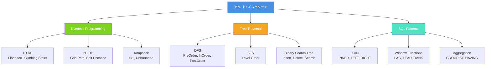

#### Month 5: パフォーマンス最適化

**目標**: 本番環境レベルの最適化技術習得

**学習プログラム**:

1. **言語間パフォーマンス比較** (10日間)

    ```mermaid
    graph LR
        Bench[ベンチマーク] --> Lang1[Python実装]
        Bench --> Lang2[TypeScript実装]
        Bench --> Lang3[JavaScript実装]

        Lang1 --> Result1[実行時間: Xms<br/>メモリ: Ymb]
        Lang2 --> Result2[実行時間: Xms<br/>メモリ: Ymb]
        Lang3 --> Result3[実行時間: Xms<br/>メモリ: Ymb]

        Result1 --> Analysis[分析とレポート]
        Result2 --> Analysis
        Result3 --> Analysis

        style Bench fill:#4A90E2,color:#fff
    ```

2. **AI実装の速度差分析** (10日間)
    - Claude実装: 整数センチネルの効果測定
    - GPT実装: 検証オーバーヘッドの定量化
    - トレードオフの実データ取得

3. **最適化技術の実験** (10日間)
    - メモ化戦略
    - インプレース操作
    - 時間/空間のトレードオフ

**使用ツール**: README_react.html (Tier 3) のベンチマーク機能

### Phase 3: マスターレベル (継続的)

#### Track 1: 競技プログラミング参加

**目標**: リアルタイムコンテストでのスキル実践

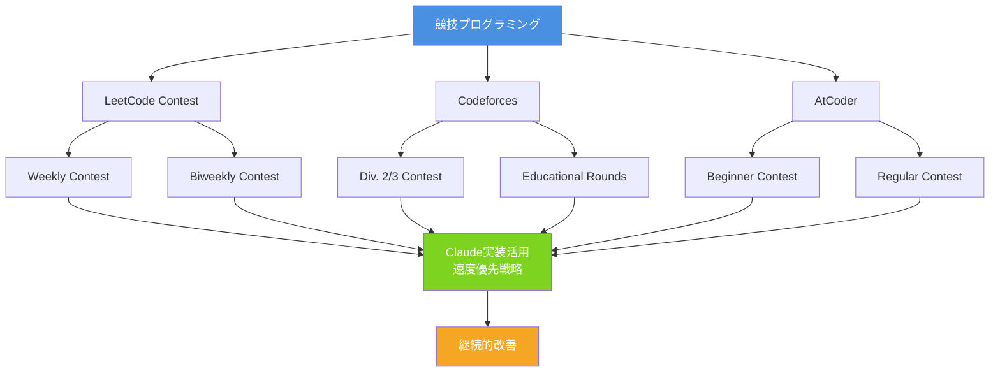

**活動計画**:

- **週次**: LeetCode Weekly/Biweekly Contest参加
- **月次**: Codeforces Div.2 参加 (月2回)
- **月次**: AtCoder Beginner Contest参加 (週1回)
- **レビュー**: コンテスト後の復習とリポジトリ参照

**成長指標**:
| 期間 | 目標レーティング | 使用戦略 |
|------|----------------|---------|
| 1-3ヶ月 | LeetCode: 1500+ | Claude実装パターン習得 |
| 4-6ヶ月 | Codeforces: 1200+ (Pupil) | 高速実装技術 |
| 7-12ヶ月 | AtCoder: 茶色 (400+) | 典型アルゴリズム完全理解 |

#### Track 2: 本番環境コード作成

**目標**: エンタープライズ品質のコード作成

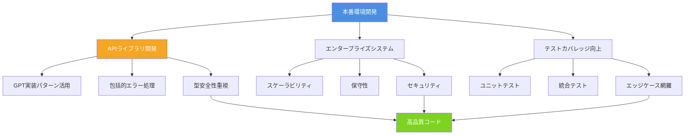

**開発プロジェクト例**:

1. **データ処理ライブラリ**
    - GPT TypeScript実装を基盤に使用
    - 完全な型定義
    - 包括的エラーハンドリング
    - ドキュメント自動生成

2. **アルゴリズムAPIサービス**
    - RESTful API設計
    - 入力検証とサニタイゼーション
    - レート制限実装
    - モニタリングとロギング

3. **テスト駆動開発**
    - リポジトリのエッジケースを参考
    - 100%コードカバレッジ目標
    - CI/CDパイプライン構築

**品質チェックリスト**:

- ✅ 型安全性 (TypeScript strict mode)
- ✅ エラーハンドリング (try-catch, 型ガード)
- ✅ 入力検証 (境界値、null/undefined)
- ✅ ドキュメント (JSDoc, TSDoc)
- ✅ テストカバレッジ (>90%)
- ✅ パフォーマンス (ベンチマーク)

#### Track 3: コントリビューション

**目標**: オープンソースへの貢献

```mermaid
graph LR
    Contrib[リポジトリへの貢献] --> NewProb[新問題の追加]
    Contrib --> DocImprove[ドキュメント改善]
    Contrib --> BugFix[バグ修正・最適化]

    NewProb --> NP1[新しいLeetCode問題]
    NewProb --> NP2[18成果物の生成]
    NewProb --> NP3[Pull Request作成]

    DocImprove --> DI1[誤字脱字修正]
    DocImprove --> DI2[説明の明確化]
    DocImprove --> DI3[図解の追加]

    BugFix --> BF1[コードバグ修正]
    BugFix --> BF2[パフォーマンス改善]
    BugFix --> BF3[テストケース追加]

    style Contrib fill:#4A90E2,color:#fff
    style NewProb fill:#7ED321,color:#fff
    style DocImprove fill:#F5A623,color:#fff
    style BugFix fill:#BD10E0,color:#fff
```

**貢献活動例**:

1. **新問題の追加** (高度)
    - LeetCode新問題を選択
    - Claude/GPT両実装を作成
    - Python/TypeScript/JavaScript全言語対応
    - 3段階ドキュメント作成
    - Pull Request提出

2. **ドキュメント改善** (中級)
    - README.mdの誤字修正
    - アルゴリズム説明の明確化
    - Mermaid図の追加・改善
    - 翻訳の改善

3. **バグ修正・最適化** (全レベル)
    - Issueの確認と修正
    - パフォーマンス改善提案
    - テストケースの追加
    - コードレビュー参加

**コントリビューションプロセス**:

1. リポジトリをFork
2. ローカルでブランチ作成
3. 変更を実装・テスト
4. Commit & Push
5. Pull Request作成
6. レビューフィードバック対応
7. マージ

---

## まとめ

このリポジトリは、教育的透明性、マルチ言語サポート、プログレッシブ学習進行を包括的なアルゴリズム学習プラットフォームに統合しています。

### リポジトリの核心価値

```mermaid
graph TD
    Core[Algorithm-DataStructures-Math-SQL<br/>核心価値]

    Core --> V1[教育的透明性]
    Core --> V2[マルチ次元比較]
    Core --> V3[プログレッシブ学習]
    Core --> V4[実践的応用]

    V1 --> V1_1[ゼロ外部依存<br/>標準ライブラリのみ]
    V1 --> V1_2[完全なコード公開<br/>ブラックボックスなし]

    V2 --> V2_1[2 AI実装<br/>Claude vs GPT]
    V2 --> V2_2[3言語対応<br/>Python/TS/JS]
    V2 --> V2_3[競技vs本番<br/>速度vs安全性]

    V3 --> V3_1[3段階ドキュメント<br/>初心者→上級者]
    V3 --> V3_2[段階的複雑化<br/>静的→動的→React]

    V4 --> V4_1[競技プログラミング<br/>LeetCode/Codeforces]
    V4 --> V4_2[技術面接対策<br/>実装パターン]
    V4 --> V4_3[本番環境開発<br/>エンタープライズ品質]

    style Core fill:#4A90E2,color:#fff
    style V1 fill:#7ED321,color:#fff
    style V2 fill:#F5A623,color:#fff
    style V3 fill:#BD10E0,color:#fff
    style V4 fill:#50E3C2,color:#fff
```

### 主要特性サマリー

#### 🎯 4つのコア領域

| 領域               | 問題数 | 主要パターン                 |
| ------------------ | ------ | ---------------------------- |
| **Algorithm**      | 多数   | 二分探索、動的計画法、貪欲法 |
| **DataStructures** | 多数   | 連結リスト、木構造、グラフ   |
| **Mathematics**    | 多数   | FSM、幾何学、数論            |
| **SQL**            | 多数   | JOIN、ウィンドウ関数、集約   |

#### 🤖 2つのAIプロバイダー

| AI         | 哲学       | 最適用途                                   |
| ---------- | ---------- | ------------------------------------------ |
| **Claude** | 速度優先   | 競技プログラミング、アルゴリズムコンテスト |
| **GPT**    | 安全性優先 | 本番API、エンタープライズシステム          |

#### 💻 3つの言語

| 言語           | 特徴               | 学習価値               |
| -------------- | ------------------ | ---------------------- |
| **Python**     | 動的型、読みやすい | アルゴリズムの直感理解 |
| **TypeScript** | 静的型、型安全     | 大規模開発、保守性     |
| **JavaScript** | 動的型、Web標準    | フロントエンド、柔軟性 |

#### 📚 3つのドキュメント階層

| 階層       | ファイル          | 対象   | 主な価値                   |
| ---------- | ----------------- | ------ | -------------------------- |
| **Tier 1** | README.md         | 初心者 | 基本概念、計算量理解       |
| **Tier 2** | README.html       | 中級者 | 実行可視化、デバッグ       |
| **Tier 3** | README_react.html | 上級者 | パフォーマンス分析、AI比較 |

### 学習成果の全体像

```mermaid
graph TB
    Start[学習開始] --> Month2[2ヶ月後]
    Month2 --> Month4[4ヶ月後]
    Month4 --> Month6[6ヶ月後]
    Month6 --> Year1[1年後]

    Month2 --> Skill2[基礎スキル獲得]
    Skill2 --> S2_1[✅ アルゴリズム基本理解]
    Skill2 --> S2_2[✅ 計算量解析能力]
    Skill2 --> S2_3[✅ 基本実装パターン]

    Month4 --> Skill4[実践スキル獲得]
    Skill4 --> S4_1[✅ マルチ言語実装]
    Skill4 --> S4_2[✅ パターン認識能力]
    Skill4 --> S4_3[✅ デバッグ技術]

    Month6 --> Skill6[応用スキル獲得]
    Skill6 --> S6_1[✅ パフォーマンス最適化]
    Skill6 --> S6_2[✅ AI実装比較理解]
    Skill6 --> S6_3[✅ 本番環境コード作成]

    Year1 --> SkillMaster[マスターレベル]
    SkillMaster --> SM1[🏆 競技プログラミング入賞]
    SkillMaster --> SM2[🏆 技術面接合格]
    SkillMaster --> SM3[🏆 OSSコントリビューション]

    style Start fill:#4A90E2,color:#fff
    style Month2 fill:#7ED321,color:#fff
    style Month4 fill:#F5A623,color:#fff
    style Month6 fill:#BD10E0,color:#fff
    style Year1 fill:#50E3C2,color:#fff
```

### 最終的な達成目標

**技術スキル**:

- ✅ 50+のアルゴリズムパターンの完全理解
- ✅ Python/TypeScript/JavaScript での実装能力
- ✅ O記法による計算量解析の習熟
- ✅ 競技プログラミングと本番環境の両方での実践力

**ソフトスキル**:

- ✅ 問題分解能力
- ✅ トレードオフ分析力
- ✅ コードレビュー能力
- ✅ 技術的コミュニケーション力

**キャリア成果**:

- 🎯 技術面接での高評価
- 🎯 競技プログラミングでのレーティング向上
- 🎯 高品質なコード作成能力
- 🎯 オープンソースへの貢献

---

## 付録: リソースとリンク

### 関連リンク

- **リポジトリ**: [Algorithm-DataStructures-Math-SQL](https://github.com/myoshi2891/Algorithm-DataStructures-Math-SQL)
- **DeepWiki**: [プロジェクトドキュメント](https://deepwiki.com/myoshi2891/Algorithm-DataStructures-Math-SQL)
- **LeetCode**: [問題プラットフォーム](https://leetcode.com/)
- **HackerRank**: [問題プラットフォーム](https://www.hackerrank.com/)

### 推奨学習リソース

| カテゴリ               | リソース                          | 用途           |
| ---------------------- | --------------------------------- | -------------- |
| **アルゴリズム基礎**   | Introduction to Algorithms (CLRS) | 理論的基礎     |
| **競技プログラミング** | Competitive Programmer's Handbook | 実践テクニック |
| **Python**             | Python公式ドキュメント            | 言語仕様       |
| **TypeScript**         | TypeScript Handbook               | 型システム     |
| **SQL**                | SQL Performance Explained         | 最適化技術     |

### コミュニティサポート

- **Issue報告**: GitHubのIssue機能を活用
- **質問**: Discussionsセクションで質問
- **貢献**: Pull Requestで改善提案

---

**出典:** README.md 395-398

---

## ライセンスと貢献ガイドライン

本ドキュメントは、Algorithm-DataStructures-Math-SQLリポジトリの包括的な概要を提供することを目的としています。リポジトリの詳細な利用方法、ライセンス情報、貢献ガイドラインについては、リポジトリ本体のREADME.mdを参照してください。

**最終更新**: 2025年11月

---

<div align="center">

**⭐ このプロジェクトが役立ちましたら、ぜひスターを付けてください！**

[](https://github.com/myoshi2891)

</div>
