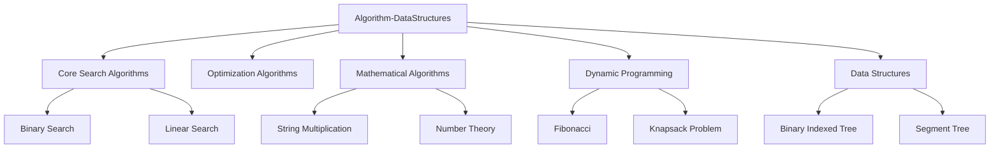
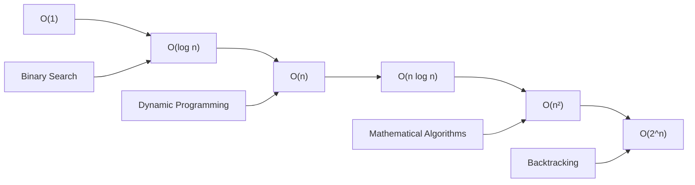
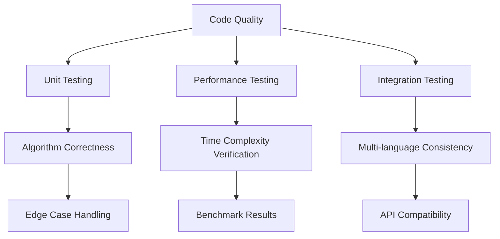

# Algorithm-DataStructures

> 競技プログラミング、技術面接、コンピューターサイエンス学習のための総合的なアルゴリズム・データ構造実装コレクション

## 概要

このリポジトリは、基本的なアルゴリズムの多言語実装を特徴とした教育・参考実装コレクションです。詳細な計算量解析、インタラクティブな可視化、パフォーマンスベンチマークフレームワークを提供します。

## 🏗️ リポジトリ構成

```
Algorithm-DataStructures/
├── Core Search Algorithms/     # 探索アルゴリズム
├── Optimization Algorithms/    # 最適化アルゴリズム  
├── Mathematical Algorithms/    # 数学的アルゴリズム
├── Dynamic Programming/        # 動的プログラミング
├── Data Structures/           # データ構造
└── Implementation Guide/       # 実装ガイド
```

### アーキテクチャ概要



## 🚀 多言語実装フレームワーク

各アルゴリズムは一貫した論理を保ちながら、言語固有の最適化を行った複数言語で実装されています。

### サポート言語

- **Python** - 型ヒント、クラスベース設計
- **TypeScript** - 厳密な型注釈、コンパイル時チェック  
- **JavaScript** - ランタイム最適化、V8エンジン対応

### 実装例: 文字列掛け算アルゴリズム

#### Python実装
```python
from typing import List

class Solution:
    def multiply(self, num1: str, num2: str) -> str:
        if num1 == "0" or num2 == "0":
            return "0"
        
        m, n = len(num1), len(num2)
        result = [0] * (m + n)
        
        # 言語固有の最適化を実装
        return self._process_multiplication(num1, num2, result)
```

#### TypeScript実装
```typescript
function multiply(num1: string, num2: string): string {
    if (num1 === "0" || num2 === "0") return "0";
    
    const m = num1.length;
    const n = num2.length;
    const result: number[] = new Array(m + n).fill(0);
    
    // 型安全性を保証した実装
    return processMultiplication(num1, num2, result);
}
```

#### JavaScript実装
```javascript
var multiply = function(num1, num2) {
    if (num1 === "0" || num2 === "0") return "0";
    
    const m = num1.length;
    const n = num2.length;
    const result = new Array(m + n).fill(0);
    
    // V8エンジン最適化対応
    return processMultiplication(num1, num2, result);
};
```

## 📊 アルゴリズムカテゴリと計算量

| アルゴリズムカテゴリ | 主要関数 | 時間計算量 | 空間計算量 | 言語サポート |
|---------------------|---------|------------|------------|-------------|
| Binary Search | `search()`, `findMedianSortedArrays()` | O(log n) | O(1) | Python, TypeScript, JavaScript |
| Dynamic Programming | `countWays()`, `count_ways()` | O(n) ~ O(n²) | O(n) | Python, TypeScript, JavaScript |
| Backtracking | `combinationSum()`, `backtrack()` | O(2^n) | O(log n) | TypeScript, JavaScript |
| Mathematical | `multiply()`, `Solution.multiply()` | O(m × n) | O(m + n) | Python, TypeScript, JavaScript |
| Data Structures | `BinaryIndexedTree.update()`, `query()` | O(log n) | O(n) | Python |

### 計算量分析図



## 📚 教育システム

### インタラクティブ可視化

アルゴリズムの実行過程をステップバイステップで視覚化します：

```html
<!-- デモ実装例 -->
<script>
function demoMultiply() {
    const num1 = document.getElementById('num1').value;
    const num2 = document.getElementById('num2').value;
    const result = multiply(num1, num2);
    
    // リアルタイム結果表示
    document.getElementById('result').textContent = result;
    
    // パフォーマンス測定
    const startTime = performance.now();
    // アルゴリズム実行
    const endTime = performance.now();
    console.log(`実行時間: ${endTime - startTime}ms`);
}
</script>
```

### パフォーマンス分析ツール

```python
def benchmark_search_algorithms():
    """探索アルゴリズムのベンチマーク（複数データサイズ）"""
    sizes = [1000, 10000, 100000, 1000000]
    
    for size in sizes:
        data = generate_test_data(size)
        
        # バイナリサーチ vs リニアサーチの性能比較
        binary_time = measure_binary_search(data)
        linear_time = measure_linear_search(data)
        
        print(f"サイズ {size}: Binary={binary_time}ms, Linear={linear_time}ms")
    
    return results
```

## 🏆 競技プログラミング統合

### プラットフォーム対応

#### AtCoder統合
```javascript
// 高速I/O実装
const input = require('fs').readFileSync('/dev/stdin', 'utf8').split('\n');
let lineIndex = 0;

function nextLine() {
    return input[lineIndex++];
}

function solve() {
    const n = parseInt(nextLine());
    // 競技プログラミング最適化済みソリューション
    return optimizedSolution(n);
}
```

#### LeetCode統合
```python
class Solution:
    def multiply(self, num1: str, num2: str) -> str:
        # 制約対応: 文字列長 ≤ 200文字
        # メモリ効率化: 最小限の補助領域使用
        
        if num1 == "0" or num2 == "0":
            return "0"
            
        return self._optimized_multiply(num1, num2)
```

### 高速I/Oクラス

```javascript
class FastIO {
    constructor() {
        this.input = require('fs').readFileSync('/dev/stdin', 'utf8').split('\n');
        this.lineIndex = 0;
        this.output = [];
    }
    
    nextLine() {
        return this.input[this.lineIndex++];
    }
    
    nextInt() {
        return parseInt(this.nextLine());
    }
    
    print(value) {
        this.output.push(value);
    }
    
    flush() {
        console.log(this.output.join('\n'));
    }
}
```

## 🔧 システム統合とQA

### 品質保証フレームワーク



### 依存関係管理

- **最小限の外部依存性**を維持
- **包括的なアルゴリズムカバレッジ**を提供
- **教育リソースの充実**

## 🎯 使用目的

このAlgorithm-DataStructuresリポジトリは以下の用途に最適化されています：

- 📖 **アルゴリズム学習** - 包括的な参考実装
- 🏃‍♂️ **競技プログラミング準備** - 最適化済みソリューション  
- 💼 **技術面接対策** - 実装パターンとベストプラクティス
- 🚀 **パフォーマンス最適化** - 言語固有の最適化技法
- 🎓 **教育価値** - インタラクティブな学習体験
- 🔄 **多言語一貫性** - 統一されたAPIと実装論理

---

## 🤝 コントリビューション

アルゴリズム実装の改善、新しい言語サポート、教育コンテンツの追加など、あらゆる形での貢献を歓迎します。
